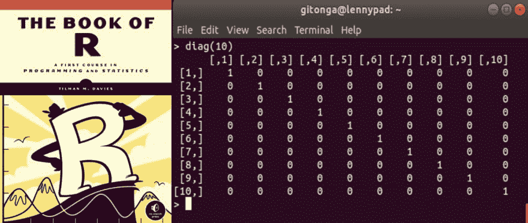
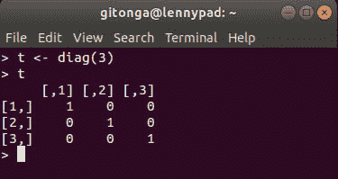
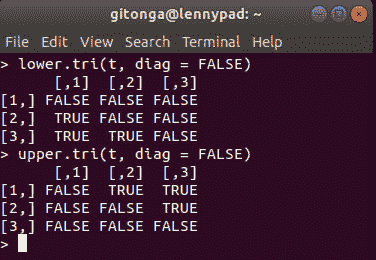
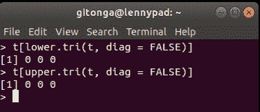
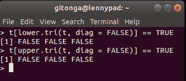
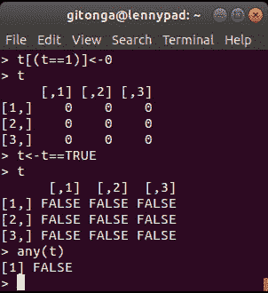

# 排除 R 中矩阵的对角元素

> 原文：<https://dev.to/egimba/excluding-diagonal-elements-from-a-matrix-in-r-341d>

我正在阅读 Tilman M. Davies 写的《数据科学导论》一书。在一次练习中(第 64 页 4.1 部分)，我碰到了这个问题:

*通过提取(c)中创建的逻辑矩阵的对角元素，使用`any`确认没有`TRUE`条目。*

所述矩阵是 10×10 单位矩阵。如何进行提取和测试？到目前为止，我尝试了这本书里教过的所有东西，但找不到方法去做。离开谷歌，我去寻找解决方案。

通过各种渠道，我了解了`lower.tri()`和`upper.tri()`函数。他们似乎可以做我想做的事。唯一的问题是，根据所使用的函数，我只能提取下半部分或上半部分。

但是，我了解到你可以使用`c()`函数将不同的项目组合成一个向量。这意味着我可以使用这两个函数提取我需要的部分，然后组合结果，然后进行所需的测试。

为了简单起见，我将使用一个 3×3 的单位矩阵来演示。首先，让我们使用`diag()`函数形成它，并将其赋给变量`t`。

接下来，我们使用`lower.tri()`和`upper.tri()`函数来识别`t`的下半部分和上半部分。

在这两个函数的参数中，我们设置了`diag = FALSE`,因为我们想确保对角线被忽略。如果我们没有这个参数集，我们将捕获对角线上的参数，这与我们的目标相反。

现在我们可以从`t`中提取每一半的零。

由于我们想将这些存储为`FALSE`，我们测试它们是否等于`TRUE`。

现在我们可以使用`c()`函数将这两半组合成一个向量`s`。

最后，我们可以执行练习中请求的操作。

这证实了提取单位矩阵的对角线将导致矩阵中没有逻辑`TRUE`值。

可能有一种更简单的方法可以做到这一点。我也有一个小小的想法，有一种方法可以提取对角线上的 1，将 0 留在矩阵中，然后使用`any()`测试矩阵，但是我还没有找到方法。这是一个初学者的解决方案，从现在开始的一段时间将证明我的知识增长了多少。如果你知道如何以更简单、更直接的方式做到这一点，请在评论中分享。

**编辑:**是的，还有一个更简单的方法！我只需要耐心地多读几页书，读到介绍函数`which`的第 69 页。使用它节省了大量的打字时间！

基本上，该命令根据给定的测试选择要提取的向量中的元素。要提取一些并留下其他的，您可以在`which`后面添加一个连字符，从而删除所有通过测试的内容。

我最初的问题仍然存在。有没有一种方法可以提取不需要的元素，但仍然保留在矩阵中？一个可能的解决方案是用 0 代替 1，然后整体测试矩阵。再一次，我需要的只是一点耐心，继续读下去，集中注意力(因为这个解决方案是在读完第 68 页后得到的)。这让我有了以下想法:

这里我使用了`==`关系操作符来识别矩阵中的 1 并用 0 替换。后续步骤如前；将零点转换成`FALSE`，然后通过`any()`运行矩阵，给出我们期望的答案。

这太令人兴奋了。关于用 R 编程，甚至数据科学，还有很多需要学习和探索的地方！

资源:

R 之书:[https://nostarch.com/bookofr](https://nostarch.com/bookofr)