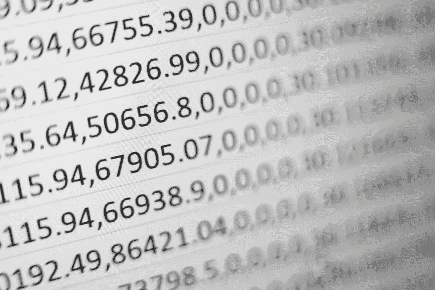

# 使用 JavaScript 和 Google Sheets Reader 读取 Google Sheets 数据

> 原文：<https://dev.to/kendalmintcode/reading-google-sheets-data-using-javascript-with-google-sheets-reader-1fjc>

[](https://res.cloudinary.com/practicaldev/image/fetch/s--Q5oOTOgi--/c_limit%2Cf_auto%2Cfl_progressive%2Cq_auto%2Cw_880/https://robkendal.co.uk/static/0c525fed537b27ead400336b0b97658e/4aca8/mika-baumeister-703680-unsplash.jpg)

如果你曾经发现自己在问‘我如何用 JavaScript 访问 Google Sheet 电子表格？’，那么你可能不是一个人。你只需要在谷歌里输入“使用 javascript 读取谷歌表单数据”之类的东西(或者用我现在用的:D 的 Duck Duck Go)，你就会被这个难题的大量解决方案淹没。

问题是，以我的经验来看，它们要么非常复杂和夸张，要么很难启动和运行(例如，糟糕的文档)，要么它们在如何为您提供那些宝贵的结果方面有点过于规范。

所以，我自己造了一个...

[](https://res.cloudinary.com/practicaldev/image/fetch/s--kkscwHJ0--/c_limit%2Cf_auto%2Cfl_progressive%2Cq_auto%2Cw_880/https://images.unsplash.com/photo-1519635694260-6af6fc200c89%3Fixlib%3Drb-1.2.1%26q%3D80%26fm%3Djpg%26crop%3Dentropy%26cs%3Dtinysrgb%26w%3D1080%26fit%3Dmax%26ixid%3DeyJhcHBfaWQiOjExNzczfQ)

照片由[raw pixel](https://unsplash.com/@rawpixel?utm_source=ghost&utm_medium=referral&utm_campaign=api-credit)/[Unsplash](https://unsplash.com/?utm_source=ghost&utm_medium=referral&utm_campaign=api-credit)拍摄

## 进入 Google Sheets 阅读器

因为我找不到能很好满足我需求的东西(我也不想和成熟的 [Google Sheets API](https://developers.google.com/sheets/api/) 较劲)，我决定构建一个[快速、轻量级的实用程序](https://github.com/bpk68/g-sheets-api.git#readme)，从 Google Sheets 中获取一些简单的数据，并以合适的方式返回给我，让我随意处理。

在 GitHub 和 NPM 软件包库中可以找到 Google Sheets 阅读器:

*   [GitHub 项目](https://github.com/bpk68/g-sheets-api.git#readme)
*   [NPM 套餐](https://www.npmjs.com/package/g-sheets-api)

一会儿我们会深入其中的原因，但是让我们开门见山，先解释一下如何使用它。

## 我怎么用？

很高兴你问了。前往 [GitHub repo，亲自看一看](https://github.com/bpk68/g-sheets-api.git#readme)。我整理了一个不错的自述文件，详细介绍了如何在自己的项目中使用 Google Sheets 阅读器。

### 首先，这是否符合我的需求？

Google Sheets Reader 是一个简单的单向数据获取器，它只允许*从公开发布的 Google Sheet 中读取*。如果您的需求如下，那么它可能非常适合您:

*   您可以公开发布您的 Google 表单
*   在单个工作表中有一个相对简单的数据集(多工作表是一个计划中的特性)
*   你只需要*读取*数据
*   您不需要访问由官方 Google Sheets API 提供的更高级的功能(如缓存或 OAuth)。
*   您想要一种简单、直接的方式来获取数据>用数据做事>庆祝！

### 喋喋不休够了，让我用 Google Sheets 阅读器吧！

基本前提是你需要做到以下几点:

1.  建立一个谷歌表单供公众访问(在 GitHub 项目的自述文件中有一个指南)
2.  将 npm 软件包添加到您的存储库中
3.  调用 reader 函数，传入一组选项和一个回调函数来处理结果

一旦有了可用的 Google 表单，就可以将 npm 包添加到您的项目中:

`npm install g-sheets-api --save-dev`

或者，如果你喜欢纱线，

`yarn add --dev g-sheets-api`

接下来，您需要调用项目中的阅读器:

```
const reader = require('g-sheets-api');
const readerOptions = {
    sheetId: '1-CmQumuz5ZiOvINhphEMgfplrJacQhD623RROcOBTAg',
    returnAllResults: false,
    filter: {
        "key to filter on": "value to match" 
    }
};

reader(readerOptions, results => {
    /* Do something amazing with the results */
}); 
```

Enter fullscreen mode Exit fullscreen mode

从 Google Sheets 返回的初始数据汤本质上既不是 JSON，也不是特别友好。事实上，这是来自相关工作表的单元格值的 JSON 式转储。

阅读器为您做的是获取这些数据，在解析成合适的 JSON 之前对其进行整理。然后，它将这个 JSON 单元格集合格式化为一个 row 对象数组，如下所示:

```
[  {  //  row  1  "column 1 header":  "column 1, row 1 value",  "column 2 header":  "column 2, row 1 value",  "column 3 header":  "column 3, row 1 value",  },  {  //  row  2  "column 1 header":  "column 1, row 2 value",  "column 2 header":  "column 2, row 2 value",  "column 3 header":  "column 3, row 2 value",  },  //  etc.  ] 
```

Enter fullscreen mode Exit fullscreen mode

这样，你就可以随心所欲地处理它们了！

## 为什么要打造 Google Sheets 阅读器？

在最近的一个项目中，需要从一个在线存储罐(某种性质)中读取结构化的表格数据，我们最初使用了 Google 的 Fusion Tables。然而，这些都是测试版产品，今年将被关闭(撰写本文时是 2019 年 8 月)。

人们强烈需要将 Fusion Tables 数据存储替换为一个足够健壮、能够安全地存储数据、同时又能让常规内容编辑人员进行更新或更改的存储库；最终，这导致我们选择 Google Sheets 作为替代品。

但是...

Fusion Tables 设置实际上只是一些 JSON 数据之上的一个漂亮的 UI，所以它已经与通过漂亮的、类似 REST 的 API 端点读取底层数据结构的机制捆绑在一起。

谷歌床单，没那么多。

从 Google Sheets 读取和写入数据主要围绕着通过 Google 的开发控制台设置 API(在编写本文时是 V4 ),然后苦读开发文档并创建一组(在我看来)虚假的 JavaScript 函数来添加客户端身份验证库、获取 promise 对象、获取一些数据、将其转换成合理的形状等。

在我们的例子中，我们所需要的只是从 Google Sheet 中获取一些简单的表格数据，并将其填充到页面的 HTML 表格中。

幸运的是，我发现有一种时髦的方法可以访问 Google Sheet 中的数据，方法是调用一个末尾带有 JSON 修饰符的特殊 URL:

`https://spreadsheets.google.com/feeds/cells/1-CmQumuz5ZiOvINhphEMgfplrJacQhD623RROcOBTAg/1/public/values?alt=json-in-script`

然而，**这只有在你已经向全世界发布了你的表单的情况下才有效** -显然，这并不适合所有的需求，但是非常适合我们！

然后，我构建了一个简单的库来使用这个 URL 获取数据，因为如上所述，您得到的最初结果是一个不太友好的原始单元格值集合。我需要一种方法来顺利地获得数据，然后将它转化为更好的东西来使用。

所以，当你想用 JavaScript 以简单、轻松的方式从 Google Sheets 中读取数据时，现在你可以:D 了

## 有用的链接

如果您想了解更多关于该实用程序的信息或探索代码，那么请看看；随时留下评论，叉工作，建议改进-我洗耳恭听。

*   [GitHub 项目](https://github.com/bpk68/g-sheets-api.git#readme)
*   [NPM 套餐](https://www.npmjs.com/package/g-sheets-api)
*   [Google Sheets 官方 API](https://developers.google.com/sheets/api/)