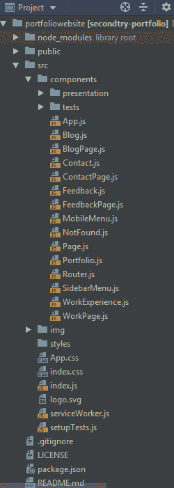
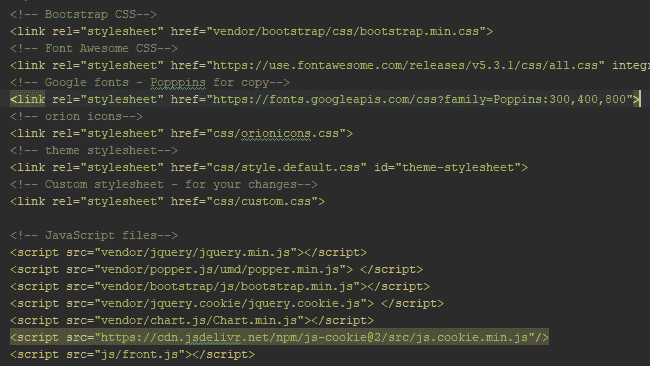
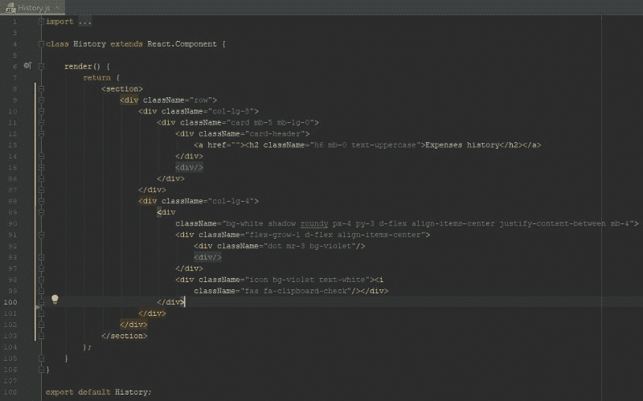
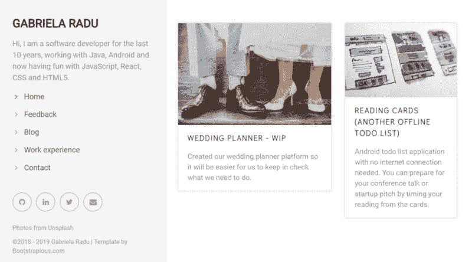

# 在 React.js 应用程序中集成一个引导 HTML 模板

> 原文：<https://dev.to/gabriela/integrate-a-bootstrap-html-template-in-your-react-application-1aje>

你好，如果你在这里，我只能猜测你想创建一个新的 React 应用程序，并使用一个引导模板，因为它太棒了，可以节省你的时间，或者你很好奇如何将模板集成到 React 项目中。对于本文，我假设您已经接触过 React，并且知道如何创建一个新项目。如果没有，请先阅读这篇文章，因为这是一个好的开始:[https://reactjs.org/docs/create-a-new-react-app.html](https://reactjs.org/docs/create-a-new-react-app.html)

以下是我完成这项任务的步骤。

**1。找到自己喜欢的模板**

这并不总是容易的，但通过一点研究，你可以找到合适的东西。请记住应用程序的范围，这将缩小选择范围。到目前为止，我真的很喜欢来自 Bootstrapious.com 的模板，因为他们是干净的，很好地实施。如果您保留模板中的原始演职员表，或者捐赠以删除该表，您可以将其用于个人或商业用途(查看他们的网站以了解更多信息)。

**2。寻找美丽的艺术资源**

你可能想在你的网站上放一些漂亮的艺术作品。我非常喜欢 https://undraw.co/的和 https://unsplash.com/的。

**3。脚手架空页**

对于模板中的每个页面，您都需要有一个相应的 React 组件。
[T3】](https://res.cloudinary.com/practicaldev/image/fetch/s--g8gwicl8--/c_limit%2Cf_auto%2Cfl_progressive%2Cq_auto%2Cw_880/https://thepracticaldev.s3.amazonaws.com/i/wv47qnp9ynuch5bst59p.PNG)

**4。现场检查风格变化**

打开终端并运行>纱线开始

这将在您首选的浏览器中打开一个标签，在这里您可以随时检查您的修改。如果只在样式中修改，则需要刷新页面才能重新呈现。

**5。将所需的资源文件和文件夹从模板复制到 React app**

将模板目录中所有需要的样式表、JavaScript 文件、字体和任何其他资源复制到 React 应用程序的公共文件夹中。接下来，我们需要在模板索引页面的 public/index.html 文件中声明和引用它们。

**6。开始在你的组件中使用 html 代码**

现在我们需要开始在 React 项目中渲染模板。为此，我将任务分为两步:

a)我直截了当地抄袭了

section from html template file into the render function in my component.

b)通常代码不会编译，因为有些标签没有关闭。寻找< img >、< hr >等。一定要关上它们。我发现这更像是一个试错阶段，因为它依赖于模板，但如果模板本身工作，它最终肯定会工作。

就是这样。

以上步骤是我从目前的经验中总结出来的，希望对你有所帮助。我很乐意学习更好的和新的方法来做到这一点，所以提前感谢你的想法和帮助。