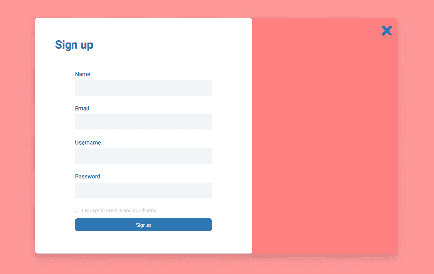

# 将顺风与 Vuejs 一起使用

> 原文：<https://dev.to/finallynero/using-tailwind-with-vuejs-5cdh>

我们( [Codingcoach.io](https://github.com/Coding-Coach/coding-coach) 贡献者)决定从 Scss 迁移到 Tailwind，因为我们是一个分布式团队，而 Tailwind 通过预先为颜色、间距、字体大小等属性提供定义的值来帮助我们保持样式的一致性。这对我来说是一次很好的体验，我爱上了 Tailwind。

### 什么是顺风？

Tailwind 是一个 CSS 框架，支持用户界面的快速开发，你可能会认为这是另一个引导或基础，但 Tailwind 不是，它没有主题或任何 UI 组件，而是提供了可组合的实用程序类，你可以在 UI 开发中使用，而无需编写任何 CSS。

在本文中，我将介绍如何在 Vuejs 应用程序中设置 Tailwind，并分享我使用 Tailwind 制作的一个简单表单。它还假设您对 Vuejs 有很好的理解。

##### 在 Vuejs 中设置顺风

首先使用`Yarn`或`Npm`T2 安装顺风

```
npm install tailwindcss --save-dev

or

yarn add tailwindcss --dev 
```

Enter fullscreen mode Exit fullscreen mode

接下来创建一个配置文件。

配置文件包含了基本的 tailwind 颜色、字体等配置，你也可以在那里添加插件来扩展 Tailwind 的功能。

为了创建配置文件，tailwind 提供了 CLI 实用程序来完成这个任务:
`./node_modules/.bin/tailwind init [filename]`
您可以将文件命名为任何名称，但建议将其命名为`tailwind.js`，并且应该放在项目的根目录下。

为了在 Vuejs 中使用 Tailwind，在`src/assets`文件夹中创建一个 CSS 文件，并添加以下内容，将 Tailwind 的预检和实用程序样式注入到您的 CSS 中。

```
@tailwind preflight;
@tailwind components;
@tailwind utilities; 
```

Enter fullscreen mode Exit fullscreen mode

然后将 CSS 文件导入到`src`文件夹中的`main.js`中。

现在一切都准备好了。我构建了一个简单的注册表单，几乎没有使用 CSS，我还使用了一个插件来制作按钮中的过渡动画。你可以检查出[演示](http://tailwind-demo.surge.sh/)和[代码](https://github.com/nero2009/tailwindcss-demo)

[](https://res.cloudinary.com/practicaldev/image/fetch/s--egfvKZNq--/c_limit%2Cf_auto%2Cfl_progressive%2Cq_auto%2Cw_880/https://thepracticaldev.s3.amazonaws.com/i/bqqeq7yoidd9lch8nztm.PNG)