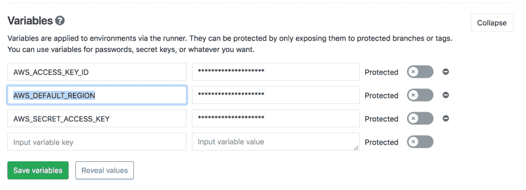

# 正在部署 Vue。使用 GitLab CI 将 JS 应用程序应用到 S3

> 原文：<https://dev.to/wmccoubrey/deploying-vuejs-app-to-s3-using-gitlab-ci-1kek>

# 概述

这是我如何使用 GitLab CI 部署 Vue 的快速指南。JS 在 S3 铲斗中的应用。我还将简要介绍如何设置 S3 桶来托管一个静态网站。

# 假设

在开始之前，我假设您已经成功完成了以下设置:

*   Vue。定义了`npm run build`命令的 JS 应用程序
    *   这个命令将构建 Vue。JS 应用程序放到项目中的`dist/`文件夹中
    *   该命令是 most Vue 预定义的。JS 快速启动工具，例如 Vue CLI 生成的项目。
*   S3 桶设置主机静态网站:
    *   参见[这些 AWS 文档](https://docs.aws.amazon.com/AmazonS3/latest/dev/HowDoIWebsiteConfiguration.html)以设置铲斗
    *   确保将索引文档和错误文档都设置为`index.html`
*   Git repo setup in GitLab
*   具有写入 S3 存储桶权限的 IAM 设置
    *   按照本指南设置 IAM。
    *   确保选择`Programmatic access`并记下您的访问密钥和秘密密钥，这些将在 GitLab 配置步骤中使用。
    *   试验

## 配置 GitLab CI

Gitlab CI 是一个基于 docker 的 CI 系统，在下面的配置文件中，我们指定了一个 docker 映像，用于运行部署作业。我们将使用的 docker 图像是我发布的图像，请参见此处的，它包含我们需要的以下组件:

*   AWS CLI
*   节点。射流研究…
*   NPM

以下配置文件执行以下操作:

*   使用指定的映像启动容器
*   在 Vue 上运行一个`npm install`命令。JS 应用程序
*   运行`npm run build`命令将应用程序构建到`dist/`文件夹中
*   使用 aws cli 将`dist/`文件夹复制到 S3 存储桶根目录

### 创建你的`.gitlab-ci.yml`文件

将下面的内容放在项目的根目录下的`.gitlab-ci.yml`中。确保替换为您的存储桶的名称。暂时不要提交和推送该文件。

```
stages:
  - deploy

deploy web:
  stage: deploy
  image: wilson208/circleci-awscli:node

  cache:
    key: ${CI_COMMIT_REF_SLUG}
    paths:
    - node_modules/

  before_script:
  - npm install

  script:
  - npm run build
  - aws s3 rm s3://<bucket-name> --recursive
  - aws s3 cp --recursive ./dist s3://<bucket-name>/ 
```

### 配置 CI 环境变量

在提交上述文件之前，需要在 Gitlab repo 设置中设置以下变量。这些设置将作为环境变量提供给 GitLab runner，并将由 aws cli 在验证 S3 时使用。

*   在 Gitlab 中导航到您的项目页面
*   点击设置
*   单击 CI/CD
*   展开变量部分
*   输入以下环境变量:
    *   AWS_ACCESS_KEY_ID
    *   AWS_SECRET_ACCESS_KEY
    *   AWS _ 默认 _ 区域

[](https://res.cloudinary.com/practicaldev/image/fetch/s--oUfcfzAY--/c_limit%2Cf_auto%2Cfl_progressive%2Cq_auto%2Cw_880/https://thepracticaldev.s3.amazonaws.com/i/npdeqn4gq0ofo2u5oz9m.png)

### 提交和推送

最后，提交新的`.gitlab-ci.yml`文件并将其推送到 repo。在 Gitlab 中导航到你的项目页面，然后到 CI / CD，你*应该*看到一个正在运行的作业。运气好的话，这将是成功的，并将部署到您的桶。

如果部署成功，导航 bucket URL，您应该会看到您的 Vue。JS 应用。

如果你有任何问题，请在评论中告诉我，我会尽全力帮助你解决它们！