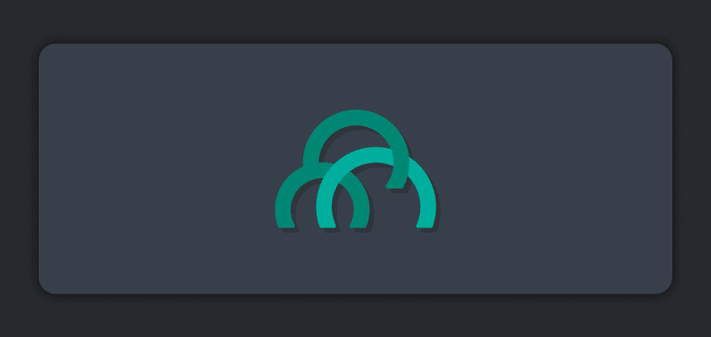

# PCF Tile 版本 2 . 2 . 0 Solace PubSub+简介

> 原文：<https://dev.to/solacedevs/introducing-the-solace-pubsub-for-pcf-tile-version-2-2-0-19mn>

注:2019 年 9 月，Pivotal 将 Pivotal Cloud Foundry (PCF)更名为 Pivotal Platform。

越来越多的客户选择将其 Pivotal Cloud Foundry (PCF)应用程序绑定到 Solace PubSub+ event brokers。 [PubSub+是 PCF 应用开发者](https://solace.com/pivotal)的绝佳搭配，他们中的很多人都在用 Spring 开发事件驱动的微服务。Solace PubSub+ for PCF tile 使得在 PCF 中部署 PubSub+变得简单、可管理和可重复。

这种瓦片已经推出一年多了，在各种版本中已经成熟。9 月，在 2.1 版本中，我们增加了对 Solace PubSub+ Standard Edition 的支持，这是一个永远免费的企业级消息代理，支持发布/订阅、排队、请求/回复和流，以及集成的高可用性(HA)和灾难恢复(DR)。

现在，正好赶上假期，我们发布了 PCF tile 的 PubSub+版本 2.2.0，其中充满了有用的、客户要求的功能。

**新功能概述:**

*   按需服务代理
*   支持应用安全组(ASG)
*   服务实例已准备好进行动态消息路由
*   由服务生命周期变化(创建、更新、删除)触发的可配置 webhook
*   为迁移的服务备份和还原导出/导入服务实例配置设置
*   运营商可配置的服务计划

该版本包括其他特性和修复，您可以在发行说明中了解，但我想解释一下最值得注意的添加和增强。

## 按需服务代理

按需服务代理(ODB)允许动态创建服务实例。它“按需”为服务提供资源，而不是从虚拟机(VM)上预先提供的 PubSub+事件代理池中分配服务。

ODB 为创建的服务提供了更具弹性和特定于实例的资源。通过按需分配底层虚拟机资源，这变得更加容易。

tile 运营商可以拥有使用预先分配的代理/虚拟机和新的按需服务实例的服务组合。

## 应用安全组(ASG)

对 ASG 的支持允许 PubSub+ tile 为操作员自动管理所需的 ASG。

Pivotal 将 ASG 定义为“出口规则的集合，这些规则指定应用程序或任务实例发送流量的协议、端口和 IP 地址范围。”

Solace tile 对 ASGs 的支持意味着，当一个应用程序绑定到 PubSub+服务实例时，会自动创建必要的规则，以允许该应用程序正确地与服务通信并使用该服务，当一个应用程序被解除绑定或删除时，ASG 也会被解除绑定或删除。这消除了在配置应用程序与 PubSub+服务通信时的任何猜测或试错。

## 动态消息路由(DMR)

[动态消息路由](https://solace.com/tech/#dmr)是最近推出的一项功能，它使 PubSub+事件代理能够轻松配置到一个智能的自路由网格中，该网格可以在任意数量的全球分布式应用程序和设备之间自动分发事件，就像它们连接到一个代理一样。

PubSub+ for PCF tile 2.2.0 通过创建服务实例来支持 DMR，这些服务实例可由 PubSub+用户配置以参与此事件网格。事件网格可以位于 PCF 服务实例的其他 PubSub+之间，或者与运行在其他云中、内部或其他地方的外部、非 PCF PubSub+事件代理一起运行……或者所有这些的某种组合！

## 服务生命周期变化触发的可配置 webhook

这个版本有一个可配置的 webhook，它将在服务的某些生命周期事件(如服务创建、编辑或删除)之后向您选择的端点发出一个出站 REST 调用。

webhook 支持与您的 PubSub+ PCF 服务的生命周期相关的定制任务的自动化和编排，并将在 DevOps CI/CD 管道中找到一个自然的位置。

## 导出/导入服务实例设置

有时，您希望能够备份(并可能恢复)PCF 服务的 PubSub+配置。

您可能还希望能够对服务的配置进行模板化，以便它可以跨服务实例重复。例如，您希望您的开发、测试和生产服务具有相同的队列和主题。

导出/导入功能允许您将服务配置导出到外部文件。您还可以选择将其导入到另一个新服务中，以将配置设置为导出配置中的内容。

请注意，此功能是作为测试版发布的，因为有些功能仍在开发中，还有一些已知的限制。该功能是可用的，Solace 希望您在测试期间对它提出反馈意见。PCF tile 的 PubSub+的未来版本中将删除 beta 标签。

## 运营商可配置的服务计划

PubSub+ for PCF tile 附带了各种预配置的服务计划，可以按原样部署。在某些情况下，切片运营商可能希望定制这些计划，以便为他们的开发人员应用程序提供不同的服务选项。他们可能还想为用户创建新的定制计划，以补充(或替换)Solace 提供的服务计划。

2.2.0 版允许您创建新的服务计划、自定义虚拟机类型、消息 VPN 数量等。PubSub+ tile 将自动应用扩展层，以匹配您创建的服务计划中的资源分配。

## 总结

我们与许多 Solace/Pivotal 客户密切协商，开发了这一新版本的 Solace PubSub+ for PCF tile。我们认为它包括一些非常棒的新特性和一些操作改进，这使它成为那些希望在 Pivotal 堆栈上使用 PubSub+的人的必备工具。

我们希望你同意，所以请让我们知道你安装或升级后的情况！

介绍 PCF Tile 版本 2.2.0 的 Solace PubSub+的帖子[最先出现在](https://solace.com/blog/solace-pubsub-plus-pcf-tile-v2-2-0/) [Solace](https://solace.com) 上。