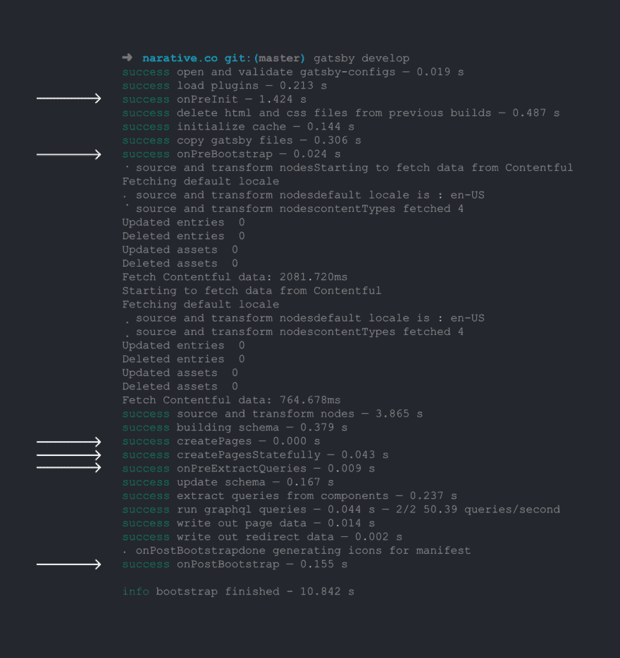

# 了解盖茨比的生命周期

> 原文：<https://dev.to/narative/understanding-gatsbys-lifecycle-4g5l>

*在 [Narative](https://narative.co) 自从我们开始帮助我们的合作伙伴打造他们梦寐以求的产品，我们就成了[盖茨比](https://medium.com/narative/why-narative-loves-gatsby-226e4d92861d)的粉丝。随着我们不断扩大的团队和 Gatsby 周围不断增长的社区，我们希望创造资源，使每个人都更容易掌握 Gatsby 的力量。*

* * *

我在学习盖茨比时遇到的一个挑战是试图理解盖茨比的生命周期。React 向我介绍了组件生命周期的概念，但当我开始学习 Gatsby 时，我再次感到不知所措。我记得浏览范例库，在每个项目中看到 Gatsby 特定的文件，并对自己说，“这些文件是做什么用的？为什么 gatsby-node.js、gatsby-browser.js、gatsby-ssr.js 会在默认的初学者工具包中生成？我真的可以删除这些文件吗？”在本文中，我将解释 Gatsby 的生命周期是如何工作的，以及 Gatsby 特定文件的用途。

## 盖茨比是怎么工作的？

要了解这些文件是干什么用的，首先要了解盖茨比是怎么工作的。Gatsby 是一个静态网站生成器，它从您提供的来源中提取数据，并为您生成一个网站/应用程序。
Gatsby 要求安装节点来运行引导程序和构建序列。在幕后，Gatsby 使用 Webpack 构建并启动了一个开发服务器。

### 第一步

在每次运行$ gatsby develop 时都会发生的引导序列中，大约会触发 20 个事件，从验证 gatsby-config.js 到为站点构建数据模式和页面。例如，引导序列是盖茨比创建页面的地方。如果你想深入了解所有 20 个引导步骤，Swyx 分享了一个更详细的精彩要点。

### 第二步

构建序列与引导序列非常相似，只不过它是在生产优化的情况下运行的，并且将输出准备好进行部署的静态文件。可以把它看作是在生产模式和开发模式下构建 React 应用程序。

### 第三步

最后，一旦生成的文件被部署，Gatsby 就存在于浏览器中。Gatsby 巧妙地生成了一个静态网站，在初始加载后变成了一个 web app，将生命周期延伸到了浏览器。需要记住的重要一点是，盖茨比的人生可以归纳为三个主要阶段

1.  引导程序
2.  建设
3.  浏览器

这三个序列构成了盖茨比的生命周期

* * *

运行`$ gatsby develop`
时，生命周期的一部分是可见的；运行`$ gatsby develop`时，Gatsby 生命周期的一个高峰。如果你熟悉 React 和组件生命周期，Gatsby 的生命周期几乎是相同的概念。就像 React 的生命周期一样，Gatsby 为开发人员提供了可以在其上构建的钩子。那些生命周期挂钩是通过 Gatsby 特定文件访问的，比如`gatsby-node.js`、`gatsby-browser.js`和`gatsby-ssr.js`。

* * *

## 盖茨比的具体文件是为了什么？

### `gatsby-config.js`

放置所有站点配置(如插件、元数据和聚合填充)的地方。这个文件是应用程序的蓝图，也是 Gatsby 的插件系统真正出彩的地方。当你运行`$ gatsby develop`或`$ gatsby build`时，T2 是第一个被读取和验证的文件。
你在`gatsby-config.js`花费的大部分时间可能会围绕源代码插件、图片插件、离线支持、样式选项和站点元数据。

### `gatsby-node.js`

Gatsby 在您开发或构建您的网站时运行一个节点进程，并在幕后使用 Webpack 通过热重装启动开发服务器。在节点处理过程中，Gatsby 将加载插件，检查缓存，引导网站，构建数据模式，创建页面，并处理一些配置和数据管理。在引导和构建序列中发生的一切都发生在 gatsby-node.js 中。这意味着它是基于来自源插件的数据动态创建页面或修改 gatsby 的 Webpack 或 Babel 配置的最佳位置。
例如，如果您想要手动移动一些文件，比如 Netlify _redirects 文件，那么在 onPostBuild 生命周期钩子下的 gatsby-node.js 文件中是一个很好的地方。

从经验来看，我的大部分时间都围绕着在`gatsby-node.js`中处理数据和构建页面。这个文件很快成为你整个网站的管道。

`gatsby-node.js`挂钩的例子:

*   创建页面
*   onCreateBabelConfig
*   onCreateWebpackConfig
*   onPostBuild

### `gatsby-ssr.js`

当您想到服务器端呈现时，您会想到一个接受请求并动态构建页面并发送给客户端的服务器。Gatsby 不这样做，但是它做服务器端呈现——它在构建时生成所有页面。

很自然地，`gatsby-ssr.js`允许开发者加入到这个生命周期中。根据我的经验，大多数用例都围绕着将 CSS、HTML 或 Redux 状态信息注入到生成的输出中。例如，如果您需要插入第三方脚本，如分析跟踪或像素，可以在 onRenderBody `gatsby-ssr.js`挂钩上完成。

`gatsby-ssr.js`挂钩的例子:

*   onPreRenderHTML
*   onRenderBody
*   替换渲染器

## `gatsby-browser.js`

Gatsby 是一个静态站点，在初始加载后加载动态应用程序，这意味着您在 web 应用程序中获得了静态站点的好处。`gatsby-browser.js`提供方便的挂钩来处理应用程序加载、路线更新、服务人员更新、滚动定位等。

静态站点加载后发生的一切都可以在`gatsby-browser.js`中挂钩。对于我开发的应用程序来说，`gatsby-browser.js`主要用于跟踪路线、滚动定位和发送分析事件。

`gatsby-browser.js`挂钩的例子:

*   oncliextentry
*   onRouteUpdate
*   onServiceWorkerInstalled
*   注册服务工作者
*   shouldUpdateScroll

## 结论

Gatsby 是以 React 为核心构建的，并共享一个通用的 API 模式，即生命周期。这个生命周期让开发者通过特定的钩子访问他们网站过程中的关键时刻。例如，添加分析可以通过浏览器生命周期钩子 onClientEntry 来实现。Gatsby 保留特定的文件名作为访问每个生命周期的入口点；这些文件被命名为`gatsby-node.js`、`gatsby-ssr.js`和`gatsby-browser.js`。如果没有 Gatsby 生命周期，就不可能在基本配置之外定制和修改您的项目，这给开发人员留下了僵化和糟糕的开发体验。这种能力和灵活性帮助我们[为像](https://medium.com/narative/building-the-new-hopper-com-c19ec83a0bbd) [Hopper](https://hopper.com) 这样的客户构建了令人惊叹的网络项目！

* * *

Gatsby 是 Narative 工程流程中的一个重要组成部分，我们通过它帮助客户制造他们梦寐以求的产品，以及他们尚未梦想到的产品。

**https://narative.co**