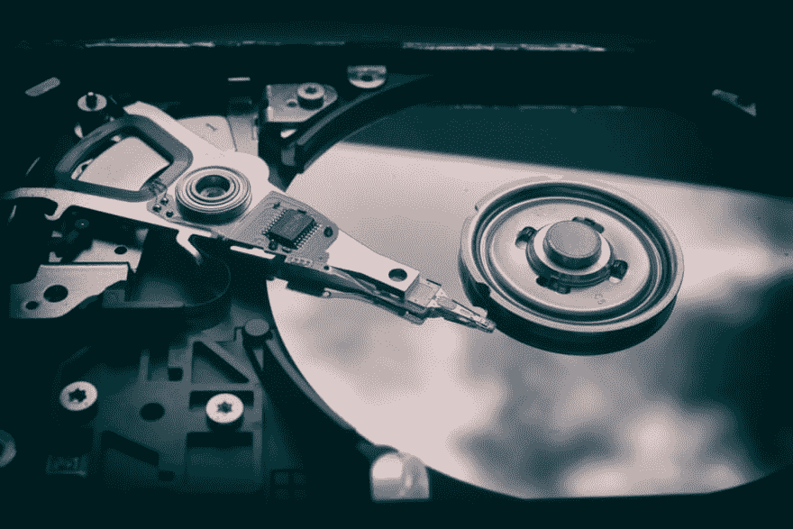

# 家庭文件服务器- SnapRAID

> 原文：<https://dev.to/jmlw/home-file-server-snapraid-1alo>

[](https://res.cloudinary.com/practicaldev/image/fetch/s--5tAas42N--/c_limit%2Cf_auto%2Cfl_progressive%2Cq_auto%2Cw_880/https://images.unsplash.com/photo-1484662020986-75935d2ebc66%3Fixlib%3Drb-1.2.1%26q%3D80%26fm%3Djpg%26crop%3Dentropy%26cs%3Dtinysrgb%26w%3D1080%26fit%3Dmax%26ixid%3DeyJhcHBfaWQiOjExNzczfQ)

第一个问题是，SnapRAID 是什么？Snapraid 是一个类似于快照奇偶校验 raid 的系统，或者来自于(SnapRAID 的网站)[[https://www . snap RAID . it](https://www.snapraid.it)]“一个磁盘阵列的备份程序。它存储数据的奇偶校验信息，并从最多六个磁盘故障中恢复”。

RAID 和冗余很流行，但是 RAID 解决什么呢？你为什么想用它？RAID(独立磁盘冗余阵列)旨在解决当阵列中的一个磁盘出现故障时可能丢失操作数据的问题，并保持阵列在线运行。它确保您在阵列中的其他位置仍有该数据的副本，以便在更换坏驱动器时恢复数据。它非常适合拥有许多磁盘和适当备份解决方案(磁带、阵列克隆、异地、云等)的企业级系统...).然而，这对于家庭文件服务器或没有很多经常变化的小文件的文件服务器来说通常不是很好。

对于我的用例来说，这有点过了，RAID 有一些可怕的优点，让我对它敬而远之。这些通常与硬件 raid 有关，这意味着您依赖硬件的确切品牌和型号来支持您的 RAID 阵列，如果您的任何一个硬件出现故障，都有可能丢失阵列中的所有数据。缓解这种情况就像迁移到基于软件的 RAID 一样简单，但这通常需要更多的计算资源，而我不愿意在简单的文件服务器上投资。

## 快照奇偶校验的 SnapRAID

要想同时获得 JBOD(只是一堆驱动器)存储阵列和某种数据奇偶校验，SnapRAID 是完美的解决方案。这意味着我可以在我的家庭服务器上保留一堆硬盘驱动器，并将文件放在它们上面我想放的任何地方，同时，这些数据将有一些冗余，以防止其中一个驱动器出现故障。那么，为什么不使用像 ZFS 这样听起来能解决差不多同样问题的东西呢？简而言之，ZFS 不允许我轻而易举地将新驱动器添加到我的 JBOD 池中，但是配置 SnapRAID 以根据其奇偶校验计算保护新驱动器就像编辑单个文件并重新运行同步功能以生成因添加新驱动器而产生的奇偶校验更改一样简单。

不过，使用 SnapRAID 代替实时 RAID 奇偶校验计算有一个主要缺点。要使 SnapRAID 正常工作，您必须运行`Sync`命令，该命令将从您的所有磁盘中读取数据，运行计算来计算您的数据的`parity`(计算结果允许您在其中一个磁盘丢失时重新生成数据，方法是找出使其余磁盘的奇偶校验与现有奇偶校验匹配所需的丢失位)。因为它依赖于在某个时间点运行的 sync 命令，所以它只为该时间点的数据提供冗余。如果您要同步您的阵列，然后向磁盘添加一个新文件，而该磁盘崩溃，则您的新文件将会丢失，并且无法恢复，因为它是在运行奇偶校验计算后添加的。好处是，如果你不经常添加文件，你不太可能在同步命令之间丢失文件！这听起来像是家庭文件服务器的完美选择。

## 安装和配置

要进行设置，首先你需要下载并编译 SnapRAID，所以让我们准备好基于 Debian 的 Linux 操作系统，确保我们是最新的，并安装了`gcc`、`git`和`make`:

```
sudo apt-get update
sudo apt-get upgrade
sudo apt-get install gcc git make -y 
```

现在让我们下载、编译并安装:

```
cd ~/Downloads
wget https://github.com/amadvance/snapraid/releases/download/v11.3/snapraid-11.3.tar.gz
tar xzvf snapraid-11.3.tar.gz
cd snapraid-11.3/
./configure
make
make check
make install
cd ..
cp ~/snapraid-11.3/snapraid.conf.example /etc/snapraid.conf
cd ..
rm -rf snapraid* 
```

如果您没有准备好磁盘，并且需要对它们进行分区，那么也要安装`parted`和`gdisk`，然后对您的磁盘进行分区:

```
sudo apt-get install parted gdisk 
```

分区`disk b` ( `/dev/sdb`)并对所有需要分区的磁盘重复(警告！这将破坏你磁盘上的数据):

```
sudo parted -a optimal /dev/sdb
GNU Parted 2.3
Using /dev/sdb
Welcome to GNU Parted! Type 'help' to view a list of commands.
(parted) mklabel gpt
(parted) mkpart primary 1 -1
(parted) align-check
alignment type(min/opt) [optimal]/minimal? optimal
Partition number? 1
1 aligned
(parted) quit 
```

我发现在我的系统中将奇偶校验磁盘和数据磁盘配置在单独的挂载目录中非常有帮助，这也使得像 MergerFS 这样的工具的配置更加简单，因为您可以引用整个目录而不是单独的挂载驱动器。配置安装数据和奇偶校验驱动器的位置:

```
mkdir -p /mnt/data/{disk01,disk02,disk03,disk04}
mkdir -p /mnt/parity/parity-01 
```

将您的驱动器配置为通过`/etc/fstab`
安装

```
sudo blkid ### Make note of the UUID of each disk
sudo vi /etc/fstab
### Append the following as suited for your disks

# Data Disks
UUID=disk01 /data/disk01 ext4 defaults 0 2
UUID=disk02 /data/disk02 ext4 defaults 0 2
UUID=disk03 /data/disk03 ext4 defaults 0 2
UUID=disk04 /data/disk04 ext4 defaults 0 2

# Snapraid Disks
UUID=parity01 /parity/parity01 ext4 defaults 0 0 
```

注意:您可以为数据磁盘将 fstab 的最后一列配置为`0`,以避免启动时磁盘检查。

在每个磁盘上创建一个文件系统(假设磁盘是 sdb1 到 sde1):

```
sudo mkfs.ext4 -m 2 -T largefile4 /dev/sdb1
sudo mkfs.ext4 -m 2 -T largefile4 /dev/sdc1
sudo mkfs.ext4 -m 2 -T largefile4 /dev/sdd1
sudo mkfs.ext4 -m 2 -T largefile4 /dev/sde1 
```

这也预留了 2%的空间，因此，如果某个磁盘与您的奇偶校验磁盘大小相同，您将无法完全填满它，否则，将没有足够的空间来存储同步操作需要存储的有关数据奇偶校验的额外数据。然而，对于奇偶校验磁盘，我们可以预留 0%的空间，因为我们不需要保留任何空间或防止它完全填满:

```
sudo mkfs.ext4 -m 0 -T largefile4 /dev/sdf1 
```

现在我们在每个驱动器上都有了一个文件系统，可以开始使用了。将它们全部装入:

```
sudo mount -a 
```

现在配置 SnapRAID:

```
sudo vi /etc/snapraid.conf 
```

这和我的配置
差不多

```
parity /mnt/parity/parity01/snapraid.parity

content /var/snapraid/content
content /mnt/data/disk01/content
content /mnt/data/disk02/content
content /mnt/data/disk03/content
content /mnt/data/disk04/content

disk d1 /mnt/data/disk01/
disk d2 /mnt/data/disk02/
disk d3 /mnt/data/disk03/
disk d4 /mnt/data/disk04/

exclude *.bak
exclude *.unrecoverable
exclude /tmp/
exclude /lost+found/
exclude .AppleDouble
exclude ._AppleDouble
exclude .DS_Store
exclude .Thumbs.db
exclude .fseventsd
exclude .Spotlight-V100
exclude .TemporaryItems
exclude .Trashes
exclude .AppleDB

block_size 256

autosave 250 
```

在您的根驱动器上为内容文件创建一个目录:

```
sudo mkdir -p /var/snapraid 
```

现在运行第一次同步来计算驱动器的奇偶校验。这可能需要很长时间，具体取决于您拥有的数据量。

```
sudo snapraid sync 
```

现在一切都设置好了，数据阵列的第一次同步正在进行中，奇偶校验应该如何保持同步？最初我在 [ZachReed.me](https://zachreed.me) 上找到了一篇与本文类似的文章，他写了一个非常好的脚本来使用 SnapRAID 的`diff`命令，检查该命令输出的已更改文件的数量，并与阈值进行比较。如果超过阈值，将不会采取进一步的操作，并且会向用户发送电子邮件，通知他们更改或删除的文件比阈值多。在过去的几年里，我一直使用该脚本来运行夜间同步作业，并每周对我的阵列进行部分`scrub`，以确保一切都是最新的，并且没有“位腐败”。你可以在这里找到(原脚本)[【http://zackreed.me/updated-snapraid-sync-script/】]，以及(支持分割奇偶校验的更新脚本在这里)[]的参考。

## 总结性的

这是我用于家庭服务器数据阵列的基本设置，但我实际上有不止 4 个数据驱动器，因此我目前采用 SnapRAID 推荐的 2 奇偶校验设置。这意味着，对于每 4 个数据驱动器，我至少有 1 个奇偶校验驱动器。目前有 6 个数据驱动器(从 2 TB 到 4 TB 不等)和 2 个 4 TB 的奇偶校验驱动器(SnapRAID 要求奇偶校验驱动器至少与最大的数据驱动器一样大)。其中一些已经很旧了，我预计它们很快就会出现故障，当它们出现故障时，我一定会写一篇关于运行恢复的快速帖子，以更换驱动器并重建被故障驱动器破坏的数据(我已经练习过这一次，所以希望下次会好得多，或者我可以在它们出现故障之前更换驱动器！).

这篇文章也没有涉及 SnapRAID 的`pool`功能，该功能将多个驱动器连接到一个大“文件夹”中。然而，我发现 SnapRAID 缺乏这一功能，我更喜欢使用 MergerFS 作为我的驱动器池解决方案(将在未来的博客文章中发布)。

最后需要注意的是，也可以在加密卷上使用 SnapRAID。您可以完全加密数据驱动器和奇偶校验驱动器，在成功输入密码以解锁您的根文件系统后，使用安全存储在您的服务器上的根帐户下的密钥文件在引导时自动装载和解密它们，这一切都可以通过 SSH 远程完成。这可能也会出现在未来的博客文章中。

任何问题或意见，应该可以通过下面的 Disqus 评论。