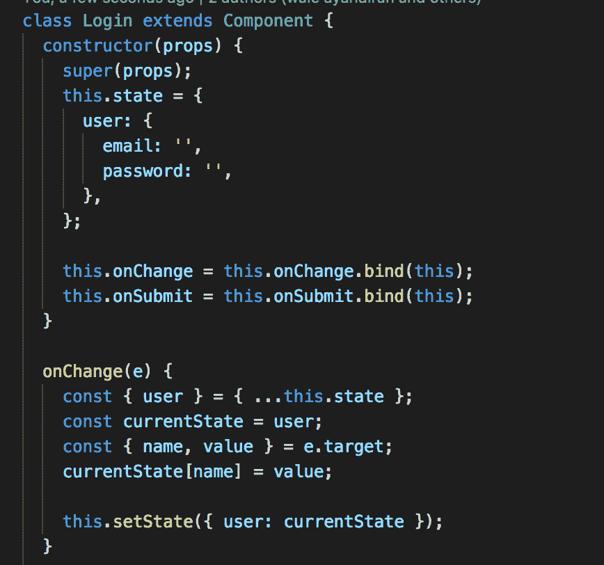

# 更新反应嵌套状态属性

> 原文：<https://dev.to/walecloud/updating-react-nested-state-properties-ga6>

[](https://res.cloudinary.com/practicaldev/image/fetch/s--EzLGRwgS--/c_limit%2Cf_auto%2Cfl_progressive%2Cq_auto%2Cw_880/https://thepracticaldev.s3.amazonaws.com/i/pd50euhxmawva1ns3y0a.png)

使用 react accessible 要求您管理应用程序在某个时刻的状态，至少是您当前正在使用的组件的状态。

最近，我在做一个兼职项目，我想尝试一些不同于常规

`this.state = { email: '', password: '' };`
的东西

我试图用电子邮件和密码凭证登录一个用户，所以我想把它包装到一个用户对象中，以便于阅读，或者更好的是不需要任何理由:)。

我做了这个

```
this.state = {
  user: {
    email: '',
    password: ''
  }
}; 
```

Enter fullscreen mode Exit fullscreen mode

然后我注意到我的表单域没有接受输入，更像是只读模式。

在谷歌搜索之后，我突然发现状态并没有使用常规的
更新

```
 onChange(e) {
   const { name, value } = e.target;
   this.setState({ [name]: value }); 
```

Enter fullscreen mode Exit fullscreen mode

为什么？因为属性(电子邮件和密码)嵌套在用户状态属性下。起初，我想这应该不是什么大问题，调用`user.email, user.password`应该就可以了吧？你猜对了，并没有，我只是想让事情正常进行，这样我就可以继续写我的代码了。

### 解

#### 快速回答:

```
onChange(e) { 
  const { user } = { ...this.state };
  const currentState = user;
  const { name, value } = e.target;
  currentState[name] = value;

  this.setState({ user: currentState });
} 
```

Enter fullscreen mode Exit fullscreen mode

#### 长版:

react 的 setState 不处理嵌套属性，在本例中是`email`和`password`。因此，进行更改的唯一方法是，每当`email`或`password`发生新的更改时，访问父状态对象`user`。

这意味着每当您在任何字段中键入一个新字符时，用户状态都会被重新创建。如果你的用户对象有很多字段，比如一个庞大的注册表单处理超过 10 个字段是不理想的。

上面的代码使用了一些 es6 特性，比如 spread 操作符& Destructuring。

在 react 中改变(直接添加/删除状态的元素)状态通常是一种不好的做法。如果必须改变，就应该重新创建状态。

第`const { user } = { ...this.state }`行使用扩展操作符(...)来获取当前状态。将返回的值赋给 currentState 变量`const currentState = user;`，析构来自输入字段的 emmitted events `const { name, value } = e.target;`以获取名称及其值。用输入`currentState[name] = value;`的值更新当前状态，其中 name 是用户状态对象`email`和`password`的属性。

最后，每当成功完成`this.setState({ user: currentState });`的更新时，我们就用`currentState`替换`user`。

### 我的推荐

有些人会争论使用嵌套属性，因为 React 不是面向嵌套状态的。也许这是正确的或不正确的，但这是我的想法；

我建议您避免使用嵌套状态，如果您必须努力使它尽可能轻，因为缺点是每一个微小的变化都会重新创建父对象，这对性能没有好处。