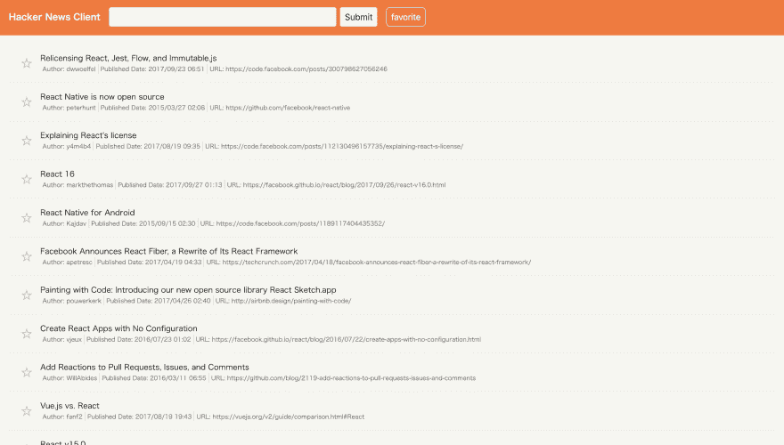

# react hooks API 支持的类似 redux 架构示例

> 原文：<https://dev.to/hirodeath/similar-redux-architecture-example-powered-by-react-hooks-api-hdg>

我猜你们已经知道 hooks API 了吧？这篇文章是 React hooks API 的一个例子。首先，这是我将要描述的示例代码。
[https://github . com/takahiro-saeki/react-example-code/tree/master/chapter 2](https://github.com/takahiro-saeki/react-example-code/tree/master/chapter2)

这是一个例子的截图。
[T3】](https://res.cloudinary.com/practicaldev/image/fetch/s--mNCz6qhZ--/c_limit%2Cf_auto%2Cfl_progressive%2Cq_auto%2Cw_880/https://thepracticaldev.s3.amazonaws.com/i/3ura92oa11b920lqwy2f.png)

我们开始吧！

## Redux 架构带钩子 API 不带 Redux。

### 建筑结构。

```
./chapter2
├── index.html
├── package.json
└── src
    ├── Context.jsx
    ├── Provider.jsx
    ├── actions
    │   └── index.js
    ├── components
    │   ├── Header
    │   │   ├── index.jsx
    │   │   └── style.js
    │   ├── List
    │   │   ├── index.jsx
    │   │   └── style.js
    │   ├── ListArea
    │   │   ├── index.jsx
    │   │   └── style.js
    │   └── index.js
    ├── connect.js
    ├── containers
    │   └── App
    │       └── index.js
    ├── index.js
    ├── modules
    │   ├── fetchLogic.js
    │   ├── getFavoItems.js
    │   ├── getSearch.js
    │   └── useWindowWidth.js
    ├── pages
    │   └── MainView
    │       └── index.jsx
    ├── reducers
    │   ├── combineReducers.js
    │   ├── favorite.js
    │   ├── index.js
    │   └── posts.js
    └── store.js 
```

这看起来像是 redux 架构。但是在这个例子中没有 redux 依赖项。
和主逻辑在`index.js`里面是一个根。

```
import React from 'react';
import { render } from 'react-dom';
import reducers from './reducers';
import Provider from './Provider';
import App from './containers/App';

document.body.style.margin = 0;

const Main = () => (
  <Provider reducer={reducers}>
    <App />
  </Provider>
);

render(<Main />, document.querySelector('#app')); 
```

这个`Provider`组件有一个 reducer props，它传递给上下文 API。
看看`Provider`的逻辑。

```
import React, { useState, useReducer, useEffect } from 'react';
import Context from './Context';

type Props = {
  children: any,
  reducer: () => {}
};

const Provider = ({ children, reducer }: Props) => {
  const [store, dispatch] = useReducer(reducer);
  const [state, setState] = useState({ isLoaded: false });

  useEffect(() => {
    dispatch({ type: '@init' });
    setState({ isLoaded: true });
  }, []);

  return (
    <Context.Provider value={{ dispatch, store }}>
      {state.isLoaded ? children : false}
    </Context.Provider>
  );
};

export default Provider; 
```

`Provider`组件有 2 个道具。第一个是`children`，第二个是`reducer`。`useEffect`的`dispatch`里面的
是，需要用减速器做储备。
与 redux 的减速器相同，必须在每个减速器中设置默认状态参数，否则会出现意外错误。
和`combineReducer.js`内，它组合了在 combineReducer 函数中被设置为自变量的每个减速器。
看看`combineReducer.js`的内部。

```
const combineReducers = reducer => {
  return (state = {}, action) => {
    const keys = Object.keys(reducer);
    const nextReducers = {};
    for (let i = 0; i < keys.length; i++) {
      const invoke = reducer[keys[i]](state[keys[i]], action);
      nextReducers[keys[i]] = invoke;
    }
    return nextReducers;
  };
};

export default combineReducers; 
```

我模仿了 redux combineReducer。我不知道 reducer 会在每次调度动作时被调用。

### 连接逻辑

连接逻辑实际上是简单的高阶组件。

```
import React, { useContext } from 'react';
import Context from './Context';

const connect = (mapState, mapDispatch) => {
  return WrappedComponent => {
    return () => {
      const { store, dispatch } = useContext(Context);
      return (
        <WrappedComponent {...mapState(store)} {...mapDispatch(dispatch)} />
      );
    };
  };
};

export default connect; 
```

使用上下文 API 作为钩子很简单。共享 store 到 mapState，共享 dispatch 到 mapDispatch，然后你可以在任何地方使用 mapStateToProps 和 mapDispatchToProps，就像你连接的表示组件中的 redux 一样。

```
const App = ({ posts, addTodo, addFavoItem, favorite }) => {
  /* ...logics */
  return <MainView {...hundlers} />;
};

const mapStateToProps = store => ({
  posts: store.posts.data,
  favorite: store.favorite.favorite_posts
});

const mapDispathToProps = dispatch => ({
  addTodo: param => dispatch(addTodo(param)),
  addFavoItem: param => dispatch(addFavoItem(param))
});

export default connect(
  mapStateToProps,
  mapDispathToProps
)(App); 
```

好像是 redux，对吧？

## 总之。

以我的拙见，我认为像 redux 这样使用 hooks api 的，确实很难替代 redux。但这是可能的，你可以像 redux 一样做类似的逻辑。但是如果你使用 redux 中间件，比如 redux-saga，你可能需要考虑如何优化这些中间件。
我想尝试从使用 redux-saga 或 thunk 或任何人们在 redux 环境中大量使用的著名库的示例应用程序中替换 redux。

另一件事是，我觉得很重要，使用 hooks api 肯定会提高你的 DX。到目前为止，我很乐意。我可能会写一些关于钩子的教程，比这篇文章更加简洁明了。哈哈的笑

谢谢，如果您有任何问题，请随时联系我。任何问题都可以。
再见！！