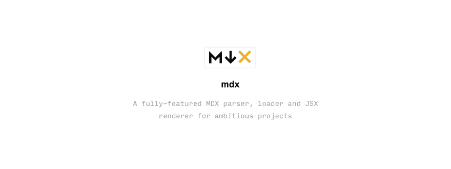

# MDX 简介

> 原文：<https://dev.to/sergiodxa/introduccin-a-mdx-1dbd>

[](https://res.cloudinary.com/practicaldev/image/fetch/s--voPedf9O--/c_limit%2Cf_auto%2Cfl_progressive%2Cq_auto%2Cw_880/https://thepracticaldev.s3.amazonaws.com/i/yd4jrvpzk9vr6oh03lj4.png)

MDX 是一种文件格式，允许使用 JS 代码和 jsx(react 组件)扩展 Markdown。这使您可以使用自定义 React 组件或任何 npm 下载组件来添加比简单的 Markdown 通常无法添加的更多内容。

> 最初发表于[https://sdx . im/articles/introduction-a-mdx/](https://sdx.im/articles/introduccion-a-mdx/)

## Casos de Uso

MDX 的第一个使用案例是为博客创建内容，因为只要创建文件“`.mdx`”就可以添加新帖子，并在必要时使“`import`”成为 React 组件。

甚至加上元数据做`export`的这个。使用它的博客的一个例子是[时间博客](https://zeit.co/blog)或这同一博客，虽然最初[使用另一种方式解析扩展的](https://dev.to/essays/markdown-react)这篇文章和以后的文章(最终还是旧的)使用 MDX。

使用案例明显更多，因为通过使用 JS，您可以根据需要扩展 Markdown，例如，只需使用 Markdown 和 React 自己的组件创建整个站点。

例如，我在[【从地方到全球】
【单指令】](https://sergiodxa.com/slides/local-to-global)(我在家乡的太阳下说的一句话)上看到的幻灯片系统是使用 MDX 制作的，每张幻灯片都是使用普通的 Markdown 的`.mdx`文件，以及一些特殊的幻灯片，如

## 安装和配置

现在我们已经了解 MDX 的用途了，让我们来看看如何使用它，首先是安装。

```
yarn add -D @mdx-js/loader @mdx-js/mdx 
```

Enter fullscreen mode Exit fullscreen mode

这将为我们安装 MDX 和 webpack 加载程序。现在，我们只需将其添加到我们的 webpack 配置中的“`babel-loader`”旁边(支持 JS 代码和 React 所需)。

```
module.exports = {
  module: {
    rules: [
      {
        test: /\.mdx?$/,
        use: ["babel-loader", "@mdx-js/loader"]
      }
    ]
  }
}; 
```

Enter fullscreen mode Exit fullscreen mode

就是这样！我们现在可以开始编写使用我们新加载器的文件`.md`或`.mdx`。

## 实例

让我们看一个文件“`.mdx`”的示例，以及如何使用该文件。

```
# Hola, Mundo! 
```

Enter fullscreen mode Exit fullscreen mode

一个很简单的文件，只呈现一个‘t0’，上面写着‘T2’你好，世界！。现在让我们来看看我们的`index.js`，然后再加上这个。

```
import React from "react";
import { render } from "react-dom";

import Hola from "./essay/hola.mdx";

render(<Hola />, document.getElementById("app")); 
```

Enter fullscreen mode Exit fullscreen mode

再一次，就是这样！我们导入我们的文件`.mdx`，并将其渲染为反应器的常规组件，而无需执行任何其他操作。

### 进口自己的零部件

我们扩展了我们的例子，假设我们有一个文件`./components/graph.js`显示了用 React 制作的图表。为了能把它列入我们的文章，我们只需要做一个简单的`import`。

```
import Graph from "../components/graph";

# Hola, Mundo!

<Graph /> 
```

Enter fullscreen mode Exit fullscreen mode

这将使我们的部件`<Graph />`在文章中呈现出来。

#### 进口另一个降级

由于每个文件`.md`或`.mdx`都作为 React 组件导入，因此您可以从另一个文件导入 MDX 文件并在其中进行渲染，从而使您能够构建我们的 Markdown 组件。

```
import Graph from "../components/graph";
import Contributing from "../CONTRIBUTING.md";

# Hola, Mundo!

<Graph />
 --- 
<Contributing /> 
```

Enter fullscreen mode Exit fullscreen mode

### 导出额外数据

因为我们可以使用通用和常用的 JavaScript 代码，所以也可以导出额外的数据，以便在导入‘t0’时通过 JS 进行消费。

```
import Graph from "../components/graph";
import Contributing from "../CONTRIBUTING.md";
import { sergio } from "../data/authors";
import Layout from "../components/layout";

# Hola, Mundo!

<Graph />
 --- 
<Contributing />

export const authors = [sergio];
export const layout = Layout; 
```

Enter fullscreen mode Exit fullscreen mode

现在我们可以从我们的联署材料中获得更多信息。

```
import React from "react";
import { render } from "react-dom";

import Hola, { authors, layout as Layout } from "./essay/hola.mdx";

render(
  <Layout authors={authors}>
    <Hola />
  </Layout>,
  document.getElementById("app")
); 
```

Enter fullscreen mode Exit fullscreen mode

### 个性化组件

MDX 还允许我们自定义每个可从 Markdown 解析的 HTML 标签应使用哪些 React 组件。

```
import React from "react";
import { render } from "react-dom";

import { Text, Heading, Code, InlineCode } from "./components/ui";

import Hola, { authors, layout as Layout } from "./essay/hola.mdx";

render(
  <Layout authors={authors}>
    <Hola
      components={{
        h1: Heading,
        p: Text,
        code: Code,
        inlineCode: InlineCode
      }}
    />
  </Layout>,
  document.getElementById("app")
); 
```

Enter fullscreen mode Exit fullscreen mode

现在，渲染时将使用这些组件，而不仅仅是渲染 HTML 标签。这使您可以使用诸如 [styled-jsx](https://github.com/zeit/styled-jsx) 、 [styled-components](https://github.com/styled-components/styled-components) 之类的库，或者只需为每个标签定义类，然后在 CSS 中使用。

## 插件

由于 MDX 使用[remark](https://github.com/remarkjs/remark)/[reype](https://github.com/rehypejs/rehype)，因此可以扩展 MDX 加载程序以使用任何兼容的插件。

为此，需要对 webpack 的设置进行一些更改。

```
module.exports = {
  module: {
    rules: [
      {
        test: /\.mdx?$/,
        use: [
          "babel-loader",
          {
            loader: "@mdx-js/loader",
            options: {
              mdPlugins: [require("remark-highlight.js")]
            }
          }
        ]
      }
    ]
  }
}; 
```

Enter fullscreen mode Exit fullscreen mode

这增加了我们根据代码块中指定的语言对代码进行着色的能力。

## Uso con Next.js

MDX 和 Next.js 都很完美，因此有一个正式的 MDX 插件可以与 Next.js 一起使用。

```
yarn add @zeit/next-mdx @mdx-js/mdx 
```

Enter fullscreen mode Exit fullscreen mode

一旦安装完毕，就是去我们的`next.config.js`加入以下内容。

```
const withMDX = require("@zeit/next-mdx")();
module.exports = withMDX(); 
```

Enter fullscreen mode Exit fullscreen mode

O personalizando MDX。

```
const withMDX = require("@zeit/next-mdx")({
  options: {
    mdPlugins: [],
    hastPlugins: []
  }
});

module.exports = withMDX(); 
```

Enter fullscreen mode Exit fullscreen mode

这样就足以在我们的 Next.js 应用程序中嵌入 MDX，现在只需导入我们的文件，Next.js 将负责渲染到服务器。

结合导出静态站点的功能，您可以使用 MDX 和 Next.js 创建博客(就像这样)，然后将其免费托管在“now”、“GitHub Pages”等中。

## 结语

MDX 是一种非常有用的格式，由于其强大的可扩展性和易用性，可用于帮助创建具有高度动态部分的网站。