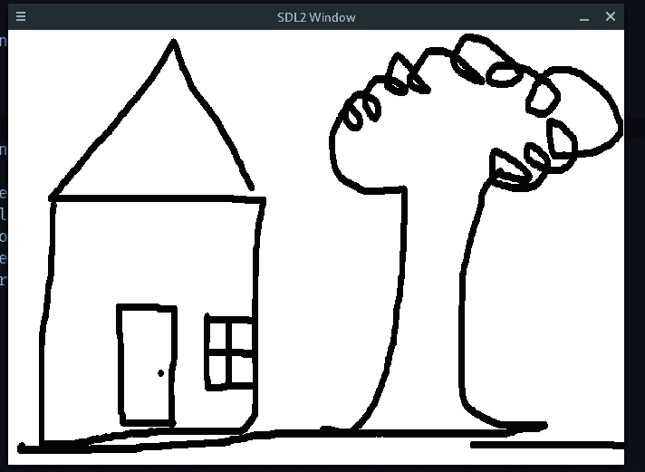

# 使用 SDL2:视口

> 原文：<https://dev.to/noah11012/using-sdl2-viewports-dgn>

当渲染一个场景或世界时，并不是所有的东西都在窗口的边界内。一次只能向用户呈现和显示部分区域。在 SDL(通常在 GC 中)这个区域也称为视口。视口内的任何内容都将被渲染，而视口外的任何内容都将被忽略。许多游戏都有一个可以在世界中移动和执行操作的角色。视角色移动的位置而定，视口必须随之移动，以保持角色处于焦点上。

作为一个在 SDL 演示视窗的例子，我们将有一个程序，可以在一个基本上是房子和树的图像的世界中缩放和移动。

在之前的文章中，我们使用了`Appplication`类来处理窗口事件、更新实体以及最后的渲染。然而，与前几期不同，我们将有一个名为`handle_zoom()`的额外方法。当检测到事件`SDL_KEYDOWN`时，这个方法处理用户缩放。

```
void Application::loop()
{
    bool keep_window_open = true;
    while(keep_window_open)
    {
        while(SDL_PollEvent(&m_window_event) > 0)
        {
            switch(m_window_event.type)
            {
                case SDL_QUIT:
                    keep_window_open = false;
                    break;

                case SDL_KEYDOWN:
                    handle_zoom();
            }
        }

        update(1.0/60.0);
        draw();
    }
} 
```

因为我决定对图像的背景使用透明度，所以我必须使用 SDL2 图像扩展库来打开 PNG 图像。在构造函数中，图像库被初始化，我们将要使用的图像被载入内存。

```
Application::Application()
{
    // ...

    m_render_viewport = { 0, 0, 680, 480 };

    IMG_Init(IMG_INIT_PNG);

    SDL_Surface *image_surface = IMG_Load("world.png");
    m_image = SDL_CreateTextureFromSurface(m_window_renderer, image_surface);
    SDL_FreeSurface(image_surface);
} 
```

在过去的文章中，当使用图像时，我们将图像的像素数据加载到一个`SDL_Surface *`中，将其转换为一个`SDL_Texture`，最后，查询纹理的宽度和高度。我们在这里做前两个，但不是最后一个。`m_render_viewport`负责将图像的哪一部分渲染到屏幕上。

现在，我终于可以展示让所有奇迹发生的方法了:

```
void Application::handle_zoom()
{
    unsigned char const *keys = SDL_GetKeyboardState(nullptr);
    if(keys[SDL_SCANCODE_UP])
    {
        m_render_viewport.w += 5;
        m_render_viewport.h += 5;
    } else if(keys[SDL_SCANCODE_DOWN])
    {
        m_render_viewport.w -= 5;
        m_render_viewport.h -= 5;
    }
    else if(keys[SDL_SCANCODE_W])
    {
        m_render_viewport.y += 20;
        if(m_render_viewport.y > 0)
            m_render_viewport.y = 0;
    } else if(keys[SDL_SCANCODE_S])
    {
        m_render_viewport.y -= 20;
        if(m_render_viewport.y < -720)
            m_render_viewport.y = -720;
    } else if(keys[SDL_SCANCODE_A])
    {
        m_render_viewport.x += 20;
    } else if(keys[SDL_SCANCODE_D])
    {
        m_render_viewport.x -= 20;
        if(m_render_viewport.x < -1280)
            m_render_viewport.x = -1280;
    }
} 
```

这只是操纵视口的位置和尺寸。在`Application::draw()`方法中，我们设置视口并渲染。

```
void Application::draw()
{
    SDL_SetRenderDrawColor(m_window_renderer, 255, 255, 255, 255);
    SDL_RenderClear(m_window_renderer);
    SDL_RenderCopy(m_window_renderer, m_image, nullptr, nullptr);
    SDL_RenderSetViewport(m_window_renderer, &m_render_viewport);
    SDL_RenderPresent(m_window_renderer);
} 
```

编译并运行。

[](https://res.cloudinary.com/practicaldev/image/fetch/s--qBANn6MG--/c_limit%2Cf_auto%2Cfl_progressive%2Cq_auto%2Cw_880/https://thepracticaldev.s3.amazonaws.com/i/7w774dxyv94tzlzzmwk6.png)

当然，你可以移动和放大缩小。

## 接下来是什么

下一篇文章没有明确的时间表，但是你可以认为这是一个惊喜。

Github 库:[https://github.com/Noah11012/sdl2-tutorial-code](https://github.com/Noah11012/sdl2-tutorial-code)