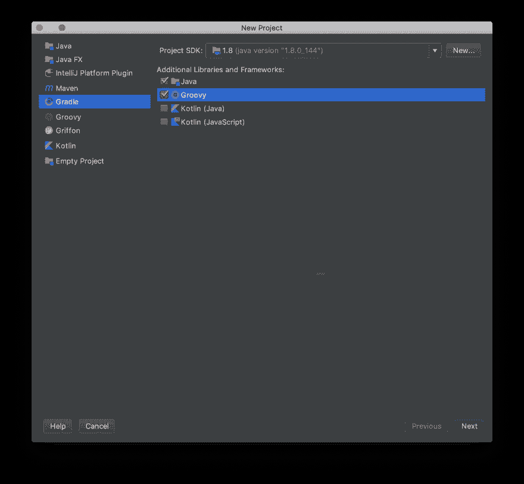
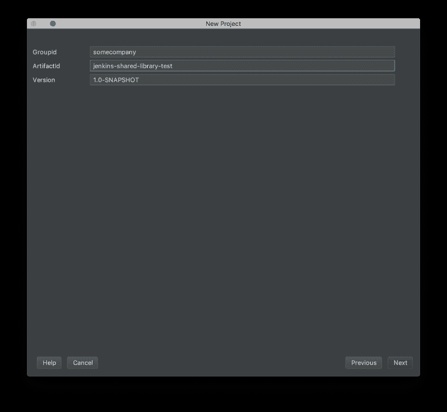
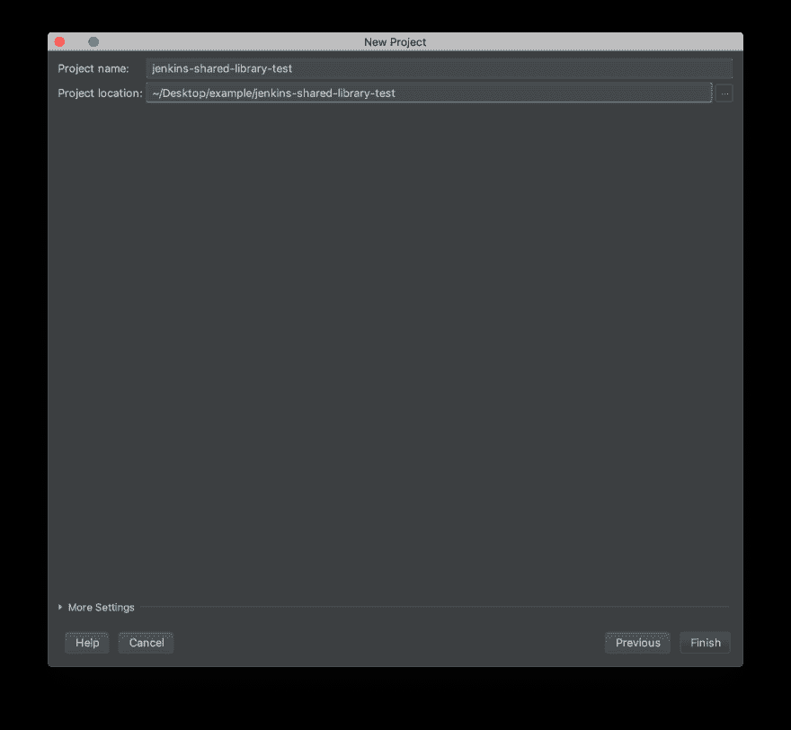
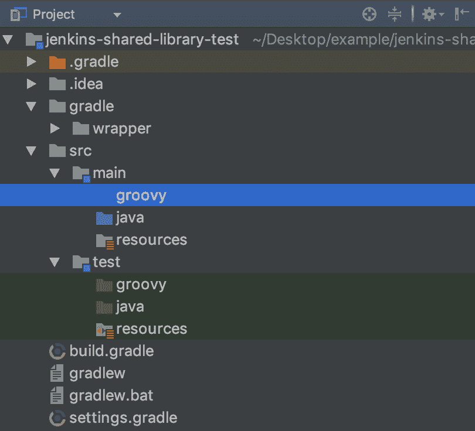
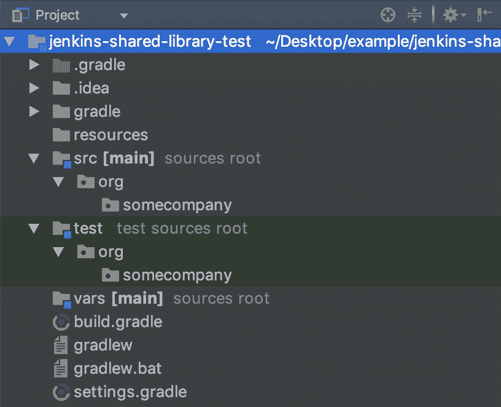

# 如何:设置可单元测试的 Jenkins 共享管道库

> 原文：<https://dev.to/kuperadrian/how-to-setup-a-unit-testable-jenkins-shared-pipeline-library-2e62>

(最初发布于[loglevel-blog.com](https://loglevel-blog.com/how-to-setup-and-develop-jenkins-shared-pipeline-library/))

在这篇博文中，我将尝试解释如何为 Jenkins 设置和开发一个共享管道库，这很容易操作，并且可以用 JUnit 和 Mockito 进行单元测试。

注意:这篇博文有点长，涉及了很多话题，但没有详细解释。如果你不想跟随冗长的教程，你可以看看 [GitHub](https://github.com/kuper-adrian/jenkins-shared-library-example) 上完整的例子库。此外，如果你有问题，或者真的有任何关于我可以改进的反馈，请留下评论，我会尽快回复你；)另外，如果你对 Jenkins 共享库完全不熟悉，你可能应该先在[官方文档](https://jenkins.io/doc/book/pipeline/shared-libraries/)中了解一下。

我们走吧！

## 基本开发设置

首先，让我们创建一个新的 IntelliJ IDEA 项目。我建议将 IntelliJ 理念用于 Jenkins 共享管道开发，因为它是我所知道的唯一一个正确支持 Java 和 Groovy 并具有 Gradle 支持的 IDE。所以，如果你还没有安装它，你可以在这里为 Windows、Linux 或 MacOS 下载它。还要确保安装了 Java 开发工具包，可以在[这里](https://www.oracle.com/technetwork/java/javase/downloads/jdk8-downloads-2133151.html)获得。

一切准备就绪后，启动 IntelliJ，创建一个新项目，选择 Gradle，并确保在 Groovy 上设置复选框。

[](https://res.cloudinary.com/practicaldev/image/fetch/s--IH63qh5K--/c_limit%2Cf_auto%2Cfl_progressive%2Cq_auto%2Cw_880/https://thepracticaldev.s3.amazonaws.com/i/mvf2arsz0dmpi721uc6l.png)

接下来，输入一个 GroupId 和一个 ArtifactId。

[](https://res.cloudinary.com/practicaldev/image/fetch/s--PuuFHnaf--/c_limit%2Cf_auto%2Cfl_progressive%2Cq_auto%2Cw_880/https://thepracticaldev.s3.amazonaws.com/i/6jgw5g2khn8nt9rrc0tp.png)

忽略下一个窗口(默认为好)，单击“下一步”，输入项目名称，然后单击“完成”。

[](https://res.cloudinary.com/practicaldev/image/fetch/s--cufImhm3--/c_limit%2Cf_auto%2Cfl_progressive%2Cq_auto%2Cw_880/https://thepracticaldev.s3.amazonaws.com/i/bw2p2kfvz6v3ygq5hgs7.png)

IntelliJ 应该会启动您的新项目。项目中的文件夹结构应该如下所示。

[](https://res.cloudinary.com/practicaldev/image/fetch/s--wK1TAHWo--/c_limit%2Cf_auto%2Cfl_progressive%2Cq_auto%2Cw_880/https://thepracticaldev.s3.amazonaws.com/i/jj5vrid6mhbqb0ffyhkm.png)

这对于普通的 Java/Groovy 项目来说很酷，但是对于我们的目的来说，我们必须做一些改变，因为 Jenkins 需要这样的项目结构:

```
(root)
+- src                     # Groovy source files
|   +- org
|       +- somecompany
|           +- Bar.groovy  # for org.foo.Bar class
+- vars
|   +- foo.groovy          # for global 'foo' variable
|   +- foo.txt             # help for 'foo' variable
+- resources               # resource files (external libraries only)
|   +- org
|       +- somecompany
|           +- bar.json    # static helper data for org.foo.Bar 
```

Enter fullscreen mode Exit fullscreen mode

所以:

1.  将一个`vars`文件夹添加到您的项目根文件夹
2.  将一个`resource`文件夹添加到您的项目根文件夹
3.  删除`src`中的所有文件/文件夹，并添加一个类似`org.somecompany`的新包
4.  编辑`build.gradle`文件:

```
group 'somecompany'
version '1.0-SNAPSHOT'

apply plugin: 'groovy'
apply plugin: 'java'

sourceCompatibility = 1.8

repositories {
    mavenCentral()
}

dependencies {
    compile 'org.codehaus.groovy:groovy-all:2.3.11'
    testCompile group: 'junit', name: 'junit', version: '4.12'
    testCompile "org.mockito:mockito-core:2.+"
}

sourceSets {
    main {
        java {
            srcDirs = []
        }
        groovy {
            // all code files will be in either of the folders
            srcDirs = ['src', 'vars'] 
        }
    }
    test {
        java {
            srcDir 'test'
        }
    }
} 
```

Enter fullscreen mode Exit fullscreen mode

保存后，将您的更改导入 Gradle 项目:

[](https://res.cloudinary.com/practicaldev/image/fetch/s--9xy7qV3R--/c_limit%2Cf_auto%2Cfl_progressive%2Cq_auto%2Cw_880/https://thepracticaldev.s3.amazonaws.com/i/5negvecnc8xuk8ejp8mq.png)

在这一点上，我们的项目有了合适的结构，可以被 Jenkins 用作共享库。但是，正如您可能在上面的代码片段中看到的，我们还为单元测试添加了一个名为`test`的源目录。现在是时候在项目的根级别创建这个文件夹，并添加一个包`org.somecompany`，就像我们对`src`所做的那样。最终的结构应该如下所示。

[](https://res.cloudinary.com/practicaldev/image/fetch/s--SrbiI-K3--/c_limit%2Cf_auto%2Cfl_progressive%2Cq_auto%2Cw_880/https://thepracticaldev.s3.amazonaws.com/i/rn55h3ybm728ak0kjdr8.png)

酷，是时候实现我们的共享库了！

## 一般做法

首先简单介绍一下我们是如何建立图书馆的，以及为什么要这样做:

*   我们将保持`var`中的“定制”步骤尽可能简单，并且没有任何真正的逻辑。相反，我们创建完成所有工作的类(在`src`内部)。
*   我们创建一个接口，它为所有必需的 Jenkins 步骤(`sh`、`bat`、`error`等)声明方法。).这些类只通过这个接口调用步骤。
*   我们为您的类编写单元测试，就像您通常使用 JUnit 和 Mockito 一样。

通过这种方式，我们能够:

*   在没有 Jenkins 的情况下编译和执行我们的库/单元测试
*   测试我们的类是否按预期工作
*   测试是否用正确的参数调用了 Jenkins 步骤
*   当 Jenkins 步骤失败时，测试我们代码的行为
*   通过 Jenkins 本身构建、测试、运行指标并部署您的 Jenkins 管道库

现在我们真的开始吧。

## 步进访问界面

首先，我们将在`org.somecompany`中创建接口，所有的类**将使用该接口来访问常规的 Jenkins 步骤，如`sh`或`error`。** 

```
package org.somecompany

interface IStepExecutor {
    int sh(String command)
    void error(String message)
    // add more methods for respective steps if needed
} 
```

Enter fullscreen mode Exit fullscreen mode

这个接口很简洁，因为它可以在我们的单元测试中被模仿。这样我们的类就独立于 Jenkins 本身了。现在，让我们添加一个将在我们的`vars` Groovy 脚本中使用的实现:

```
package org.somecompany

class StepExecutor implements IStepExecutor {
    // this will be provided by the vars script and 
    // let's us access Jenkins steps
    private _steps 

    StepExecutor(steps) {
        this._steps = steps
    }

    @Override
    int sh(String command) {
        this._steps.sh returnStatus: true, script: "${command}"
    }

    @Override
    void error(String message) {
        this._steps.error(message)
    }
} 
```

Enter fullscreen mode Exit fullscreen mode

## 添加基本依赖注入

因为我们不想在单元测试中使用上面的实现，所以我们将设置一些基本的依赖注入，以便在单元测试中用 mock 替换上面的实现。如果您不熟悉依赖注入，您可能应该仔细阅读它，因为在这里解释它超出了范围，但是您可能只需要复制粘贴本章中的代码并跟着做就可以了。

所以，首先我们创建`org.somecompany.ioc`包并添加一个`IContext`接口:

```
package org.somecompany.ioc

import org.somecompany.IStepExecutor

interface IContext {
    IStepExecutor getStepExecutor()
} 
```

Enter fullscreen mode Exit fullscreen mode

同样，这个接口在我们的单元测试中会被模仿。但是对于我们库的常规执行，我们仍然需要一个默认的实现:

```
package org.somecompany.ioc

import org.somecompany.IStepExecutor
import org.somecompany.StepExecutor

class DefaultContext implements IContext, Serializable {
    // the same as in the StepExecutor class
    private _steps

    DefaultContext(steps) {
        this._steps = steps
    }

    @Override
    IStepExecutor getStepExecutor() {
        return new StepExecutor(this._steps)
    }
} 
```

Enter fullscreen mode Exit fullscreen mode

为了完成我们的基本依赖注入设置，让我们添加一个“上下文注册表”，用于存储当前上下文(在正常执行期间为`DefaultContext`，在单元测试期间为`IContext`添加一个 mock ITO mock):

```
package org.somecompany.ioc

class ContextRegistry implements Serializable {
    private static IContext _context

    static void registerContext(IContext context) {
        _context = context
    }

    static void registerDefaultContext(Object steps) {
        _context = new DefaultContext(steps)
    }

    static IContext getContext() {
        return _context
    }
} 
```

Enter fullscreen mode Exit fullscreen mode

就是这样！现在我们可以自由地在`vars`中编写可测试的 Jenkins 步骤了。

## 编码自定义詹金斯步骤

让我们想象一下我们的例子，我们想添加一个步骤到我们的库中，调用。NET 构建工具“MSBuild”来构建。NET 项目。为此，我们首先将一个 groovy 脚本`ex_msbuild.groovy`添加到`vars`文件夹中，这个文件夹就像我们想要实现的自定义步骤一样。因为我们的脚本名为`ex_msbuild.groovy`，所以我们的步骤稍后可以用 Jenkinsfile 中的`ex_mbsbuild`来调用。暂时将以下内容添加到脚本中:

```
def call(String solutionPath) {
    // TODO
} 
```

Enter fullscreen mode Exit fullscreen mode

根据我们的总体想法，我们希望让我们的`ex_msbuild`脚本尽可能简单，并在一个单元可测试的类中完成所有的工作。所以让我们在新的包`org.somecompany.build` :
中创建新的类`MsBuild`

```
package org.somecompany.build

import org.somecompany.IStepExecutor
import org.somecompany.ioc.ContextRegistry

class MsBuild implements Serializable {
    private String _solutionPath

    MsBuild(String solutionPath) {
        _solutionPath = solutionPath
    }

    void build() {
        IStepExecutor steps = ContextRegistry.getContext().getStepExecutor()

        int returnStatus = steps.sh("echo \"building ${this._solutionPath}...\"")
        if (returnStatus != 0) {
            steps.error("Some error")
        }
    }
} 
```

Enter fullscreen mode Exit fullscreen mode

如你所见，我们在类中同时使用了`sh`和`error`步骤，但是我们没有直接使用它们，而是使用了`ContextRegistry`来获得`IStepExecutor`的实例，从而用它来调用 Jenkins 步骤。这样，当我们以后想要对`build()`方法进行单元测试时，我们可以交换上下文。

现在我们可以完成我们的`ex_msbuild`脚本:

```
import org.somecompany.build.MsBuild
import org.somecompany.ioc.ContextRegistry

def call(String solutionPath) {
    ContextRegistry.registerDefaultContext(this)

    def msbuild = new MsBuild(solutionPath)
    msbuild.build()
} 
```

Enter fullscreen mode Exit fullscreen mode

首先，我们用上下文注册表设置上下文。因为我们不是在单元测试中，所以我们使用默认的上下文。我们传递给`registerDefaultContext()`的`this`将由`DefaultContext`保存在其私有的`_steps`变量中，并用于访问 Jenkins 步骤。注册上下文后，我们可以实例化我们的`MsBuild`类并调用`build()`方法完成所有工作。

很好，我们的`vars`剧本完成了。现在我们只需要为我们的`MsBuild`类编写一些单元测试。

## 添加单元测试

此时，编写单元测试应该像往常一样。我们用包`org.somecompany.build`在测试文件夹中创建一个新的测试类`MsBuildTest`。在每次测试之前，我们使用 Mockito 模拟`IContext`和`IStepExecutor`接口，并注册模拟的上下文。然后我们可以简单地在测试中创建一个新的`MsBuild`实例，并验证我们的`build()`方法的行为。包含两个示例测试的完整测试类:

```
package org.somecompany.build;

import org.somecompany.IStepExecutor;
import org.somecompany.ioc.ContextRegistry;
import org.somecompany.ioc.IContext;
import org.junit.Before;
import org.junit.Test;

import static org.mockito.Mockito.*;

/**
 * Example test class
 */
public class MsBuildTest {
    private IContext _context;
    private IStepExecutor _steps;

    @Before
    public void setup() {
        _context = mock(IContext.class);
        _steps = mock(IStepExecutor.class);

        when(_context.getStepExecutor()).thenReturn(_steps);

        ContextRegistry.registerContext(_context);
    }

    @Test
    public void build_callsShStep() {
        // prepare
        String solutionPath = "some/path/to.sln";
        MsBuild build = new MsBuild(solutionPath);

        // execute
        build.build();

        // verify
        verify(_steps).sh(anyString());
    }

    @Test
    public void build_shStepReturnsStatusNotEqualsZero_callsErrorStep() {
        // prepare
        String solutionPath = "some/path/to.sln";
        MsBuild build = new MsBuild(solutionPath);

        when(_steps.sh(anyString())).thenReturn(-1);

        // execute
        build.build();

        // verify
        verify(_steps).error(anyString());
    }
} 
```

Enter fullscreen mode Exit fullscreen mode

您可以使用 IntelliJ 代码编辑器左侧的绿色 play 按钮来运行测试，希望会变成绿色。

## 收拾东西

基本就是这样。现在是时候用 Jenkins 设置您的库了，创建一个新任务并运行 Jenkinsfile 来测试您的新定制`ex_msbuild`步骤。一个简单的测试 Jenkinsfile 可能是这样的:

```
// add the following line and replace necessary values if you are not loading the library implicitly
// @Library('my-library@master') _

pipeline {
    agent any
    stages {
        stage('build') {
            steps {
                ex_msbuild 'some/path/to.sln'
            }
        }
    }
} 
```

Enter fullscreen mode Exit fullscreen mode

显然，我还可以谈论更多的东西(比如单元测试、依赖注入、Gradle、Jenkins 配置、用 Jenkins 构建和测试库等等)。)，但我想让这篇已经很长的博文保持简洁。然而，我真的希望总体思路和方法变得清晰，并帮助您创建一个单元可测试的共享库，它比通常情况下更健壮、更容易操作。

**最后一条建议**:单元测试和 Gradle 设置非常好，有助于简化健壮的共享管道的开发，但不幸的是，即使库测试是绿色的，管道内部仍有相当多的地方可能出错。像下面这样的事情，主要是因为 Jenkins 的 Groovy 和沙盒的古怪而发生的:

*   一个没有实现必要的`Serializable`的类，因为“管道必须在 Jenkins 重启后存活”
*   在你的库中使用像`java.io.File`这样的类，这是[禁止的](https://support.cloudbees.com/hc/en-us/articles/230922128-Pipeline-Using-java-io-File-in-a-Pipeline-description)
*   Jenkinsfile 中的语法和拼写错误

因此，让 Jenkins 实例只用于集成测试可能是个好主意，在“上线”之前可以测试新的和修改过的`vars`脚本。

同样，请随意在评论中写下任何类型的问题或反馈，并看看 [GitHub](https://github.com/kuper-adrian/jenkins-shared-library-example) 上已完成的工作示例库。