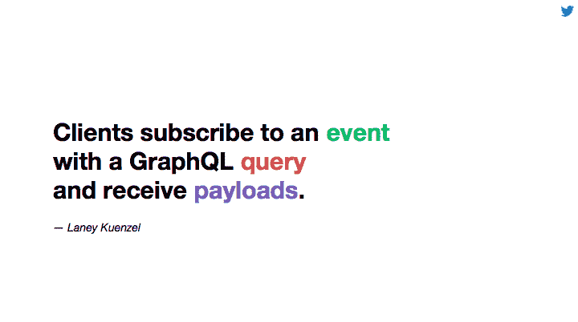

# GraphQL 初学者指南

> 原文：<https://dev.to/leonardomso/a-beginners-guide-to-graphql-3kjj>

[](https://res.cloudinary.com/practicaldev/image/fetch/s--OkC0L6E---/c_limit%2Cf_auto%2Cfl_progressive%2Cq_auto%2Cw_880/https://thepracticaldev.s3.amazonaws.com/i/hrbkpc1hronc3w3dea81.jpeg)

今天最常讨论的术语之一是 API。很多人不知道 API 到底是什么。基本上，API 代表**应用编程接口。**顾名思义，它是一个界面，开发人员、用户和消费者可以通过它与数据进行交互。

你可以把 API 想象成一个调酒师。你向酒保要一杯酒，他们会给你你想要的。简单。那为什么这是个问题呢？

自从现代网络出现以来，构建 API 并没有听起来那么难。但是学习和理解 API 是很困难的。开发人员构成了使用你的 API 来构建一些东西或者只是消费数据的大多数人。所以你的 API 应该尽可能的简洁和直观。一个设计良好的 API 非常容易使用和学习。它也是直观的，当你开始设计你的 API 时，记住这一点很好。

我们使用 REST 构建 API 已经有很长时间了。随之而来的是一些问题。当使用 REST 设计构建 API 时，您会面临一些问题，比如:

1)您将有许多端点

2)开发人员学习和理解你的 API 会更加困难

3)信息提取过多和不足

为了解决这些问题，脸书创建了 GraphQL。今天，我认为 GraphQL 是构建 API 的最佳方式。这篇文章将告诉你为什么你应该从今天开始学习它。

在本文中，您将了解 GraphQL 是如何工作的。我将向您展示如何使用 GraphQL 创建一个设计良好、高效、强大的 API。

你可能已经听说过 GraphQL，因为很多人和公司都在使用它。由于 GraphQL 是开源的，它的社区已经变得非常庞大。

现在，是时候开始在实践中学习 GraphQL 是如何工作的以及它的魔力了。

## 什么是 GraphQL？

[**GraphQL**](https://graphql.org) 是由脸书开发的开源查询语言。它为我们提供了一种更有效的方式来设计、创建和使用我们的 API。基本上就是休息的替代。

GraphQL 有很多特性，比如:

1.  你写下你想要的数据，你就能得到你想要的数据。**不再像我们习惯休息时那样过度获取信息**。

2.  它给了我们一个**单一端点**，不再有相同 API 的版本 2 或版本 3。

3.  GraphQL 是**强类型的**，因此您可以在执行之前在 GraphQL 类型系统中验证查询。它帮助我们构建更强大的 API。

这是对 GraphQL 的一个基本介绍——为什么它如此强大，为什么它最近越来越受欢迎。如果你想了解更多，推荐你去 [GraphQL 网站](https://graphql.org/)看看。

## 入门

本文的主要目标不是学习如何设置一个 GraphQL 服务器，所以我们现在不会深入探讨这个问题。目标是了解 GraphQL 在实践中是如何工作的，所以我们将使用一个名为☄️ [Graphpack](https://github.com/glennreyes/graphpack) 的零配置 GraphQL 服务器。

为了开始我们的项目，我们将创建一个新文件夹，您可以随意命名。我打算把它命名为`graphql-server`:

打开您的终端并键入:

```
mkdir graphql-server 
```

Enter fullscreen mode Exit fullscreen mode

现在，您的机器上应该已经安装了`npm`或`yarn`。如果你不知道这些是什么，`npm`和`yarn`是 JavaScript 编程语言的包管理器。对于 Node.js，默认的包管理器是`npm`。

在您创建的文件夹中键入以下命令:

```
npm init -y 
```

Enter fullscreen mode Exit fullscreen mode

或者如果你使用`yarn`:

```
yarn init 
```

Enter fullscreen mode Exit fullscreen mode

`npm`将为您创建一个`package.json`文件，您安装的所有依赖项和您的命令都在那里。

所以现在，我们将安装**我们将使用的唯一依赖项**。

☄️ [Graphpack](https://github.com/glennreyes/graphpack) 允许你创建一个 GraphQL 服务器**而无需配置**。由于我们刚刚开始使用 GraphQL，这将对我们继续学习和了解更多内容有很大帮助，而不必担心服务器配置。

在您的终端中，在您的根文件夹中，安装它，如下所示:

```
npm install --save-dev graphpack 
```

Enter fullscreen mode Exit fullscreen mode

或者，如果用`yarn`，应该这样走:

```
yarn add --dev graphpack 
```

Enter fullscreen mode Exit fullscreen mode

在安装了 *Graphpack* 之后，转到我们在`package.json`文件中的脚本，并将下面的代码放在那里:

```
"scripts": {
    "dev": "graphpack",
    "build": "graphpack build"
 } 
```

Enter fullscreen mode Exit fullscreen mode

我们将创建一个名为`src`的文件夹，它将是我们整个服务器中唯一的文件夹。

创建一个名为`src`的文件夹，之后，在我们的文件夹中，我们将只创建三个文件。

在我们的`src`文件夹中创建一个名为`schema.graphql`的文件。在第一个文件中，放入以下代码:

```
type Query {    
    hello: String    
} 
```

Enter fullscreen mode Exit fullscreen mode

在这个`schema.graphql`文件中将是我们的整个 GraphQL 模式。如果你不知道那是什么，我稍后会解释——别担心。

现在，在我们的`src`文件夹中，创建第二个文件。将其命名为`resolvers.js`，并在第二个文件中放入以下代码:

```
import { users } from "./db";

const resolvers = {    
    Query: {    
        hello: () => "Hello World!"    
    }    
};

export default resolvers; 
```

Enter fullscreen mode Exit fullscreen mode

这个`resolvers.js`文件将成为我们提供将 GraphQL 操作转化为数据的指令的方式。

最后，在你的 *src* 文件夹中，创建第三个文件。调用这个`db.js`，并在第三个文件中放入以下代码:

```
export let users = [    
    { id: 1, name: "John Doe", email: "john@gmail.com", age: 22 },    
    { id: 2, name: "Jane Doe", email: "jane@gmail.com", age: 23 }    
]; 
```

Enter fullscreen mode Exit fullscreen mode

在本教程中，我们没有使用真实世界的数据库。所以这个`db.js`文件要模拟一个数据库，只是为了学习的目的。

现在我们的`src`文件夹应该是这样的:

```
src
  |--db.js
  |--resolvers.js
  |--schema.graphql 
```

Enter fullscreen mode Exit fullscreen mode

现在，如果您运行命令`npm run dev`，或者如果您正在使用`yarn`、`yarn dev`，您应该在您的终端中看到这个输出:

[](https://res.cloudinary.com/practicaldev/image/fetch/s--5vvAFZtb--/c_limit%2Cf_auto%2Cfl_progressive%2Cq_auto%2Cw_880/https://cdn-images-1.medium.com/max/2096/1%2AFKJYY9qqg4PLBvziWPlhVg.png)

你现在可以去`localhost:4000`。这意味着我们已经准备好开始用 GraphQL 编写我们的第一批查询、变异和订阅。

您可以看到 GraphQL Playground，这是一个强大的 GraphQL IDE，用于更好的开发工作流。如果你想了解更多关于 GraphQL Playground 的信息，[点击这里](https://www.prisma.io/blog/introducing-graphql-playground-f1e0a018f05d/)。

## 图式

GraphQL 有自己的语言类型，用于编写模式。这是一种人类可读的模式语法，称为**模式定义语言(SDL)** 。无论您使用什么技术，SDL 都是一样的——您可以将它用于您想要的任何语言或框架。

这种模式语言非常有用，因为很容易理解你的 API 将会有什么类型。你只要看着它就能理解它。

## 类型

类型是 GraphQL 最重要的特性之一。类型是表示 API 外观的自定义对象。例如，如果您正在构建一个社交媒体应用程序，那么您的 API 应该包含帖子、用户、喜欢、群组等类型。

类型有字段，这些字段返回特定类型的数据。例如，我们要创建一个用户类型，我们应该有一些姓名、电子邮件和年龄字段。类型字段可以是任何类型，并且总是返回数据类型，如 Int、Float、String、Boolean、ID、对象类型列表或自定义对象类型。

现在，为了编写我们的第一个类型，转到您的`schema.graphql`文件，用下面的代码替换已经存在的类型查询:

```
type User {    
    id: ID!    
    name: String!    
    email: String!    
    age: Int    
} 
```

Enter fullscreen mode Exit fullscreen mode

每个用户都有一个 ID，所以我们给了它一个 ID 类型。用户也将有一个名字和电子邮件，所以我们给它一个字符串类型，和一个年龄，我们给了一个 Int 类型。很简单，对吧？

但是，那些呢！在每一行的结尾？感叹号意味着字段**不可为空**，这意味着每个字段必须在每个查询中返回一些数据。我们的用户类型中唯一的**可空字段**将是年龄。

在 GraphQL 中，您将处理三个主要概念:

1.  **查询** —从服务器获取数据的方式。

2.  **突变** —您将在服务器上修改数据并获取更新数据的方式(创建、更新、删除)。

3.  **订阅** —您将与服务器保持实时连接的方式。

我会把它们都解释给你听。让我们从查询开始。

## 查询

简单地解释一下，GraphQL 中的查询就是获取数据的方式。GraphQL 中查询最美妙的事情之一是，您将获得您想要的确切数据。不多不少。这对我们的 API 有巨大的积极影响——不再像 REST APIs 那样获取过多或不足的信息。

我们将在 GraphQL 中创建我们的第一个类型查询。我们所有的查询都将在这个类型中结束。因此，首先，我们将转到我们的`schema.graphql`并编写一个名为 Query 的新类型:

```
type Query {    
    users: [User!]!    
} 
```

Enter fullscreen mode Exit fullscreen mode

非常简单:用户查询**将返回一个或多个用户**的数组。它不会返回 null，因为我们放入了**！**，这意味着它是一个不可空的查询。它应该总是返回一些东西。

但是我们也可以返回一个特定的用户。为此，我们将创建一个名为 user 的新查询。在我们的查询类型中，放入以下代码:

```
user(id: ID!): User! 
```

Enter fullscreen mode Exit fullscreen mode

现在，我们的查询类型应该如下所示:

```
type Query {    
    users: [User!]!    
    user(id: ID!): User!    
} 
```

Enter fullscreen mode Exit fullscreen mode

如您所见，使用 GraphQL 中的查询，我们还可以传递参数。在本例中，为了查询特定用户，我们将传递其 ID。

但是，您可能想知道:GraphQL 如何知道从哪里获取数据？这就是为什么我们应该有一个`resolvers.js`文件。该文件告诉 GraphQL 如何以及在哪里获取数据。

首先，转到我们的`resolvers.js`文件，导入我们刚刚创建的`db.js`。您的`resolvers.js`文件应该是这样的:

```
import { users } from "./db";

const resolvers = {    
    Query: {    
        hello: () => "Hello World!"    
    }    
};

export default resolvers; 
```

Enter fullscreen mode Exit fullscreen mode

现在，我们将创建第一个查询。转到您的`resolvers.js`文件并替换 hello 函数。现在，您的查询类型应该如下所示:

```
import { users } from "./db";

const resolvers = {    
    Query: {    
        user: (parent, { id }, context, info) => {    
        return users.find(user => user.id == id);    
        },    
        users: (parent, args, context, info) => {    
            return users;    
        }    
    }    
};

export default resolvers; 
```

Enter fullscreen mode Exit fullscreen mode

现在，为了解释它是如何工作的:

每个查询解析器有四个参数。在用户函数中，我们将把 id 作为参数传递，然后返回与传递的 id 相匹配的特定用户。很简单。

在 users 函数中，我们将返回已经存在的 users 数组。它总会回到我们所有的用户身上。

现在，我们将测试我们的查询是否工作正常。转到`localhost:4000`并输入以下代码:

```
query {    
    users {    
        id    
        name    
        email    
        age    
    }    
} 
```

Enter fullscreen mode Exit fullscreen mode

它应该归还给你我们所有的用户。

或者，如果您想要返回特定用户:

```
query {    
    user(id: 1) {    
        id    
        name    
        email    
        age    
    }    
} 
```

Enter fullscreen mode Exit fullscreen mode

现在，我们将开始学习**突变**，这是 GraphQL 中最重要的特性之一。

## 突变

在 GraphQL 中，突变是您在服务器上修改数据并获取更新数据的方式。你可以像 REST 的 CUD(创建、更新、删除)一样思考。

我们将在 GraphQL 中创建我们的第一个类型变异，我们所有的变异都将在这个类型中结束。所以，首先，去我们的`schema.graphql`写一个叫做突变的新类型:

```
type Mutation {    
    createUser(id: ID!, name: String!, email: String!, age: Int): User!    
    updateUser(id: ID!, name: String, email: String, age: Int): User!    
    deleteUser(id: ID!): User!    
} 
```

Enter fullscreen mode Exit fullscreen mode

如你所见，我们将有三个突变:

createUser :我们应该传递 ID、姓名、电子邮件和年龄。它应该会返回一个新用户给我们。

我们应该传递一个 ID，以及一个新的名字、电子邮件或年龄。它应该会返回一个新用户给我们。

deleteUser :我们应该传递一个 ID。它应该会将删除的用户返回给我们。

现在，转到我们的`resolvers.js`文件和下面的**查询对象，像这样创建一个新的突变对象:**

```
Mutation: {    
    createUser: (parent, { id, name, email, age }, context, info) => {    
        const newUser = { id, name, email, age };    
        users.push(newUser);    
        return newUser;    
},   
    updateUser: (parent, { id, name, email, age }, context, info) => {    
        let newUser = users.find(user => user.id == id);    
        newUser.name = name;    
        newUser.email = email;    
        newUser.age = age;

        return newUser;
    },    
    deleteUser: (parent, { id }, context, info) => {    
        const userIndex = users.findIndex(user => user.id == id);

        if (userIndex === -1) throw new Error("User not found.");

        const deletedUsers = users.splice(userIndex, 1);

        return deletedUsers[0];     
    }    
} 
```

Enter fullscreen mode Exit fullscreen mode

现在，我们的`resolvers.js`文件应该是这样的:

```
import { users } from "./db";

const resolvers = {    
    Query: {        
        user: (parent, { id }, context, info) => {      
            return users.find(user => user.id == id);       
        },      
        users: (parent, args, context, info) => {       
            return users;       
        }       
    },    
    Mutation: {    
        createUser: (parent, { id, name, email, age }, context, info) => {    
            const newUser = { id, name, email, age };    
            users.push(newUser);    
            return newUser;    
    },   
        updateUser: (parent, { id, name, email, age }, context, info) => {    
            let newUser = users.find(user => user.id == id);    
            newUser.name = name;    
            newUser.email = email;    
            newUser.age = age;

            return newUser;
        },    
        deleteUser: (parent, { id }, context, info) => {    
            const userIndex = users.findIndex(user => user.id === id);

            if (userIndex === -1) throw new Error("User not found.");

            const deletedUsers = users.splice(userIndex, 1);

            return deletedUsers[0];         
        }    
    }    
};

export default resolvers; 
```

Enter fullscreen mode Exit fullscreen mode

现在，我们将测试我们的突变是否工作正常。转到`localhost:4000`并输入以下代码:

```
mutation {    
    createUser(id: 3, name: "Robert", email: "robert@gmail.com", age: 21) {    
        id    
        name    
        email    
        age    
    }    
} 
```

Enter fullscreen mode Exit fullscreen mode

它应该会向您返回一个新用户。如果你想尝试做新的突变，我推荐你自己去尝试！尝试删除您创建的同一个用户，看看它是否工作正常。

最后，我们将开始了解**订阅**，以及它们为何如此强大。

## 订阅

如我之前所说，订阅是你与服务器保持实时连接的方式。这意味着每当服务器中发生事件以及调用该事件时，服务器都会向客户端发送相应的数据。

通过使用订阅，您可以根据不同用户之间的最新变化来更新您的应用程序。

[](https://res.cloudinary.com/practicaldev/image/fetch/s--5ZxE4cuA--/c_limit%2Cf_auto%2Cfl_progressive%2Cq_auto%2Cw_880/https://cdn-images-1.medium.com/max/2000/1%2ANaIPy126r9Ie5NwjS3g-rg.png)

基本订阅是这样的:

```
subscription {    
    users {    
        id    
        name    
        email    
        age    
    }    
} 
```

Enter fullscreen mode Exit fullscreen mode

你会说它非常类似于一个查询，是的。但它的工作原理不同。

当服务器中有更新时，服务器将运行订阅中指定的 GraphQL 查询，并将最新更新的结果发送给客户机。

在这篇文章中，我们不打算讨论订阅，但是如果你想了解更多关于订阅的内容，请点击这里。

## 结论

如您所见，GraphQL 是一项非常强大的新技术。它赋予我们构建更好、设计更好的 API 的真正力量。这就是为什么我建议你现在就开始学。对我来说，它最终会取代休息。

感谢阅读文章，请在下方给出评论！

**🐦 [**在推特上关注我！**](https://twitter.com/leonardomso)**
**⭐ [**跟着我上 GitHub 吧！**](https://github.com/leonardomso)**