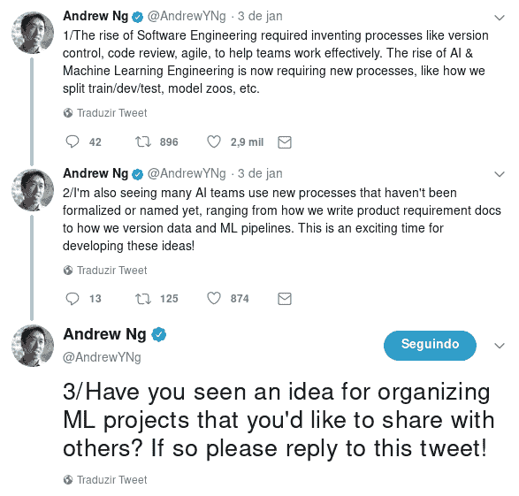

# 数据科学/工程模式的时代到了吗？

> 原文：<https://dev.to/renatocf/is-it-time-for-data-science--engineering-patterns-1782>

大多数软件工程师都已经读过由 Erich Gamma、Richard Helm、Ralph Johnson 和 John Vlissides(**四人组**又名 **GoF** )撰写的开创性著作 [Design Patterns](https://www.goodreads.com/book/show/85009) ,这本书让大多数面向对象语言的程序员用*singleton*、*迭代器*、*策略*等术语来谈论。

对于那些不知道这个概念的人，下面是来自维基百科的定义:

> 在[软件工程](https://en.wikipedia.org/wiki/Software_engineering)中，**软件设计模式**是对[软件设计](https://en.wikipedia.org/wiki/Software_design)中给定上下文中常见问题的通用、[可重用](https://en.wikipedia.org/wiki/Reusability)解决方案。它不是一个可以直接转化为源代码或机器码的成品设计。它是如何解决一个问题的描述或模板，可以在许多不同的情况下使用。设计模式是形式化的[最佳实践](https://en.wikipedia.org/wiki/Best_practice)，程序员可以用它来解决设计应用程序或系统时的常见问题。

我记得在 2014 年，我在两天内把这本书从头到尾读了一遍(这种方法并不常见，因为这本书是一种目录)。我在本科的时候就有了一些关于[面向对象编程](https://en.wikipedia.org/wiki/Object-oriented_programming) (OOP)的经验。然而，用这种模式设计新系统，我仍然有一些困难。突然，有人给了我一个制作新项目的指南。这个想法真的很吸引我！

认为设计模式是*“会敲打所有钉子的锤子”*，这是 new GoF 的书的读者常见的错误。我犯了这个错误。我试着根据模式来计划一切。但是[没有银弹](https://en.wikipedia.org/wiki/No_Silver_Bullet)。我掩盖了他们的优点和缺点。它们一方面提供了灵活性，但另一方面增加了复杂性。这是对设计模式概念最大的批评之一(这一点，对于 GoF 模式， [OOP 语言限制](http://norvig.com/design-patterns/))。

我现在的硕士和前专题论文的导师是在伊利诺伊大学香槟分校(UIUC)和拉尔夫·约翰逊一起获得博士学位的。我们一直在合作重构由我们的研究小组创建的机器学习框架， [ToPS](https://github.com/topsframework) 。该框架广泛使用模式，以至于我们发现并记录了一种新的设计模式——[秘书模式](https://renatocf.xyz/secretart-pattern)——我们在第 11 届 [SugarLoaf-PLoP](http://hillside.net/sugarloafplop/2016/) 拉丁美洲程序模式语言会议上展示了这种模式。

多亏了这个项目以及与我的顾问的关系，我想我意识到了模式是如何以及为什么有价值的(至少对我来说):**标准化并增加开发人员语言的描述能力**。正如我在本文开头所说，g of 的书让大多数面向对象语言的程序员用*单例*、*迭代器*、*策略*等术语来谈论。这节省了时间，同时使设计/架构讨论更加简洁和准确。

所有这些背景让我想到了写这篇文章的原因。今天[著名的斯坦福大学教授吴恩达](https://twitter.com/AndrewYNg/)在推特上发布了这样的帖子，他是 Coursera 的联合创始人，并制作了[有史以来最受欢迎的机器学习在线课程之一](https://www.coursera.org/learn/machine-learning):

这个帖子是我对他的(长篇)回应。

GoF 催生了模式编写者的运动，他们为诸如[领域驱动设计](https://www.goodreads.com/book/show/179133)、[企业架构](https://www.goodreads.com/book/show/70156)、[连续交付](https://www.goodreads.com/book/show/8686650)、[微服务](https://www.goodreads.com/book/show/34372564)、[游戏编程](https://www.goodreads.com/book/show/15499449)以及许多其他事物编写单个模式和整体**模式语言**。

但是数据科学和数据工程模式在哪里呢？

作为这种记录最佳实践方式的热衷者，我认为我们应该寻找这些模式并记录下来。我第一次意识到这一点是在 2016 年我去 SugarLoaf Plop 时，看到了许多领域的模式，但没有一个与这些相关。正如吴恩达所说(重点是我的):

> 我也看到许多人工智能团队使用新的流程，这些流程**还没有正式化或命名**，从我们如何编写产品需求文档到我们如何版本化数据和 ML 管道。

正如我上面所说的，我认为模式对于标准化和增加开发人员语言的描述能力最有价值。

> 这是发展这些想法的激动人心的时刻！

所以让我们来创造它们吧！

需要注意的是，我谈论的是**数据科学**和**数据工程**，而不是吴恩达所说的 **AI** 或 **ML** 。这是一个深思熟虑的词语选择。我通常将机器学习描述为数据科学家在试图对他们的数据进行推理时可用的人工智能技术(统计学习)之一。然而，数据科学的范围更广，包括其他任务(比如数据挖掘或可视化)，在这些任务中模式也是有用的。同时，处理大量数据有其自身的挑战，因此(大)数据工程也可以从这种方法中受益。

* * *

感谢阅读！你怎么想呢?你会读数据科学/工程模式吗？您认为这是记录该领域最佳实践的好方法吗？

在我的博士学位(我希望很快开始)，我想探索软件工程和数据科学/数据工程之间的关系。我认为探索模式可能是一个有趣的方向，因此我对吴恩达的推特感兴趣。

如果你喜欢这个讨论，看看我第一次写软件工程的另一篇文章。在那里，我介绍了我的想法:R.A.D.I.C.A.L 系统(T1 ),它也可以使用 AI/ML 进行 T2 智能数据转换。