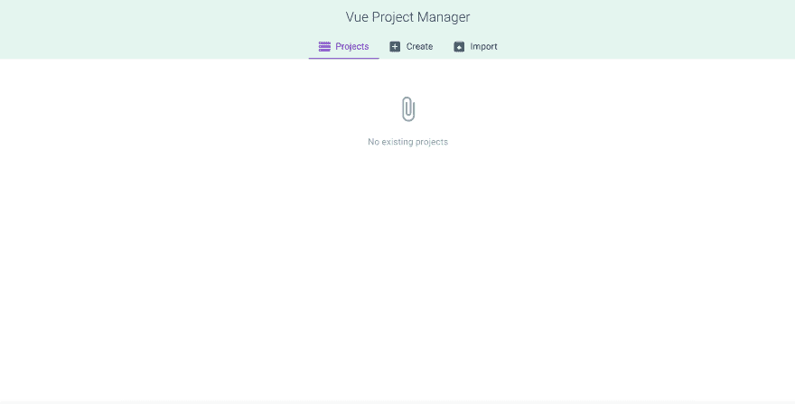
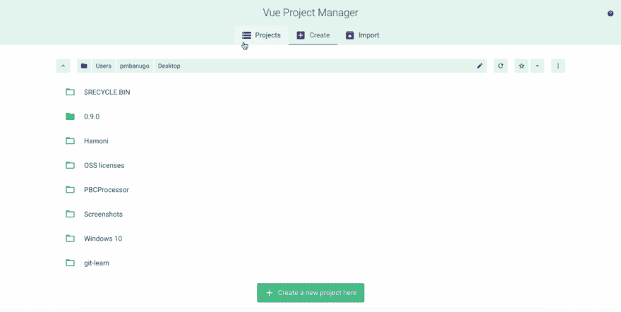
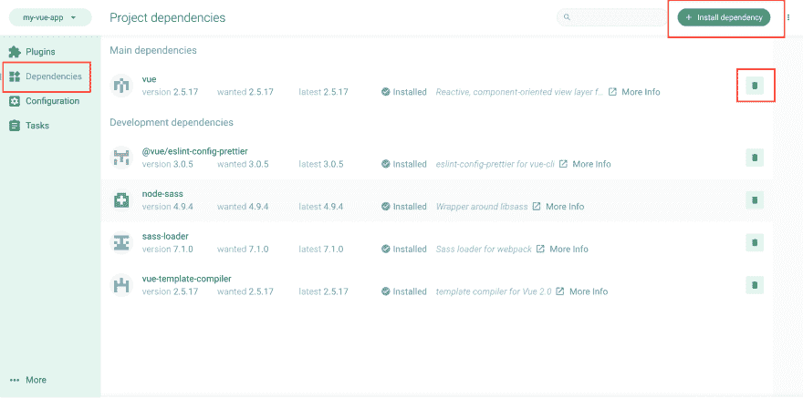
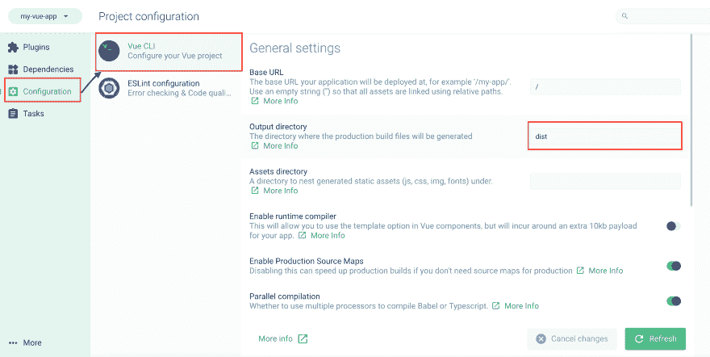
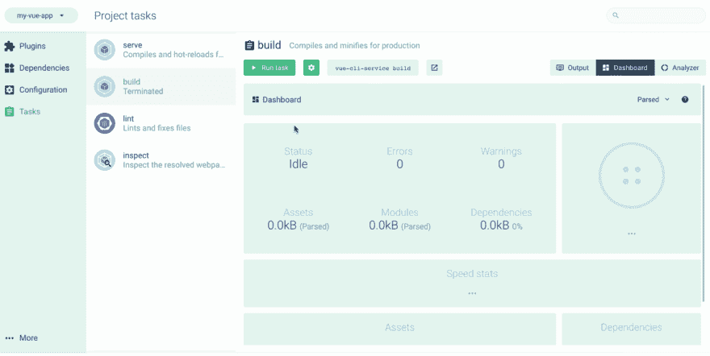

# 使用 Vue UI 创建和管理 Vue 项目

> 原文：<https://dev.to/progresstelerik/creating-and-managing-vue-projects-with-vue-ui-3e8a>

Vue CLI 版本 3 为我们提供了一个图形用户界面来创建和管理 Vue.js 项目。请继续阅读，了解如何使用 Vue UI 创建和管理 Vue.js 项目。

[Vue CLI](https://dev.to/progresstelerik/what-you-need-to-know-about-vue-cli-3-56h5-temp-slug-3068326) 为 Vue.js 的快速开发提供了标准工具。它确保 Vue.js 开发所需的各种构建工具与合理的默认值一起顺利工作，因此您可以专注于编写您的应用程序，而不是花费数天时间争论配置。使用 Vue CLI，我们可以:

1.  即时项目脚手架
2.  用一个 Vue 文件快速制作新想法的原型
3.  用于集成的官方插件集合
4.  创建和管理 Vue.js 项目的完整图形用户界面(GUI)

我将向您展示如何使用 Vue CLI 的图形用户界面工具创建和管理 Vue.js 项目。这个 GUI 被称为 Vue UI。

## 入门

我们需要安装 Vue CLI 才能使用它。要安装它，如果您使用 npm，打开命令行并运行`npm install -g @vue/cli`,或者如果您使用 yarn，运行`yarn global add @vue/cli`。你可以通过运行`vue`来验证它是否被正确安装。这将向您显示一条帮助消息，列出所有可用的命令。

### 创建项目

为了使用 Vue UI，我们将在命令行中运行`vue ui`命令。这将弹出一个图形用户界面，如下图所示。

用户界面有三个选项卡；**项目**、**创建**、**导入**。“项目”选项卡显示现有项目的列表,“创建”选项卡显示一个屏幕，其中包含构建新项目的选项，而“导入”选项卡允许您导入未在“项目”选项卡中列出的现有 Vue 项目。

要创建新项目，请执行以下操作:

1.  点击**创建**选项卡。
2.  选择您想要保存我们项目的位置。
3.  点按“在此创建新项目”按钮。这将我们带到**创建新项目**屏幕。
4.  然后在**项目文件夹**标签下的文本框中输入项目名称。
5.  选择您所选择的包管理器，并选择是否要初始化 git 存储库，以及是否覆盖现有的项目文件夹(如果存在的话)。保留默认选项，点击**下一步**按钮进入下一步。
6.  下一个屏幕要求您选择一个预设。可以选择默认预置，自带基本的 Babel + ESLint 设置；选择**手动**选择您需要的功能；或者选择**遥控器**使用遥控预设。选择手动并点击**下一步**按钮进入下一个屏幕。
7.  下一个屏幕显示了我们想要添加到项目中的特性列表。选择 Babel、Linter/Formatter、CSS 预处理程序，并使用配置文件。然后点击**下一个**按钮进入下一个屏幕。
8.  在下一页中，我们选择**萨斯/SCSS** 作为 CSS 预处理器， **ESLint +漂亮器**作为 Linter/formatter 选项，以及保存时 lint 的选项。
9.  点击**创建项目**按钮，使用我们上面选择的选项创建项目。它显示一个对话窗口，询问我们是否要将选项保存为新的预设，以便我们可以在以后使用它来搭建项目。点按“继续而不存储”，以便创建项目而不存储任何预置。

该项目将被创建，它应该显示一个项目已安装插件列表的页面。

### 项目插件

Vue CLI 使用基于插件的架构，这使得 Vue CLI 具有灵活性和可扩展性。点击右上角的**添加插件**按钮可以添加更多插件。您可以从**依赖项**选项卡中管理项目的依赖项，并能够删除或安装新的依赖项。

### 项目依赖关系

您可以选择更改一些项目配置。例如，要更改保存生产构建文件的目录，从侧面菜单中选择**配置**选项卡。然后选择 **Vue CLI** 并更改**输出目录**选项。

### 项目任务

**Tasks** 选项卡允许我们运行诸如 serve、build、lint 或 inspect 之类的任务。**服务**任务通过热重装启动开发服务器。当该任务运行时，我们可以在 **localhost:8080** 上访问 web 应用。在这个页面上，我们还可以看到一个仪表板，其中分析了项目的依赖大小、资产大小等等。这可以帮助我们了解应用程序的大小，以及它如何影响不同连接速度的不同用户。构建任务也有这个信息仪表板，但是当我们想要构建我们的应用程序以便它编译和缩小文件用于生产时使用。lint 任务 lint 并修复错误。

### 导入项目

如果您在没有使用 Vue UI 的情况下创建了 Vue 项目，它们将不会在**项目**选项卡中列出。Vue UI 的导入功能允许我们导入项目，因此我们可以从 Vue UI 管理和运行它们。

要导入项目，您只需从主屏幕导航到**导入**，选择要导入的文件夹，然后单击**导入该文件夹**按钮。如果您不在主页上，请单击页面左侧底部的主页图标。

## 就是这样！

所有这些出色的功能都有助于我们轻松创建和管理 Vue 项目。Vue CLI 是基于插件的，允许我们添加和删除插件。我们可以添加[Vue 化](https://vuetifyjs.com/en/)(Vue 的一个材质设计组件框架)作为插件。我们还可以修改 Vue CLI 和 ESLint 配置，运行任务如 **serve** (相当于从命令行运行`npm run serve`)。

我希望这篇文章向你展示了如何使用 Vue UI。向前迈进，构建出色的 Vue 应用程序！

* * *

#### 了解更多关于 Vue 的信息

想了解如何使用 Vue 创建出色的用户界面吗？查看 Vue 的[剑道 UI，这是我们完整的 UI 组件库，允许您快速构建高质量、响应迅速的应用程序。它包括你需要的所有组件，从网格和图表到时间表和刻度盘。并且它](https://www.telerik.com/kendo-vue-ui/)[很容易与 Vue CLI](https://dev.to/progresstelerik/integrating-vue-cli-3-with-kendo-ui-5ebe-temp-slug-3401190) 集成。