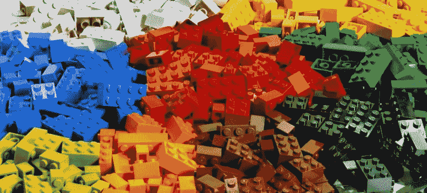

# 价值对象

> 原文：<https://dev.to/mangelsnc/value-objects-1gd9>

[](https://res.cloudinary.com/practicaldev/image/fetch/s--6riYiaIx--/c_limit%2Cf_auto%2Cfl_progressive%2Cq_auto%2Cw_880/https://cdn-images-1.medium.com/max/1024/1%2AhdNNJNnJEOMYQv3c4pDprw.jpeg) 

<figcaption>*“值对象是领域驱动设计的基本构件，它们被用来在代码中对你无处不在的语言的概念进行建模。”PHP 中的领域驱动设计——Carlos Buenosvinos，Christian Soronellas，Keyvan Akbary。*</figcaption>

### 导言

今天我们将看到的模式(相当小的模式)广泛应用于域驱动设计(DDD)。价值对象模式强化了一个有时被人遗忘的概念，即对象导向原则，特别是那些我们习惯于弱类型语言的概念:封装；。

一个价值对象(VO)是什么，有几个定义，例如，我们有‘t0’ward Cunningham’t1:

> 值对象的例子有数字、日期、货币和字符串。通常，它们是用途非常广泛的小物件。他们的身份是基于他们的状态，而不是基于他们的对象身份。这样，您可以拥有同一个概念值对象的多个副本。每张 5 美元纸币都有自己的身份(由于其序列号)，但现金经济依赖于每张 5 美元纸币与其他 5 美元纸币具有相同的价值。

马丁·福勒:

> 在编程时，我经常发现将事物表示为一个复合物是很有用的。2D 坐标由 x 值和 y 值组成。一笔钱由一个数字和一种货币组成。日期范围由开始日期和结束日期组成，它们本身可以是年、月和日的组合。
> 
> (…)由于属性值相等的对象，在这种情况下是它们的 x 和 y 坐标，称为值对象。

卡洛斯·布埃诺斯维诺斯、凯万·阿克巴里和克里斯蒂安·索罗内拉斯:

> 值对象是领域驱动设计的基本构件，它们被用来在代码中建模你的无处不在的语言的概念。

基本上还有另外一种说法:如果我们把我们的系统和一个生命体进行比较，那么*价值对象*就相当于细胞，如果我们把它和建筑物进行比较，那就是砖块。

Value Object 用于建模系统概念，例如标识符、日期或日期范围、价格、权重、速度(几乎任何大小都可以建模为 VO)，甚至是标题、名称或地址。例如，图元由 Value Objects 组成。

### 特性

有许多不同的特性使类被视为值对象。

#### 测量、量化或描述一个概念

VO 旨在衡量、量化或描述我们的域层概念。他们并不认为什么东西，而是一种价值，因此有目的。

#### **【不变性】**

VO 被认为是不变的物体。由于它的大小有限，因此它的构造不会对内存消耗产生很大影响，因此最好在修改现有实例之前创建一个新实例，从而避免因修改现有实例而产生的副作用。

当我们谈到基本型时，我们可以将一个变量的值与另一个变量的值进行比较:

```
$a = 1;
$b = 1;

$a == $b; //true 
```

我们可以根据需要多次重新分配值，放弃以前的值:

```
$a = 1;
$a = 2;
$a = 3;

$a == 1; //false
$a == 2; //false
$a == 3; //true 
```

我们还可以通过操作来修改它们，并始终获得新的价值:

```
$a = 1;
$a = $a + 9;

$a == 10; //true 
```

相反，如果将基本型作为函数引数传递，则我们会依值传递(除非明确地依参照传递)，而且除非您将函数的结果指定给变数，否则函数将无法变更其值:

```
/\*\* Forma Incorrecta \*/

function add(int $a, int $b)
{
 $a = $a + $b;
}

$a = 1;
$b = 9;
add($a, $b);

$a == 10; //false

/\*\* Forma correcta \*/

function add(int $a, int $b)
{
 return $a + $b;
}

$a = 1;
$b = 9;
$a = add($a, $b);

$a == 10; //true 
```

这个想法是，一个卵的行为就像一个基本的类型。

#### 始终有效

VO 构造函数始终传递实例化新对象所需的基元(或其它 VO)，因此该对象始终处于有效状态，因为如果缺少任何值或提供了无效值，则不会构造该对象并抛出异常。

一个良好的做法是提供静态的语义构造函数，以方便 VO 的创建，特别是当其中一个参数具有有限的有效值集时。

#### 没有身份

切勿将实体与值对象混淆。主要区别在于前者有一个*身份，*一个标识符，使得它们在同类的另一个实例面前是独一无二的。另一方面，值对象没有标识，因此应根据其内容(而不是标识符或引用)对值对象进行比较。

这与大多数编程语言的默认行为有很大的冲突。请看以下示例: