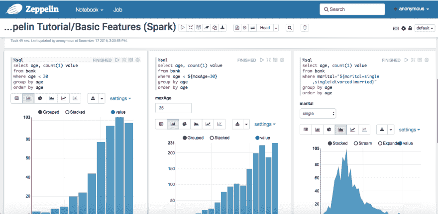
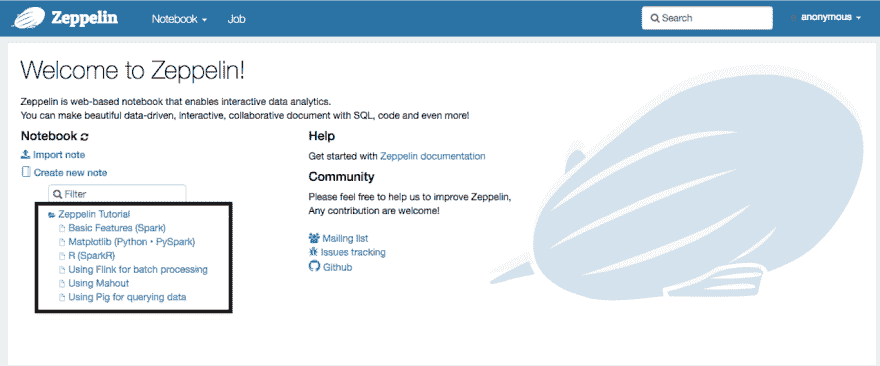
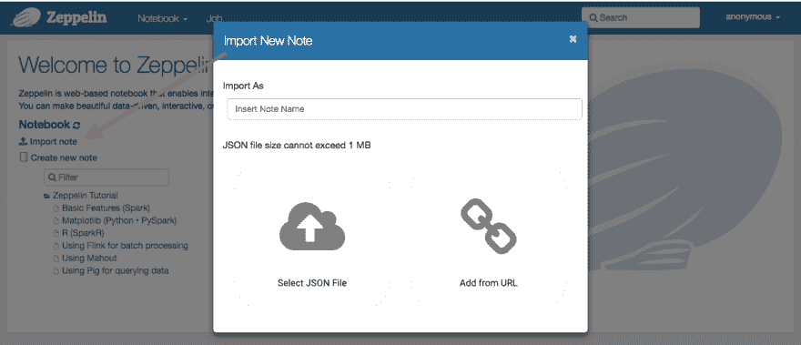
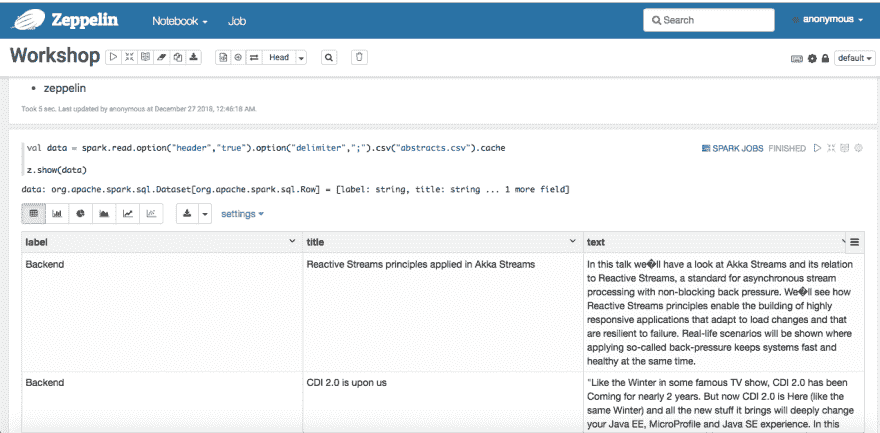
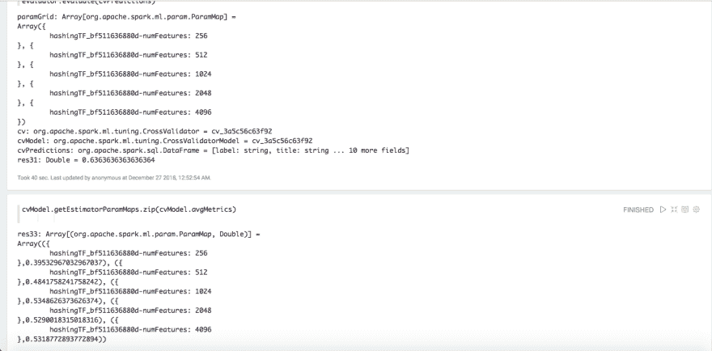

# 阿帕奇齐柏林飞艇:通往天堂的阶梯！

> 原文：<https://dev.to/neomatrix369/apache-zeppelin-stairway-to-notes-haven--46el>

*笔记适用于 Zeppelin 行话中的笔记本

这篇文章是我的@JavaAdventCalendar 文章的再博客，来自[https://www . javaadvent . com/2018/12/Apache-zeppelin-stairway-to-notes-haven . html](https://www.javaadvent.com/2018/12/apache-zeppelin-stairway-to-notes-haven.html)。

# 简介

继续上一篇文章，在 AI、ML、DL 和 Java 的两年生活中，我表达了我的动机。我提到了我们的讨论，其中一个讨论是，你可以在 JuPyteR 笔记本上用 Python，R，Julia 这样的语言来写。大多数人不知道除了 Python、SQL 之外，你还可以写 Java 和 Scala 在 [Apache Zeppelin](http://zeppelin.apache.org/) 笔记本的帮助下。*所以我确实承诺分享一些这方面的东西，以扩大每个人的意识。虽然已经过了一段时间，但我还是把我的想法整合到了这篇文章中，展示了我们如何使用支持 Java 和 Scala 的*[*Apache Zeppelin*](https://zeppelin.apache.org/)*来完成类似的操作。*这个项目本身是用 Java 编写的，它的开放架构意味着 Zeppelin 可以支持任何东西，只要[为那个东西提供了一个解释器](https://zeppelin.apache.org/docs/0.6.0/development/writingzeppelininterpreter.html)。

# 第一件事，先…

万一我失去了你们中的一些人，这里是我所说的 JuPyteR 笔记本和用不同语言写笔记本的意思，见[https://www.youtube.com/watch?v=Rc4JQWowG5I](https://www.youtube.com/watch?v=Rc4JQWowG5I)，也看看 JuPyteR 笔记本支持的[内核列表](https://github.com/jupyter/jupyter/wiki/Jupyter-kernels)。但是在这篇文章中，我们将讨论 Apache Zeppelin，如何让它工作，以及如何在 Zeppelin 环境中使用一些注释。

## 好玩的部分……

所以让我们看看我们是如何做到的，首先下载并安装 Apache Zeppelin。

**下载&安装**

**下载**
进入[下载页面](https://zeppelin.apache.org/download.html)，有多个选项可供选择，推荐两个选项:

*   下载包含解释器的整个二进制文件
*   下载一个网络安装程序，然后下载解释器(你可以选择你需要的，或者对所有的[解释器](https://zeppelin.apache.org/docs/0.8.0/usage/interpreter/installation.html)使用`--all`标志)

在我们的例子中，我从[下载二进制包部分](https://zeppelin.apache.org/docs/0.8.0/quickstart/install.html#downloading-binary-package)下载了 **net-install 解释器包**。

**安装**

$ CD/opt/zeppelin-0 . 8 . 0-bin-netinst
$。/bin/install-interpreter . sh-all

对于另一种类型的存档或安装选项，请参见[快速启动页面](https://zeppelin.apache.org/docs/0.8.0/quickstart/install.html)上的说明。

**运行**
根据下载的二进制文件类型，按照[快速启动页面](https://zeppelin.apache.org/docs/0.8.0/quickstart/install.html#starting-apache-zeppelin)上的说明进行操作。
虽然在我们的例子中，我必须运行:

$ CD/opt/zeppelin-0 . 8 . 0-bin-netinst
$。/bin/zeppelin.sh

*可选设置*
由于我很好奇 Zeppelin 在另一个 JDK 下运行什么，而不是通常的 Oracle 或 OpenJDK JDK 或 JRE，我决定尝试 GraalVM JRE，所以我在我的机器上切换`JAVA_HOME`指向`/path/to/GraalVM/jre`。GraalVM JDK 与 JRE 捆绑在一起，可以像任何 Java 供应商的 JRE 一样独立使用。

当 Zeppelin 运行时，会显示这些消息(您可以看到`JAVA_HOME`设置已被选中):

Pid dir 不存在，create/opt/zeppelin-0 . 8 . 0-bin-net inst/run
graal VM 1 . 0 . 0-rc7 警告:忽略选项 MaxPermSize = 512m 在 8.0
SLF4J 中移除了支持:类路径包含多个 SLF4J 绑定。
SLF4J:在【jar:file:/opt/zeppelin-0 . 8 . 0-bin-net inst/lib/interpreter/slf4j-log4j 12-1 . 7 . 10 . jar 中发现绑定！/org/slf4j/impl/staticloggerbinder . class]
SLF4J:在[jar:file:/opt/zeppelin-0 . 8 . 0-bin-net inst/lib/slf4j-log4j 12-1 . 7 . 10 . jar 中找到绑定！/org/slf4j/impl/staticloggerbinder . class]
SLF4J:详见[http://www.slf4j.org/codes.html#multiple_bindings](http://www.slf4j.org/codes.html#multiple_bindings)解释。
SLF4J:实际绑定的类型为[org . slf4j . impl . log 4 jloggerfactory]
2018 年 12 月 25 日 1:34:23AM org . glassfish . jersey . internal . inject . providers checkProviderRuntime
警告:在服务器运行时注册的提供者 org . Apache . zeppelin . rest . notebookreporestapi 没有实现任何适用于服务器运行时的提供者接口。由于约束配置问题，将忽略提供程序 org . Apache . zeppelin . rest . notebookreporestapi。
2018 年 12 月 25 日 1:34:23AM org . glassfish . jersey . internal . inject . providers checkProviderRuntime
2018 年 12 月 25 日 1:34:23AM org . glassfish . jersey . internal . inject . providers checkProviderRuntime
[-snipped-]
警告:org . Apache . zeppelin . rest . notebookrestapi 中的(子)资源方法 getNoteList 包含空路径批注。

**运行(续)**
一旦完成上述所有步骤，并且 Zeppelin 已成功启动，请执行以下操作:

*   打开 [http://localhost:8080/#/](http://localhost:8080/#/)
*   然后看看[下的文档探索 Zeppelin UI](https://zeppelin.apache.org/docs/0.8.0/quickstart/explore_ui.html)
*   然后是[http://localhost:8080/#/notebook/2 a94m 5j 1z](http://localhost:8080/#/notebook/2A94M5J1Z)的教程笔记本

# 小实验

为了查看一些数字，我决定使用 **Zeppelin 教程/基本功能(Spark)笔记本**来检查使用 GraalVM JDK/JRE 和另一个 JDK/JRE 运行时的性能差异，结果如下:

***JDK*T3】**

*   `./bin/zeppelin.sh`48.26 秒用户 25.63 秒系统 28% cpu 4:20.15 总计(手动启动和停止脚本)
*   第一段
*   耗时 47 秒。最后更新由匿名于 2018 年 12 月 25 日，凌晨 2:18:36。
*   其后的每个段落(从左到右的列):
*   耗时 44 秒。最后更新由匿名于 2018 年 12 月 25 日，凌晨 2:18:44。(过时)
*   花了 10 秒钟。最后更新由匿名于 2018 年 12 月 25 日，凌晨 2:18:47。(过时)
*   花了 6 秒钟。最后更新由匿名于 2018 年 12 月 25 日，凌晨 2:18:50。(过时)

***甲骨文 JDK8***

*   `./bin/zeppelin.sh`37.64 秒用户 25.73 秒系统 29% cpu 3:38.49 总计(手动启动和停止脚本)
*   第一段
*   耗时 54 秒。最后更新由匿名于 2018 年 12 月 25 日，凌晨 2:12:16。
*   其后的每个段落(从左到右的列):
*   耗时 43 秒。最后一次由匿名更新于 2018 年 12 月 25 日凌晨 2:12:24。(过时)
*   花了 13 秒。最后一次由匿名更新于 2018 年 12 月 25 日凌晨 2:12:29。(过时)
*   花了 6 秒钟。最后更新由匿名于 2018 年 12 月 25 日，凌晨 2:12:31。(过时)

我的观察是，性能差异是微不足道的，尽管对于不同类型的操作，结果会在两者之间有所不同，因此需要更多的观察。除非另有说明，否则最好留在 GraalVM JRE 上，以便在我们进行的过程中看到更多这样的变化。

***注:*** *段落是齐柏林飞船行话中的代码块，注是一本笔记本在齐柏林飞船世界中的简称。因此，笔记有一个或多个段落。*

还有许多其他教程(示例)笔记可以使用，请参见 Zeppelin 教程下的主页(见截图):

# 导入便笺

从主页( [http://localhost:8080/#/](http://localhost:8080/#/) ，见下文)，我们可以选择超链接文本[导入笔记](https://www.javaadvent.com/2018/12/apache-zeppelin-stairway-to-notes-haven.html)，这允许我们从磁盘或 URL 导入笔记(Zeppelin 行话中的笔记本)。

在我们的例子中，我将来自[https://github . com/mmatloka/machine-learning-by-example-workshop](https://github.com/mmatloka/machine-learning-by-example-workshop)的注释(确保使用了到`json`文件的原始内容的链接，即[https://raw . githubusercontent . com/mmatloka/machine-learning-by-example-workshop/master/workshop . JSON](https://raw.githubusercontent.com/mmatloka/machine-learning-by-example-workshop/master/Workshop.json))添加到 Zeppelin 中，并尝试运行，但在尝试运行前几段时出现了各种错误。

在寻找为什么我会得到这些错误的答案时，我偶然发现了一个论坛，然后采纳了论坛上有人的建议，那里有类似的错误消息。这是解决 https://issues.apache.org/jira/browse/ZEPPELIN-3586 问题的一种方法。

# 上次我们失败了，让我们再试一次…

其中一个解决方案是让`SPARK_HOME`指向 Spark 的一个独立实例，而不依赖 Apache Zeppelin 安装中的嵌入式`spark interpreter`。作为一种变通办法，在[https://gist . github . com/conker 84/4 ffc 9 a2 f 0125 c 808 B4 dfcf 3 b7d 70 b 043 # file-zeppelin-docker file](https://gist.github.com/conker84/4ffc9a2f0125c808b4dfcf3b7d70b043#file-zeppelin-dockerfile)提供了一个指向 Dockerfile gist 的链接。我扩展了该脚本以包含 GraalVM JRE，并添加了必要的配置以使其对 Zeppelin 和 Spark 可见:

齐柏林飞艇码头文件

从 apache/zeppelin:0.8.0
#变通办法到“修复”[https://issues.apache.org/jira/browse/ZEPPELIN-3586](https://issues.apache.org/jira/browse/ZEPPELIN-3586)
运行 echo "$LOG_TAG 下载 Spark 二进制"&&\
wget-O/tmp/Spark-2 . 3 . 1-bin-Hadoop 2.7 . tgz[http://Apache . panu . it/Spark/Spark-2 . 3 . 1/Spark-2 . 3 . 1-bin-Hadoop 2.7 . tgz](http://apache.panu.it/spark/spark-2.3.1/spark-2.3.1-bin-hadoop2.7.tgz)
mv SPARK-2 . 3 . 1-bin-Hadoop 2.7/SPARK-2 . 3 . 1-bin-Hadoop 2.7
ENV SPARK _ HOME =/SPARK-2 . 3 . 1-bin-Hadoop 2.7
# # #我在这里修改的步骤:
运行 RM-fr/usr/lib/JVM/JAVA-1 . 8 . 0-open JDK-amd64/usr/lib/JVM/JAVA-8-open JDK-amd64【上

并创建了两个小型 bash 脚本来帮助构建 docker 映像并从映像运行容器。

*构建 docker 映像*

docker build-t Zeppelin-f Zeppelin-docker file。

*运行 docker 容器*

docker run-RM \
-it \
-p 8080:8080 zeppelin

**注:**docker 镜像名为`zeppelin:latest`，大小约为 4.45GB。

***以上脚本可以在***[***https://github . com/neo matrix 369/awesome-ai-ml-dl/tree/master/examples/Apache-zeppelin***](https://github.com/neomatrix369/awesome-ai-ml-dl/tree/master/examples/apache-zeppelin)***找到，请随时改进它们并创建拉请求返回到 repo 中。*T13】**

*如果你不想做以上的事情，你可以尝试使用***。我是 Apache Zeppelin，它也使用这个容器。**

 *我对上述内容不太感兴趣，因为整个过程花费了 45 分钟，其中 35 分钟用于下载几兆字节的 Spark。下载 GraalVM JDK 轻而易举，用我的高速 DSL 连接不到 5 分钟。

应用上面相同的步骤加载 [**米哈尔·马特洛卡**](https://github.com/mmatloka) 的工作室笔记本(`workshop.json`)并运行笔记本中的段落，它工作得非常好，当然没有任何错误。感谢 [**Michal Matloka**](https://github.com/mmatloka) ，为我们提供了这样一个例子，让我们一起玩，一起学。

从`.csv`文件加载数据集:

通过参数`avgMetrics`–平均交叉验证指标，在`CrossValidator.estimatorParamMaps`中按照各自的顺序计算每个`paramMap`的结果。

得分*53.18%*——可能仍然需要一点调整和微调来获得更高的分数，但这是一个不同的讨论，与我们当前关于 Zeppelin notes 的主题无关。

# 告诫

不知何故，Zeppelin 不喜欢带有这种缩进的代码布局:

val index tostring = new index tostring()
。setInputCol(“预测”)。setOutputCol(" prediction label ")
。setLabels(stringIndexer.labels)

因此，当我移除缩进以将函数调用链连接在一起时:

val indexToString =新的 indexToString()。setInputCol(“预测”)。setOutputCol(“predictionLabel”)。setLabels(stringIndexer.labels)

我能够很好地运行这些段落。我不得不对所有的段落都这样做，以防止任何来自齐柏林飞艇的错误。否则你会在所有段落中得到这样的信息:

:1:错误:非法开始定义
。setInputCol(“预测”)。setoutputcol(" prediction label ")
^

# 总结

我喜欢齐柏林飞艇的原因是:

*   你有一个干净直观的界面(工作时必须有棱角)
*   您可以编写自定义解释器，并扩展可接受的语言列表
*   编写自己的可视化工具
*   实时显示每个段落的执行进度
*   实时计算并显示每一段的执行时间
*   在任何适用的地方，数据表都可以被可视化为多个视图，然后返回到数据表——所有这些都是延迟完成的(仅在被选中时执行，并保持结果不变)

虽然，执行可能会显得比 JuPyteR 笔记本慢。IPython 笔记本中的许多功能都没有了，这也意味着作为一个开源项目，它通过贡献留下了很多改进的空间——为拉取请求选择您最喜欢的功能。

总而言之，这是一个让 Java/JVM 开发人员感觉宾至如归的好地方，对于熟悉 Python 和 R 以及 Java 和 Scala 的开发人员来说，可以使用 Zeppelin 进行原型、ML 培训和实验工作。

*请关注这个空间，并分享您的评论、反馈或任何有助于我们学习和成长到*[*@ theneomatrix 369*](http://twitter.com/@theNeomatrix369)，*您可以通过* [*关于我的页面*](http://neomatrix369.worpress.com/aboutme) *了解更多关于我的信息。*

## 关于我

Mani Sarkar 是一名充满激情的开发人员，主要从事 Java/JVM 领域的工作，目前作为一名自由软件工程师/数据/ml 工程师，他正在加强团队，并帮助他们在与小型团队和初创公司合作时加快速度。

**Twitter:**[@ the neomatrix 369](https://twitter.com/@theNeomatrix369)|**github:**[@ new matrix 369](https://github.com/neomatrix369)*