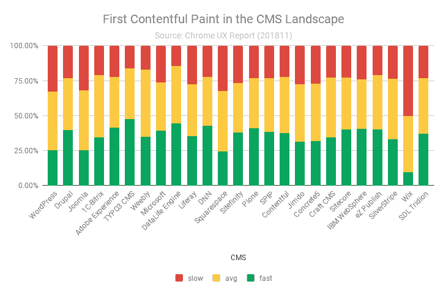
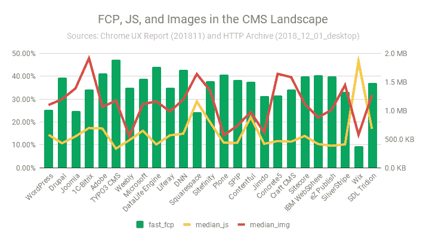

# 运用网络透明的力量

> 原文：<https://dev.to/httparchive/wielding-the-power-of-web-transparency-4np4>

*本帖原载于[表演日历 2018 系列](https://calendar.perfplanet.com/2018/wielding-the-power-of-web-transparency/)。*

去年，我写了一篇关于如何利用 Chrome UX 报告来帮助 T2 找到竞争优势的文章。从那时起，已经有了几个重要的发展:CrUX 已经发展到超过 400 万个网站，数据集已经积累了一年多的性能趋势，最重要的是， [HTTP Archive](https://httparchive.org) 已经开始分析超过 100 万个这些 CrUX 网站是如何构建的。在这篇文章中，我们将看看如何结合这些工具的优势来学习一些关于网络性能的新知识。

## 症结与 HTTP 存档概述

作为补充，CrUX 从真实的 Chrome 用户那里收集性能数据，并在原始级别上汇总这些数据。数据集中有数百万个这样的原点。表示交互性、绘图和页面加载时间的性能指标包含在 [BigQuery](https://console.cloud.google.com/bigquery?p=chrome-ux-report) 上的可查询数据库中。我们将在这篇文章中使用的指标是[第一次内容丰富的描绘](https://developers.google.com/web/tools/lighthouse/audits/first-contentful-paint) (FCP)，或者页面向用户显示有用信息的时间。每个原点的 FCP 数据被组织成一个直方图，表示用户体验的分布，体验的百分比以 100 毫秒的间隔分组。

另一方面，HTTP 档案不是真实用户数据的集合。这是一个建立在 [WebPageTest](https://webpagetest.org) 之上的综合工具，它收集关于每个网页是如何构建的信息。在 httparchive.org 的[网站](https://httparchive.org)上可以获得统计数据和趋势，而在[的【BigQuery】网站](https://console.cloud.google.com/bigquery?p=httparchive)上也可以查询原始数据。

我们将使用 BigQuery 合并这些数据集，以分析由 HTTP 存档确定的 CrUX 中特定源的性能。

## 了解网络是如何构建的

根据 BuiltWith 的调查，100 万个顶级网站中有 60%使用某种内容管理系统(CMS) ,其中 WordPress 是最受欢迎的，约占网络的三分之一。CMSs 的流行使它们成为展示网络透明数据力量的一个很好的研究课题。

为了了解一个给定的网站是用哪个 CMS 构建的，我们可以利用包含在 [Wappalyzer](https://www.wappalyzer.com/) 项目中的技术检测。HTTP Archive 和 WebPageTest 使用该工具来识别大约 1000 种不同的技术，其结果可在 [`technologies`](https://console.cloud.google.com/bigquery?p=httparchive&d=technologies&page=dataset) 数据集中查询。所以这里有一个快速统计 WordPress 网站数量的例子:

```
SELECT
  COUNT(DISTINCT url) AS num_wordpress
FROM
  `httparchive.technologies.2018_12_01_desktop`
WHERE
  app = 'WordPress' 
```

Enter fullscreen mode Exit fullscreen mode

结果是 200，384 页被检测为使用 WordPress。我们可以编写类似的查询来识别用许多其他流行的 CMS 构建的网站，如 Drupal、Joomla、TYPO3 等。

## 了解 web 的性能

为了理解给定原点的 FCP 体验有多快，我们可以查询只有 3 个桶的简化分布的 CrUX:快(小于 1 秒)、平均(在 1 到 2.5 秒之间)或慢(大于 2.5 秒)。

```
SELECT
  ROUND(SUM(IF(fcp.start < 1000, fcp.density, 0)) / SUM(fcp.density), 4) AS fast,
  ROUND(SUM(IF(fcp.start >= 1000 AND fcp.start < 2500, fcp.density, 0)) / SUM(fcp.density), 4) AS avg,
  ROUND(SUM(IF(fcp.start >= 2500, fcp.density, 0)) / SUM(fcp.density), 4) AS slow
FROM
  `chrome-ux-report.all.201811`,
  UNNEST(first_contentful_paint.histogram.bin) AS fcp
WHERE
  origin = 'https://web.dev' 
```

Enter fullscreen mode Exit fullscreen mode

结果显示，在 2018 年 11 月期间，原点`https://web.dev`大约 50%的时间具有快速 FCP，其次是 40%的平均时间，以及 10%的慢速时间。

| 快的 | 平均 | 慢的 |
| --- | --- | --- |
| 0.5094 | 0.4053 | 0.0853 |

## 把两者放在一起

既然我们已经确定了如何识别用于构建网站的 CMS 以及确定其速度的方法，我们可以结合查询来了解特定 CMS 的速度:

```
SELECT
  ROUND(SUM(IF(fcp.start < 1000, fcp.density, 0)) / SUM(fcp.density), 4) AS fast,
  ROUND(SUM(IF(fcp.start >= 1000 AND fcp.start < 2500, fcp.density, 0)) / SUM(fcp.density), 4) AS avg,
  ROUND(SUM(IF(fcp.start >= 2500, fcp.density, 0)) / SUM(fcp.density), 4) AS slow
FROM
  `chrome-ux-report.all.201811`,
  UNNEST(first_contentful_paint.histogram.bin) AS fcp
JOIN (
  SELECT
    url
  FROM
    `httparchive.technologies.2018_12_01_desktop`
  WHERE
    app = 'WordPress'
  GROUP BY
    url)
ON
  CONCAT(origin, '/') = url 
```

Enter fullscreen mode Exit fullscreen mode

结果显示，WordPress 网站上 FCP 性能的平均分布是快 25%，平均 42%，慢 33%。

| 快的 | 平均 | 慢的 |
| --- | --- | --- |
| 0.2528 | 0.4192 | 0.3280 |

## CMS 生态系统的性能分析

很高兴知道 WordPress 网站有多快，但是与 Drupal 或 TYPO3 网站相比如何？让我们修改查询，将所有 CMS 平台都考虑在内:

```
SELECT
  app,
  COUNT(DISTINCT origin) AS freq,
  ROUND(SUM(IF(fcp.start < 1000, fcp.density, 0)) / SUM(fcp.density), 4) AS fast,
  ROUND(SUM(IF(fcp.start >= 1000 AND fcp.start < 2500, fcp.density, 0)) / SUM(fcp.density), 4) AS avg,
  ROUND(SUM(IF(fcp.start >= 2500, fcp.density, 0)) / SUM(fcp.density), 4) AS slow
FROM
  `chrome-ux-report.all.201811`,
  UNNEST(first_contentful_paint.histogram.bin) AS fcp
JOIN (
  SELECT
    url,
    app
  FROM
    `httparchive.technologies.2018_12_01_desktop`
  WHERE
    category = 'CMS'
  GROUP BY
    url,
    app)
ON
  CONCAT(origin, '/') = url
GROUP BY
  app
ORDER BY
  freq DESC 
```

Enter fullscreen mode Exit fullscreen mode

该结果为我们提供了 156 个 CMS 的性能数据。让我们来看看前 25 名:

| 应用 | 频率 | 快的 | 平均 | 慢的 |
| --- | --- | --- | --- | --- |
| WordPress | One hundred and sixty thousand eight hundred and thirty-five | 25.28% | 41.92% | 32.80% |
| Drupal | Thirty-three thousand eight hundred and six | 39.47% | 37.46% | 23.07% |
| 网站架站软件 | Twelve thousand six hundred and twenty-five | 24.96% | 43.14% | 31.91% |
| 1C 比特位 | Five thousand eight hundred and forty-four | 34.21% | 44.77% | 21.02% |
| Adobe 体验管理器 | Five thousand five hundred and seventy-three | 41.33% | 36.51% | 22.16% |
| TYPO3 CMS | Five thousand three hundred and thirty-eight | 47.40% | 36.35% | 16.25% |
| Weebly | Three thousand nine hundred and seventy-six | 34.91% | 48.13% | 16.95% |
| Microsoft SharePoint | Three thousand four hundred and fifty-five | 38.94% | 34.81% | 26.25% |
| 数据生活引擎 | Two thousand six hundred and forty-six | 44.26% | 41.13% | 14.61% |
| 救生筏 | Two thousand five hundred and sixty-eight | 35.08% | 37.48% | 27.44% |
| DNN | Two thousand one hundred and ninety-seven | 42.73% | 35.10% | 22.18% |
| 方形空间 | One thousand five hundred and thirty-four | 24.33% | 43.35% | 32.32% |
| 站点有限性 | One thousand four hundred and one | 38.02% | 35.36% | 26.61% |
| 普洛内 | Nine hundred and thirty-one | 40.88% | 35.97% | 23.16% |
| 史派普 | Eight hundred and eleven | 38.29% | 38.32% | 23.39% |
| 满足的 | Eight hundred and four | 37.61% | 39.94% | 22.46% |
| 吉姆多 | Seven hundred and five | 31.45% | 40.90% | 27.64% |
| 混凝土 5 | Six hundred and eighty-four | 31.55% | 41.39% | 27.05% |
| Craft CMS | Six hundred and eleven | 34.22% | 43.16% | 22.62% |
| 站点核心 | Five hundred and ninety-eight | 40.07% | 37.30% | 22.63% |
| IBM WebSphere Portal | Five hundred and seventeen | 40.51% | 35.46% | 24.03% |
| eZ 发布 | Four hundred and forty-eight | 40.02% | 38.85% | 21.13% |
| 银色条纹 | Four hundred and twenty-six | 33.08% | 43.07% | 23.84% |
| 威克斯 | Four hundred and six | 9.47% | 40.24% | 50.29% |
| SDL 特里迪翁 | Three hundred and thirty | 36.99% | 39.65% | 23.36% |

[可视化工作表](https://docs.google.com/spreadsheets/d/1pN1thYcCayQRpduCmFX80FRmdCkq9PCFF9gbBTvRaWo/edit?usp=sharing)中的数据会生成此图表:

[](https://res.cloudinary.com/practicaldev/image/fetch/s--1ElNZ8If--/c_limit%2Cf_auto%2Cfl_progressive%2Cq_auto%2Cw_880/https://thepracticaldev.s3.amazonaws.com/i/98l38km8tvw7f14bmxe0.png)

那么，使用 CrUX 和 HTTP 存档数据，我们可以了解 CMS 的什么情况呢？首先，图表显示这是一个多样化的景观。快速 FCP 密度的变化范围为 9.47%-47.40%。许多 CMS 都在 30-40%左右，但是有几个没有达到:WordPress、Joomla、Squarespace 和 Wix。TYPO3、DataLife Engine 和 DNN 在其他产品中脱颖而出。

### 深入挖掘表现机会

现在我们已经了解了用户如何体验每个 CMS，让我们试着了解 JS 或图像的数量是否与性能相关。我们可以使用 HTTP Archive 中的 [`summary_pages`](https://console.cloud.google.com/bigquery?p=httparchive&d=summary_pages&page=dataset) 表来测量每个页面加载的字节数，并汇总每个 CMS 的中位数。

```
SELECT
  app,
  COUNT(DISTINCT origin) AS freq,
  ROUND(SUM(IF(fcp.start < 1000, fcp.density, 0)) / SUM(fcp.density), 4) AS fast_fcp,
  APPROX_QUANTILES(bytesJS, 1000)[OFFSET(500)] AS median_js,
  APPROX_QUANTILES(bytesImg, 1000)[OFFSET(500)] AS median_img
FROM
  `chrome-ux-report.all.201811`,
  UNNEST(first_contentful_paint.histogram.bin) AS fcp
JOIN (
  SELECT
    url,
    app
  FROM
    `httparchive.technologies.2018_12_01_desktop`
  WHERE
    category = 'CMS'
  GROUP BY
    url,
    app)
ON
  CONCAT(origin, '/') = url
JOIN
  `httparchive.summary_pages.2018_12_01_desktop`
USING
  (url)
GROUP BY
  app
ORDER BY
  freq DESC 
```

Enter fullscreen mode Exit fullscreen mode

| 应用 | 频率 | fast_fcp | median_js | 中位数 _img |
| --- | --- | --- | --- | --- |
| WordPress | One hundred and sixty thousand eight hundred and thirty-five | 25.28% | 576.0 KB | 1.1 兆字节 |
| Drupal | Thirty-three thousand eight hundred and six | 39.47% | 427.7 KB | 1.2 兆字节 |
| 网站架站软件 | Twelve thousand six hundred and twenty-five | 24.96% | 549.0 KB | 1.4 兆字节 |
| 1C 比特位 | Five thousand eight hundred and forty-four | 34.21% | 696.0 KB | 1.9 兆字节 |
| Adobe 体验管理器 | Five thousand five hundred and seventy-three | 41.33% | 686.0 KB | 1.1 兆字节 |
| TYPO3 CMS | Five thousand three hundred and thirty-eight | 47.40% | 334.3 KB | 1.2 兆字节 |
| Weebly | Three thousand nine hundred and seventy-six | 34.91% | 482.8 KB | 549.9 KB |
| Microsoft SharePoint | Three thousand four hundred and fifty-five | 38.94% | 647.6 KB | 1.1 兆字节 |
| 数据生活引擎 | Two thousand six hundred and forty-six | 44.26% | 406.5 KB | 1.2 兆字节 |
| 救生筏 | Two thousand five hundred and sixty-eight | 35.08% | 566.5 KB | 984.7 KB |
| DNN | Two thousand one hundred and ninety-seven | 42.73% | 595.4 KB | 1.2 兆字节 |
| 方形空间 | One thousand five hundred and thirty-four | 24.33% | 1.2 兆字节 | 1.6 兆字节 |
| 站点有限性 | One thousand four hundred and one | 38.02% | 789.8 KB | 1.3 兆字节 |
| 普洛内 | Nine hundred and thirty-one | 40.88% | 437.6 KB | 566.6 KB |
| 史派普 | Eight hundred and eleven | 38.29% | 434.2 KB | 734.2 KB |
| 满足的 | Eight hundred and four | 37.61% | 882.4 KB | 973.9 KB |
| 吉姆多 | Seven hundred and five | 31.45% | 418.5 KB | 616.6 KB |
| 混凝土 5 | Six hundred and eighty-four | 31.55% | 467.0 KB | 1.6 兆字节 |
| Craft CMS | Six hundred and eleven | 34.22% | 455.6 KB | 1.6 兆字节 |
| 站点核心 | Five hundred and ninety-eight | 40.07% | 555.8 KB | 1.1 兆字节 |
| IBM WebSphere Portal | Five hundred and seventeen | 40.51% | 414.1 KB | 879.5 KB |
| eZ 发布 | Four hundred and forty-eight | 40.02% | 383.7 KB | 1.0 兆字节 |
| 银色条纹 | Four hundred and twenty-six | 33.08% | 408.1 KB | 1.4 兆字节 |
| 威克斯 | Four hundred and six | 9.47% | 1.9 兆字节 | 576.9 KB |
| SDL 特里迪翁 | Three hundred and thirty | 36.99% | 677.0 KB | 1.3 兆字节 |

好，现在我们处理两种类型的值:百分比和字节。让我们试着用两个 y 轴来想象这个，希望它不会太大。

[](https://res.cloudinary.com/practicaldev/image/fetch/s--OzC58Bwy--/c_limit%2Cf_auto%2Cfl_progressive%2Cq_auto%2Cw_880/https://thepracticaldev.s3.amazonaws.com/i/lvqkq3a4hzvkp1azvh1s.png)

绿色条在左轴上表示快速 FCP 体验的百分比，芥末和番茄酱的条纹分别在右轴上表示 JS 和 images 的字节数的中值。

您可能首先注意到的一点是，Wix 具有最小的快速 FCP 密度，也具有最大的 JS 中值字节(1.9 MB)。巧合的是，Wix 也是图像字节数最少的国家之一。如果 Wix 用大约 2 MB 的 JS 引导所有页面，那肯定会对性能产生负面影响。

Addy Osmani 在 2018 年写了一篇名为[JavaScript 的成本](https://medium.com/@addyosmani/the-cost-of-javascript-in-2018-7d8950fbb5d4)的惊人文章，其中指出 JS 是“你的网站中最昂贵的部分”，因为它必须下载、解析、编译和执行。所以网络和/或 CPU 速度有限的用户尤其会受到浪费性 JS 使用的伤害。

Squarespace 有 1.2 MB 的中值 JS 和 1.6 MB 的中值 images。这些都不是小数值，可能是造成其低快速 FCP 的因素。

TYPO3，快速 FCP 密度最大的 CMS，也恰好拥有最少的 JS 中间字节(334.3 KB)。巧合吗？这一分析并没有告诉我们是否存在因果关系，但这种相关性非常明显，不容忽视。

## 总结起来

这是网络透明力量的一个很好的例子。使用 CrUX 和 HTTP 存档数据集，我们对网络有了一种 x 射线视觉，使我们能够看到网站是如何构建的，以及用户是如何体验它们的。最终，我们的目标是改善用户体验，我们可以通过利用这些数据集来了解机会所在并监控一段时间内的进展。

在 Wappalyzer 中还有 48 个其他技术类别，因此您可以想象在数据中等待发现的丰富见解。接受本帖中的问题，用这些值替换你关心的事情，并确保与[社区](https://discuss.httparchive.org)分享你的发现。

其他资源:

*   【HTTP 归档入门
*   [贡献给 HTTP 存档](https://httparchive.org/about#contribute)
*   [使用 CrUX 查看现场表现](https://web.dev/fast/chrome-ux-report)
*   [网络现状:与 Paul Calvano 一起利用网络透明度](https://www.youtube.com/watch?v=hqTtkdNwYwk)
*   [CMS 在 HTTP 存档论坛上的表现](https://discuss.httparchive.org/t/cms-performance/1468?u=rviscomi)

感谢伊利亚·格里戈利克、保罗·卡尔瓦诺、阿尔贝托·梅迪纳和艾迪·奥斯马尼审阅了这篇文章的初稿。