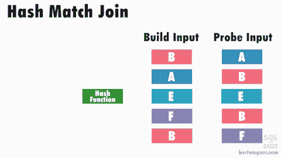
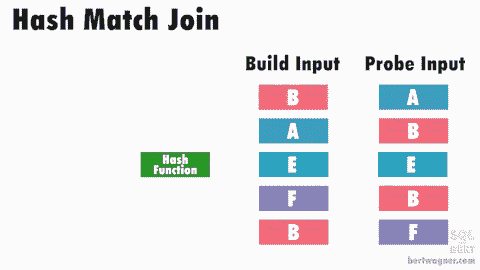

# 可视化散列匹配连接内部并理解它们的含义

> 原文：<https://dev.to/bertwagner/visualizing-hash-match-join-internals-and-understanding-their-implications-3k4b>

*这篇文章是关于物理连接操作符的系列文章的第 3 部分(请务必查看[第 1 部分——嵌套循环连接](https://bertwagner.com/2018/12/11/visualizing-nested-loops-joins-and-understanding-their-implications/)，以及[第 2 部分——合并连接](https://bertwagner.com/2018/12/18/visualizing-merge-join-internals-and-understanding-their-implications/))。*

[https://www.youtube.com/embed/59C8c7p_hII](https://www.youtube.com/embed/59C8c7p_hII)

散列匹配连接是物理连接操作符的可靠工具。

如果数据太大而无法放入内存，嵌套循环联接将会失败，而合并联接要求对输入数据进行排序，哈希匹配将会联接任何两个数据输入(只要联接具有相等谓词并且您在 tempdb 中有足够的空间)。

基本哈希匹配算法有两个工作阶段，如下所示:

在第一个“构建”阶段，SQL Server 从其中一个输入(通常是两个输入中较小的一个)构建内存中的哈希表。哈希值是基于输入数据的连接键计算的，然后与哈希表中的行一起存储在该哈希表桶下。大多数情况下，每个哈希桶只有一行数据，除非:

1.  存在具有重复连接键的行。
2.  哈希函数会产生冲突，完全不同的连接键会收到相同的哈希(不常见，但也有可能)。

一旦构建了哈希表，SQL Server 就开始了“探测”阶段。在第二个阶段，SQL Server 为第二个输入中的每一行计算连接键哈希，并检查它是否存在于第一个生成阶段创建的哈希表中。如果它找到了该散列的匹配项，那么它将验证散列表中的行和第二个表中的行之间的连接键是否实际匹配(由于潜在的散列冲突，它需要执行这个验证)。

当构建阶段无法创建可以完全存储在内存中的哈希表时，这种哈希匹配算法会出现一种常见的变体:

当数据大于内存中可以存储的数据量时，或者当 SQL Server 授予哈希匹配联接所需的内存量不足时，就会发生这种情况。

当 SQL Server runs 没有足够的内存来存储生成阶段哈希表时，它会将一些存储桶保留在内存中，同时将其他存储桶溢出到 tempdb。

在探测阶段，SQL Server 将第二个输入中的数据行连接到内存中构建阶段的存储桶。如果该行可能匹配的存储桶当前不在内存中，SQL Server 会将该行写入 tempdb，以便以后进行比较。

一旦一个存储桶的匹配完成，SQL Server 将从内存中清除该数据，并将下一个存储桶加载到内存中。然后，它将第二个输入的行(当前驻留在 tempdb 中)与新的内存桶进行比较。

与本系列中的每个物理连接操作符一样，Hugo Kornelis 关于散列匹配的参考资料中有更多关于散列匹配操作符的细节。

## 哈希匹配连接揭示了什么？

了解散列匹配连接的内部工作原理可以让我们推断出优化器对我们的数据和连接的上游操作符的看法，帮助我们集中精力进行性能调优。

下面是下一次在执行计划中使用散列匹配连接时要考虑的几个场景:

*   虽然哈希匹配连接能够连接大量的数据集，但是从第一个输入构建哈希表是一个阻塞操作，会阻止下游操作符的执行。因此，我*总是*检查是否有一种简单的方法将散列匹配转换成嵌套循环或合并连接。有时这是不可能的(嵌套循环的行数太多或合并连接的数据未排序)，但检查简单的索引更改或统计数据更新的改进估计是否会导致 SQL Server 选择非阻塞散列匹配连接操作符总是值得的。

*   散列匹配连接对于大型连接非常有用——因为它们*可以*溢出到 tempdb，这允许它们在大型数据集上执行连接，这些数据集在使用嵌套循环或合并连接操作符进行内存连接时会失败。

    *   看到散列匹配连接运算符意味着 SQL Server 认为上游输入很大。如果我们知道我们的输入不应该那么大，那么就有必要检查我们是否有一个统计/估计问题导致 SQL Server 错误地选择了散列匹配连接。
*   当在内存中执行时，散列匹配连接相当有效。当构建阶段扩展到 tempdb 时，问题就出现了。

    *   如果我注意到一个小的黄色三角形表示连接正在溢出到 tempdb，我会看一下原因:如果数据大于服务器的可用内存，那么在那里就没有多少事情可以做，但是如果内存授权看起来异常小，这意味着我们可能有另一个统计问题，即提供的 SQL Server 优化器估计值太低。

*感谢阅读。你可能也会喜欢在 Twitter 上关注我。T3】*