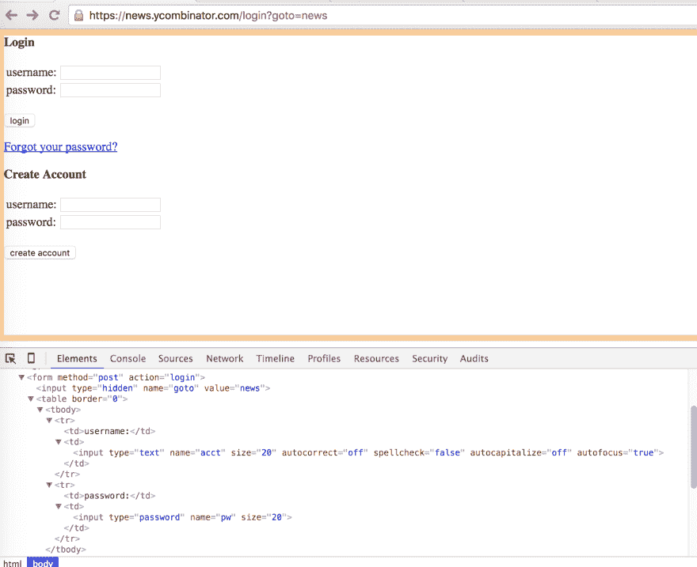

# 如何登录几乎任何网站

> 原文：<https://dev.to/scrapingbee/how-to-log-in-to-almost-any-websites-7dn>

在第一篇关于 java 网络抓取的文章中，我展示了如何从 CraigList 网站中提取数据。
但是，如果你想要的数据或者你想在网站上执行的操作需要认证呢？

在这个简短的教程中，我将向您展示如何创建一个通用方法来处理大多数身份验证表单。

### 认证机制

有许多不同的认证机制，最常见的是登录表单，有时使用一个 [CSRF 令牌](http://https://en.wikipedia.org/wiki/Cross-site_request_forgery#Forging_login_requests)作为隐藏输入。

用你的抓取工具自动登录网站的想法是:

*   获取/登录页面

*   选择第一个`<input type="password">`标签

*   选择它之前未隐藏的第一个`<input>`

*   为两个输入设置值属性

*   选择随附的表单，并提交它。

### 黑客新闻认证

假设您想要创建一个登录到 hacker news 的 bot(提交一个链接或执行一个需要验证的操作) :

下面是登录表单和相关的 DOM:

[](https://res.cloudinary.com/practicaldev/image/fetch/s--AYcjSLil--/c_limit%2Cf_auto%2Cfl_progressive%2Cq_auto%2Cw_880/https://www.scrapingbee.cimg/post/java-login/screenshot_hn_login_form.png)

现在我们可以实现登录算法

```
 public static WebClient autoLogin(String loginUrl, String login, String password) throws FailingHttpStatusCodeException, MalformedURLException, IOException{
        WebClient client = new WebClient();
        client.getOptions().setCssEnabled(false);
        client.getOptions().setJavaScriptEnabled(false);

        HtmlPage page = client.getPage(loginUrl);

        HtmlInput inputPassword = page.getFirstByXPath("//input[@type='password']");
        //The first preceding input that is not hidden
        HtmlInput inputLogin = inputPassword.getFirstByXPath(".//preceding::input[not(@type='hidden')]");

        inputLogin.setValueAttribute(login);
        inputPassword.setValueAttribute(password);

        //get the enclosing form
        HtmlForm loginForm = inputPassword.getEnclosingForm() ;

        //submit the form
        page = client.getPage(loginForm.getWebRequest(null));

        //returns the cookie filled client :)
        return client;
    } 
```

然后是主要方法，即:

*   用正确的参数调用`autoLogin`

*   转到`https://news.ycombinator.com`

*   检查注销链接是否存在，以验证我们已登录

*   将 cookie 打印到控制台

```
 public static void main(String[] args) {

        String baseUrl = "https://news.ycombinator.com" ;
        String loginUrl = baseUrl + "/login?goto=news" ; 
        String login = "login";
        String password = "password" ;

        try {
            System.out.println("Starting autoLogin on " + loginUrl);
            WebClient client = autoLogin(loginUrl, login, password);
            HtmlPage page = client.getPage(baseUrl) ;

            HtmlAnchor logoutLink = page.getFirstByXPath(String.format("//a[@href='user?id=%s']", login)) ;
            if(logoutLink != null ){
                System.out.println("Successfuly logged in !");
                // printing the cookies
                for(Cookie cookie : client.getCookieManager().getCookies()){
                    System.out.println(cookie.toString());
                }
            }else{
                System.err.println("Wrong credentials");
            }

        } catch (Exception e) {
            e.printStackTrace();
        }
    } 
```

你可以在这个 [Github repo](https://github.com/ksahin/introWebScraping) 中找到代码

### 更进一步

这种方法在很多情况下都行不通:亚马逊、DropBox...和所有其他两步/验证码保护的登录表单。

这段代码可以改进的地方:

*   处理`autoLogin`内注销链接的检查

*   检查`null`输入/表单并抛出适当的异常

在下一篇文章中，我将向你展示如何使用 OCR 和验证码破解 API 来处理验证码或虚拟数字键盘！

如果你喜欢网络抓取并且厌倦了代理、JS 渲染和验证码，你可以检查我们新的[网络抓取 API](https://www.scrapingbee.com) ，第一批 1000 个 API 调用由我们负责。