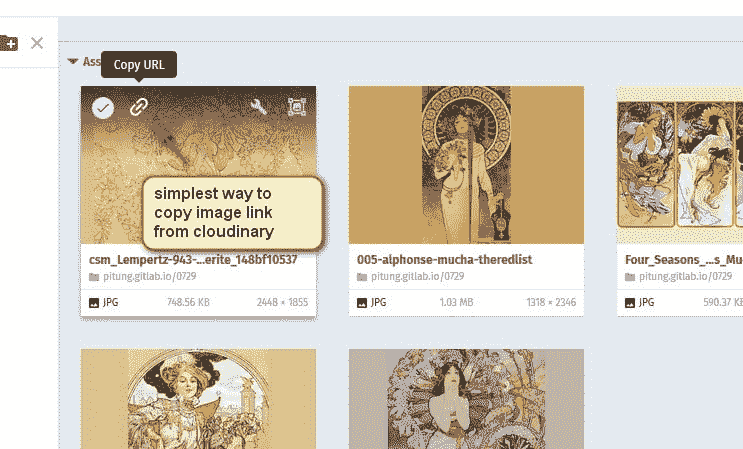

# 我的雨果短代码包括来自 cloudinary 的图像

> 原文：<https://dev.to/xabeng/my-hugo-shortcode-for-including-image-from-cloudinary-1l46>

我喜欢用静态站点生成器写博客，比如 hugo 或者 hexo，但是他们不擅长处理响应图像。

我的博客是 git repo，所以我不喜欢用它存储图像。我发现在 cloudinary 上存储图像更容易(也更快)，尤其是当我想响应性地将图像加载到我博客文章中时。

我将这篇文章分成四个部分:

*   第 1 部分:Hello World
*   第 2 部分:云
*   第 3 部分:云二进制响应图像脚本
*   第 4 部分:hugo 模板和短代码

## 第一部分:Hello World

还没什么，只是想说声嗨，祝大家新年快乐。

[](https://res.cloudinary.com/practicaldev/image/fetch/s--lqcoiYkp--/c_limit%2Cf_auto%2Cfl_progressive%2Cq_auto%2Cw_880/https://thepracticaldev.s3.amazonaws.com/i/snbo8it5vo1xxpfla3ul.jpg)

## 第二部分:云淡风轻

假设我在网上某处发现了一张美丽的大照片，我想用它来写我的博客。它应该在帖子列表上加载一个*小版本*和*大版本*用于帖子满，作为帖子封面。当在各种设备(手机、平板电脑、台式电脑)上显示时，它也应该响应性地加载...).

OMG！太多的版本，太多的逻辑，只显示一张图片...

我登录 cloudinary，将图片 url 复制粘贴到*网址标签*上，然后点击旁边的上传按钮，将其添加到我的收藏中。 <sup id="fnref1">[1](#fn1)</sup>

每当它上传，你可以得到它的网址并粘贴到你的博客文章中，最简单的方法是将鼠标悬停在缩略图上并点击链接图标

[](https://res.cloudinary.com/practicaldev/image/fetch/s--peS7_F97--/c_limit%2Cf_auto%2Cfl_progressive%2Cq_auto%2Cw_880/https://thepracticaldev.s3.amazonaws.com/i/xhec0x6dk5y3dtilsa0e.jpg)

正如你在缩略图右下角看到的，大小接近 2500 像素* 2000 像素。我想在帖子里用这个，但是它太大了。我的帖子预览宽度在 300px 左右，帖子封面最大宽度在 1400px 左右(台式电脑上) <sup id="fnref2">[2](#fn2)</sup>

这就是我使用 cloudinary [响应式图像脚本](https://cloudinary.com/documentation/responsive_images#automating_responsive_images_with_javascript)的原因

## 第三部分:云二进制响应图像脚本

我在用雨果。

首先我[下载脚本](https://github.com/cloudinary/pkg-cloudinary-core/blob/master/cloudinary-core-shrinkwrap.js)并保存到`assets/js`文件夹。您的脚本文件路径可能与我的不同。

用 Hugo pipe
将其包含在`partials/site-tail.html`模板中

```
{{ $cloudinary := resources.Get "js/cloudinary-core-shrinkwrap.js" }}
{{/* $vars := resources.Get "other scripts" */}}
{{ $js := slice $cloudinary /* $vars */ | resources.Concat "js/script.js" | minify }}
<script type="text/javascript" src="{{ $js.Permalink }}"></script>

<script type="text/javascript">
    // replace account_name with your account
    var cl = cloudinary.Cloudinary.new({ cloud_name: "account_name" });
    cl.responsive();
</script> 
```

通过查看页面源代码来检查它是否包含得很好

[](https://res.cloudinary.com/practicaldev/image/fetch/s--y_SUNgDX--/c_limit%2Cf_auto%2Cfl_progressive%2Cq_auto%2Cw_880/https://thepracticaldev.s3.amazonaws.com/i/83gubw1ho0wru0d1q37i.png)

现在使图像加载响应。

通常情况下，如果你从 cloudinary 复制图片 url 并插入到 post 中，你的图片将呈现如下*(为了可读性，我添加了一些分隔符)*

```
 
```

要加载响应图像，您的图像应该呈现如下

```
 
```

看出不同了吗？

*   图像 url 必须使用`data-src`
*   你必须在图片 url 的中间加上`c_scale, w_auto`
*   你必须使用`class="cld-responsive"`

我将向你展示我的 Hugo 模板和短代码

## 第 4 部分:hugo 模板和短码

好吧，希望你还在这里看书不会无聊死。

这是我在`yml`格式的封面文章

```
---
title: "my  title"
#other things

# it is easier for me to use account_name instead of img or something else
account_name: "url/you/copy/from/cloudinary"
--- 
```

### 模板显示帖子预览和帖子封面

这是我的`partials/post-preview.html`模板。这样做的原因是我不喜欢在每个帖子上编辑图片的 url，只是复制粘贴*原始*的 url。

```
// replace account_name with yours
<a class="card-preview" href="{{ .Permalink }}">

    {{ if (.Params.account_name) }}
        {{ $vcl := "https://res.cloudinary.com/account_name/image/upload" }}
        {{ $pth := .Params.account_name | strings.TrimLeft $vcl }}
        <div class="preview-image"></div>

    {{ else }}
        <div class="preview-image" style="background: teal;"></div>
    {{ end }}

</a> 
```

### 将*响应的*图片插入帖子的短码

我用`account_name`作为简称，因为我有很多云账户。

创建`shortcodes/account_name.html`，用这个
填充

```
<div class="cld-image">
    {{ $vcl := "https://res.cloudinary.com/account_name/image/upload" }}
    {{ $path := .Get 0 | strings.TrimLeft $vcl }}
    <a href="{{ $vcl }}/{{ $path }}">
        
    </a>
</div> 
```

在帖子中使用

```


// like this

 
```

现在，在我的 hugo 网站上，几乎每个页面都会根据浏览器的屏幕大小来加载图片。

仅此而已。感谢观看。

* * *

1.  将图片添加到收藏中的另一种方法是下载到您的电脑上，然后通过点击*我的文件标签*上传，或者搜索图片，或者从您的 dropbox、facebook、instagram 获取... [↩](#fnref1)

2.  其他设备的屏幕尺寸很大。比如手机 500 像素，平板电脑 700-1000 像素等...没有一个比 1400 像素大的。 [↩](#fnref2)