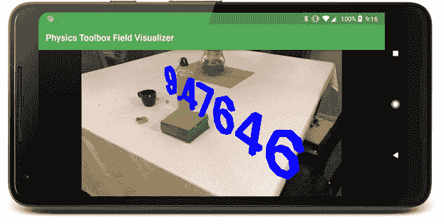
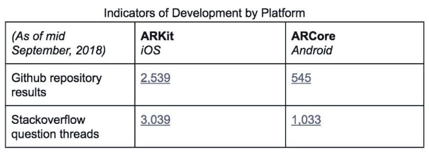
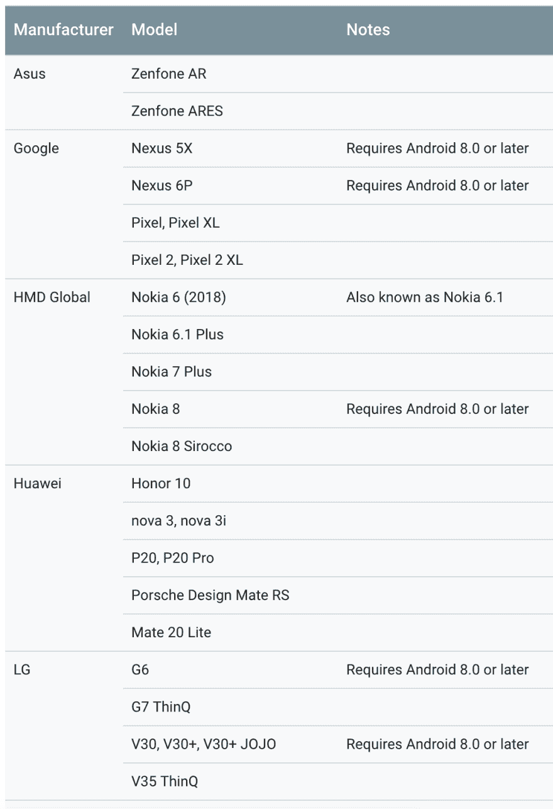

# 比较谷歌 ARCore 和苹果 ARKit

> 原文：<https://dev.to/chrystianv1/comparing-google-arcore-and-apple-arkit-2lin>

选择使用哪个平台来进行增强现实(AR)可视化技术的探索性工作至关重要。由于许多移动开发者只专注于一个平台，所以对于像 AR 这样相对较新的技术进步，很少有跨平台的分析。在下面的段落中，我们展示了一些我们自己对这些 AR 工具的研究经验，作为最近从国家科学基金会授予美国建模教师协会和 T4 Vieyra 软件的赠款的一部分。我们将介绍 ARKit 和 ARCore 与苹果和安卓产品的兼容性。在未来的条目中，我们将更仔细地研究我们在每个平台上的一些开发，以及在我们使用 AR 和真实数据显示磁场时，每个平台在性能和功能方面的固有优势和劣势。

2017 年夏天，公开 AR 框架向开发者公开发布:[ARKit for iOS](https://developer.apple.com/arkit/)2017 年[6 月 5 日](https://www.apple.com/newsroom/2017/06/highlights-from-wwdc-2017/)和[ARCore for Android](https://developers.google.com/ar/)2017 年[8 月 29 日](https://www.blog.google/products/arcore/arcore-augmented-reality-android-scale/)。这些新框架将智能手机的内部运动传感器和相机算法联系起来，允许开发人员创建 AR 世界，在其中智能手机具有 3d 环境意识。这使得用户不仅可以在 2-D 背景上显示图像，还可以在 3-D 环境中与图像进行交互，而无需使用笨重的预制视觉目标。然而，这些基本的技术框架发布时只有极其有限的公开文档或示例应用程序，开发人员可以在这些文档或示例应用程序的基础上进行工作。在发布近一年后，这些框架仍然很少被开发人员理解和利用。

黄点是空间意识的定位点。两个红点(在杯子上和餐巾纸上)位于空间中，它们之间的距离用蓝色标注(以厘米为单位)。

ARKit 和 ARCore 谁在开发？

对提交存储库的简单搜索显示了当今开发人员对 ARKit 的强烈偏好。尽管这两个平台在几个月内相继发布，ARKit 的开发量和讨论频率却是 ARCore 的五倍。

我们的资助工作最初将 Android ARCore 作为首选平台，因为我们希望创造尽可能易于用户使用的东西。然而，看到这些数字让我们质疑为什么更多的开发者不投资 AR 的 Android。

哪些设备兼容 ARKit 和 ARCore？

截至 2018 年，全球近 85%的智能手机使用安卓系统，这一比例预计在未来几年只会增长。然而， [2014 年对美国城市地图的一项研究](https://www.businessinsider.com/android-is-for-poor-people-maps-2014-4)显示了 Android 用户与 iOS 用户之间的社会经济差异，与此一致，数十亿 Android 用户中的很大一部分正在[购买低端设备](https://newzoo.com/insights/articles/insights-into-the-2-3-billion-android-smartphones-in-use-around-the-world/)，这些设备的功能与价格更高的同类设备有着显著差异。与苹果公司控制所有使用 iOS 的机型不同，安卓手机至少由十家主要公司制造，每家公司都可以选择独特的功能，并获得他们选择的完全不同的硬件组件。

部分 Android 设备与 ARCore 兼容。来源:[谷歌开发者](https://developers.google.com/ar/discover/supported-devices)

这对兼容性意味着什么？由于 iOS 的硬件一致性，所有设备，包括 iPhone SE 和 iPad 5 代，都兼容 ARKit。截至 2017 年底，对 ARKit 兼容设备的数量做出了两个值得注意的估计——1 . 95 亿台,这没有计入 iPhone 8 或 iPhone X 的发布，以及[4 . 34 亿台](https://artillry.co/2017/10/04/434-million-arkit-devices-by-year-end-revised-forecast/),这是在 iPhone 8 被披露后发布的估计。相比之下，谷歌 2017 年 12 月估计的 ARCore 兼容设备为 [1 亿](https://www.blog.google/products/arcore/arcore-developer-preview-2/)，相对于安卓巨大的全球市场份额而言，这只是沧海一粟。

哪些变量影响设备与 AR 平台的兼容性？

传感器硬件:虽然多年来所有苹果设备都包含相同的基本传感器系统，但 Android 设备在硬件和传感器方面的差异是出了名的。ARCore 需要一个带有后置摄像头、加速度计和陀螺仪的设备。虽然几乎所有手机都有所需的摄像头和加速度计，但陀螺仪要求消除了与大部分低端 Android 设备的兼容性，这些设备通常由注重成本的消费者购买，尤其是发展中国家的消费者。在所有 Android 平板电脑中，目前只有 Galaxy Tab S4 兼容。([点击此处](https://developers.google.com/ar/discover/supported-devices)查看右边表格的扩展版本，查看兼容 ARCore 的 Android 设备的完整列表)。

操作系统:与 ARKit 与 2015 年 9 月以来发布的运行 iOS 11.0 的设备完全兼容相比，ARCore 仅支持运行 Android 7 或更高版本的 Android 设备的[有限子集，用户必须下载谷歌](https://developers.google.com/ar/discover/supported-devices)的应用 [ARCore，不像苹果设备，苹果设备已经包括嵌入在操作系统中的应用。然而，即使这些对 Android 的要求也不是一成不变的规则。一些设备需要 Android 8.0，另一部分设备需要特定的补丁(除了下载 ARCore 应用程序)，索尼 Xperia XZ2 就是这种情况。](https://play.google.com/store/apps/details?id=com.google.ar.core)

应用程序要求:对于用户尚未下载 ARCore by Google 应用程序的任何 ARCore 兼容设备，尝试下载使用 ARCore 功能的应用程序，如流行的 [IKEA Place](https://play.google.com/store/apps/details?id=com.inter_ikea.place) 应用程序，会通知用户也将下载 ARCore by Google。

设备发布:虽然所有新的 iOS 设备都准备好与 ARKit 兼容，但即使是最新的 Android 产品也并非如此。虽然今年的谷歌智能手机 Pixel 2 和 Pixel XL 完全安装了 ARCore，但它们只占市场份额的很小一部分。因为谷歌不控制其他公司生产的设备的制造，所以大多数公司在发布前都会寻求 [Android 认证](https://www.android.com/certified/)。在这样做的过程中，制造商与谷歌合作，以确保他们的硬件与 Google Play 应用程序兼容，允许谷歌提前修改他们的应用程序，以确保它们在下载后无缝运行。不幸的是，谷歌的 ARCore 应用程序似乎被排除在这一认证过程之外，因为已经发布了许多与 ARCore 不兼容的 Android 认证设备，甚至不能下载到这些设备上供用户测试——谷歌实际上只允许在其批准的设备上下载其 ARCore 应用程序。

事实证明，无法将 ARCore by Google 应用程序下载到一些最新、最受欢迎的 Android 设备上令人沮丧。例如，Galaxy S9 和 Galaxy S9+是三星最受欢迎的设备之一。尽管 ARCore 于 2018 年 3 月 16 日发布[，但谷歌直到 5 月初](https://en.wikipedia.org/wiki/Samsung_Galaxy_S9)才允许其[下载，这距离其发布已经过去了近两个月。同样，索尼的 XPERIA XZ2 是在 2018 年 4 月 5 日](https://github.com/google-ar/arcore-android-sdk/issues/367)发布的[，而](https://en.wikipedia.org/wiki/Sony_Xperia_XZ2)[直到 2018 年 8 月 8 日](https://developers.google.com/ar/discover/supported-devices)才完全兼容，即便如此，也只有额外需要的安全补丁。

一个人应该如何决定使用哪个平台来追求发展？

答案取决于你的目标。

功能:虽然我们还没有明确指出每个 AR 软件框架的优势和局限性，但我们的初步实验表明，ARKit 比 ARCore 经历的位置滞后要少得多。(例如，当将一个无生命的 AR 对象“放置”在一个房间的中间，在房子里走来走去，并期望在放置的同一坐标找到 AR 对象时，ARKit 明显优于我们在两个不同的 Android 设备上对 ARCore 的测试)。这背后的原因可能是，尽管所有苹果制造的设备都有以相同方式校准的传感器，但即使是同一个安卓制造商也经常从不同的传感器制造商那里获得不同水平的传感器精度和准确度。事实上，谷歌迟迟没有为新设备开发兼容的 ARCore 软件的原因可能正是因为它正在进行调整，以满足硬件规格。

可访问性:我们最近获得的[国家科学基金会资助](https://www.nsf.gov/awardsearch/showAward?AWD_ID=1822728&HistoricalAwards=false)的目标是使用手机、传感器数据和 AR 的现代 3d 绘图功能来构建新颖的软件，用于教授和学习设备所有者高度可访问的领域。将 AR 功能与传感器数据相结合的进步有可能改变教育工作者、学习者和工作人员与其移动设备交互的方式，进而影响开发人员支持教育和工作需求的方式。我们希望建立一个平台，最终允许大规模实施我们制作的任何东西，特别是为资金不足的学校和欠发达地区的教师和学生提供的教育资源。然而，现实是，由于如此多的 Android 设备是低端的，他们的用户在这个时候根本不会访问 ARCore。就 shear 数而言，iOS 和 arKit 更有可能导致对新 AR 开发的更多访问。

尽管基于传感器的软件开发人员长期以来表现出对 Android 的偏好，因为可以轻松获取传感器数据，并且可以在各种设备上选择多种传感器，但在增强现实方面，ARKit 和苹果似乎赢得了胜利。

联系作者:写信给[support@vieyrasoftware.net](mailto:support@vieyrasoftware.net)

这项工作得到了国家自然科学基金#1822728 的资助。本材料中表达的任何观点、发现、结论或建议都是作者的，不一定反映国家科学基金会的观点。