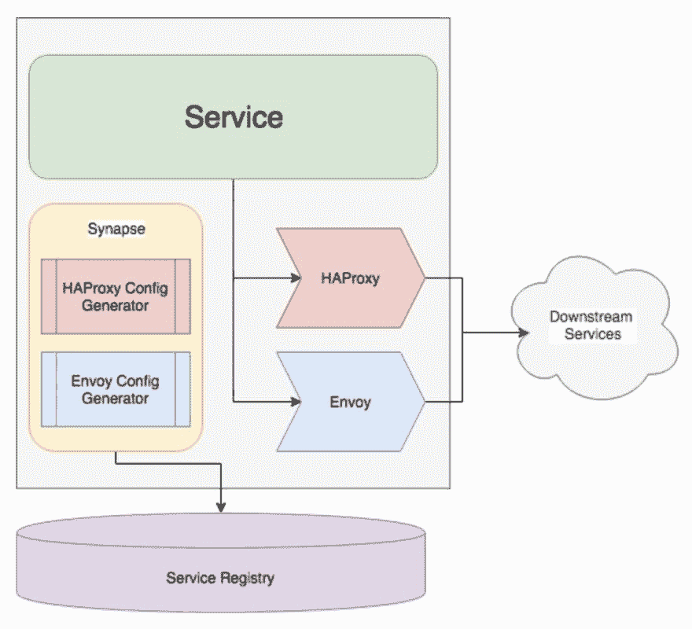

# EnqueueZero Techshack 2018-52

> 原文：<https://dev.to/soasme/enqueuezero-techshack-2018-52-26cl>

# enqueue zero Techshack 2018-52

起亚奥拉！我是**零入队**(【https://enqueuezero.com】T2)的创建者，这是一个向开发者/开发者/系统管理员解释代码原理的网站。本网站自 2018 年起在单人团队下更新。“EnqueueZero Techshack”系列由我写的或在互联网上找到的一堆有趣的帖子组成。更重要的是，我希望这些帖子能让你满意。

为了保持我的动力和这个网站的无广告，感谢您的捐赠！

[](https://www.patreon.com/join/enqueuezero)

喜欢读本周的帖子。

## 云时代的 DNS 负载均衡

[enqueuezero.com](https://enqueuezero.com/dns-load-balancing.html)

DNS 负载平衡通过配置各种 DNS A 记录将请求分布在多个 IP 地址上。现代工具能够以编程方式更新 DNS 记录。当事件发生时，他们中的一些人甚至可以自动更新 DNS 记录。DNS 负载平衡的缺点是它不能将请求平均分配给后端服务器。

## Reddit 上的特使代理

[redditblog.com](https://redditblog.com/2018/12/18/envoy-proxy-at-reddit/)

这篇文章讨论了 Reddit 上特使代理的使用，以降低服务相互交互的复杂性。特别是，作为 Airbnb [SmartStack](https://medium.com/airbnb-engineering/smartstack-service-discovery-in-the-cloud-4b8a080de619) 的替代产品，Envoy 是一个服务对服务的 L4/L7 代理。

迁移到新系统并不容易，因此需要一步一步地改进。Reddit 目前混合使用 SmartStack(Synapse，HAProxy，Nervel)和 Envoy——它仍然使用 neur 和 Synapse 来处理服务注册和发现，并使用 Envoy 进行基本的 TCP 代理。

[](https://res.cloudinary.com/practicaldev/image/fetch/s--WsGPVFC8--/c_limit%2Cf_auto%2Cfl_progressive%2Cq_auto%2Cw_880/https://redditupvoted.files.wordpress.com/2018/12/Screen-Shot-2018-12-14-at-11.13.22-AM.png)

稍后再看系统最终如何收场。:)

## Clojure 的稳定性:经验教训

Aka，为什么 clojure 这么稳定？

[words.steveklabnik.com](https://words.steveklabnik.com/why-is-clojure-so-stable)

Clojure 在稳定性方面有着当之无愧的声誉。

*   里奇，这位 BDFL 或仁慈的终身独裁者，理应得到很多赞誉。
*   Clojure 作为 Lisp 方言缺乏语法，因此很少在语法上增长。宏引入了新的语法。
*   Clojure 是动态类型的——改变动态系统比改变静态系统更容易。
*   Clojure 开发很慢——当您不经常更改时，保持稳定要容易得多。

## 为什么应该使用 pathlib

[treyhunner.com](https://treyhunner.com/2018/12/why-you-should-be-using-pathlib/)

从 Python 3.6 开始，您可以使用 pathlib 而不是 os 系列的工具。下面列出了一些设计最好的 API。

```
Path(filename).write(content)

Path(__file__).parent.parent.join_path(resource_filename)

Path(filename).mkdir(parents=True, exist_ok=True)

Path(filename1).rename(filename2)

Path.cwd().glob('*.csv')

[p.read_text() for p in Path.cwd().rglob('*.csv')] 
```

Enter fullscreen mode Exit fullscreen mode

## 2019 年 20 大开发工具

[blog.axosoft.com](https://blog.axosoft.com/top-developer-tools-2019/)

分别是 GitKaren、VSCode、Docker、Git、Postman、VStudio、ChromeDevTools、GitLab、SublimeText、IntelliJ IDEA、GitHub、Slack、Atom、Azure、Trello、Google、XCode、Eclipse IDE、Linux。

## 设计弹性系统:断路器还是重试？(第一部分)

[engineering.grab.com](https://engineering.grab.com/designing-resilient-systems-part-1)

本文重点关注实现断路器的用例，包括与电路配置相关的不同选项。只要您的服务与外部资源通信，故障就可能由以下原因引起:

*   网络问题
*   系统霸主
*   资源匮乏(例如，内存不足)
*   错误的部署/配置
*   错误的请求(例如，缺少身份验证凭据、缺少请求数据)

同时，一个成功的请求应该是及时的，以预期的格式，并包含预期的数据，因此其他的一切都是某种失败(从客户端的角度来看)，无论是:

*   迟钝的反应
*   一点反应都没有
*   格式错误的响应
*   不包含预期数据的响应

因此我们应该只跟踪网络或基础设施的错误(即 HTTP 错误代码 503 和 500)。断路器断开后，没有请求发送到外部服务。在睡眠窗口之后，它要么保持自己打开，要么恢复自己。

因此，在设置断路器时，请记住 5 件事:

*   超时——在被认为是错误之前，允许请求花费的最长时间。
*   max Concurrent Requests(Bulwark)——防止并发请求超过配置的最大数量。
*   请求量阈值-在可以打开电路之前，在评估(滚动窗口)期间必须做出的最小请求数。
*   睡眠窗口-在断路器尝试检查请求的健康状态之前，电路等待的时间
*   错误百分比阈值-在电路断开之前必须失败的请求的百分比。

为每个服务设置断路器有一个缺点——它不能检测由一个坏实例引起的错误。相比之下，为每台主机设置断路器更好，尽管这增加了复杂性。

## 利用队列实现弹性:构建一个十亿分之一秒都不会漏过的系统

[www.braze.com](https://www.braze.com/perspectives/article/building-braze-job-queues-resiliency)

本文讨论了一组应用于作业队列的技术。

*   启动多组队列和工作线程。
*   将作业保存到数据库并发送到队列。如果发送失败，请重试。
*   如果需要，暂停某些队列。
*   为具有大量作业的特定活动创建队列，以避免作业不足。
*   如果队列平台遇到错误，客户端使用指数补偿算法重试，直到成功。

## 脸书应用机器学习:数据中心基础设施视角

[research.fb.com](https://research.fb.com/publications/applied-machine-learning-at-facebook-a-datacenter-infrastructure-perspective/)

这篇论文描述了脸书如何将 ML 应用到它的服务中。

*   机器学习广泛应用于几乎所有的服务。
*   脸书通过机器学习管道汇集了所有存储数据的很大一部分，并且这一部分随着时间的推移而增加，以提高模型质量。
*   脸书大学一些最重要的最大似然算法包括逻辑回归、SVM、梯度推进决策树和 DNNs(结构化数据的最大似然算法、空间任务的最大似然算法、序列处理的 RNN/最小似然算法)
*   例子
    *   多层感知器。
    *   新闻源中的故事排名。
    *   向给定用户显示的广告。
    *   搜索照片、视频等。
    *   梯度推进决策树(GBDT)。
    *   一般分类和异常检测。
    *   支持向量机(SVM)。
    *   人脸检测。
    *   递归神经网络(RNN)
    *   翻译，语音识别。
*   脸书的内部工具包括 FBLearner，PyTorch，Caffe2。
*   脸书使用 [ONNX](https://onnx.ai/) 将模型从 PyTorch 交换到生产环境 Caffe2。

## 通过日志分析识别有影响的服务系统问题

[dl.acm.org](https://dl.acm.org/citation.cfm?id=3236083)|[GitHub 项目](https://github.com/logpai/Log3C) | [晨报](https://blog.acolyer.org/2018/12/19/identifying-impactful-service-system-problems-via-log-analysis/)

Log3C 的分布式版本已经在微软产品中部署和服务多年，每天分析数百亿条日志消息。这是基于日志的有效问题识别，使用微软的机器学习。

从原始日志记录到问题的解决需要以下步骤。

[](https://res.cloudinary.com/practicaldev/image/fetch/s--nNdN4Sqq--/c_limit%2Cf_auto%2Cfl_progressive%2Cq_auto%2Cw_880/https://enqueuezero.com/statimg/2018-52-log3c.jpeg)

1.  日志解析。将原始日志记录参数化为一系列事件。最终，每个日志序列成为一个向量——n 个不同类型的事件等于 n 元素向量。

```
HTTP Request URL: /path

=>

Event: "HTTP Request URL: *"

=>

[E1, ] 
```

Enter fullscreen mode Exit fullscreen mode

1.  序列矢量化。将事件分块到配置的时间间隔中，并获取每个事件的权重。使用 sigmoid 函数将逆文档频率(IDF)权重归一化到范围[0，1]内。

```
[t1, E1]
[t1, E2]
[t2, E1]
[t2, E2]
[t2, E2]

=>
   E1  E2
t1 [1, 1]
t2 [1, 2] 
```

Enter fullscreen mode Exit fullscreen mode

1.  级联聚类。将事件归入同一类别。每次迭代都要经过采样、聚类、匹配。

2.  相关性分析。将群集与 KPI 的更改相关联。

## 航天飞机风格(Kubernetes)

[github.com](https://github.com/kubernetes/kubernetes/blob/ec2e767e59395376fa191d7c56a74f53936b7653/pkg/controller/volume/persistentvolume/pv_controller.go)

Kubernetes PersistentVolume 代码的代码风格是所谓的`space shuttle style`，用于 NASA 航天飞机应用程序。这些想法是:

*   每个“if”语句都有一个匹配的“else”
    *   除了客户端 API 调用的简单错误检查之外
*   看似显而易见的事情会被明确地注释掉

它可以有以下两种风格。

```
// Try to do what?
if (cond) {
  // true logic 
} else {
  // false logic
}

// Try to do what?
if (!cond) {
  // false logic
}
// true logic 
```

Enter fullscreen mode Exit fullscreen mode

原帖:[https://enqueuezero.com/techshack.weekly/2018-52.html](https://enqueuezero.com/techshack.weekly/2018-52.html)