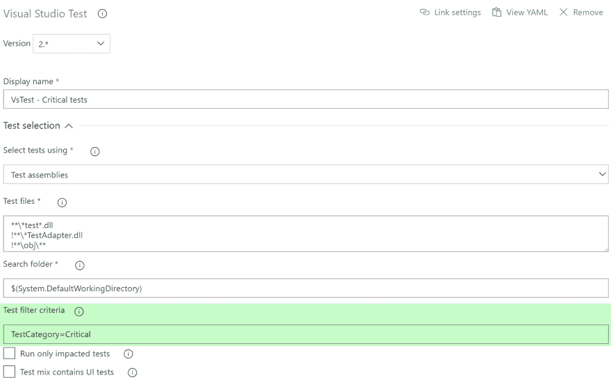
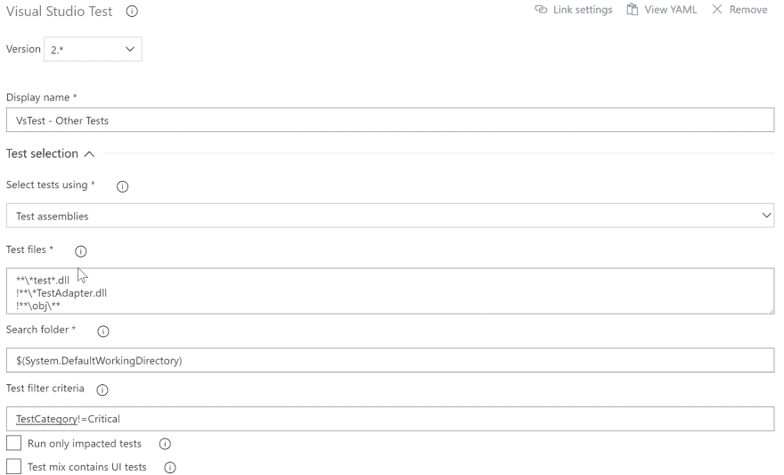

# Azure DevOps 管道中测试的分阶段执行

> 原文：<https://dev.to/xpirit/staged-execution-of-tests-in-azure-devops-pipelines-2jb2>

[](https://res.cloudinary.com/practicaldev/image/fetch/s--kr5UlXId--/c_limit%2Cf_auto%2Cfl_progressive%2Cq_auto%2Cw_880/https://jessehouwing.net/conteimg/2018/12/detian-falls-1.jpg)

当在您的构建系统中运行单元测试时，您可能想要首先运行最重要的套件，不应该失败的套件，当前正在被更改的套件，最后是执行起来可能较慢的回归套件和集成测试。

Visual Studio 测试任务支持这一特性，尽管许多人可能从基于工作流的 Team Build 2010 第一次发布时就不知道这一点。

在您的构建定义中，您可以轻松地添加多个测试运行，并为每个测试运行定义应该运行哪些测试。不仅仅是固定的测试列表，而是基于测试属性的动态列表。

下面的步骤将带你了解在 Azure 管道中实现这一点的基本要点。

## 1。分类你的测试

第一步是将需要一起运行的测试分组在一起。这可以通过许多不同的方式来实现。分组可以在程序集或名称空间级别完成，但是我倾向于依赖的最灵活的系统是按测试类别分组。

仔细检查您的测试库，并将类别应用到您的自动化测试中。对 MsTest 使用`[TestCategory]`属性，对 NUnit 使用`[Category]`属性，对 xUnit 使用`[Trait]`属性。

```
// MsTest
[TestCategory("Critical")]
[TestMethod]
public void MyCriticalTest {}

// NUnit
[Category("Critical")]
[Test]
public void MyCriticalTest {}

// xUnit
[Trait("Category", "Critical")]
[Fact]
public void MyCriticalTest {} 
```

Visual Studio 测试的测试筛选器选项还可以根据测试的其他特征进行筛选，如测试的名称、其父类、命名空间或程序集。您可以组合这些元素:

```
// MsTest
[TestCategory("Critical")]
[TestPriority(1)]
[TestMethod]
public void MyCriticalTest {} 
```

## 2。在 Azure 管道中创建多个测试运行

一旦对测试进行了分类，就可以在 Azure Pipelines 中创建测试运行。每个测试阶段或测试集将映射到它自己的测试运行。在这个例子中，我们将使用一个简单的属性来区分关键测试和非关键测试。

在 Azure 管道中添加多个 Visual Studio 测试任务，每个任务对应一组要运行的测试:

[](https://res.cloudinary.com/practicaldev/image/fetch/s--_ONWb6bm--/c_limit%2Cf_auto%2Cfl_progressive%2Cq_auto%2Cw_880/https://jessehouwing.net/conteimg/2018/12/image-3.png) 

<figcaption>为每组要运行的测试添加一个 Visual Studio 测试任务。</figcaption>

我们将配置第一次运行来执行关键测试(并且当任何这些测试失败时，使构建失败)。只有当这些测试成功时，我们才会运行非关键测试。

在 **VsTest -关键测试**中，配置测试过滤器仅运行关键测试:

[](https://res.cloudinary.com/practicaldev/image/fetch/s--_cbXaNaA--/c_limit%2Cf_auto%2Cfl_progressive%2Cq_auto%2Cw_880/https://jessehouwing.net/conteimg/2018/12/image-4.png) 

<figcaption>将测试过滤条件设置为`TestCategory=Critical`</figcaption>

[](https://res.cloudinary.com/practicaldev/image/fetch/s--ucWikmP1--/c_limit%2Cf_auto%2Cfl_progressive%2Cq_auto%2Cw_880/https://jessehouwing.net/conteimg/2018/12/image-5.png) 

<figcaption>为测试运行命名，这样你就可以很容易地分辨出结果。</figcaption>

在第二个 Visual Studio 测试任务中，配置反向过滤器:

[](https://res.cloudinary.com/practicaldev/image/fetch/s--O-DLR0rZ--/c_limit%2Cf_auto%2Cfl_progressive%2Cq_auto%2Cw_880/https://jessehouwing.net/conteimg/2018/12/image-6.png) 

<figcaption>过滤第二个 Visual Studio 测试任务来运行测试的逆集。</figcaption>

## **替代滤镜**

测试类别是筛选测试的一种非常常见的方式，但是您可能有一大组已经遵循不同命名模式的测试。一个常见的区别是将所有集成测试放在它们自己的程序集中或不同的命名空间中。

这也很容易实现。为了了解您可以使用哪些过滤选项，下面是您可以做的事情的概述。

#### **装配名称**

*测试文件*遵循[标准 Azure Pipelines glob 模式](https://docs.microsoft.com/en-us/azure/devops/pipelines/tasks/file-matching-patterns?view=vsts):

*   `**/`递归文件夹
*   `*`通配符搜索
*   `?`单字符占位符

当您的集成测试位于它们自己的项目中时，您可以使用项目和程序集名称来选择这些测试:

*   `**/*IntegrationTests.dll`对于集成测试
*   `**/*UnitTests.dll`对于单元测试

#### **命名空间或类**

**测试过滤标准**选项可以对多项进行过滤，全名和类名(并非所有项目都支持类名过滤)都可以用来过滤。您可以使用精确匹配(`=`)或包含过滤器(`~`)，例如:

*   `FullyQualifiedName~Integration`
*   `ClassName~Important`

这里很好地解释了操作符和属性。

#### **类别或优先级**

如上所述，您可以使用测试类别，或者您可以根据优先级进行过滤。

*   `Priority=1`

您也可以使用`&` (and)和`|` (or)组合多个项目:

*   `Priority=1&TestCategory=Critical`
*   `Priority=2&TestCategory=Critical`
*   `Priority=3&TestCategory=Critical`

这将排队 3 次运行，每次运行不太重要但仍然重要的测试，然后运行其余的测试。

## 测试失败继续

每个测试任务都可以被配置为不会使正在执行的管道失败。这是 Azure DevOps 和 Team Foundation Server 2017 或更高版本上每个任务的标准功能。

我有时用它来过滤掉不可靠的测试:

[](https://res.cloudinary.com/practicaldev/image/fetch/s--XEAPUp-Y--/c_limit%2Cf_auto%2Cfl_progressive%2Cq_auto%2Cw_880/https://jessehouwing.net/conteimg/2018/12/image-8.png) 

<figcaption>在单独运行中运行您的片状测试</figcaption>

[](https://res.cloudinary.com/practicaldev/image/fetch/s--w-4Kbutt--/c_limit%2Cf_auto%2Cfl_progressive%2Cq_auto%2Cw_880/https://jessehouwing.net/conteimg/2018/12/image-7.png) 

<figcaption>不要失败</figcaption>

通过这种方式，您可以获得这些测试的统计数据，并且可以随着时间的推移对它们进行重构以保持稳定，同时仍然可以获得发布。这对于有技术债务的代码库是有用的，并且在你清理混乱的时候会有所帮助。

来源: [StackOverflow](http://stackoverflow.com/a/28028200/736079)