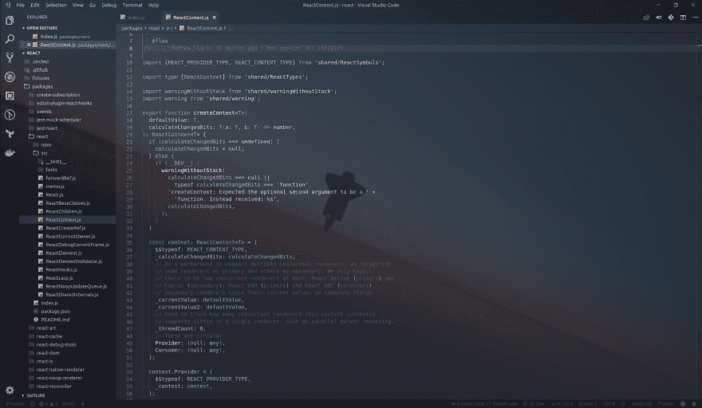

# 如何变酷，让 Visual Studio 代码(VSCode)透明

> 原文：<https://dev.to/emmanuelnk/how-to-be-cool-and-make-vscode-transparent-56ib>

[](https://res.cloudinary.com/practicaldev/image/fetch/s--0H8T_oIJ--/c_limit%2Cf_auto%2Cfl_progressive%2Cq_auto%2Cw_880/https://thepracticaldev.s3.amazonaws.com/i/ja3r63kqoxsu7izm0aqp.png) 
我是能够实现透明的应用程序的超级粉丝。没有特别的原因。我只是喜欢这种美感。其他人可能会发现这很有用，因为在背景中有终端，他们可以透过透明物等温和地观察

这也是在 Visual Studio 代码 Github 问题上要求的一个特性，但是在撰写本文时还没有官方的解决方案。希望这种情况会很快改变(更多信息请见下面的 MacOS 部分)。

然而，非正式地，这些是你可以使 VSCode 在你的操作系统上透明的方法。受到这个 [github 问题](https://github.com/Microsoft/vscode/issues/12578)的启发

## 如何让 VSCode 在 Windows 上透明(在 Windows 10 上测试)

Windows 用户有最简单的解决方案。只需安装[格拉斯特-VSC 扩展](https://marketplace.visualstudio.com/items?itemName=s-nlf-fh.glassit)

在 VSCode 设置中(文件>首选项>设置或`Ctrl` + `,`):

*   `glassit.alpha (integer): Transparency level [1-255]`
*   `glassit.step (integer): Increment of alpha`或:`ctrl+alt+z`增加透明度，`ctrl+alt+c`减少透明度，如扩展所设置的(注意不要覆盖分配给这些热键的其他快捷键)

## 如何在 Linux 上使 VSCode 透明(在 Ubuntu 18.04 上测试)

对于 Linux 来说，这尤其容易。首先，你需要 devilspie。魔鬼的馅饼)。
*出于好奇，devilspie 是一个非图形用户界面工具，它可以让你在指定的工作区、指定的大小和位置、最小化或最大化以及更多基于简单配置文件的应用程序。*

```
sudo apt-get install devilspie
mkdir -p ~/.devilspie
nano ~/.devilspie/vscode_transparent.ds 
```

Enter fullscreen mode Exit fullscreen mode

然后将下面的代码复制并粘贴到刚刚创建的文件`vscode_transparent.ds`

```
( if
( contains ( window_class ) "Code" )
( begin
( spawn_async (str "xprop -id " (window_xid) " -f _NET_WM_WINDOW_OPACITY 32c -set _NET_WM_WINDOW_OPACITY 0xdfffffff") )
)
) 
```

Enter fullscreen mode Exit fullscreen mode

你可以使用末尾的十六进制字符串来设置你想要的不透明度(大约 87%的不透明度对我来说已经足够了)。它的范围是 1 到 99。

如果你想避免所有的十六进制数学，你可以像这样在你的脚本中使用百分比(用你想要的不透明度替换`87`):

```
( if
( contains ( window_class ) "Code" )
( begin
( spawn_async (str "xprop -id " (window_xid) " -f _NET_WM_WINDOW_OPACITY 32c -set _NET_WM_WINDOW_OPACITY $(printf 0x%x $((0xffffffff * 87 / 100)))") )
)
) 
```

Enter fullscreen mode Exit fullscreen mode

你会注意到，使用`devilspie`，你可以写一个脚本来启动任何不透明的程序。您只需要获得应用程序的启动名称(在我们的例子中是“代码”)并编写一个类似的脚本。所以你也可以用不透明度启动 subl。

显然，在 KDE 等离子上(我还没有测试过)，你甚至可以更进一步。KDE 有你可以启用的模糊效果和透明度:(见原始 github [评论](https://github.com/Microsoft/vscode/issues/12578#issuecomment-403619551)和后续[评论](https://github.com/Microsoft/vscode/issues/12578#issuecomment-444781951) )

```
(if (contains (window_class) "Code")
    (begin
        (spawn_async (str "xprop -id " (window_xid) " -f _KDE_NET_WM_BLUR_BEHIND_REGION 32c -set _KDE_NET_WM_BLUR_BEHIND_REGION 0 "))
        (spawn_async (str "xprop -id " (window_xid) " -f _NET_WM_WINDOW_OPACITY 32c -set _NET_WM_WINDOW_OPACITY 0xdfffffff"))
    )
) 
```

Enter fullscreen mode Exit fullscreen mode

我很想知道是否有人知道如何在 Ubuntu 18 上实现这种模糊！

## 如何让 VSCode 在 MacOS 上透明(未测试)

MacOS 用户对当前的 VSCode 版本没有太多选择(除了一些低效的黑客)。然而，一个惊人的拉请求目前正在开放，这将增加所有三个平台(Windows，Linux 和 MacOS)华丽的透明度。目前还没有关于何时这个 PR 将被合并到一个主要版本的信息，但希望它会很快。目前，MacOS 用户(以及其他人)可以使用基于这个 pull 请求分支的 VSCode 源代码。

在所有三个平台上从源代码构建和运行 VSCode 的指令在这里找到[和引用的拉](https://github.com/Microsoft/vscode/wiki/How-to-Contribute#build-and-run)[请求](https://github.com/Microsoft/vscode/pull/52707)

如果有任何 MacOS 或其他 OS 用户已经尝试过这个 PR，请告诉我。我也将对此进行测试，并根据我的发现更新这篇文章。

请投赞成票或对拉请求作出贡献，以便我们可以将这一令人敬畏的功能合并到我们最喜爱的代码编辑器中！