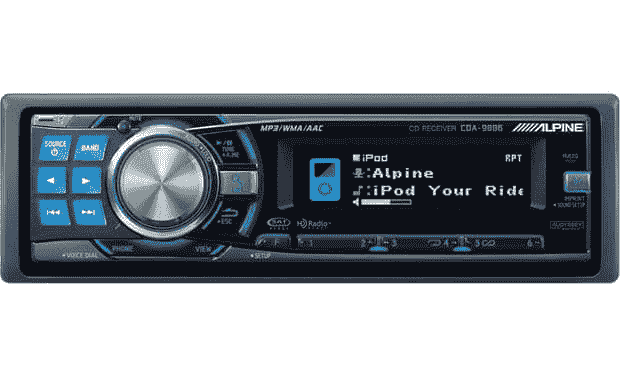
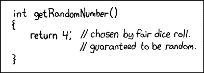

# 洗牌失败:用代码修复我汽车音响！

> 原文：<https://dev.to/turnerj/shuffle-fail-fixing-my-car-stereo-with-code-426>

## 背景

我上班要花 40 分钟，喜欢在车里放音乐(抱歉，如果你在我旁边的车里)。我在 6 年前买了一辆二手车，自从我买了它之后，它仍然有同样的音响。

> [](https://res.cloudinary.com/practicaldev/image/fetch/s--cmZF4aL3--/c_limit%2Cf_auto%2Cfl_progressive%2Cq_auto%2Cw_880/https://i.imgur.com/m6NccQG.png) 
> [阿尔卑斯 CDA-9886](https://www.cnet.com/products/alpine-cda-9886-car-cd-receiver-in-dash-unit-full-din/) -目前在我车上的音响

我把音乐存在一个插在我车上的 USB 上，我喜欢听 shuffle 上的音乐(我不想预测下一首歌)。有一段时间，我怀疑我的车实际上没有很好地播放音乐。

有些歌我听了不少(甚至是背对背)，有些歌我从来没听过放。原来我的音响有一个有趣的怪癖，只允许播放文件夹中的前 100 首歌曲。这肯定是一个问题，但不是我唯一的问题，因为我的一些音乐确实分散在几十个文件夹中，偶尔会播放。

如果要我猜的话，从我加载到 USB 上的几百首歌曲中，我会说大概有 60 首歌曲我是在启用了随机播放的情况下听到的。

我是个程序员该死的，我们让电脑服从我们的意志！我确信我能做些什么...

## [T1】！随意](#random)

> [](https://res.cloudinary.com/practicaldev/image/fetch/s--x4yQGAvk--/c_limit%2Cf_auto%2Cfl_progressive%2Cq_auto%2Cw_880/https://imgs.xkcd.com/comics/random_number.png) 
> [xkcd #221](https://www.xkcd.com/221/)

你可能知道也可能不知道，但是我们代码中的许多随机数函数并不像你想象的那样随机。这些是[伪随机数发生器](https://en.wikipedia.org/wiki/Pseudorandom_number_generator)，它们实际上是由一个初始值决定的，一个*种子*。

伪随机数发生器的种子通常基于当前时间，如果不小心的话，这会导致一个有趣的问题。如果你想在短时间内得到大量的随机数，你需要使用相同的生成器实例，否则你可能会得到完全相同的随机数，因为它可能有相同的种子。

伪随机数对很多事情都有用，但绝对不应该用于加密目的，你通常会在这些函数的文档中发现。

用我的车载音响，不知道种子是怎么产生的，也不知道随机数是怎么来的。虽然尝试对立体声进行逆向工程来控制这样一个方面是一项有趣的工作，但我希望有一个更简单的解决方案。

## 调试

通过更多的重复工作和更多的调试，我发现了一些不用洗牌就能玩的有趣的事情。如果没有 shuffle，我以为音乐会按字母顺序播放，或者按修改日期播放，但实际上要简单得多——它使用的是写入文件系统的顺序。

这对其他人来说似乎是显而易见的事情，但对我来说有点意外，给了我一个潜在的解决随机性问题的方法。如果歌曲以不同的顺序加载，我就能以不同的顺序听音乐。

## 解

解决方案很简单——从 USB 中移除所有音乐，然后以随机(实现我的随机性目标)和“分块”(避免文件夹中的 100 个文件问题)的方式将音乐重新添加到 USB 中。

以下是我拼凑的内容:

```
class Program
{
    static Random rand = new Random();

    static void Main(string[] args)
    {
        var source = @"C:\Path\To\My\Music\";
        var destination = @"E:\";

        Console.WriteLine($"Source: {source}");
        Console.WriteLine($"Destination: {destination}");

        Console.WriteLine("Press Enter to continue...");
        Console.ReadLine();

        RemoveAllFiles(destination);
        CopyFiles(source, destination);

        Console.WriteLine("Complete! Press Enter to close");
        Console.ReadLine();
    }

    static void RemoveAllFiles(string location)
    {
        foreach (var file in Directory.EnumerateFiles(location))
        {
            Console.WriteLine($"Deleteing {file}...");
            File.Delete(file);
        }
    }

    static void CopyFiles(string source, string destination)
    {
        var sourceFiles = Directory.EnumerateFiles(source).ToArray();

        Shuffle(rand, sourceFiles);

        var foldersOfFiles = ChunkBy(sourceFiles.ToList(), 25);

        for (int i = 0, l = foldersOfFiles.Count; i < l; i++)
        {
            var folderName = $"{i + 1}";
            var folderPath = Path.Combine(destination, folderName);

            Directory.CreateDirectory(folderPath);

            var files = foldersOfFiles[i];

            for (int i2 = 0, l2 = files.Count; i2 < l2; i2++)
            {
                var sourceFile = files[i2];
                var destFile = Path.Combine(folderPath, Path.GetFileName(files[i2]));

                Console.WriteLine($"Copying {sourceFile} to {destFile}...");
                File.Copy(sourceFile, destFile);
            }
        }
    }

    static void Shuffle<T>(Random rng, T[] array)
    {
        int n = array.Length;
        while (n > 1)
        {
            int k = rng.Next(n--);
            T temp = array[n];
            array[n] = array[k];
            array[k] = temp;
        }
    }

    static List<List<T>> ChunkBy<T>(List<T> source, int chunkSize)
    {
        return source
            .Select((x, i) => new { Index = i, Value = x })
            .GroupBy(x => x.Index / chunkSize)
            .Select(x => x.Select(v => v.Value).ToList())
            .ToList();
    } 
```

Enter fullscreen mode Exit fullscreen mode

功劳归功劳，堆栈溢出是洗牌和分块实现的根源。

你可能会注意到我也使用了 [`Random`](https://docs.microsoft.com/en-us/dotnet/api/system.random?view=netframework-4.7.2) 类，它是一个伪随机数发生器，但在这种情况下实际上也很好。我的问题源于汽车音响有一个坏的伪随机发生器(或种子),所以我的电脑随机上传到 USB 的音乐，我已经解决了这个问题。

这并没有消除我的汽车音响上的随机播放仍然只能播放大约 60 首歌曲，但这确实意味着我现在不需要启用随机播放，因为我的音乐已经被随机播放了。