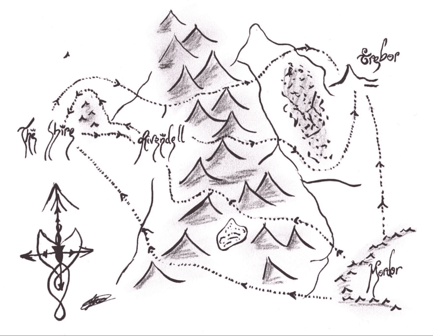
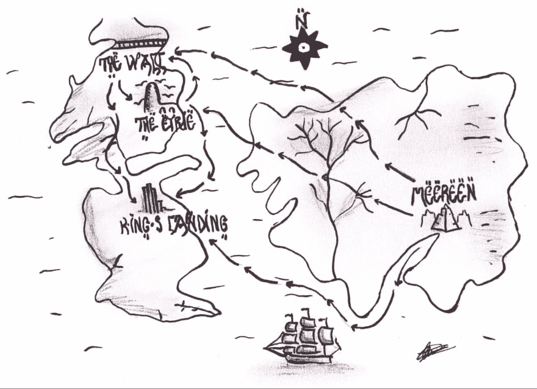
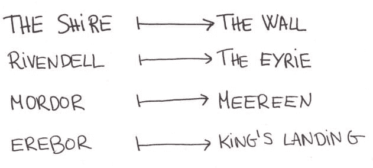
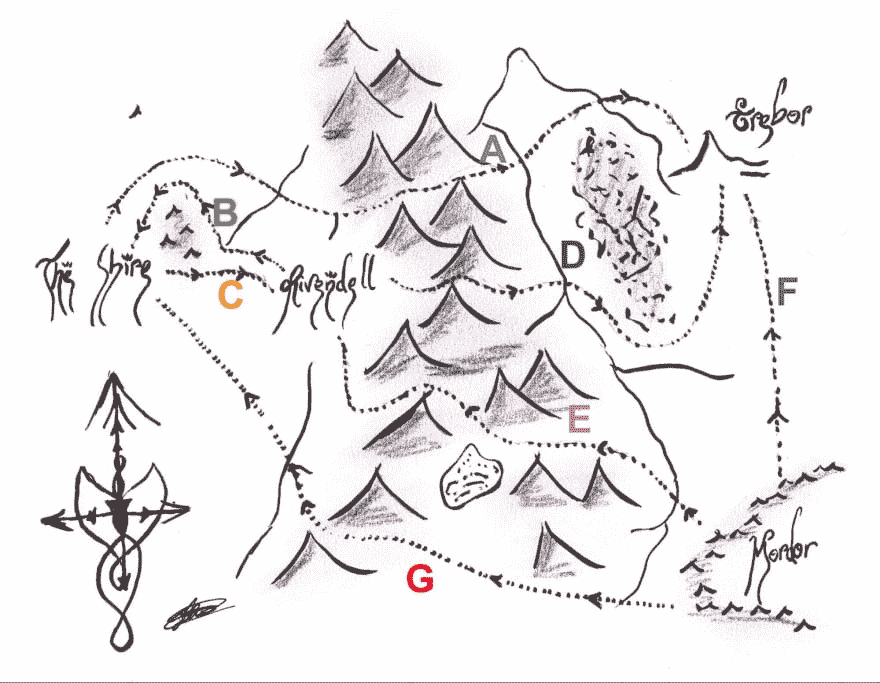
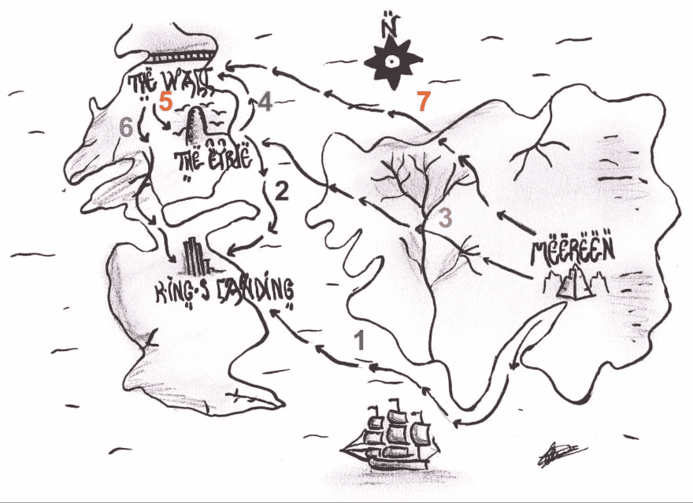
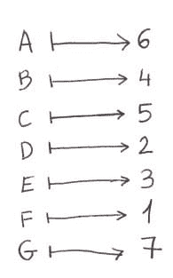
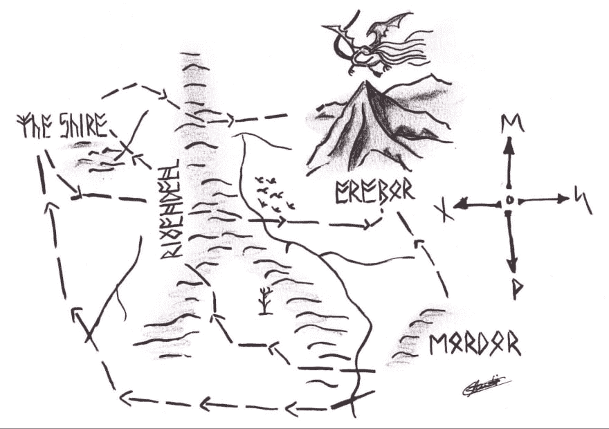
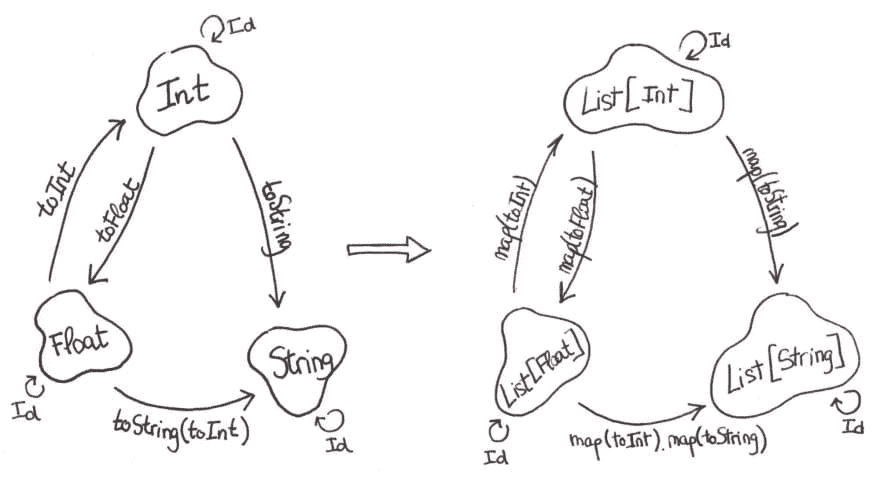

# 通过范畴理论认识单子

> 原文：<https://dev.to/juaneto/knowing-monads-through-the-category-theory-1mea>

我们都知道编程是以数学为基础的，但也许不太清楚的是，了解更多的数学知识会帮助我们成为更好的开发人员。尽管在所有类型的编程中，数学都是基础，但在函数式编程中更是如此。

一个非常普遍的概念是**单子**，我相信你最近听说过。它是后来在函数式编程中应用的**范畴理论**的一个数学概念。

我第一次听到这个术语是在我开始用 Scala 编程的时候。在网上搜索了很久之后，我只找到了由数学家解释和为数学家解释的文章，或者是谈论编程而不是数学的文章。另一方面，有些滥用语言的行为是指非单子的事物。因此，我们将尝试在不丧失数学严谨性的情况下，在这里讨论单子是什么，以及它们将如何以及为什么帮助我们成为更好的开发者。虽然它们是非常抽象和复杂的术语，但我们将尝试用简单的方式来完成。

为了理解单子，我们必须首先了解两个概念，范畴和函子。

## 类别

让我们从一个例子开始:

假设我们获得了下面这张**指环王**的中土地图。**精灵**成功了。

[](https://res.cloudinary.com/practicaldev/image/fetch/s--q23zhHZ4--/c_limit%2Cf_auto%2Cfl_progressive%2Cq_auto%2Cw_880/https://cdn-images-1.medium.com/max/3998/1%2AkGkLNFOax3rOXUDKT0xHYQ.jpeg)

我们在这张地图上看到了什么？我们首先看到的是几个城镇。此外，我们有道路连接每个城镇，以及他们自己(身份)。这些是单程或单程返回。同样，从地图上看，你不可能到达每一个城镇(谁会想去魔多？哦，没错…霍比特人…)。另一方面，很明显，如果佛罗多想从夏尔去伊鲁伯，他可以先穿过瑞文戴尔或者直接去伊鲁伯。

这是一个**类别**。从数学上讲，它有两个组成部分:

1.  第一，一组集合(中土世界的城镇集合)

2.  第二，一种被称为变形的功能/箭头(连接城镇的道路)。此外，我们可以组合态射(如在前面的 Frodo 例子中一样),并且这种组合使得任何由**身份**组合的态射等于态射，并且使得该组合是**结合的**。

**函子**:

现在想象一下，我们找到了另一张地图，这次是**权力的游戏**的七大王国地图。

[](https://res.cloudinary.com/practicaldev/image/fetch/s--hUOrr74a--/c_limit%2Cf_auto%2Cfl_progressive%2Cq_auto%2Cw_880/https://cdn-images-1.medium.com/max/3998/1%2A_RaW9K6vsnqcfXpV24lanA.jpeg)

同样，我们有城镇和连接这些城镇的道路。也就是说，我们还有另外一类。

看看连接每个城镇的道路。你能找到一些相似之处吗？比如有没有哪个小镇没人想去？当然，谁会想去弥林呢？没人！

另一个例子是，有一个城镇可以从所有其他城镇到达。看，中土世界也是！事实上，它有如此多的相似之处，以至于我们可以说，如果我们改变名称和距离，它就是同一个地图(在数学中，据说它有**相同的结构**，在现实世界中，我们说乔治·R·R·马丁受到了托尔金作品的“强烈启发”)。

看到这里，很明显我们应该可以改造，七大王国的中土地图，但是……怎么改造？
我们首先要考虑的是城镇的转型，在这种情况下:

[](https://res.cloudinary.com/practicaldev/image/fetch/s--1sRRVunV--/c_limit%2Cf_auto%2Cfl_progressive%2Cq_auto%2Cw_880/https://cdn-images-1.medium.com/max/2000/0%2A6Oq0pKYf-aL3i2O8.)

我们要做的最后一件事是改造道路:

[](https://res.cloudinary.com/practicaldev/image/fetch/s--Zwg_71gN--/c_limit%2Cf_auto%2Cfl_progressive%2Cq_auto%2Cw_880/https://cdn-images-1.medium.com/max/3998/1%2AYH3yPrW2wzxHX1cnsjUalw.jpeg)

[](https://res.cloudinary.com/practicaldev/image/fetch/s--dVhrdMCR--/c_limit%2Cf_auto%2Cfl_progressive%2Cq_auto%2Cw_880/https://cdn-images-1.medium.com/max/3998/1%2AW0KhQvnq2YYrBYMi52ED9g.jpeg)

[](https://res.cloudinary.com/practicaldev/image/fetch/s--YNRF2c3W--/c_limit%2Cf_auto%2Cfl_progressive%2Cq_auto%2Cw_880/https://cdn-images-1.medium.com/max/2000/0%2AOulU2-oAXWYXBK_g.)

这种转变很重要的一点是，它保留了结构，包括组成:佛罗多从夏尔到伊鲁伯(可选通过瑞文戴尔)将类似于约翰·斯诺从长城到君临的旅行(也可选通过鹰巢)。

我们可以说这个变换…是一个**函子**！通过这种方式，我们已经能够改造“完全不同”的世界，这正是数学范畴理论的创建目的:在非常不同的领域之间架起桥梁。

**单子**:

现在我们发现了另一张中土世界的地图，但这次是由一个**矮人**绘制的。

[](https://res.cloudinary.com/practicaldev/image/fetch/s--umulf-qg--/c_limit%2Cf_auto%2Cfl_progressive%2Cq_auto%2Cw_880/https://cdn-images-1.medium.com/max/3998/1%2AoCa9sbyg6LVP72d95z05tg.jpeg)

当然，中土世界是一样的，所以它一定有(并且已经有)一样的人口，一样的道路。当然有这么多地图，很难迷路…

由于本质上是相同的映射，很明显我们也可以构造一个函子或者中土本身的一个变换，这是相同的。这种特殊类型的函子被称为内函子。

但是还有更多。如果一个内函子也满足它有两个自然变换，比如单位函数和另一个结合函数，我们可以说我们有一个单子(我们称之为**单子定律** )⁴.

## 函数式编程中的单子

### 历史:

Philip Wadler 是函数式编程和单子使用背后的理论的最大贡献者，他受到 Eugenio Moggi 的单子给编程语言赋予语义的启发。单子将序列的概念引入了函数范式，但由于函数的组合，没有与之相矛盾。⁵

许多常见的编程概念可以用单子结构来描述，包括副作用、I/O、异常处理…

这允许以纯函数的方式定义这些概念，而不需要向语言语义添加新的术语，也不需要求助于命令式编程。有些语言，比如 Haskell，在标准内核中提供了单子，尽管 Scala 没有在内核中提供单子，但是你应该熟悉帮助我们开发单子的 [Cats](http://typelevel.org/cats/) 和 [Scalaz](https://github.com/scalaz/scalaz) 库(尽管我们总是可以实现自己的单子)。

### FP 中的函子和单子:

解释数学中的范畴理论是如何工作的很好，但是作为开发人员，我们已经希望看到一个应用于函数式编程的例子:

[](https://res.cloudinary.com/practicaldev/image/fetch/s--9eTOS0AN--/c_limit%2Cf_auto%2Cfl_progressive%2Cq_auto%2Cw_880/https://cdn-images-1.medium.com/max/3998/1%2A-JICmgqkQmDXmNVkei9AbQ.jpeg)

这个 drawing⁶表示一个函子，在本例中，由**列表**和**映射**组成。你肯定已经把这个例子和《指环王》和《权力的游戏》的仿函数联系起来了。

你可能在网上读到过 List 本质上是一个函子，就像 Scala Option 类是一个单子一样。两者都是类型构造器(相当于城镇的转换器),但是……道路/箭头的转换器在哪里？这是一种非常频繁的滥用语言，你将不再用同样的眼光看待它。
**如果在之前的绘图中我们使用了平面图而不是图**(平面图的输出是在同一类别中)，那么**我们将绘制一个单子**(尽管我们需要检查单子定律)而不是一个函子。

在我们的程序中使用单子有很多原因，但是我将列出使用单子的三个主要原因(以我的拙见):

1.  说到底，我们只想用函数(记住:函数式编程)。

2.  假设您有一个执行这两个功能的程序:

    **f(x) = x+3**

    **g(x，y) = List(x，y)**

    我们希望这两个函数按顺序执行，并且我们希望只使用函数来实现。那么，我们该怎么做呢？使用函数的组合。如果我们首先要对结果执行 g，然后执行 f，我们用下面的方式来组合函数: **f ∘ g (x，y)** 。

3.  如果我们用 **g(x，y) = x / y** 代替前面的 g，我们有两个问题:

*   如果接受 f **的**类型**不同于返回 g 的类型**(g 可以返回一个浮点数，因为它是一个除法，而 f 接受一个整数)我们显然会有问题。

*   如果函数 g 传递值 2 和 0 会发生什么？事实上，会有一个失败，因为它不能被 0 除。我们不希望函数式编程中出现异常，因为**异常不是函数**。

我的意思是，功能的构成还需要一个成分才能 100%功能化(这个成分也会解决上面两个问题)。这个成分，很明显(从帖子标题来看；))，就是单子的使用。

这个想法是允许函数返回两种类型的结果，所以 g 将不再是:g: Int，Int → Float，但我们会这样做 **g: Int，Int → Some | None** 和 **f(x): Some | None → Some | None** 。

例如，我们要撤销前面例子中的函数:

```
def g(x: Int, y: Int): Option[Float] = {
    y match {
        case 0 => return None
        case y => return Some(x.toFloat/y)
    }
} 
```

f(x)也是如此:

```
def f(x: Option[Float]): Option[Int] = {
    x match {
        case None => None
        case Some(x) => Some(x.asInstanceOf[Int]+3)
    }
} 
```

所以我们的代码是 **g(x，y)。flatMap (x = > f(选项(x)))** 。这样，我们组合了两个函数并避免了异常，因为如果 y 等于 0，结果将是 0。

## 总结和结论

简而言之，我们可以说一元是一个保持一元定律的内函子。我们也可以说，由于单子，我们可以组成函数，解决类型问题和异常。

现在我们对范畴理论有了更好的了解，并且知道了这些概念是如何在函数式编程中使用的，我们可以使用程序中提供的工具来编写更好的代码。

去吧，你已经可以告诉你的朋友“我见过你们这些人不会相信的事情”。

## 备注

**1。**也就是说，如果佛罗多从夏尔去了伊鲁伯(f)然后留在伊鲁伯(身份)就和他直接去伊鲁伯一样。

**2。也就是说，如果我们走五条路，例如从夏尔到伊鲁伯的那条(f)，从瑞文戴尔到夏尔的那条(g)，从魔多到瑞文戴尔的那条(h)，从瑞文戴尔到伊鲁伯的那条(j)，以及从魔多到伊鲁伯的那条(k)。然后(f**∘**g】**∘**h = f**∘**(g**∘**h)自 f **∘** g = j 和 g **∘** h = k**

**3。**显然，这些地图的路径都是精心发明的，这样一切都完美契合。

**4。** [一元定律](https://wiki.haskell.org/Monad_laws)同合成运算:

*   F ∘ id = F ( **左标识**

*   Id ∘ F = F ( **右恒等式**

*   (F ∘ G) ∘ H = F ∘ (G ∘ H) ( **结合律**

**5。** [德·欧几里得一爪哇—里卡多·培尼亚·马里](https://www.amazon.com/Euclides-Historia-algoritmos-lenguajes-programaci%C3%B3n/dp/8496566145)

**6。** [根据尼古拉·格罗泽夫的一首](http://nikgrozev.com/2016/03/14/functional-programming-and-category-theory-part-1-categories-and-functors/)改编

## 资源和链接

*   菲利普·瓦德勒的论文，他解释了单子

*   尤金尼奥关于单子的莫吉作品

*   [无所不知的巴托斯基](https://bartoszmilewski.com/)

*   [Juan Pedro Villa-Isaza 围绕范畴理论在函数式编程中的应用所做的工作](https://repository.eafit.edu.co/bitstream/handle/10784/4551/VillaIsaza-2011%20Practica-investigativa-I%20Teoria-de-categorias-aplicada-a-la-programacion-funcional-con-Agda.pdf?sequence=2)

*   [特雷弗·哈特曼关于 Scala 中单子定律的帖子](https://devth.com/2015/monad-laws-in-scala)

*   [猫图书馆](http://typelevel.org/cats/)

*   维基百科关于[范畴理论](https://en.wikipedia.org/wiki/Category_theory)和[单子](https://en.wikipedia.org/wiki/Monad_(functional_programming))的文章

*   [一本关于编程历史的著作:De Euclides A Java—Ricardo pea Mari](https://www.amazon.com/Euclides-Historia-algoritmos-lenguajes-programaci%C3%B3n/dp/8496566145)

*   [尼古拉·格罗泽夫关于函子的帖子](http://nikgrozev.com/2016/03/14/functional-programming-and-category-theory-part-1-categories-and-functors/)

*   [堆栈溢出的 post](https://stackoverflow.com/questions/28139259/why-do-we-need-monads/)

*   [一个关于函子和单子的帖子](http://adit.io/posts/2013-04-17-functors,_applicatives,_and_monads_in_pictures.html)

* *这篇文章最初于 2017 年 6 月 26 日出现在 [Datio 的博客](http://www.datio.com/development/knowing-monads-through-the-category-theory/)上。*