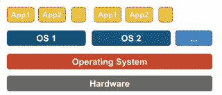
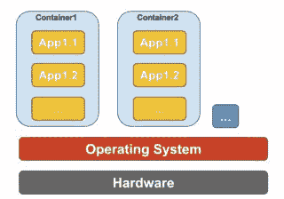
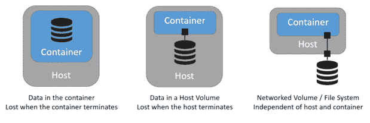
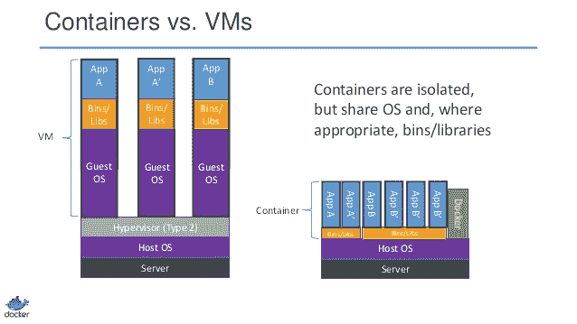

# Ace DevOps 面试的 30 个 Docker 面试问题

> 原文：<https://dev.to/fullstackcafe/30-docker-interview-questions-to-ace-devops-engineer-interview-2277>

[](https://res.cloudinary.com/practicaldev/image/fetch/s--0dH4YwN8--/c_limit%2Cf_auto%2Cfl_progressive%2Cq_auto%2Cw_880/https://images.unsplash.com/photo-1534630568132-3614115ca7d8%3Fixlib%3Drb-1.2.1%26ixid%3DeyJhcHBfaWQiOjEyMDd9%26auto%3Dformat%26fit%3Dcrop%26w%3D650%26q%3D60) 
随着应用程序容器市场的大幅增长(根据 451 Research 的预测，从 2016 年的 7.62 亿美元到 2020 年的 27 亿美元)，对容器技能的需求处于高位。Docker 的软件工程师、信息架构师和 DevOps 工程师的需求量非常大。

> 🔴最初发表于 [FullStack。咖啡馆-杀死你的技术&编码面试](https://www.fullstack.cafe/?utm_source=dev&utm_medium=blog)

### Q1:devo PS 的需求是什么？

> 题目:**devo PS**T2】难度:⭐

如今，公司不再发布大的功能集，而是尝试看看小的功能是否可以通过一系列的发布系列传递给他们的客户。这有许多优点，如客户的快速反馈，更好的软件质量等。这反过来导致了高客户满意度。为此，公司必须:

1.  增加部署频率
2.  降低新版本的失败率
3.  缩短修复之间的交付时间
4.  在新版本崩溃时，平均恢复时间更短

DevOps 满足所有这些需求，并帮助实现无缝软件交付。

🔗**来源:**【edureka.co】T2

### Q2:Docker 是什么？

> 主题:坞站
> 难点:□

*   Docker 是一个容器化平台，它以容器的形式将你的应用程序及其所有依赖项打包在一起，以确保你的应用程序可以在任何环境下无缝工作，无论是开发、测试还是生产。
*   Docker 容器将一个软件包装在一个完整的文件系统中，该文件系统包含运行所需的一切:代码、运行时、系统工具、系统库等。任何可以安装在服务器上的东西。
*   这保证了软件将总是相同地运行，而不管其环境如何。

🔗**来源:**【edureka.co】T2

### Q3:devo PS 有什么优点？

> 题目:**devo PS**T2】难度:⭐⭐

技术优势:

*   连续软件交付
*   要解决的不太复杂的问题
*   更快地解决问题

业务优势:

*   更快地交付功能
*   更稳定的操作环境
*   更多时间可用于增值(而不是修复/维护)

🔗**来源:**【edureka.co】T2

### Q4:CI(持续集成)服务器的功能是什么？

> 题目:**devo PS**T2】难度:⭐⭐

CI 服务器的功能是持续集成不同开发人员所做的所有更改并提交到存储库中，并检查编译错误。它需要一天构建几次代码，最好是在每次提交之后，这样，如果发生了中断，它就可以检测出是哪个提交导致了中断。

🔗**来源:**【linoxide.com】T2

### Q5:如何用 Docker 构建环境无关的系统？

> 主题:坞站
> 难点:□

有三个主要功能有助于实现这一目标:

*   卷
*   环境变量注入
*   只读文件系统

🔗**来源:**【rafalgolarz.com】T2

### Q6:docker 文件中的`COPY`和`ADD`命令有什么区别？

> 主题:坞站
> 难点:□

虽然`ADD`和`COPY`功能相似，但一般来说还是首选`COPY`。

那是因为它比 ADD 更透明。COPY 只支持将本地文件复制到容器中的基本操作，而 ADD 有一些不太明显的特性(比如仅本地的 tar 提取和远程 URL 支持)。因此，ADD 的最佳用途是将本地 tar 文件自动提取到映像中，如 ADD rootfs.tar.xz /中所示。

🔗**来源:**【stackoverflow.com】T2

### Q7:Docker 镜像是什么？

> 主题:坞站
> 难点:□

**Docker 镜像**是 Docker 容器的来源。换句话说，Docker 图像用于创建容器。图像是用 build 命令创建的，当用 run 启动时，它们将产生一个容器。图像存储在 Docker 注册表中，如`registry.hub.docker.com`因为它们可能会变得非常大，图像被设计为由其他图像的层组成，允许在网络上传输图像时发送最少量的数据。

🔗**来源:**【edureka.co】T2

### Q8:Docker 容器是什么？

> 主题:坞站
> 难点:□

**Docker 容器**包括应用程序及其所有依赖项，但与其他容器共享内核，在主机操作系统的用户空间中作为独立的进程运行。Docker 容器不依赖于任何特定的基础设施:它们可以在任何计算机、任何基础设施和任何云中运行。

🔗**来源:**【edureka.co】T2

### Q9:Docker hub 是什么？

> 主题:坞站
> 难点:□

Docker hub 是一种基于云的注册服务，它允许您链接到代码库，构建并测试您的映像，存储手动推送的映像，并链接到 Docker cloud，以便您可以将映像部署到您的主机。它为容器映像发现、分发和变更管理、用户和团队协作以及整个开发流程中的工作流自动化提供了一个集中的资源。

🔗**来源:**【edureka.co】T2

### Q10:Docker 容器在任何给定的时间点可以处于哪些不同的状态？

> 主题:坞站
> 难点:□

在任何给定的时间点，Docker 容器可以处于四种状态。这些状态如下所示:

*   运转
*   暂停
*   重新启动
*   激动的

🔗**来源:**【mindmajix.com】T2

### Q11:有没有识别 Docker 容器状态的方法？

> 主题:坞站
> 难点:□

我们可以通过运行命令
来识别 Docker 容器的状态

```
docker ps –a 
```

Enter fullscreen mode Exit fullscreen mode

这将依次列出所有可用的 docker 容器及其在主机上的相应状态。从那里，我们可以很容易地识别感兴趣的容器，以相应地检查其状态。

🔗**来源:**【mindmajix.com】T2

### Q12:docker file 中最常见的指令有哪些？

> 主题:坞站
> 难点:□

Dockerfile 中的一些常见指令如下:

*   **FROM** :我们使用 FROM 来设置后续指令的基础映像。在每个有效的 Dockerfile 文件中，FROM 是第一条指令。
*   **标签**:我们使用标签按照项目、模块、许可等来组织我们的图像。我们也可以使用标签来帮助自动化。在 LABEL 中，我们指定了一个键值对，稍后可以用它来以编程方式处理 docker 文件。
*   **RUN** :我们使用 RUN 命令在当前图像之上的新图层中执行任何指令。对于每个 RUN 命令，我们都在映像的顶部添加一些东西，并在 Dockerfile 的后续步骤中使用它。
*   **CMD** :我们使用 CMD 命令来提供正在执行的容器的默认值。在 Dockerfile 文件中，如果我们包含多个 CMD 命令，那么只使用最后一条指令。

🔗**来源:**【knowledgepowerhouse.com】T2

### Q13:什么类型的应用——无状态还是有状态更适合 Docker 容器？

> 主题:坞站
> 难点:□

最好为 Docker 容器创建无状态应用程序。我们可以在应用程序之外创建一个容器，并从应用程序中取出可配置的状态参数。现在，我们可以用不同的参数在生产和 QA 环境中运行相同的容器。这有助于在不同的场景中重用相同的图像。此外，无状态应用程序比有状态应用程序更容易使用 Docker 容器进行扩展。

🔗**来源:**【mindmajix.com】T2

### Q14:解释 Docker 的基本使用流程

> 主题:坞站
> 难点:□

1.  一切都从 **Dockerfile** 开始。Dockerfile 是图像的源代码。
2.  一旦创建了 Dockerfile，您就可以构建它来创建容器的**图像**。该映像只是“源代码”的“编译版本”，即 docker 文件。
3.  一旦有了容器的映像，就应该使用**注册表**重新分发它。注册中心就像一个 git 存储库——你可以推和拉图片。
4.  接下来，您可以使用该映像来运行**容器**。运行中的容器在许多方面与虚拟机非常相似(但没有管理程序)。

```
 +------------+  docker build   +--------------+  docker run -dt   +-----------+  docker exec -it   +------+
    | Dockerfile | --------------> |    Image     | --------------->  | Container | -----------------> | Bash |
    +------------+                 +--------------+                   +-----------+                    +------+
                                     ^
                                     | docker pull
                                     |
                                   +--------------+
                                   |   Registry   |
                                   +--------------+ 
```

Enter fullscreen mode Exit fullscreen mode

🔗**来源:**【stackoverflow.com】T2

### Q15:Docker 图像和图层有什么区别？

> 主题:坞站
> 难点:□

*   **图像**:Docker 图像由一系列**只读**层构建而成
*   **层**:每一层代表图像 Dockerfile 中的一条指令。

下面的 docker 文件包含四个命令，每个命令创建一个层。

```
FROM ubuntu:15.04
COPY . /app
RUN make /app
CMD python /app/app.py 
```

Enter fullscreen mode Exit fullscreen mode

重要的是，每一层都只是与前一层的一组差异。

🔗**来源:**【stackoverflow.com】T2

### Q16:什么是虚拟化？

> 主题:坞站
> 难点:□

在其构想的形式中，**虚拟化**被认为是一种逻辑划分大型机以允许多个应用程序同时运行的方法。然而，当公司和开源社区能够以某种方式提供处理特权指令的方法，并允许多个操作系统在单个基于 x86 的系统上同时运行时，情况发生了巨大的变化。

实际效果是，虚拟化允许您在相同的硬件上运行两个完全不同的操作系统。每个客户操作系统都要经历引导、加载内核等过程。你可以有非常严格的安全性，例如，客户操作系统不能完全访问主机操作系统或其他客户操作系统，把事情弄糟。

虚拟化方法可以根据它如何将硬件模拟为客户操作系统并模拟客户操作环境来分类。主要有三种类型的虚拟化:

*   竞争
*   半虚拟化
*   基于容器的虚拟化

🔗**来源:**【stackoverflow.com】T2

### Q17:什么是 Hypervisor？

> 主题:坞站
> 难点:□

**虚拟机管理程序**负责创建虚拟环境，来宾虚拟机在该环境中运行。它监督来宾系统，并确保根据需要将资源分配给来宾。虚拟机管理程序位于物理机和虚拟机之间，为虚拟机提供虚拟化服务。为了实现这一点，它拦截虚拟机上的客户操作系统操作，并模拟主机操作系统上的操作。

虚拟化技术(主要是在云中)的快速发展进一步推动了虚拟化的使用，它允许借助 Xen、VMware Player、KVM 等虚拟机管理程序在单个物理服务器上创建多个虚拟服务器。，并在商用处理器中整合硬件支持，如英特尔 VT 和 AMD-V。

🔗**来源:**【stackoverflow.com】T2

### Q18:Docker Swarm 是什么？

> 主题:坞站
> 难点:□

**Docker Swarm** 是 Docker 的原生集群。它将一个 Docker 主机池转变为一个虚拟 Docker 主机。Docker Swarm 提供标准的 Docker API，任何已经与 Docker 守护进程通信的工具都可以使用 Swarm 透明地扩展到多个主机。

🔗**来源:**【edureka.co】T2

### Q19:你将如何在生产中监控 Docker？

> 主题:坞站
> 难点:□

docker 提供了像 docker stats 和 docker events 这样的工具来监控生产中的 Docker。我们可以使用这些命令获得重要统计数据的报告。

*   **Docker stats** :当我们用容器 id 调用 Docker stats 时，我们得到容器的 CPU、内存使用情况等。它类似于 Linux 中的 top 命令。
*   **Docker 事件** : Docker 事件是一个命令，用于查看 Docker 守护进程中正在进行的活动流。

一些常见的 Docker 事件有:附加、提交、终止、分离、重命名、销毁等。我们还可以使用各种选项来限制或过滤我们感兴趣的事件。

🔗**来源:**【knowledgepowerhouse.com】T2

### Q20:什么是孤立卷，如何删除？

> 主题:坞站
> 难点:□

孤立卷是指没有附加任何容器的卷。先前的 Docker v. 1.9 很难移除它。

🔗**来源:**【rafalgolarz.com】T2

### Q21:什么是半虚拟化？

> 主题:坞站
> 难点:□

**半虚拟化**，也称为第 1 类虚拟机管理程序，直接在硬件或“裸机”上运行，并直接向在其上运行的虚拟机提供虚拟化服务。它有助于操作系统、虚拟化硬件和真实硬件协作以实现最佳性能。这些虚拟机管理程序通常占用空间很小，本身不需要大量资源。

[](https://res.cloudinary.com/practicaldev/image/fetch/s--XMMLLX1E--/c_limit%2Cf_auto%2Cfl_progressive%2Cq_auto%2Cw_880/https://i.stack.imgur.com/oPO6Um.png)

这一类的例子包括 Xen、KVM 等。

🔗**来源:**【stackoverflow.com】T2

### Q22:Docker 和虚拟机有什么不同？

> 主题:坞站
> 难点:□

Docker 不是一种虚拟化方法。它依赖于其他工具，这些工具实际上实现了**基于容器的虚拟化**或操作系统级虚拟化。为此，Docker 最初使用 LXC 驱动程序，然后转移到`libcontainer`，现在更名为`runc`。Docker 主要关注应用程序容器中应用程序的自动化部署。应用程序容器被设计用来打包和运行单个服务，而系统容器被设计用来运行多个进程，比如虚拟机。因此，Docker 被认为是容器化系统上的容器管理或应用程序部署工具。

[](https://res.cloudinary.com/practicaldev/image/fetch/s--S_7MN3S1--/c_limit%2Cf_auto%2Cfl_progressive%2Cq_auto%2Cw_880/https://i.stack.imgur.com/qTuWpm.png)

*   与虚拟机不同，容器不需要引导操作系统内核，因此可以在不到一秒的时间内创建容器。这个特性使得基于容器的虚拟化比其他虚拟化方法更独特、更受欢迎。
*   因为基于容器的虚拟化很少或不增加主机的开销，所以基于容器的虚拟化具有接近本机的性能
*   与其他虚拟化不同，基于容器的虚拟化不需要额外的软件。
*   主机上的所有容器共享主机的调度程序，节省了额外的资源需求。
*   与虚拟机映像相比，容器状态(Docker 或 LXC 映像)的大小较小，因此容器映像易于分发。
*   容器中的资源管理是通过 cgroups 实现的。Cgroups 不允许容器消耗多于分配给它们的资源。然而，截至目前，主机的所有资源在虚拟机中都是可见的，但不能使用。这可以通过在容器和主机上同时运行 top 或 htop 来实现。所有环境的输出看起来都相似。

🔗**来源:**【stackoverflow.com】T2

### Q23:能解释一下 dockerfile ONBUILD 指令吗？

> 主题:坞站
> 难点:□

`ONBUILD`指令向映像添加一个触发指令，当映像用作另一个构建的基础时，该指令将在以后执行。如果您正在构建一个映像，该映像将用作构建其他映像的基础，例如可以使用特定于用户的配置进行定制的应用程序构建环境或守护程序，这将非常有用。

🔗**来源:**【stackoverflow.com】T2

### Q24:在 Docker 上运行有状态应用是好的做法吗？Docker 最适合的场景有哪些？

> 主题:坞站
> 难点:□

statefull docker 应用程序的问题在于，默认情况下，它们将状态(数据)存储在容器文件系统中。一旦你更新了你的软件版本或者想转移到另一台机器上，就很难从那里获取数据。

您需要做的是将一个卷绑定到容器，并将任何数据存储在该卷中。

[](https://res.cloudinary.com/practicaldev/image/fetch/s--g9Velu-B--/c_limit%2Cf_auto%2Cfl_progressive%2Cq_auto%2Cw_880/https://images.techhive.cimg/article/2016/08/containerizingstatefulapps-1-100676361-large.idge.png)

如果用`docker run -v hostFolder:/containerfolder`运行容器，那么对`/containerfolder`的任何更改都将保存在`hostfolder`上。nfs 驱动器也可以做类似的事情。然后，您可以在任何主机上运行您的应用程序，状态将保存在 nfs 驱动器中。

🔗**来源:**【stackoverflow.com】T2

### Q25:可以在 Windows 上原生运行 Docker 容器吗？

> 主题:坞站
> 难点:□

借助 Windows Server 2016，您可以在 Windows 上原生运行 Docker 容器，借助 Windows Nano Server，您将拥有一个在容器内运行的轻量级操作系统，因此您可以运行。NET 应用程序。

🔗**来源:**【rafalgolarz.com】T2

### Q26:Docker 如何在非 Linux 系统中运行容器？

> 主题:坞站
> 难点:□

Linux 内核版本 2.6.24 中添加的名称空间特性使得容器的概念成为可能。容器向每个进程添加它的 ID，并向每个系统调用添加新的访问控制检查。它由 clone()系统调用访问，该调用允许创建以前全局命名空间的单独实例。

如果容器因为 Linux 内核中的特性而成为可能，那么显而易见的问题是非 Linux 系统如何运行容器。Mac 和 Windows 的 Docker 都使用 Linux 虚拟机来运行容器。Docker 工具箱用于在虚拟机器中运行容器。但是，最新的 Docker 在 Windows 中使用 Hyper-V，在 Mac 中使用 Hypervisor.framework。

🔗**来源:**【stackoverflow.com】T2

### Q27:容器在底层是如何工作的？

> 主题:坞站
> 难点:□

大约在 2006 年，人们包括 Google 的一些员工实现了新的 Linux 内核级特性，称为 namespaces(然而这个想法很久以前就存在于 FreeBSD 中)。操作系统的一个功能是允许进程共享全局资源，如网络和磁盘。如果这些全局资源被包装在名称空间中，以便它们仅对运行在同一名称空间中的那些进程可见，会怎么样？比方说，你可以得到一块磁盘，把它放在名称空间 X 中，然后在名称空间 Y 中运行的进程就看不到或访问不到它。类似地，命名空间 X 中的进程不能访问分配给命名空间 y 的内存中的任何内容。当然，X 中的进程不能看到命名空间 y 中的进程，也不能与命名空间 y 中的进程对话。这为全局资源提供了某种虚拟化和隔离。

这就是 **Docker** 的工作方式:每个容器在自己的名称空间中运行，但使用与所有其他容器完全相同的内核。发生隔离是因为内核知道分配给进程的名称空间，并且在 API 调用期间，它确保进程只能访问自己名称空间中的资源。

[](https://res.cloudinary.com/practicaldev/image/fetch/s--KklrYXgX--/c_limit%2Cf_auto%2Cfl_progressive%2Cq_auto%2Cw_880/https://i.stack.imgur.com/pG94I.png)

🔗**来源:**【stackoverflow.com】T2

### Q28:说出容器和虚拟机的一些限制

> 主题:坞站
> 难点:□

仅举几个例子:

*   你不能像在虚拟机中一样在容器中运行完全不同的操作系统。然而，你可以运行不同的 Linux 发行版，因为它们共享相同的内核。隔离级别没有 VM 中的那么强。事实上，在早期实现中，有一种方法可以让“来宾”容器接管主机。
*   您还可以看到，当您加载新容器时，整个新的操作系统副本不会像在虚拟机中那样启动。
*   所有容器共享同一个内核。这就是集装箱重量轻的原因。
*   与虚拟机不同的是，您不必为容器预先分配大量内存，因为我们不运行新的操作系统副本。这使得能够在一个操作系统上运行数千个容器，同时将它们沙盒化，如果我们在自己的虚拟机上运行单独的操作系统副本，这可能是不可能的。

🔗**来源:**【stackoverflow.com】T2

### Q29:多环境下如何使用 Docker？

> 主题:坞站
> 难点:□

您几乎肯定希望对您的应用程序配置进行更改，使其更适合实际环境。这些变化可能包括:

*   删除应用程序代码的任何卷绑定，以便代码保留在容器内，不能从外部更改
*   绑定到主机上的不同端口
*   以不同方式设置环境变量(例如，降低日志记录的详细程度，或者启用电子邮件发送)
*   指定重启策略(例如，重启:总是)以避免停机
*   添加额外的服务(例如，日志聚合器)

出于这个原因，您可能想要定义一个额外的组合文件，比如说`production.yml`，它指定适合生产的配置。这个配置文件只需要包含您想要对原始合成文件进行的更改。

```
docker-compose -f docker-com 
```

Enter fullscreen mode Exit fullscreen mode

🔗**来源:**【stackoverflow.com】T2

### Q30:为什么 Docker compose 不等待容器准备好，就开始依赖顺序中的下一个服务？

> 主题:坞站
> 难点:□

Compose 总是按照依赖顺序启动和停止容器，其中依赖关系由`depends_on`、`links`、`volumes_from`和`network_mode`决定:“服务:……”。

然而，对于启动，Compose 不会等到容器“就绪”(无论这对于您的特定应用程序意味着什么)，而是等到它正在运行。这有一个很好的理由:

*   例如，等待数据库准备就绪的问题实际上只是一个更大的分布式系统问题的子集。在生产中，您的数据库随时可能变得不可用或移动主机。您的应用程序需要对这些类型的故障具有弹性。
*   要解决这个问题，请将您的应用程序设计为在失败后尝试重新建立到数据库的连接。如果应用程序重试连接，它最终可以连接到数据库。
*   最好的解决方案是在应用程序代码中执行这种检查，无论是在启动时还是在由于任何原因失去连接时。

🔗**来源:**【docs.docker.com】T2

> 谢谢🙌阅读，祝你面试好运！
> *如果你喜欢这篇文章，请分享给你的开发者伙伴！*
> *查看更多全栈面试问题&答案上👉[www . full stack . cafe](https://www.fullstack.cafe)T9】*