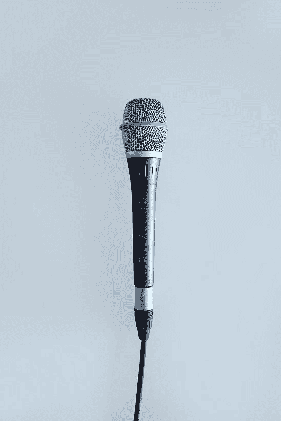
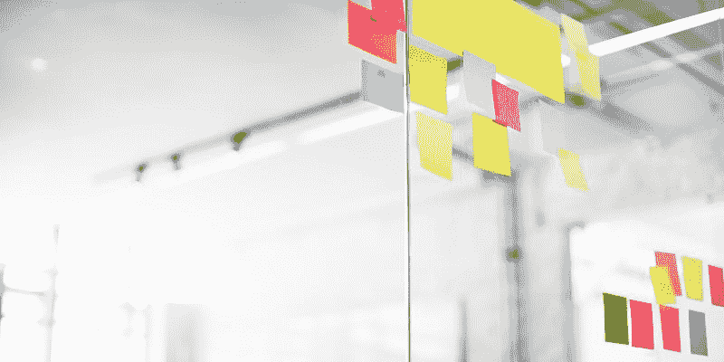

# DevFestZA:使用动画让您的 Android 应用程序变得栩栩如生(第 1 部分)

> 原文：<https://dev.to/pabiforbes/devfestza-bringing-your-android-application-to-life-using-animations-part-1-173p>

dev festza
dev fest 的南非站在约翰内斯堡举办，非常精彩。我为 CFP(征集提案)提交了一个主题，必须是关于谷歌技术的。我的主题是*用动画让你的 Android 应用变得生动。我非常紧张，因为这是我第一次谈论 Android。我只是对自己说:*房间里会有 Android 专业人员，他们可能比我更有经验，他们能从我这里学到什么？我的行动计划是分享我对动画的了解。类似于我们写编码时的经历，但这一次，它不是一篇博文，而是一次演讲。**

我选择动画是因为:

*   我慢慢开始探索动画
*   这将是一个我乐于谈论的话题
*   动画很有趣，我们几乎可以在我们的 Android 应用程序中制作任何动画
*   动画经常被忽视

**计划好一切**

我用我的博客文章规划技巧来帮助引导我的演讲结构。该技术的规划步骤如下:

1.  简介(这可能是一个背景故事，说明为什么创建该内容或您试图解决的问题。)
2.  正文(正文将包含大部分内容，也可能包括解决引言中所述问题的步骤。)
3.  结论(你可以在结论中陈述你的最终想法，甚至可以陈述你在解决问题时学到的经验。)

考虑到这一点，我计划如下展开我关于动画的演讲:

*   什么是动画？
*   他们扮演什么角色？
*   如何使用动画？
*   什么时候使用动画？

**内容**
当我们创建应用程序时，我们很少创建供自己单独使用的应用程序。我们希望创建实用且视觉上吸引人的应用程序。人们每天都与手机互动。手机已经成为我们的随身设备。人们在与手机互动时，自然会期待某种形式的反馈。

反馈至关重要。

使用动画是提供反馈的好方法。对象响应我们的交互&人们期望应用程序元素有类似的响应水平。动画添加了视觉提示，通知用户应用程序中正在发生的事情。当用户界面改变状态时，动画特别有用；例如当内容加载或新动作变得可用时。

Vision 使用了术语*功能动画*:“功能动画是微妙的动画类型，具有清晰的逻辑目的。”
这并不意味着每个元素都应该是动画。动画应该是有意义的，并用来提供保证。

在第 2 部分，我们将探索 Android 动画，我将分享一些有用的链接。

Unsplash 上由设计生态学家设计的封面图像
Unsplash 上由 rawpixel 设计的便笺图像