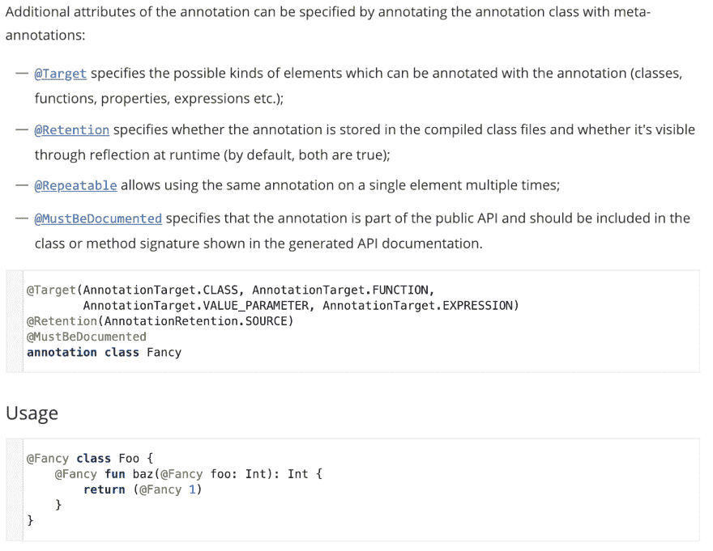

# merry Annotation——您在 Kotlin Android 中的第一个注释处理器

> 原文：<https://dev.to/thedroidboy/merryannotationyour-first-annotation-processor-in-kotlin-android-kni>

[最初发表在媒体上。](https://medium.com/@navendra/merryannotation-your-first-annotation-processor-in-kotlin-android-eb3af4ab3402)

假期给了我们很好的休息时间来放松和反思过去的一年，并为新的一年做准备。对我来说，这一年有很多事情要做，我开始了 Android 开发，爱上了 Kotlin，在计算机历史博物馆参加了我的第一次 AndroidDevSummit，这也是 Android 的 10 周年庆典，最重要的是遇到了很多了不起的人&结交了一些新的好朋友。很长一段时间以来，我想开发一个定制的注释处理器，作为它在 android 中的礼物。我终于开发了一个，在这个过程中学到了很多东西，我很高兴分享我的学习。

Android 充满了注释，无论是简单的@Override 还是 ButterKnife 的@BindView。注释和代码生成让我们的生活变得更加轻松。它有助于 DRY 原则(不要重复你自己)，并帮助我们轻松快速地开发一个更好的应用程序。在本文中，我们将学习一个用 Kotlin 为 Android 应用程序编写的基本注释处理器。我们也将自己生成代码，而不使用任何定制库，如 KotlinPoet 或 JavaPoet。让我们开始吧…

### 了解注释处理的工作原理

注释是元数据。我们可以通过在任何类、方法或参数前面添加@来向它们添加注释元数据。Java 编译器进行彻底的搜索，找到项目中所有由我们的注释标注的元素，并将其传递给注释处理器进行处理。
注释处理器获取所有带注释的元素、它们的类型和流程环境。
注释处理器然后处理接收到的元素，在我们的例子中，我们生成所需的类文件。

参考文献更详细的解释:
*[注释处理在一个科特林世界](https://www.youtube.com/watch?v=a2RoLFzrFG0)由[亨利·扎克·斯维尔斯](https://twitter.com/pandanomic)*
*[注释处理样板文件销毁](https://www.youtube.com/watch?v=dOcs-NKK-RA)由[杰克·沃顿](https://twitter.com/JakeWharton)*

### 注释—概述

在 MerryAnnotation 中，我们将通过注释一个 Greeter 类来生成“圣诞快乐”的问候。我们的主要活动如下:

```
package io.navendra.merryannotation

import android.support.v7.app.AppCompatActivity
import android.os.Bundle
import io.navendra.annotation.GreetingGenerator
import kotlinx.android.synthetic.main.activity_main.*

class MainActivity : AppCompatActivity() {

    val TAG = MainActivity::class.java.simpleName

    @GreetingGenerator
    class Santa

    override fun onCreate(savedInstanceState: Bundle?) {
        super.onCreate(savedInstanceState)
        setContentView(R.layout.activity_main)
        val textView = greetingView
        textView.text = Generated_Santa().greeting()
    }
} 
```

如你所见，我们在第 13 行创建了一个**“class Santa”**，并用我们的自定义 **@GreetingGenerator** 注释对其进行了注释。然后，我们在第 19 行使用**“Generated _ Santa”**类的 **greeting()** 方法，并用返回的问候语设置 textView 文本。
**“Generated _ Santa class”**在运行时自动生成，带有返回字符串的方法 greeting()。这是我们的最终目标！

### Github 链接

[如果你想直接跳到完整的源代码，请访问这里](https://github.com/navi25/MerryAnnotation)。
否则，请浏览整个博客，一步一步地使用 Kotlin 实现定制注释处理器。

### 创建注释和代码生成模块

我们将以多模块的形式开展工作。按照以下步骤在 Android Studio 中设置一个多模块项目。

*   在 Android Studio 中创建新项目，并检查 Kotlin 支持。
*   从文件>新建>新建模块> Java 库创建一个新模块。
*   将 Java 库命名为“annotation”。在本模块中，我们将在本模块中包含所有自定义注释。
*   重复以上步骤，创建一个新模块，命名为“codegen”。我们将在这里包含所有的代码生成逻辑。在这个阶段，我们有四个 build.gradle 文件——app、annotation、codegen 和 project。如下所示修改它们

**build.gradle(模块:app)**

```
apply plugin: 'kotlin-kapt'
dependencies {
    ...
    implementation project(':annotation')
    kapt project(':codegen')
} 
```

**build.gradle(模块:注释)**

```
apply plugin: 'kotlin'

dependencies {
    implementation fileTree(dir: 'libs', include: ['*.jar'])
    implementation "org.jetbrains.kotlin:kotlin-stdlib-jdk7:$kotlin_version"
}

sourceCompatibility = "7"
targetCompatibility = "7"

repositories {
    mavenCentral()
}
compileKotlin {
    kotlinOptions {
        jvmTarget = "1.8"
    }
}
compileTestKotlin {
    kotlinOptions {
        jvmTarget = "1.8"
    }
} 
```

build.gradle(模块:codegen)

```
apply plugin: 'kotlin'
apply plugin: 'kotlin-kapt'

kapt {
    generateStubs = true
}

sourceSets {
    main {
        java {
            srcDir "${buildDir.absolutePath}/tmp/kapt/main/kotlinGenerated/"
        }
    }
}

dependencies {
    kapt project(":annotation")
    compileOnly project(':annotation')
    implementation fileTree(include: ['*.jar'], dir: 'libs')
    implementation "org.jetbrains.kotlin:kotlin-stdlib-jdk7:$kotlin_version"

    // configuration generator for service providers
    implementation "com.google.auto.service:auto-service:1.0-rc4"
    kapt "com.google.auto.service:auto-service:1.0-rc4"

}

sourceCompatibility = "7"
targetCompatibility = "7" 
```

让我们明白我们在这里做什么。在我们的 app 模块中，我们已经为注释模块添加了依赖项，并为作为我们定制注释处理器的 **codegen** 模块使用了 **kapt** (Kotlin 注释处理器)。
对于**注释**和 **codegen** 模块 build.gradle 我们刚刚把它从 Java-library 转换到 Kotlin 库。在 Codegen 中，我们还添加了 AutoService 依赖项来链接服务。

### 在标注模块中创建我们的自定义标注

在注释模块中创建一个新的 Kotlin 文件，并将其命名为 GreetingGenerator。Kotlin 对注释类有很好的支持，我们将使用 Kotlin 的注释类来创建我们的自定义注释，如下所示:

```
//GreetingGenerator.kt 

package io.navendra.annotation

/**
 * Custom Annotation class
 * For more information check - "https://kotlinlang.org/docs/reference/annotations.html"
 */

@Target(AnnotationTarget.CLASS)
@Retention(AnnotationRetention.SOURCE)
@MustBeDocumented
annotation class GreetingGenerator 
```

这里，我们创建了一个新的注释类 GreetingGenerator，它具有所需的属性。附加属性描述如下。(无耻的抄袭了 Kotlin Docs。可以在这里找到[。)](https://kotlinlang.org/docs/reference/annotations.html)

[](https://res.cloudinary.com/practicaldev/image/fetch/s--r-tvQgXH--/c_limit%2Cf_auto%2Cfl_progressive%2Cq_auto%2Cw_880/https://cdn-images-1.medium.com/max/1600/1%2AIFLBbkyAXhU8Oo5Yr9Sf-Q.png)

### 在 CodeGen 模块中创建我们的自定义注释处理器

在 codegen 模块中创建一个新的 Kotlin 文件，并将其命名为 FileGenerator。创建一个新类 FileGenerator，并从 AnnotationProcesor 类扩展它，它将为我们提供对生成代码有用的环境数据。

```
package io.navendra.codegen

import com.google.auto.service.AutoService
import io.navendra.annotation.GreetingGenerator
import io.navendra.codegen.simplePoet.KotlinClassBuilder
import java.io.File
import javax.annotation.processing.*
import javax.lang.model.SourceVersion
import javax.lang.model.element.TypeElement

@AutoService(Processor::class) // For registering the service
@SupportedSourceVersion(SourceVersion.RELEASE_8) // to support Java 8
@SupportedOptions(FileGenerator.KAPT_KOTLIN_GENERATED_OPTION_NAME)
class FileGenerator : AbstractProcessor(){

    override fun getSupportedAnnotationTypes(): MutableSet<String> {
        return mutableSetOf(GreetingGenerator::class.java.name)
    }

    override fun getSupportedSourceVersion(): SourceVersion {
        return SourceVersion.latest()
    }

    override fun process(set: MutableSet<out TypeElement>?, roundEnvironment: RoundEnvironment?): Boolean {

        roundEnvironment?.getElementsAnnotatedWith(GreetingGenerator::class.java)
            ?.forEach {
                val className = it.simpleName.toString()
                val pack = processingEnv.elementUtils.getPackageOf(it).toString()
                generateClass(className, pack)
            }
        return true
    }

    private fun generateClass(className: String, pack: String){
        val fileName = "Generated_$className"
        val fileContent = KotlinClassBuilder(fileName,pack).getContent()

        val kaptKotlinGeneratedDir = processingEnv.options[KAPT_KOTLIN_GENERATED_OPTION_NAME]
        val file = File(kaptKotlinGeneratedDir, "$fileName.kt")

        file.writeText(fileContent)
    }

    companion object {
        const val KAPT_KOTLIN_GENERATED_OPTION_NAME = "kapt.kotlin.generated"
    }

} 
```

让我们看看我们在这里做什么。

**流程()方法**

*   这是该类最重要的方法之一，在这里我们写出我们的处理逻辑。重写此方法。我们在方法中接收 RoundEnvironment，我们将使用该方法获取用 GreetingGenerator 批注批注的所有元素，如下行所示:

```
roundEnvironment
    ?.getElementsAnnotatedWith(GreetingGenerator::class.java) 
```

*   这给了我们一个用注释标注的元素列表。然后，对于每个元素，我们将获得类名、包名，然后生成 class，这是我们的自定义函数，用于在编译时生成代码，如下面几行所示:

```
?.forEach {                
    val className = it.simpleName.toString()                
    val pack = processingEnv.elementUtils
                     .getPackageOf(it).toString()
    generateClass(className, pack)            
} 
```

**生成类方法**

在这个方法中，我们编写逻辑来生成我们的类。首先，我们获取 fileName 并使用我们的自定义 **KotlinClassBuilder** 类来生成所需的文件内容，如下所示:

```
val fileName = "Generated_$className"        
val fileContent = KotlinClassBuilder(fileName,pack).getContent() 
```

然后，我们获取目标目录，并在该目录中使用以前获取的文件内容创建一个新文件，如下所示:

```
val kaptKotlinGeneratedDir = processingEnv
                         .options[KAPT_KOTLIN_GENERATED_OPTION_NAME]        
val file = File(kaptKotlinGeneratedDir, "$fileName.kt")         file.writeText(fileContent) 
```

KAPT 科特林 _ 生成 _ 选项 _ 名称在组件对象中定义为“kapt .科特林.生成”, kapt 将从该目录编译所有文件和主源代码。

在这里，我们可以使用任何代码生成器库(如 KotlinPoet)生成我们的文件内容，但出于学习目的，让我们也构建一个简单的代码生成器。

### KotlinClassBuilder——我们定制的代码生成器

创建一个 KotlinClassBuilder 类并添加 getContent()方法，该方法返回所需的 fileContent 字符串，如下所示:

```
package io.navendra.codegen.simplePoet

/**
 * Custom Kotlin Class Builder which returns file content string
 * This is for learning purpose only.
 * Use KotlinPoet for production app
 * KotlinPoet can be found at https://github.com/square/kotlinpoet
 */
class KotlinClassBuilder(className: String,
                         packageName:String,
                         greeting:String = "Merry Christmas!!"){

    private val contentTemplate = """
        package $packageName
        class $className {
             fun greeting() = "$greeting"
        }
    """.trimIndent()

    fun getContent() : String{

        return contentTemplate

    }

} 
```

这里，我们添加了 className、package 和 greeting 作为构造函数变量，并使用它们来生成文件内容。正如我们所知，我们需要生成下面的最终类:

```
package <package_name>
class <class_name> {
    fun greeting() = "<greeting>"
} 
```

在这个 **KotlinClassBuilder** 中，我们使用了字符串模板，并通过传递适当的包名、类名和问候语生成了上面的字符串。

### 打跑

最后点击 build 并检查 **app > build >生成的> kaptKotlin > debug** ，它会根据需要包含我们生成的类— Generated_Hello()。

现在点击 run，你将会看到一个带有文本视图的活动，上面写着“圣诞快乐！!"。

编码快乐&圣诞快乐！