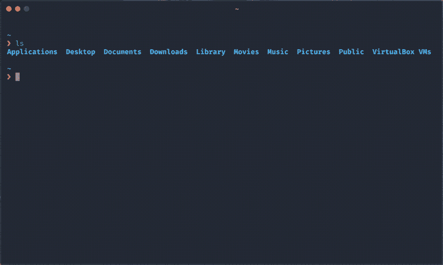

# 列岛 v3 出来了！

> 原文：<https://dev.to/pezza/archipelago-v3-is-out-2a0e>

Archipelago 是一个受 [Hyper](https://github.com/zeit/hyper) 启发的终端。我开始使用 Hyper 作为我的默认终端，当时它还在测试阶段，现在是 v1。这是迄今为止我用过的最酷、最好看、最小、可扩展的终端模拟器。但是，我发现它真的很慢，如果我要运行一个我知道会有很多输出的命令，我会选择使用不同的终端。此外，偶尔缓冲区会重叠，使终端不可读，并迫使我重新启动。

当时 Hyper 正在使用 [Hterm](https://github.com/chromium/hterm) ，这是我所有问题的罪魁祸首，但后来我听说了 [Xterm.js](https://xtermjs.org/) 项目，该项目正由 [SourceLair](https://www.sourcelair.com/home) 使用，而微软正在 [VSCode](https://code.visualstudio.com) 中使用它。Xterm.js 解决了我遇到的所有问题，所以一年多前我开始制作 Archipelago。一些突出的功能包括:

*   制表符(如果你只使用像 TMUX 这样的多路复用器，你也可以禁用制表符)
*   可以拆分和调整大小的窗格
*   跨平台(macOS、Linux 和 Windows)
*   可以保存到配置文件的主题
*   简易设置配置
*   在回卷中搜索
*   可以从任何地方调用的遮阳板窗口
*   一套系统测试

访问[archipelago.pezza.co](https://archipelago.pezza.co)查看更多 gif 或[下载](https://archipelago-terminal.herokuapp.com/download)现在就试试吧！