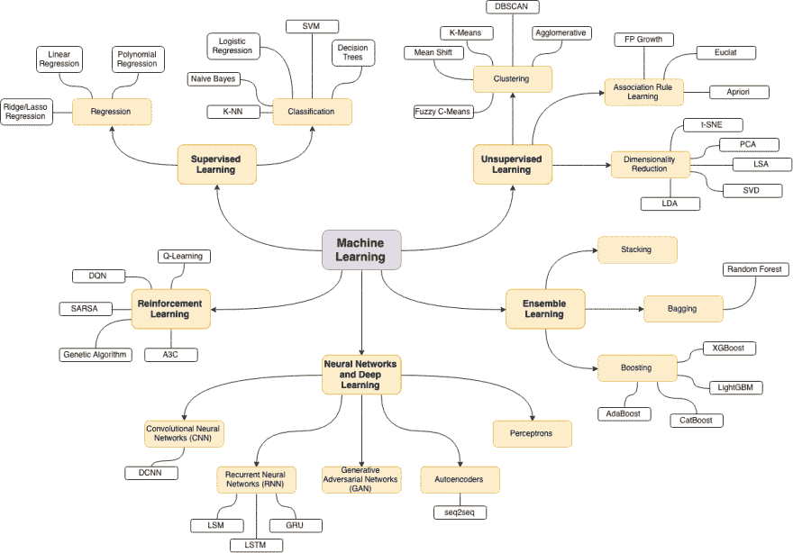

# Python 中的自制机器学习

> 原文：<https://dev.to/trekhleb/homemade-machine-learning-in-python-4gbj>

*<small>[Image source](https://vas3k.ru/blog/machine_learning/)</small>*

我最近推出了 [**自制的机器学习**](https://github.com/trekhleb/homemade-machine-learning) 知识库，其中包含用 **Python** 实现的流行的机器学习算法和方法(如*线性/逻辑回归、K 均值聚类、神经网络*)的例子，并解释了它们背后的数学原理。每种算法都有交互式的 **Jupyter 笔记本**演示，允许您使用训练数据、算法配置，并立即在您的浏览器中看到结果、图表和预测**。在大多数情况下，这些解释都是基于[吴恩达](https://www.coursera.org/learn/machine-learning)[教授的](https://medium.com/@andrewng)这门伟大的机器学习课程。**

存储库的目的*不是*通过使用第三方库“一行程序”*来实现机器学习算法，而是*从头开始练习实现这些算法，并更好地理解每个算法背后的数学。这就是为什么所有的算法实现都叫“自制”。

那里使用的主要 Python 库是 [NumPy](http://www.numpy.org/) 和 [Pandas](https://pandas.pydata.org/) 。这两个用于高效的矩阵运算和加载/解析 CSV 数据集。当谈到 [Jupyter 笔记本](http://jupyter.org/)演示时，像 [Matplotlib](https://matplotlib.org/) 和 [Plotly](https://plot.ly/) 这样的库被用于数据可视化。

目前涵盖了以下主题:

#### 回归:线性回归

在回归问题中，我们做真实值预测。基本上我们尝试沿着训练样本画一条线/平面/n 维平面。

*使用实例:股票价格预测、销售分析、任意数的依赖等。*

*   📗[线性回归数学](https://github.com/trekhleb/homemade-machine-learning/blob/master/homemade/linear_regression) —理论和进一步阅读的链接
*   ⚙️ [线性回归实现示例](https://github.com/trekhleb/homemade-machine-learning/blob/master/homemade/linear_regression/linear_regression.py)
*   ▶️ [演示|一元线性回归](https://nbviewer.jupyter.org/github/trekhleb/homemade-machine-learning/blob/master/notebooks/linear_regression/univariate_linear_regression_demo.ipynb) —通过`economy GDP`预测`country happiness`分数
*   ▶️ [演示|多元线性回归](https://nbviewer.jupyter.org/github/trekhleb/homemade-machine-learning/blob/master/notebooks/linear_regression/multivariate_linear_regression_demo.ipynb) —通过`economy GDP`和`freedom index`预测`country happiness`分数
*   ▶️ [演示|非线性回归](https://nbviewer.jupyter.org/github/trekhleb/homemade-machine-learning/blob/master/notebooks/linear_regression/non_linear_regression_demo.ipynb) —使用具有*多项式*和*正弦曲线*特征的线性回归来预测非线性相关性。

#### 分类:逻辑回归

在分类问题中，我们根据某些特征来划分输入样本。

用法示例:垃圾邮件过滤器、语言检测、查找相似文档、手写字母识别等。

*   📗[逻辑回归数学](https://github.com/trekhleb/homemade-machine-learning/blob/master/homemade/logistic_regression) —理论和进一步阅读的链接
*   ⚙️ [逻辑回归实现示例](https://github.com/trekhleb/homemade-machine-learning/blob/master/homemade/logistic_regression/logistic_regression.py)
*   ▶️ [演示|逻辑回归(线性边界)](https://nbviewer.jupyter.org/github/trekhleb/homemade-machine-learning/blob/master/notebooks/logistic_regression/logistic_regression_with_linear_boundary_demo.ipynb) —根据`petal_length`和`petal_width`预测鸢尾花`class`
*   ▶️ [演示|逻辑回归(非线性边界)](https://nbviewer.jupyter.org/github/trekhleb/homemade-machine-learning/blob/master/notebooks/logistic_regression/logistic_regression_with_non_linear_boundary_demo.ipynb) —根据`param_1`和`param_2`预测微芯片`validity`
*   ▶️ [演示|多元逻辑回归](https://nbviewer.jupyter.org/github/trekhleb/homemade-machine-learning/blob/master/notebooks/logistic_regression/multivariate_logistic_regression_demo.ipynb) —从`28x28`像素图像中识别手写数字。

#### 聚类:K 均值算法

在聚类问题中，我们通过未知特征来分割训练样本。算法本身决定使用什么特征进行分割。

*使用示例:市场细分、社交网络分析、组织计算集群、天文数据分析、图像压缩等。*

*   📗K-means 算法数学——理论和进一步阅读的链接
*   ⚙️ [K-means 算法实现示例](https://github.com/trekhleb/homemade-machine-learning/blob/master/homemade/k_means/k_means.py)
*   ▶️ [演示| K-means 算法](https://nbviewer.jupyter.org/github/trekhleb/homemade-machine-learning/blob/master/notebooks/k_means/k_means_demo.ipynb) —根据`petal_length`和`petal_width`将鸢尾花分成簇

#### 神经网络:多层感知器(MLP)

神经网络本身不是一种算法，而是许多不同的机器学习算法共同工作和处理复杂数据输入的框架。

*使用示例:作为其他所有算法的一般替代，图像识别、语音识别、图像处理(应用特定风格)、语言翻译等。*

*   📗多层感知器数学——理论和进一步阅读的链接
*   ⚙️ [多层感知器实现示例](https://github.com/trekhleb/homemade-machine-learning/blob/master/homemade/neural_network/multilayer_perceptron.py)
*   ▶️ [演示|多层感知器](https://nbviewer.jupyter.org/github/trekhleb/homemade-machine-learning/blob/master/notebooks/neural_network/multilayer_perceptron_demo.ipynb) —从`28x28`像素图像中识别手写数字。

#### 异常检测:高斯分布

异常检测(也称为异常值检测)是对罕见项目、事件或观察结果的识别，这些项目、事件或观察结果因与大多数数据显著不同而引起怀疑。

使用示例:入侵检测、欺诈检测、系统健康监控、从数据集中删除异常数据等。

*   📗[使用高斯分布进行异常检测背后的数学原理](https://github.com/trekhleb/homemade-machine-learning/blob/master/homemade/anomaly_detection)

— — — — — — — — —

我希望你会发现[资源库](https://github.com/trekhleb/homemade-machine-learning)很有用。无论是通过玩演示，还是通过阅读数学部分，或者只是通过探索源代码。编码快乐！