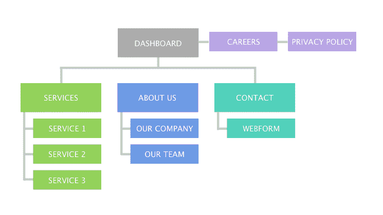
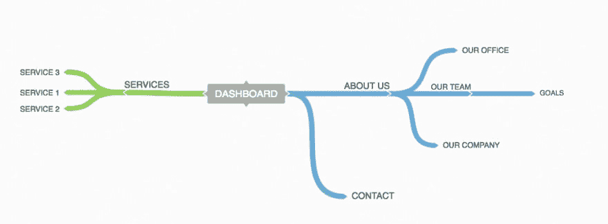
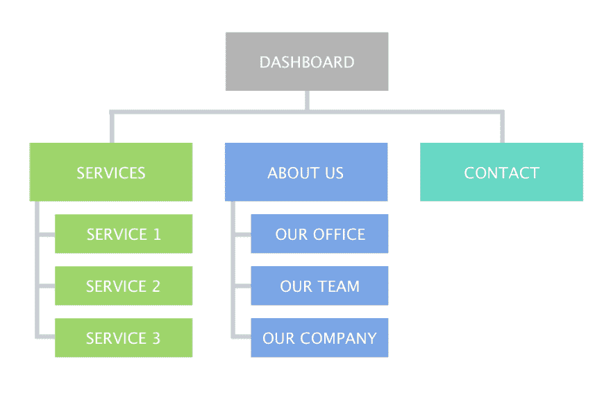
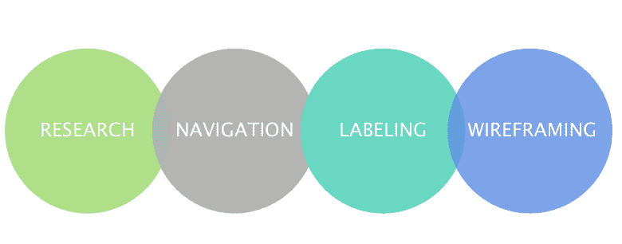

# 信息架构定义、角色、策略和资源

> 原文：<https://dev.to/brainhubeu/information-architecture-definition-roles-strategies-and-resources-31jo>

随着用户体验、用户研究、可用性测试等越来越受欢迎的概念的出现，还有一些不太为人熟知的概念:

**信息架构(IA)** 。

两者有什么区别？

> 信息架构是在网站、手机或网络应用程序上组织信息的艺术，因此使用它，网站将变得简单而直观。

这个术语与用户体验(UX)的概念紧密联系在一起，用户体验是使用一个数字产品时的印象的集合。体验不仅仅在互动的时候结束，还会在发生之后结束。

## 简而言之

信息架构更多的是关于整个网站或应用程序的结构，而 UX 与用户印象和体验有关。

在实践中，IA 被简化为组织信息，即:对内容进行分类，创建一致的导航，站点地图，以及命名各个内容组。它也是整个项目的框架，在此基础上您可以创建更多的视图、视觉元素、交互或功能。

IA 允许用户轻松获取内容，而不需要太多的努力。应用程序的结构不合理会让他感到沮丧和沮丧。

在线产品中的信息组织本身取决于用户的需求，但也取决于业务优先级。例如，在博客或登录页面的情况下，信息的结构将看起来非常不同。

## 信息架构师的角色

**IA 设计师**是设计团队的补充。他的主要任务是研究、导航、数据建模和标记。他经常使用卡片分类、可用性测试、利益相关者和用户访谈等工具。

**信息架构架构师**负责用户如何浏览[网络产品](https://brainhub.eu/blog/how-to-prototype-app-as-non-designer/)并获得相关信息。用户使用[应用程序或网站](https://brainhub.eu/blog/app-vs-website-which-to-develop-first/)的方式很大程度上取决于信息是如何呈现和组织的。

## 为什么信息架构对企业很重要？

为了精心设计信息架构，您应该回答以下问题:

*   你如何组织和划分信息？
*   你如何呈现信息？
*   你如何传达你在应用程序中导航的方式？
*   用户将如何在应用程序中导航？
*   用户将如何查找信息？

构成优秀 IA 的组件包括:

*   **组织**系统
*   **标签**系统
*   **导航**系统
*   **搜索**系统

总之，设计良好的信息架构是一种直观而高效的用户体验。因此，创造一个好的网络产品不仅需要 UX 技能，信息架构技能也同样重要。只有这样，才有可能创建满足用户需求的项目。

## 帮助您创建 IA 的工具和模板

在市场上，我们可以找到很多创建信息架构的工具。最简单的视图可以使用工具创建，例如 [Microsoft Visio](http://www.nickfinck.com/blog/entry/visio_stencils_for_information_architects/) 。

创建图表或思维导图的应用程序也很有用，例如:

*   [Create.ly](https://creately.com/) ，
*   [OmniGraffle](https://www.omnigroup.com/OmniGraffle/) ，
*   [XMind](http://www.xmind.net/) ,
*   [draw.io](https://www.draw.io/) ，
*   [智能绘图](https://www.smartdraw.com/)，
*   [考格尔](https://coggle.it/)。

我们呈现信息架构本身的方式取决于我们的偏好。我们可以通过使用思维导图工具来做到这一点。这样，我们可以有效地可视化信息架构及其流程。

我们也可以用一个简单的图表来表示信息架构。这个版本即使在非常大的页面或应用程序中也能很好地工作。

图表通常用于基于先前创建的信息架构的站点地图。

## 如何创建一个网站的信息架构？

如果你想设计一个有效的信息架构，使你的网站更加有用和易读，那么你需要经历设计过程的各个阶段。

**用户研究**

信息架构的工作应该从用户研究和分析开始。这个过程的一个重要部分是理解产品用户的需求和问题，并使它们与业务目标相一致。为此，我们可以使用许多工具:卡片分类、用户访谈、焦点小组或调查。

**导航**

下一步是定义导航、各个页面的层次结构，并设计如何以及何时显示它们。在这个阶段，我们可以用程序来进行思维导图或图表。

**贴标签**

一旦我们开发了信息结构，就该给各个部分和页面命名了，这样用户就可以理解了。它们还使页面导航变得更加容易。

**线框化**

下一步是制作基于 IA 的线框图。通过使用它们，我们定义了页面上信息的可视化层次结构以及应用程序后续视图之间的连接。【T2

## 为什么以及何时为您的数字产品创建 IA？

创建信息架构并不总是需要的。当然，在任何情况下，我们都可以做到这一点，这将是有益的，但它不是必需的，例如当我们创建一个简单的页面有几个子页面或登陆页面。

信息架构的重要性和价值将通过设计一个广泛的网站或应用程序得到认可。在这种情况下，在设计过程的开始——在识别产品的用户之后，但在创建线框和模型之前——进行信息架构的工作是值得的。

第一项工作应该包括构建页面上的信息，开发导航和命名标签。下一步应该是在用户身上测试 IA，比如使用卡片分类。

## 关于信息架构的书籍和资源

如果我唤醒了您对信息架构这一主题的兴趣，您可以使用我推荐的以下书籍和资源进行深入研究:

*   信息架构:为网络和超越[图书]
*   [Chris How -数字体验和信息架构](https://www.youtube.com/watch?v=qGFF_FhNdY4) [youtube 视频]
*   [信息架构。你可能忽略了设计的重要部分](https://blog.prototypr.io/information-architecture-the-most-important-part-of-design-youre-probably-overlooking-20372ade4fc0)
*   [如何评估您的信息架构的成熟度](http://www.uxmatters.com/mt/archives/2012/03/how-to-assess-the-maturity-of-your-information-architecture.php)[文章]

* * *

最初在 Braihub.eu/blog 发布为“[信息架构定义、角色、策略和资源”](https://brainhub.eu/blog/information-architecture/)