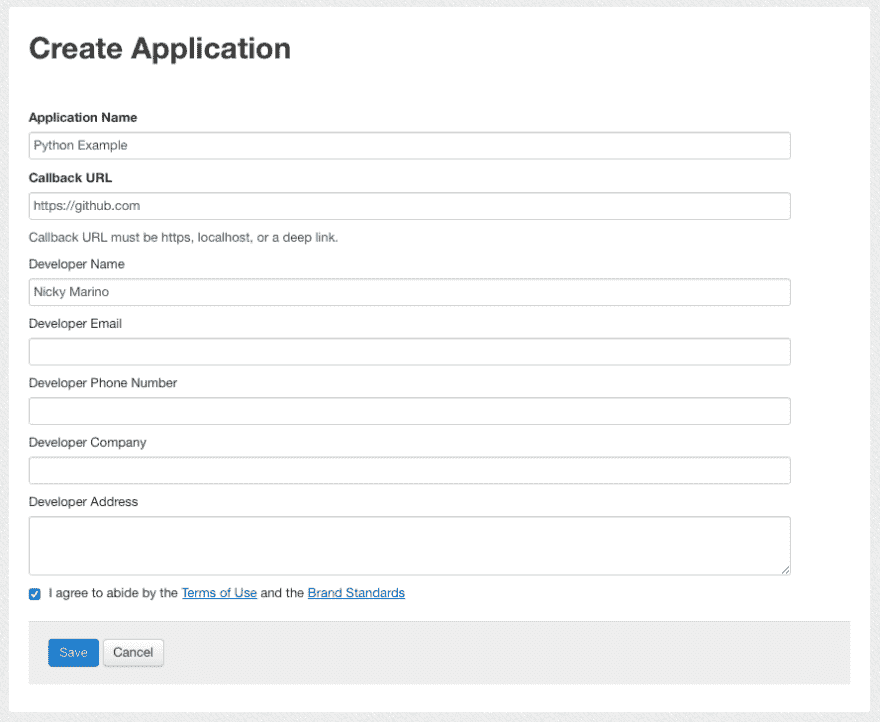
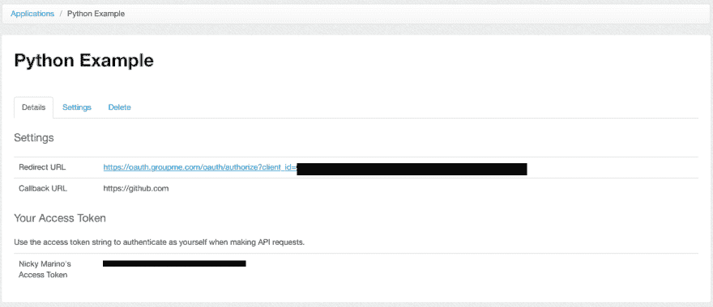

# 带有 Python 请求和 Jinja2 的 Web API 和模板

> 原文：<https://dev.to/nickymarino/web-api-and-templates-with-python-requests-and-jinja2-4e2f>

*本文最初发表于[我的网站](https://nickymarino.com)。查看更多精彩内容！*

## 简介

Web API 正在成为一种[越来越流行的](https://code.tutsplus.com/articles/the-increasing-importance-of-apis-in-web-development--net-22368)检索和存储数据的方法，对于任何程序员来说，它们都是一个极其强大的工具。在本演练中，您将使用 GroupMe 的[公共 API](https://dev.groupme.com/docs/v3) 来检索一个组中的最后几条消息，并使用 Python 3.7.1 中的自定义 HTML 模板显示它:

[](https://res.cloudinary.com/practicaldev/image/fetch/s---iAR4DcS--/c_limit%2Cf_auto%2Cfl_progressive%2Cq_auto%2Cw_880/https://nickymarino.com/public/assets/2018/web-apis-and-templates/output-site.png)

虽然我们将使用特定的 GroupMe API 端点，但本演练将帮助您学习使用 web APIs 的基本知识。

### 设置

开始之前，您需要安装以下模块:

*   `requests`(用于连接 API)
*   `jinja2`(用于向我们的模板添加数据)

## 使用 Web API

### 与`requests`一起工作

`requests`库非常适合创建 HTTP 请求，并且它有非常棒的[文档](http://docs.python-requests.org/en/master/)。我们将使用`requests.get(url)`来获取我们需要的信息:

```
>>> import requests
>>> # Use JSONPlaceHolder as an example >>> req = requests.get('https://jsonplaceholder.typicode.com/todos/1')
>>> print(req.text)
{
  "userId": 1,
  "id": 1,
  "title": "delectus aut autem",
  "completed": false
} 
```

Enter fullscreen mode Exit fullscreen mode

### 创建应用程序

要使用 GroupMe 的 API，我们需要首先注册一个应用程序来获取我们的 API 密钥。登录[开发者应用页面](https://dev.groupme.com/session/new)，点击“创建应用”。您将被带到此页面:

[](https://res.cloudinary.com/practicaldev/image/fetch/s--kWjUALgE--/c_limit%2Cf_auto%2Cfl_progressive%2Cq_auto%2Cw_880/https://nickymarino.com/public/assets/2018/web-apis-and-templates/create-application.png)

我们不会使用回调 URL，所以将其设置为任何有效的 URL。填写开发者信息并提交表单，您将被带到应用程序的详细信息页面:

[](https://res.cloudinary.com/practicaldev/image/fetch/s--ODmZ2Y5X--/c_limit%2Cf_auto%2Cfl_progressive%2Cq_auto%2Cw_880/https://nickymarino.com/public/assets/2018/web-apis-and-templates/application-access-token.png)

复制应用程序页面底部的访问令牌。这将是我们的 API 密钥。

### 查找组 ID

要获取群组中的消息，我们首先需要获取群组 ID。GroupMe 的[文档](https://dev.groupme.com/docs/v3)说使用基本 url `https://api.groupme.com/v3`，并有以下使用`curl`的示例:

```
$ curl -X POST -H "Content-Type: application/json" -d '{"name": "Family"}' https://api.groupme.com/v3/groups?token=YOUR_ACCESS_TOKEN 
```

Enter fullscreen mode Exit fullscreen mode

由此我们知道，我们与`requests.get()`一起使用的 url 将以<sup id="fnref:url-params">[1](#fn:url-params)</sup>T5】的形式出现

```
https://api.groupme.com/v3/...?token=YOUR_ACCESS_TOKEN 
```

Enter fullscreen mode Exit fullscreen mode

查看[组 API](https://dev.groupme.com/docs/v3#groups) ，我们可以使用`GET /groups`来检索我们最近的组列表:

```
>>> import requests
>>> API_KEY = 'YOUR_API_KEY'
>>> base_url = 'https://api.groupme.com/v3'
>>> req = requests.get(f'{base_url}/groups?token={API_KEY}')
>>> req.content
b'{"response":[{"id":"1111","group_id":"2222","name":"My Group Name","phone_number":"+1 5555555555","type":"private","description":"Group description goes here",
... 
```

Enter fullscreen mode Exit fullscreen mode

首先，我们为 API 请求构造 url，并将其作为参数传递给`requests.get()`。然后，我们打印存储为`req.content`的 API 请求的结果。

我们从 GroupMe 得到的响应是一个 JSON 格式的字符串，所以我们将把我们的脚本移到它自己的文件中，并使用 Python 的标准`json`库:
解析该字符串

```
import json
import requests

API_KEY = 'YOUR_API_KEY'
BASE_URL = 'https://api.groupme.com/v3'

def api_request(request):
    '''Returns the data from a request (eg /groups)'''
    url = f'{BASE_URL}{request}?token={API_KEY}'
    req = requests.get(url)

    if not req.content:
        return None

    # We only want the data associated with the "response" key
    return json.loads(req.content)['response']

if __name__ == ' __main__':
    groups = api_request('/groups')
    print(len(groups), 'group(s)')
    for group in groups:
        print(f'ID {group["group_id"]}: {group["name"]}') 
```

Enter fullscreen mode Exit fullscreen mode

函数`api_request`为我们创建最终的 URL 字符串。然后，它发出请求，并检查 GroupMe 的服务器是否返回了某些内容。如果有东西被发回给我们，那么使用`json.loads()`将内容从字符串 <sup id="fnref:json-object">[2](#fn:json-object)</sup> 转换成 Python 对象。最后，我们返回与键`response`相关的数据，因为其余的是对我们不重要的元数据。

当我们运行脚本时，我们最近的组被返回(作为解码成 Python 对象的 JSON 对象)。结果将告诉我们组名和它们的组 id:

```
3 group(s)
ID 11111111: Python Tips and Tricks
ID 22222222: University Friend Group
ID 33333333: GitHub Chat 
```

Enter fullscreen mode Exit fullscreen mode

### 获取群组消息

我们有一个组 id 列表，所以我们可以使用下面的 API 来获取一个组的最近消息列表:

```
GET /groups/<group_id>/messages 
```

Enter fullscreen mode Exit fullscreen mode

让我们将这个端点作为`get_messages_for_group(group_id)` :
添加到我们的脚本中

```
import json
import requests

API_KEY = 'YOUR_API_KEY'
BASE_URL = 'https://api.groupme.com/v3'

def api_request(request):
    '''Returns the data from a request (eg /groups)'''
    url = f'{BASE_URL}{request}?token={API_KEY}'
    req = requests.get(url)

    if not req.content:
        return None

    # We only want the data associated with the "response" key
    return json.loads(req.content)['response']

def get_messages_for_group(group_id):
    response = api_request(f'/groups/{group_id}/messages')

    # Just return the messages (and none of the metadata)
    return response['messages']

if __name__ == ' __main__':
    messages = get_messages_for_group(YOUR_GROUP_ID)
    print(messages[0]) 
```

Enter fullscreen mode Exit fullscreen mode

我们的脚本将获取一个组的消息(填入`YOUR_GROUP_ID`)并打印最近的一条。运行它将会打印出如下内容:

```
{'attachments': [], 'avatar_url': None, 'created_at': 1544810700, 'favorited_by': [], 'group_id': '11112233', 'id': '882882828288288282', 'name': 'Johnny Test', 'sender_id': '22558899', 'sender_type': 'user', 'source_guid': 'android-11111111-3eee-4444-9999-aaaabbbbcccc', 'system': False, 'text': "Hello everyone!", 'user_id': '55551111'} 
```

Enter fullscreen mode Exit fullscreen mode

我们可以从消息的数据中看到，发送者的名字是“Jonny Test”，文本是“大家好！”接下来，我们应该将 API 结果组织成 Python 对象，以便于扩展。

### 为 API 对象创建类

既然我们已经准备好开始处理来自 API 的数据，那么是时候创建对象来表示我们的 API 对象了。使用 Python 类，我们可以只保留我们需要的数据，并开始处理我们自己的信息。我们将通过传递来自`api_request(request)`的解码后的 Python 对象来初始化我们的 API 对象。这样，我们可以更容易地添加类属性，而不需要改变我们的请求函数。

让我们制作两个类，`Group`和`Message` :

```
class Message:
    def __init__ (self, json):
        self.user_id = json['user_id']
        self.name = json['name']
        self.text = json['text']

class Group:
    def __init__ (self, json):
        self.id = json['group_id']
        self.name = json['name']
        self.messages = [] 
```

Enter fullscreen mode Exit fullscreen mode

然后我们可以给`Group`添加一个方法来获取它最近的消息:

```
def get_recent_messages(self):
    messages = get_messages_for_group(self.id)

    # Convert each message to our object
    for message in messages:
        new_message_object = Message(message)
        self.messages.append(new_message_object) 
```

Enter fullscreen mode Exit fullscreen mode

然后我们可以使用我们的脚本打印出一组消息:

```
import json
import requests

API_KEY = 'YOUR_API_KEY'
BASE_URL = 'https://api.groupme.com/v3'

def api_request(request):
    '''Returns the data from a request (eg /groups)'''
    url = f'{BASE_URL}{request}?token={API_KEY}'
    req = requests.get(url)

    if not req.content:
        return None

    # We only want the data associated with the "response" key
    return json.loads(req.content)['response']

def get_messages_for_group(group_id):
    response = api_request(f'/groups/{group_id}/messages')

    # Just return the messages and none of the metadata
    return response['messages']

class Message:
    def __init__ (self, json):
        self.user_id = json['user_id']
        self.name = json['name']
        self.text = json['text']

class Group:
    def __init__ (self, json):
        self.id = json['group_id']
        self.name = json['name']
        self.messages = []
        self.get_recent_messages()

    def get_recent_messages(self):
        messages = get_messages_for_group(self.id)

        # Convert each message to our object
        for message in messages:
            new_message_object = Message(message)
            self.messages.append(new_message_object)

if __name__ == ' __main__':
    groups_json = api_request('/groups')
    my_group = Group(groups_json[0])

    for message in my_group.messages:
        print(message.text)
        print(f'-- {message.name}')
        print() 
```

Enter fullscreen mode Exit fullscreen mode

结果是我们最近群组的最近消息:

```
Hello everyone!
-- Johnny Test

Hi guys I had a question about using @classmethod
-- Alexa Jones

Wow great work!
-- Katie Alendra 
```

Enter fullscreen mode Exit fullscreen mode

我们有了易于管理的格式的数据，所以是时候开始以可读的形式格式化它了。

## 使用 Jinja 模板

我们已经走了很长的路了！首先，我们学习了如何向服务器发出 HTTP GET 请求。然后，我们使用 GroupMe 的 API 文档来获取关于不同组和消息的数据，然后我们创建 Python 类来更好地组织我们的信息。让我们创建一个 [Jinja](http://jinja.pocoo.org/docs/2.10/) 模板来打印我们的数据。

### 创建模板

首先，我将创建一个`group.html`文件，它的框架是我想要的网页外观:

```
<body>
    <h1>GROUP NAME</h1>
    <br />

    <!-- Repeat for every message -->
    <p><b>MESSAGE CONTENT</b> &mdash; NAME</p>
</body> 
```

Enter fullscreen mode Exit fullscreen mode

在 Jinja 中，使用`{{ variable_name }}`将变量插入到模板中，逻辑语句的形式如下:

```

    <p>This message should be displayed</p>
 
```

Enter fullscreen mode Exit fullscreen mode

如果我们假设将传递一个`Group()`实例到我们的 Jinja 模板中，变量名为`group`，我们可以将`group.html`重写为:

```
<body>
    <h1>{{ group.name }}</h1>
    <br />

    <!-- Repeat for every message -->
    
    <p><b>{{ message.text }}</b> &mdash;{{ message.name }}</p>
    
</body> 
```

Enter fullscreen mode Exit fullscreen mode

注意上面代码片段中的``和``；所有条件和循环都需要它们。

### 填充模板

写好模板后，让我们回到脚本，添加一个部分来使用`jinja2`导入模板。

```
with open('group.html', 'r') as f:
    contents = f.read()

template = jinja2.Template(contents)
filled_template = template.render(group=my_group)

with open('output.html', 'w') as f:
    f.write(filled_template) 
```

Enter fullscreen mode Exit fullscreen mode

首先，我们读取模板文件的内容。因为我们将只使用一个文件，所以我们可以将模板的文本加载到`jinja2.Template`中，然后我们可以通过将`my_group`变量(来自我们的主脚本)作为`group`传递来呈现模板。最后，我们将内容写入`output.html`，以便在浏览器中查看。

现在我们有了完整的脚本:

```
import json
import jinja2
import requests

API_KEY = 'YOUR_API_KEY'
BASE_URL = 'https://api.groupme.com/v3'

def api_request(request):
    '''Returns the data from a request (eg /groups)'''
    url = f'{BASE_URL}{request}?token={API_KEY}'
    req = requests.get(url)

    if not req.content:
        return None

    # We only want the data associated with the "response" key
    return json.loads(req.content)['response']

def get_messages_for_group(group_id):
    response = api_request(f'/groups/{group_id}/messages')

    # Just return the messages and none of the metadata
    return response['messages']

class Message:
    def __init__ (self, json):
        self.user_id = json['user_id']
        self.name = json['name']
        self.text = json['text']

class Group:
    def __init__ (self, json):
        self.id = json['group_id']
        self.name = json['name']
        self.messages = []
        self.get_recent_messages()

    def get_recent_messages(self):
        messages = get_messages_for_group(self.id)

        # Convert each message to our object
        for message in messages:
            new_message_object = Message(message)
            self.messages.append(new_message_object)

if __name__ == ' __main__':
    groups_json = api_request('/groups')
    my_group = Group(groups_json[0])

    with open('group.html', 'r') as f:
        contents = f.read()

    template = jinja2.Template(contents)
    filled_template = template.render(group=my_group)

    with open('output.html', 'w') as f:
        f.write(filled_template) 
```

Enter fullscreen mode Exit fullscreen mode

一旦运行，我们可以在浏览器中查看我们的`output.html`:

```
<body>
    <h1>Python Tips and Tricks</h1>
    <br />

    <!-- Repeat for every message -->
    <p><b>Hello everyone!</b> &mdash;Johnny Test</p>
    <p><b>Hi guys I had a question about using @classmethod</b> &mdash;Alexa Jones</p>
    <p><b>Wow great work!</b> &mdash;Katie Alendra</p>
</body> 
```

Enter fullscreen mode Exit fullscreen mode

[](https://res.cloudinary.com/practicaldev/image/fetch/s---iAR4DcS--/c_limit%2Cf_auto%2Cfl_progressive%2Cq_auto%2Cw_880/https://nickymarino.com/public/assets/2018/web-apis-and-templates/output-site.png)

## 结论

我们已经介绍了如何使用请求库访问和解析 web API，如何使用 Python 类表示和组织 API 数据，以及如何使用 Jinja 模板以自定义格式呈现信息。现在去使用 API 创建你自己的酷东西吧！

* * *

在这个演练中我们不会，但是如果我们需要在 URL 中传递多个[参数](https://en.wikipedia.org/wiki/Query_string#Web_forms)，它看起来会像`v3/...?limit=10&another_param=1000&token=YOUR_ACCESS_TOKEN` ) [↩](#fnref:url-params)

通常，`json.loads`()返回的 dict 可以包含更多的 dict、列表和值，如`None`、字符串和整数。查看 [Python 文档](https://docs.python.org/3/library/json.html)中的例子。 [↩](#fnref:json-object)