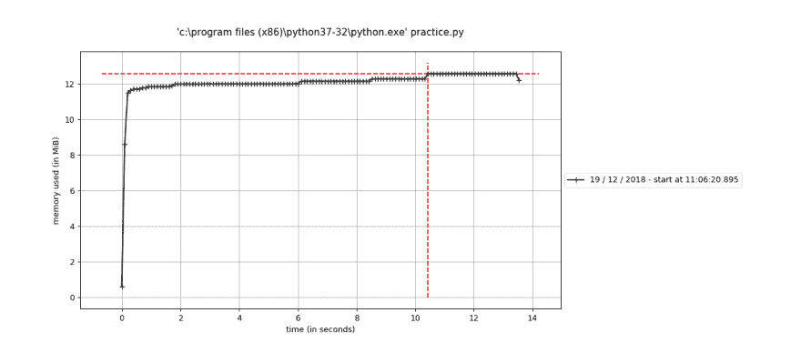
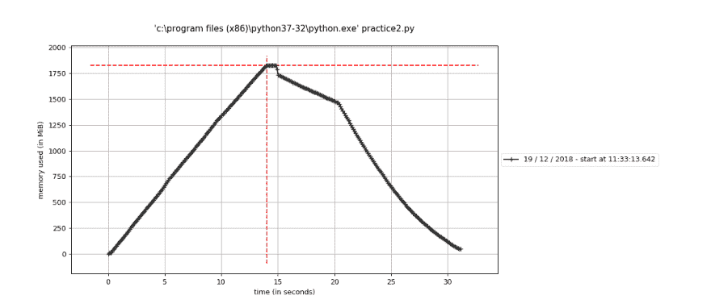
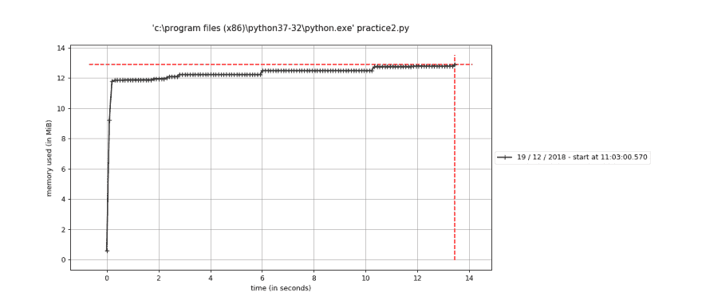

# 在 Python 中测试不同的斐波那契生成器技术

> 原文：<https://dev.to/kaelscion/testing-different-fibonacci-generator-techniques-in-python-56k0>

嘿大家好！所以，昨天我发布了一个练习解决方案，尽可能快速有效地找到斐波那契数列中的第 200，000 个数字。那篇原帖可以在这里找到[。我问是否有人可以提供一些改进的技巧，我得到了一个非常好、非常全面的回答，来自](https://dev.to/kaelscion/recursion-algorithm-practice-fibonacci-sequence-generator-3fa0) [@rrampage](https://dev.to/rrampage) ，详细介绍了生成器的使用，而不是像我一样的迭代解决方案。他的反驳如下:

> 另一个有趣的使用迭代的方法是将函数变成一个生成器，它可以作为 for 循环、list comprehensions 等的一部分使用

```
def gen_fib():
    a,b = 1,1
    yield a
    yield b
    while True:
        a,b = b,a+b
        yield b
g = gen_fib()
# Generate the first 200,000 Fibonacci numbers fibs = [next(g) for _ in range(200000)] 
```

Enter fullscreen mode Exit fullscreen mode

由于 Python 不能很好地处理大量的递归深度，在需要在低 RAM 环境中更多地利用 CPU 的情况下，这似乎是一个不错的解决方案，而这正是生成器通常非常擅长的。但是，在测试了这个解决方案(它只是一个例子，并不意味着性能)之后，我定制了一个我认为非常容易记忆的解决方案，我得到了一些有趣的结果。

下面是我最初使用的代码，它利用了 while 循环迭代中变量的存储:

```
def fibonacci(n):
    iterator = 1
    first_fib_num = 0
    second_fib_num = 1
    while iterator < n:
        added_to = first_fib_num + second_fib_num
        first_fib_num = second_fib_num
        second_fib_num = added_to
        iterator+=1
    return(added_to)

print(fibonacci(200000)) 
```

Enter fullscreen mode Exit fullscreen mode

然后，我对 mprof 运行这个脚本，进行一段时间的内存分析。下面是其运行过程中使用情况的曲线图:

[](https://res.cloudinary.com/practicaldev/image/fetch/s--zeBGNUg1--/c_limit%2Cf_auto%2Cfl_progressive%2Cq_auto%2Cw_880/https://thepracticaldev.s3.amazonaws.com/i/5uysx8m90pwmis2u01wp.png)

接下来，我使用了关于生成器的相同问题的建议示例，同样，这并不是为了提高性能。它的代码在上面，但我也把它放在这里:

```
def gen_fib():
    a,b = 1,1
    yield a
    yield b
    while True:
        a,b = b,a+b
        yield b
g = gen_fib()
# Generate the first 200,000 Fibonacci numbers fibs = [next(g) for _ in range(200000)] 
```

Enter fullscreen mode Exit fullscreen mode

下面是一段时间内相应的使用情况图:

[](https://res.cloudinary.com/practicaldev/image/fetch/s--abvTIm-d--/c_limit%2Cf_auto%2Cfl_progressive%2Cq_auto%2Cw_880/https://thepracticaldev.s3.amazonaws.com/i/ykwql7hxzwn5zf69j66k.png)

什么？！？我期待的是完全不同的东西！在这个图表的峰值，大约 14.5 秒，生成器函数使用了将近 2GB 的内存！2gb。因为比迭代器函数多 1000 多倍的内存。而且花了将近两秒的时间。

也请知道，我并不是批评由 [@rrampage](https://dev.to/rrampage) 提供的解决方案，因为它只是一个使用生成器来完成这项任务的例子。但是发电机应该更少依赖于内存中的 T2。不信你看看 freecodecamp.org 上一篇文章里的这句话:

> 与列表相比，生成器的主要优势在于它占用的内存要少得多。

当然，也许是为了储存。但显然不要用 T1，这在我看来才是重点。

我的最终解决方案是基于我在 Python 文档中找到的生成器编写我自己的生成器，并使它尽可能高效地达到这个目的。代码如下:

```
def fibon(n):
    a = b = 1
    for i in range(n):
        yield a
        a, b = b, a + b

for x in fibon(200000):
    if x < 3:
        pass
print(x) 
```

Enter fullscreen mode Exit fullscreen mode

其结果如下图所示:

[](https://res.cloudinary.com/practicaldev/image/fetch/s--u1qvUqGd--/c_limit%2Cf_auto%2Cfl_progressive%2Cq_auto%2Cw_880/https://thepracticaldev.s3.amazonaws.com/i/r3s6tboq5ef4gfoczwas.png)

因此，总之，我使用了一个在 Python 中非常流行的特定于语言的特性，因为它应该比一个更“即兴”的解决方案更好地完成这种工作。构建这个生成器，从内存和性能的角度思考它，编写它，并对它进行分析，花了我大约 30 分钟。我最初的解决方案使用了 while 循环和一些变量，花了我大约 5 分钟才想出来。幸运的是，这个时髦的解决方案几乎和内存一样快，T2 几乎和内存一样轻，这意味着如果它的实现时间不是 6 倍的话，T4 几乎是值得使用的。

所以，这个故事的寓意是奥卡姆剃刀当然适用于编程。作为开发人员，我们有责任及时有效地把事情做得更好。我们的工作是创造解决方案。不要*考虑*解决方案，而是发现、量化、发明、构建、部署和支持问题的解决方案。我们这个领域的大部分工作要么是在做尚未完成的事情，要么是在学术环境中取得被证明*可能*的东西，并让它*为非技术多数人所用*。这最终意味着我们需要相信我们的直觉，相信我们的训练，尽我们所能去寻找显而易见的解决方案，除非这个解决方案在实践中被证明是不充分的。

非常感谢那些回复我关于这个话题的原始帖子的人们:[@本](https://dev.to/ben)，[@杰斯](https://dev.to/jess)，[@ r ampage](https://dev.to/rrampage)，以及其他所有处理我现在不记得的事情的人。没有你们的讨论和评论，这种实验永远不会发生。

对于那些认为这篇文章是关于我诋毁别人的解决方案的人，请知道 ***不是*** 。我自己的生成器解决方案并没有真的更好，尽管在它上面花费了比提交示例更多的时间，并且测试/重新测试它以将其*减少*到只比 5 分钟解决方案*差一点点*。我最初的生成器解决方案使用了超过 2GB 的内存。所以没有来自我的判断。发电机有很多它们发光的用例。但是，尽管我最初的想法与此相反，这却不是其中之一。