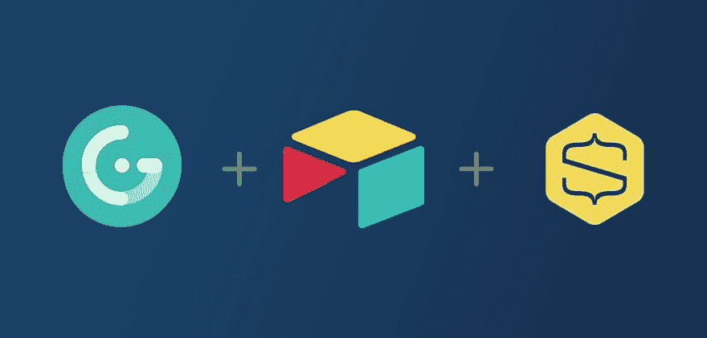
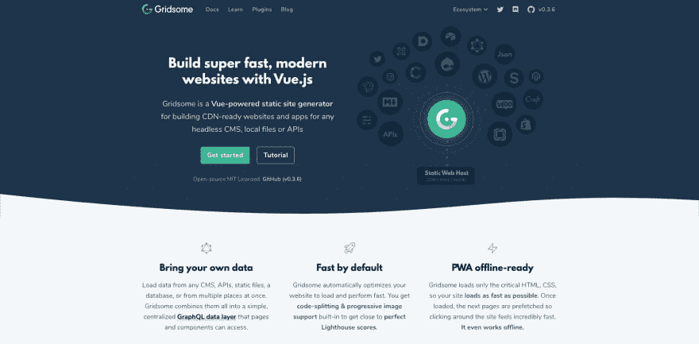

# 通过 Gridsome 利用 Vue.js 和 graph QL(Airtable 数据库示例)

> 原文：<https://dev.to/couellet/leveraging-vuejs--graphql-with-gridsome-airtable-database-example-1d2n>

花点时间回顾一下现代 JavaScript 在过去几年中的进步。

当然，有一些特定的前端技术会突然出现在你的脑海中——反应、[节点](https://snipcart.com/blog/javascript-nodejs-backend-development)、[冗余](https://snipcart.com/blog/redux-vue)等等。

你不能否认 Vue.js 和 GraphQL 也在不断增长的 js 池塘中掀起了巨大的波澜。

现在，如果我告诉你，利用这两者来构建强大的网站和应用程序的工具已经到来，会怎么样？

是的，Vue.js 终于找到了它的盖茨比，它叫 Gridsome。

它很快引起了我们团队的注意，今天我通过构建我自己的 Vue & GraphQL 支持的电子商务应用来测试它。

本教程将重点介绍 Gridsome 的一些优秀特性，同时将 Airtable 用作手工制作的数据库。

🛠台阶

1.  创建 Gridsome 项目
2.  在气动工作台处理产品表
3.  制作一个 Gridsome 数据源插件来从 Airtable 获取产品
4.  使用 GraphQL 查询数据
5.  构建 Vue.js 视图和列表
6.  添加购买按钮

首先，一点背景。

## grid some 简介:利用 Vue.js & GraphQL

如果这是你第一次读到 Gridsome，请不要感到无知，因为它只有几个月的历史。虽然，剧透警告，在接下来的几个月里，你可能会听到越来越多的消息。

这是一个基于 Vue 的静态站点生成器，从 GraphQL 层连接到任何 CMS 或数据源。

它受到了《盖茨比》的强烈启发。

→阅读完整帖子和技术教程[此处](https://snipcart.com/blog/vuejs-graphql-airtable-example)