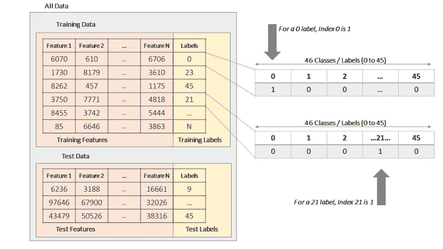

# 使用 Keras 的单标签多类分类

> 原文：<https://dev.to/hydroweaver/single-label-multiclass-classification-using-keras-45jl>

嗨，德弗兹，

这是我第二次使用 Keras 进行机器学习。这次是[书](https://www.manning.com/books/deep-learning-with-python)中**多类分类**的下一课。这篇文章很像[的上一篇文章](https://dev.to/hydroweaver/keras-sentiment-analysis-in-from-the-book-in-plain-english-36hd)，唯一的不同是我试图在下面的图表中做一些解释，我希望这能让你/我在未来理解为什么数据被分割以及什么是热门编码。😊

### 什么是多类分类？

多类别分类，或者更具体地说，在这种情况下是**单标签**多类别分类允许您将一个样本归入多个类别中的一个类别，也就是说，它是二元分类的扩展。

例如:一部电影可以是好的或坏的，这是二元的，然而它的类型可以是几个类型中的一个标签，例如它可以是:恐怖片，惊悚片，爱情片，剧情片，动作片，冒险片

### 什么是 one 热编码？

该图向您展示了如何将单个标签表示为一个长度为标签数量的数组，并且我的开发伙伴是一个热编码。
**每个样本只能位于 46 类标签或主题中的一类中才能精确定位。**

### 46 个标签？这会如何影响神经网络？

好问题！这一次，我们将使用 64 个单位，而不是在隐藏层中使用 16 个单位。为什么？你问...因为[上一次](https://dev.to/hydroweaver/keras-sentiment-analysis-in-from-the-book-in-plain-english-36hd)我们只有 2 个标签(正面或负面情绪),然而这次我们有 46 个主题，为了**不丢弃**来自 46 大小数组的任何信息，我们需要一个更大的输入堆栈，因此我们使用 64 个单位层作为输入，46 个单位层作为输出。

这个练习是基于将路透社新闻提要分类到标签中，由于某种原因，我找不到标签的文本！😅

来源是这里的。
尽情享受吧！