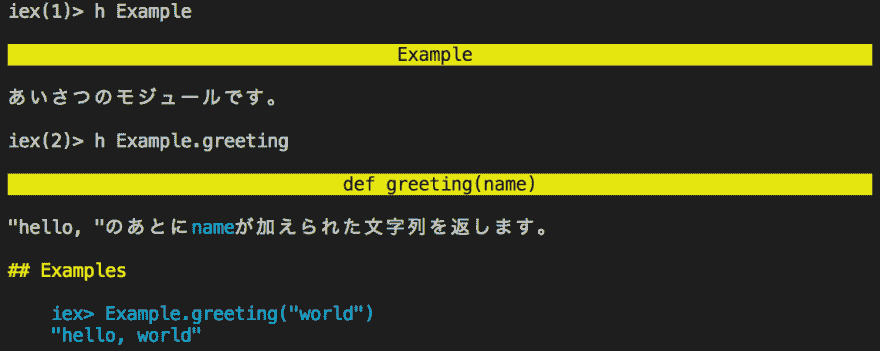

# Elixir 入门 14 :模块属性

> 原文：<https://dev.to/gumi/elixir-14--3511>

本文在 Elixir 官网的许可下，根据“[Module attributes](https://elixir-lang.org/getting-started/module-attributes.html) ”的解说，加以修改，对 Elixir 中模块属性的使用方法进行说明。 使用的目的有以下 3 个。

*   模块注释
    *   用户和虚拟机添加信息。
*   模块常数
*   模块的临时保存位置
    *   用于编译时的保管。

# 作为注释

Elixir 从 Erlang 中引入了模块属性的想法。 例如，[`@vsn`](https://hexdocs.pm/elixir/Module.html#module-vsn)是明确模块版本的属性。 `@vsn`由 Erlang VM 在代码重新加载的结构中使用，确认模块是否更新。 如果未显示版本，则该版本被设定为模块函数的[MD5](https://ja.wikipedia.org/wiki/MD5) 校验和。

```
defmodule MyServer do
  @vsn 2
end 
```

Enter fullscreen mode Exit fullscreen mode

Elixir 有一些保留的属性。 常用属性包括:

[`@moduledoc`](https://hexdocs.pm/elixir/Module.html#module-moduledoc):定义当前模块的文档。
[`@doc`](https://hexdocs.pm/elixir/Module.html#module-doc-and-since):确定函数和宏的文档。
[`@behaviour`](https://hexdocs.pm/elixir/Module.html#module-behaviour-notice-the-british-spelling):[OTP](http://erlang.org/doc/design_principles/des_princ.html) (“[Open Telecom Platform](https://en.wikipedia.org/wiki/Open_Telecom_Platform) )或指定用户定义的行为。
[`@before_compile`](https://hexdocs.pm/elixir/Module.html#module-before_compile):在模块编译之前被调用。 可以在即将编译之前将函数插入模块中。

`@moduledoc`和`@doc`是最常用的属性(请参阅[Module Attributes](https://hexdocs.pm/elixir/writing-documentation.html#module-attributes) )。 Elixir 非常重视文档，可以通过多种功能进行引用。

例如，如下所示，在模块中确定文档吧。 在 Elixir 中，使用[透明文档](https://ja.wikipedia.org/wiki/%E3%83%92%E3%82%A2%E3%83%89%E3%82%AD%E3%83%A5%E3%83%A1%E3%83%B3%E3%83%88)，可以写出易读的文档。 属性后，请用 3 个双引号将文本括起来。 可以在 Markdown 中为多行文本设置格式。 编译的模块的文档可以从 IEx 中引用。

```
defmodule Example do
  @moduledoc """
  あいさつのモジュールです。
  """

  @doc """
  "hello, "のあとに`name`が加えられた文字列を返します。

  ## Examples

      iex> Example.greeting("world")
      "hello, world"

  """
  def greeting(name), do: "hello, #{name}"
end 
```

Enter fullscreen mode Exit fullscreen mode

用命令行工具通过`elixirc`命令编译文件，进入`iex`模式。

```
$  elixirc example.exs
$  iex 
```

Enter fullscreen mode Exit fullscreen mode

在`h`后输入模块或完全限定名称的函数，shell 就会显示文档(图 001 )。

#### t0-t1 -在 001■IEx 的外壳中显示的文档

[](https://res.cloudinary.com/practicaldev/image/fetch/s--DXDaavwu--/c_limit%2Cf_auto%2Cfl_progressive%2Cq_auto%2Cw_880/https://thepracticaldev.s3.amazonaws.com/i/lpsk1mke12jw6uom1s3g.png)

还提供了从文档生成 HTML 页面的工具[ExDoc](https://github.com/elixir-lang/ex_doc#exdoc) 。 关于其他支持的属性，请参考“[Module](https://hexdocs.pm/elixir/Module.html) ”。 此外，属性可以定义[Typespec](https://elixir-lang.org/getting-started/typespecs-and-behaviours.html) ，也可以由开发者使用，库也可以扩展到自定义行为中使用。

# [作为](#%E5%AE%9A%E6%95%B0%E3%81%A8%E3%81%97%E3%81%A6)常数

在 Elixir 的开发中，模块属性经常用作模块的常量。

```
defmodule Example do
  @greeting "hello"
  def greeting(name), do: "#{@greeting}, #{name}"
end 
```

Enter fullscreen mode Exit fullscreen mode

```
iex> Example.greeting("world")
"hello, world" 
```

Enter fullscreen mode Exit fullscreen mode

与 Erlang 不同，默认情况下，用户定义的属性不会存储在模块中。 只在编译期间存在的值。 要进行与 Erlang 相同的动作，请在[`Module.register_attribute/3`](https://hexdocs.pm/elixir/Module.html#register_attribute/3)中登录属性。

如果属性没有值，系统会警告您排除引用或提供值。

```
defmodule Example do
  @greeting
end 
```

Enter fullscreen mode Exit fullscreen mode

```
warning: undefined module attribute @greeting, please remove access to @greeting or explic
itly set it before access
  example.exs: Example (module) 
```

Enter fullscreen mode Exit fullscreen mode

每次读取函数主体时，都会对属性进行值的快照。 值是在编译时而不是在运行时读取的。 如下所述，在编译模块的过程中，属性还可以用作值的存储位置。

对于给定属性的值，将调用函数。 另外，确定属性时，不能在与值之间插入换行符。

```
defmodule Example do
  @greeting "hello"
  def greeting(name), do: "#{@greeting}, #{name}"
  @greeting "こんにちは"
  def greeting_jp(name), do: "#{@greeting}、#{name}"
end 
```

Enter fullscreen mode Exit fullscreen mode

```
iex> Example.greeting("world")
"hello, world"
iex> Example.greeting_jp("日本")
"こんにちは、日本" 
```

Enter fullscreen mode Exit fullscreen mode

# 作为临时保存场所

Elixir 开发的项目之一是[`Plug`](https://github.com/elixir-lang/plug)。 是构建 web 库和框架的基础项目。 `Plug`使用程序库后，开发者将确定在 web 服务器上工作的独自的`Plug`。 开发者在制作 DSL 时，`Plug`使用模块属性。

下面的代码摘录中，使用[`plug/2`宏](https://hexdocs.pm/plug/Plug.Builder.html#plug/2)连接有 web 请求时调用的函数(第 2 自变量为默认值`[]`)。 在内部，每次调用`plug/2`时，都会通过`Plug`库将自变量保存在`@plugs`属性中。 然后，在模块即将编译之前，`Plug`调用回调。 作为回叫被规定为处理 HTTP 请求的[`call/2`](https://hexdocs.pm/plug/Plug.html#c:call/2)。 此函数依次执行`@plugs`中的所有`Plug`。

```
defmodule MyPlug do
  use Plug.Builder

  plug :set_header
  plug :send_ok

  def set_header(conn, _opts) do
    put_resp_header(conn, "x-header", "set")
  end

  def send_ok(conn, _opts) do
    send(conn, 200, "ok")
  end
end

IO.puts "Running MyPlug with Cowboy on http://localhost:4000"
Plug.Adapters.Cowboy.http MyPlug, [] 
```

Enter fullscreen mode Exit fullscreen mode

使用模块属性的另一个例子是[`ExUnit`框架](https://hexdocs.pm/ex_unit/ExUnit.html)。 属性将用作注释和存储位置。

在`ExUnit`中，标签用作测试的注释。 标签允许以后过滤测试。 例如，外部测试可能很慢，并且依赖于其他服务。 这样的话，就可以不在手头的机器上做，而在构建系统上执行。

```
defmodule MyTest do
  use ExUnit.Case

  @tag :external
  test "contacts external service" do
    # ...
  end
end 
```

Enter fullscreen mode Exit fullscreen mode

#### Elixir 入门彩票

*   [Elixir 入门 01 :编写代码并尝试](https://dev.to/gumi/elixir-01--2585)
*   [Elixir 入门 02 :型的基本](https://dev.to/gumi/elixir-02--30n1)
*   [Elixir 入门 03 :运算符的基本](https://dev.to/gumi/elixir-03--33im)
*   [Elixir 入门 04 :模式匹配](https://dev.to/gumi/elixir-04--1346)
*   [仙丹入門 05: 条件-情况/条件/条件](https://dev.to/gumi/elixir-05----casecondif-60o)
*   [Elixir 入门 06 :二进制和字符串以及字符列表](https://dev.to/gumi/elixir-06--35na)
*   [Elixir 入门 07 :关键词列表和地图](https://dev.to/gumi/elixir-07--39hi)
*   [Elixir 入门 08 :模块和函数](https://dev.to/gumi/elixir-08--1c4c)
*   [Introduction T0】 Elixir 09: Rethink](https://dev.to/gumi/elixir-09--1a0p)
*   [仙丹入門 10: EnumとStream](https://dev.to/gumi/elixir-10-enumstream-4fpb)
*   [Elixir 入门 11 :流程](https://dev.to/gumi/elixir-11--2mia)
*   [Elixir 入门 12 :输入输出和文件系统](https://dev.to/gumi/elixir-12--4og6)
*   [仙丹入門 13: aliasとrequireおよびimport](https://dev.to/gumi/elixir-13-aliasrequireimport-55c1)
*   Elixir 入门 14 :模块属性
*   [T0】 Elixir Beginner 15: Structure
*   [Elixir 入门 16 :协议](https://dev.to/gumi/elixir-16--lif)
*   [T0】 Elixir Beginner's Level 17: Record of Internal Package
*   [Elixir 入门 18 :锡吉尔](https://dev.to/gumi/elixir-18--5791)
*   [仙丹入門 19: tryとcatchおよびrescue](https://dev.to/gumi/elixir-19-trycatchrescue-50i8)
*   [Elixir 入门 20 :类型规格和行为](https://dev.to/gumi/elixir-20--j50)
*   [Elixir 入门 21 :调试](https://dev.to/gumi/elixir-21--21a1)
*   [Elixir 入门 22: Erlang 库](https://dev.to/gumi/elixir-22-erlang-2492)
*   [Elixir 入门 23 :下一步](https://dev.to/gumi/elixir-23--50ik)

##### Fanwai

*   [Elixir 入门:使用 Plug 为](https://dev.to/gumi/elixir-plug-40lb)