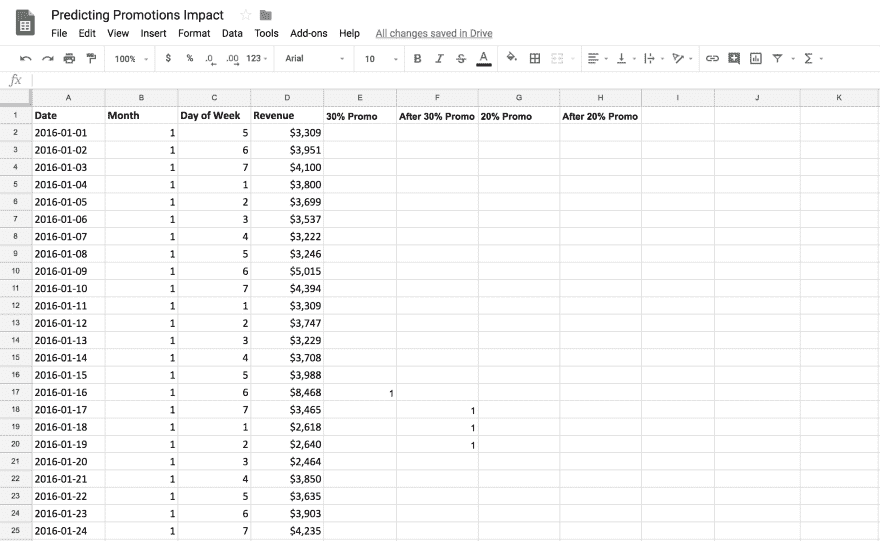
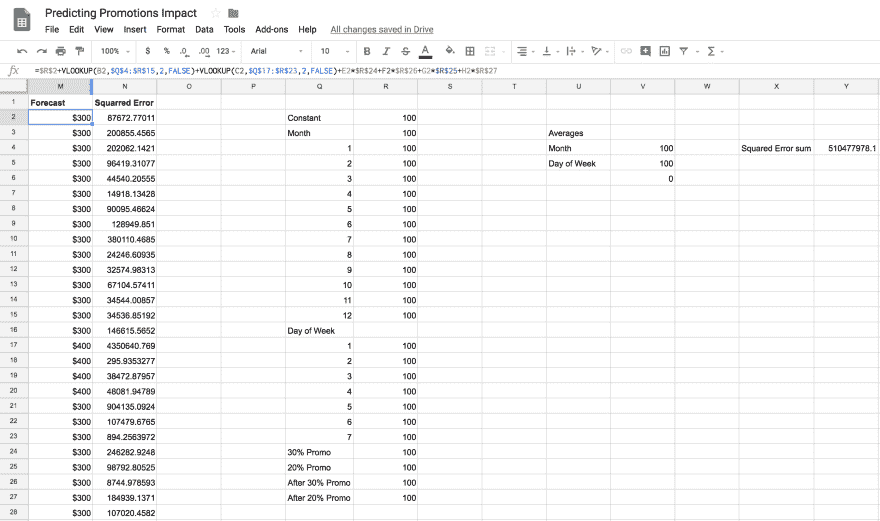
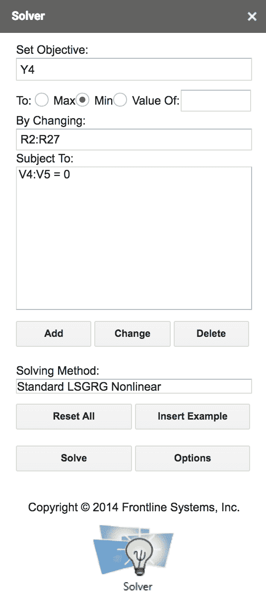
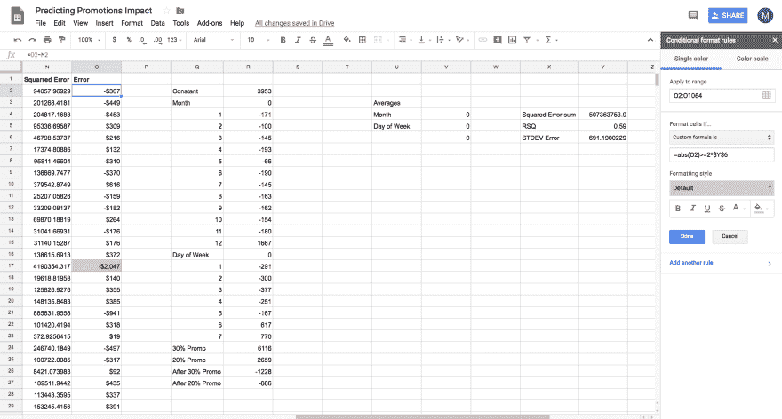
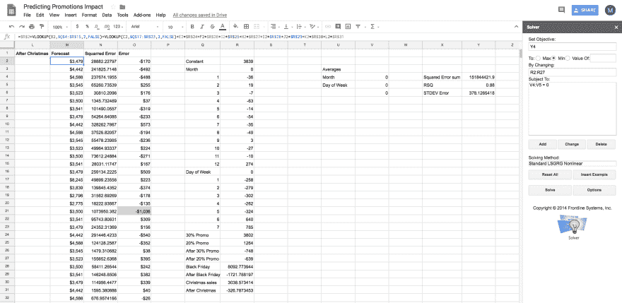
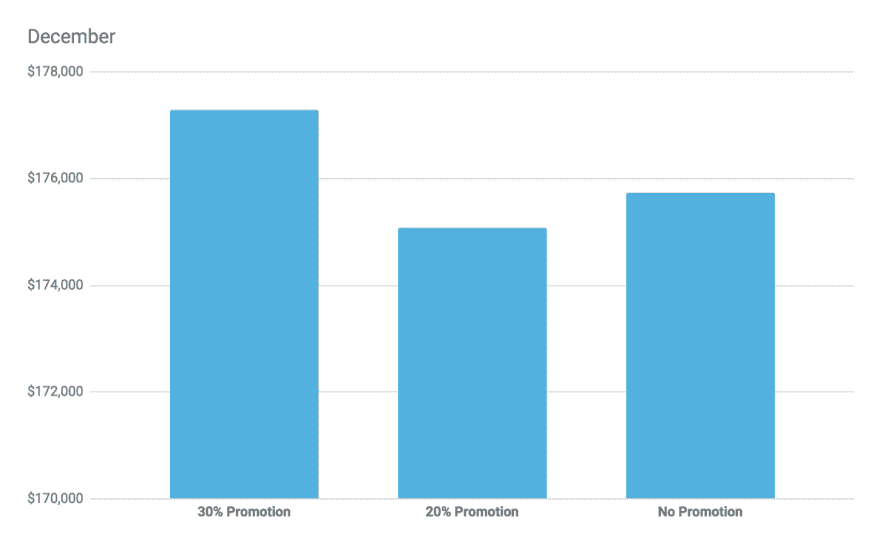

# 用 Google Sheets 预测促销对销售的影响

> 原文：<https://dev.to/the_mmw/predicting-the-impact-of-promotions-on-sales-with-google-sheets-3mfm>

销售季节开始了。黑色星期五和圣诞节传统上是一年中促销力度最大的日子。然而，对于许多营销分析师和数据驱动的营销人员来说，如何预测促销活动的结果存在许多不确定性。显然，大多数促销可能会带来更多的订单，但它会带来多少增量收入呢？在促销后的一段时间里，它甚至会通过蚕食销售额而产生负面影响吗？还是说总体效果是积极的？

想象一下，如果你有一个预测模型，可以用来预测你计划的促销活动的效果。让你更加确定你的销售收入会有多大。T3】

本指南提供了如何根据过去的促销活动为您的企业开发这样一个预测模型的逐步说明。你所需要的只是谷歌工作表和一个免费的求解器插件。我建议在[提供的工作表](https://docs.google.com/spreadsheets/d/1VHqQ3IZyHj4Pb_sdLmzVLZQxga9DxLyoSfCnkSltURk/edit#gid=947371573)中一起工作，以真正理解一切。

## 定义任务

在这个例子中，你得到了一家在线零售商在过去两年半(直到 2018 年 11 月 28 日)的历史每日收入(显然，这个模型中的技术也可以用于其他产品，如在线课程、软件等)。在过去的几年里，这家零售商分别进行了 20%和 30%的促销活动，降低了所有售出产品的价格。促销活动随机在黑色星期五和圣诞节前进行。

我们现在想弄清楚 a)这些促销的影响是什么，b)对总收入进行 20%或 30%的促销是否更有意义，以及 c)是否应该在即将到来的圣诞节期间进行促销。

## 准备数据

格式化和清理数据通常是每次数据分析的第一步。因为我们在这里处理的是一个非常简单的数据集(收入和日期),并且数据已经预先准备好，所以在清理和格式化方面没有太多工作要做。

然而，我们仍然需要为即将到来的分析做一些准备。因为我们想调查促销的影响，我们必须指出促销发生的日期。此外，我们需要指出促销对促销后的日子是否有任何可见的影响，即由于收入的蚕食而产生的负面影响。

两者都已经在提供的表格中完成。在 E - H 列中,“1”分别表示一个事件已经发生。例如，单元格 E2 中的“1”表示在 2016-01-01发生了 30%的促销，而单元格 E3 - E5 中的 1 表示在这些天观察到了负面的促销后效应。

一周中的日子和季节性通常也会对销售产生影响(例如工作日与周末、夏季月份与十二月)，这也是我们希望将这些因素考虑在内的原因。

这里我们可以使用两个简单的公式:MONTH()和 WEEKDAY()，它们分别给出参考单元格的月份和星期几。这些公式已在 B 栏和 c 栏中使用

准备工作到此为止。显然，即使上面的一切都已经在我们的示例数据中提供了，您仍然需要为自己的数据集做这些。

## 建立基本模型

我们要做的是建立一个模型，根据季节性和促销的影响来预测销售额。我们将有以下五个因素影响我们的销售预测:

1.  作为基础的常数
2.  影响一周中某一天的效果
3.  当月影响效果
4.  促销日的影响效果
5.  促销后几天的影响效果

这意味着每天的收入预测将通过以下等式计算:

预计收入=常数+ [星期效应] + [月份效应] + [20%促销效应]+[20%促销效应后的天数] +[30%促销效应]+[30%促销效应后的天数]

将这些单个参数放入单元格 Q2 中:Q27 和 a 100 放入 r 列的相应单元格中。这些只是试验值，将作为系数。

我们将使用求解器来估计系数，这将使模型最适合我们的数据，即最小化我们的预测和历史数据之间的(平方)误差。但稍后会详细介绍。

下一步是编写实际的公式，它对应于上面的等式。在单元格中，M2 放入下面的公式，并将其拖至整个列:

=$R$2 + VLOOKUP(B2，$ Q $ 4:$ 15.2，FALSE) + VLOOKUP(C2，$ Q $ 17:23.2，FALSE)+E2 * $ 24+F2 * $ 26+G2 * $ 25+H2 * $ 27

R2 代表常数。【VLOOKUP】(，【Q $ 4:$ R $ 15， 2 ， FALSE )取每个月的系数，而 VLOOKUP(，【Q $ 17:$ R $ 23如果某一天发生促销活动E2*$ R $ 24和G2$ R $ 25将分别获得 20%和 30%的促销效果，而F2*$ R $ 26 和**

 **

现在你将计算每天的平方误差。这可以简单地通过将=(D2-m2)^2放入 N2 中并沿着列向下拖动来完成。将单元格 Y4 中的所有平方误差相加。

在使用规划求解之前，你必须做的最后一件事是对一周中的每一天和每一个月的所有值进行平均。你可以把= AVERAGE(R17:R23)放入 V4，把= AVERAGE(R4:R15)放入 V5。我们这样做是因为我们将向规划求解模型添加约束，这些约束将一周的平均天数和平均月数约束为 0。我们这样做是因为这些约束确保一周或一个月中具有正面影响的某一天的收入高于平均收入，而具有负面影响的某一天的收入低于平均收入。

如果你还没有:不，是时候[下载求解器](https://chrome.google.com/webstore/detail/solver/iennicjichkeiajiflbcmaaohildohpb?hl=en)了。这样做之后，点击附加组件- >求解器- >开始设置:

我们想通过改变 R2:R27 的值来最小化目标单元格 Y4，同时约束 V4:V5 = 0。

因此，基本上我们所做的就是通过改变上述五个因素的系数来最小化历史收入数据和我们虚构的预测之间的平方误差。当你设置好求解器后，点击“求解”。

结果告诉你一些事情。例如，30%的促销日增加了 6116 美元的收入(其他条件相同)。周末在收入方面比其他工作日好得多，12 月也是销售增长的主要原因。促销后的几天通常会导致收入下降。

### 评估模型

您可以通过计算预测和实际历史收入之间的 R2 值来评估模型。为此将= RSQ(D2:d 1064， M2:M1064 )插入 Y5 单元格。该公式计算收入变化的百分比，预测模型对此进行了解释。在我们的例子中，我们应该得到 0.59，这意味着五个因素的独立变量解释了收入每日变化的 59%。显然，这个模型还有改进的空间。

为了做到这一点，我们将尝试找出每日预测准确性中的任何异常值。第一步，计算预测和历史每日收入之间的误差。通过将=-放入单元格 O2 中，并将其复制到下一列。在单元格 Y6 中使用公式= STDEV(O2:o 1064)计算预测的标准误差的近似标准偏差。

如果预测误差的绝对值超过标准误差的两倍，我们定义异常值。因此，下一步我们想找出符合这个定义的异常值。为此，我们将使用条件格式。选择范围 O2:O1064，点击格式->->添加新规则。在“格式如果…”下拉菜单中选择“自定义公式是”，并在方框中填入=abs(O2) > =2*$Y$6。

这将突出显示上述定义内的所有异常值。

令人惊讶的是，我们会在黑色星期五前后和圣诞节前发现异常值群，这两种情况我们都没有包括在原始模型中。然而，很明显，人们在这些日期(如 12/01 - 12/17)购物更多，之后(如 12/18 - 12/31)购物更少。

## 改进模型

现在我们知道了是什么导致了异常值和较低的预测准确性，我们可以通过将这些因素添加到我们原来的五个因素中来改进我们的模型。

因此，我们将在 I:L 列的标题中添加黑色星期五、黑色星期五之后、圣诞节销售、圣诞节之后，以便能够标记每天发生的这些事件，类似于我们之前为促销所做的。因此，我们将在 Q28:R31 中添加这些新因素的系数。

我们现在要做的最后一项调整是在预测计算中加入这些因素。将以下公式放入 M2 单元格，并将其拖至 M1064(我们分别添加了黑色星期五、圣诞节和这些事件之后的日子作为因素):

$ r $ 2+vlookup(【B2】， $Q$4:$R$15 【false】)+【e23】【r24】+  +*【r30】+

现在使用添加的变量再次运行求解器:

加入这些变量后，R2 大幅提高至 0.88，这意味着变量 e 解释了收入日变化的 88%

## 实际预测

到目前为止，我们只研究了预测模型。下一步显然是用这个模型预测销售收入，直到年底，并检查 20%或 30%的促销有什么影响。这实际上是容易的部分。

首先将公式从单元格 M1064 复制到所有单元格 M1065:M1097。接下来，在 K 列和 L 列中标记圣诞节销售时间和圣诞节销售后的天数(这在这里很容易，因为销售收入的变化非常明显。然而，在现实生活数据中可能更难发现。)

这将给你一个没有任何促销的 12 月预期收入的预测:总收入为 175，734 美元。

如果我们在 2018-12-01进行 20%的促销，现在让我们试试会发生什么。将指标分别插入 G1067 和 H1068:H10670。现在 12 月的总收入是 175，082 美元。

删除 20%促销的指标，并通过在 E1067 和 F1068:F10670 中写入“1”来尝试 30%促销。12 月的总收入现在是 177，291 美元。差别不大，但还是 30%的促销更好。

就这样，我们完成了！我们现在能够回答我们最初的所有问题:我们知道这些促销活动分别会对收入产生什么影响，以及我们应该在圣诞节期间开展哪些促销活动

## 限制

你可能想知道，为什么我们没有用回归分析工具来解决这个问题。这个问题的答案其实很简单:

对于带有典型电子表格分析插件的回归分析，因变量应该是收入。此外，我们还需要 25 个独立变量来说明不同的因素(月份、星期几、促销、黑色星期五、圣诞节、活动后的日子)。

大多数分析插件根本无法处理那么多的独立变量(包括 Excel 分析工具库，它可以处理多达 15 个独立变量)。这就是为什么我们使用求解器(它允许更多的可变单元)来估计独立变量的系数，以最小化误差平方和。

此外，与上述所有模型一样，创建的模型只是对现实的简化，永远无法给出 100%准确的预测。此外，在这种情况下，收入数字也被简化了。因为这样的收入增长不包括在内。此外，事件日和事件后日非常容易识别，可以与正常日明显区分开来。如前所述，这对于现实生活中的数据集来说可能更加困难。

尽管如此，上述指南为开发您自己的预测模型并使模型适合您的收入数据和事件提供了良好的基础。所以你的下一步是将它与你自己的数据集相匹配，并预测圣诞节促销对你是否有意义！**