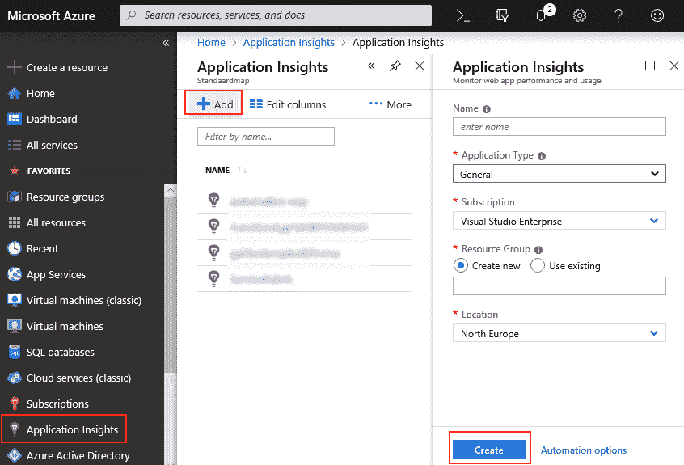
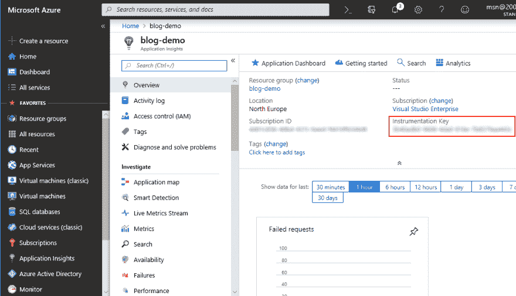
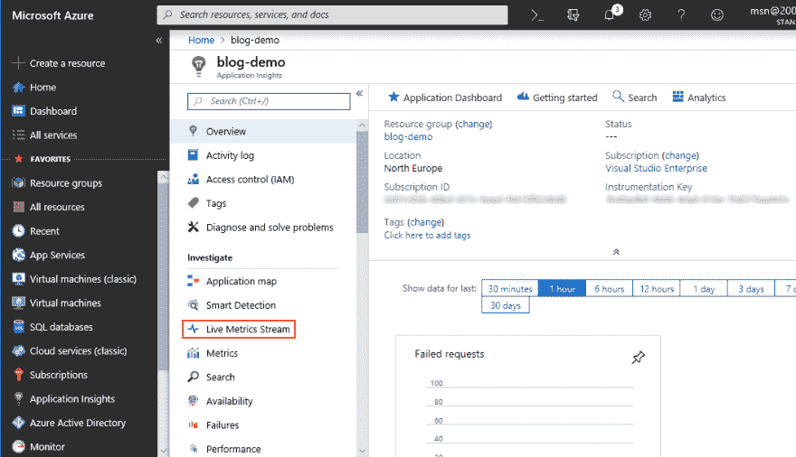

# 使用 Azure Application Insights 监控非 web 应用程序(第 1 部分:入门)

> 原文：<https://dev.to/expecho/monitoring-non-website-applications-using-azure-application-insights-part-1--42oa>

这是系列文章的第一篇，我们将看看如何使用 [Application Insights](https://docs.microsoft.com/en-us/azure/application-insights/app-insights-overview) 来监控 web 应用之外的其他应用。大多数应用程序环境是基于云的应用程序和本地应用程序的混合。有些是基于网络的，有些是桌面应用程序。如果我们可以使用一个工具来监控它们，这不是很好吗？幸运的是，有一个运行在 Azure 上的低成本监控解决方案 Application Insights。

这篇文章将介绍应用洞察和监控桌面应用的第一步。

# 什么是应用洞察？

*Application Insights 是一个**可扩展的**应用性能管理(APM)服务，面向**多个平台**上的 web 开发人员。使用它来监控您的实时 web 应用程序。它会自动检测性能异常。它包括**强大的分析**工具，帮助你诊断问题，并了解用户实际上对你的应用做了什么。它旨在帮助您不断提高性能和可用性。它适用于各种平台上的应用，包括**。NET、Node.js 和 J2EE** ，在内部或云中托管**。它与您的 DevOps 流程集成在一起，并且具有到各种开发工具的连接点。***

 **应用洞察有几个优点:

*   它紧密集成在许多 Azure 服务中，如 Azure Web Apps、Azure Functions、Azure Kubernetes 服务等等。
*   这真的很容易配置。(通常它要么是自动完成，要么最多需要一两次点击)
*   它有一个强大的查询机制，称为[应用洞察分析](https://docs.microsoft.com/en-us/azure/application-insights/app-insights-analytics)。
*   它有许多扩展点。例如，您可以[丰富或过滤](https://docs.microsoft.com/en-us/azure/application-insights/app-insights-api-filtering-sampling)遥测数据，并且[跟踪您自己的](https://docs.microsoft.com/en-us/azure/application-insights/app-insights-api-custom-events-metrics?toc=/azure/azure-monitor/toc.json)遥测数据。
*   您可以[创建并固定](https://docs.microsoft.com/en-us/azure/azure-monitor/visualizations?toc=/azure/azure-monitor/toc.json)您自己的视觉效果。
*   它有强大的[报警能力](https://docs.microsoft.com/en-us/azure/azure-monitor/platform/alerts-overview)。
*   它不限于运行在云中的工作负载。
*   就是[开源](https://github.com/Microsoft?utf8=%E2%9C%93&q=applicationinsights&type=&language=)。

# 监控简单的桌面应用程序

大多数关于 Application Insights 的文档和博客文章都是关于设置监控 web 应用程序的。这真的很简单，因为所有需要做的就是添加一些 NuGet 包，提供一个工具键，并添加一些配置代码。然后，您可以自动将请求、异常和跟踪遥测发送到应用洞察，因为它可以挂钩到 Asp.Net(核心)框架提供的几个扩展点。但是不幸的是，当你使用 WPF 或 WinForms 开发桌面应用程序时，没有请求管道这样的机制可以使用。但是，正如我们将在本系列中探讨，这并不意味着我们完全不能使用应用程序洞察。

所以，事不宜迟，这就是本系列将要讨论内容:

1.  在 Azure 中提供应用洞察资源，并启用我们的小控制台应用程序的[实时指标流](https://docs.microsoft.com/en-us/azure/application-insights/app-insights-live-stream)。
2.  向我们的代码中添加基本工具，并将其发送至应用洞察。
3.  通过自动跟踪异常、请求和依赖性来增强我们的工具。

## 供应应用洞察资源

显然，我们需要做的第一件事是创建一个应用洞察资源供我们使用。然后，我们需要提取我们的应用程序中需要的检测密钥，以配置 Application Insights 集成。

转到 [Azure 门户](https://portal.azure.com/)并创建一个应用洞察资源:

[](https://res.cloudinary.com/practicaldev/image/fetch/s--fKLz4Sxz--/c_limit%2Cf_auto%2Cfl_progressive%2Cq_auto%2Cw_880/https://expecho.blob.core.windows.net/blogposts/create-appinsights.png)

创建资源后，浏览到该资源并记下检测密钥。我们将在应用程序中使用这个密钥。

[](https://res.cloudinary.com/practicaldev/image/fetch/s--PQTNCR5V--/c_limit%2Cf_auto%2Cfl_progressive%2Cq_auto%2Cw_880/https://expecho.blob.core.windows.net/blogposts/appinsights-getinstkey.png)

暂时就这样了。是时候创建我们的应用程序了。

## 在我们的应用中实现应用洞察

我用 Visual Studio 2017 创建了一个. Net 4.7.2 控制台应用程序。要使用 Application Insights，我们必须添加对 Microsoft。application insights . windows server[n 获取包](https://www.nuget.org/packages/Microsoft.ApplicationInsights.WindowsServer/)。(这将自动引用微软。ApplicationInsights 包)

当 NuGet 包被安装后，一个新文件被添加到项目中，名为`ApplicationInsights.config`。打开该文件并添加工具键，如下所示添加顶部:

```
<?xml version="1.0" encoding="utf-8"?>
<ApplicationInsights xmlns="http://schemas.microsoft.com/ApplicationInsights/2013/Settings">
  <InstrumentationKey>YOUR_KEY_HERE</InstrumentationKey>
  <TelemetryInitializers>
    <Add Type="Microsoft.ApplicationInsights.DependencyCollector.HttpDependenciesParsingTelemetryInitializer, Microsoft.AI.DependencyCollector"/>
    <Add Type="Microsoft.ApplicationInsights.WindowsServer.AzureRoleEnvironmentTelemetryInitializer, Microsoft.AI.WindowsServer"/>
    <Add Type="Microsoft.ApplicationInsights.WindowsServer.AzureWebAppRoleEnvironmentTelemetryInitializer, Microsoft.AI.WindowsServer"/>
    <Add Type="Microsoft.ApplicationInsights.WindowsServer.BuildInfoConfigComponentVersionTelemetryInitializer, Microsoft.AI.WindowsServer"/>
  </TelemetryInitializers>
  <TelemetryModules>
... 
```

现在，我们可以选择从我们的应用程序向 Application Insights 发送一些“Hello World”消息，但让我们做得更生动一些。如果我们能够实时了解运行应用程序的机器的 cpu 和内存使用情况，这不是很好吗？让我们尝试通过修改我们的控制台应用程序来实现这一点:

```
using System;
using Microsoft.ApplicationInsights.Extensibility;

namespace NonWebIntegrationDemo
{
    class Program
    {
        static void Main(string[] args)
        {
            _ = TelemetryConfiguration.Active;

            Console.WriteLine("Press any key to exit.");
            Console.ReadKey();
        }
    }
} 
```

线路`_ = TelemetryConfiguration.Active;`触发 SDK 开始向应用洞察发送遥测数据。

现在，构建并执行应用程序，并让它运行。浏览至 Azure 门户，并导航至您的应用洞察资源。在那里，打开“实时指标流”选项卡，观察应用程序的实时反馈:

[](https://res.cloudinary.com/practicaldev/image/fetch/s--ZAkMZBf---/c_limit%2Cf_auto%2Cfl_progressive%2Cq_auto%2Cw_880/https://expecho.blob.core.windows.net/blogposts/appinsights-livestream.png)

[](https://res.cloudinary.com/practicaldev/image/fetch/s--QLs_k5r0--/c_limit%2Cf_auto%2Cfl_progressive%2Cq_auto%2Cw_880/https://expecho.blob.core.windows.net/blogposts/LiveMetricsStream-Basic.PNG)

直播流显示数据可能需要一段时间，请耐心等待。

现在就这样吧！我们已经创建了一个 Application Insights 资源，并在控制台应用程序中成功配置了它。这将是我们下一个帖子的出发点，敬请关注。**