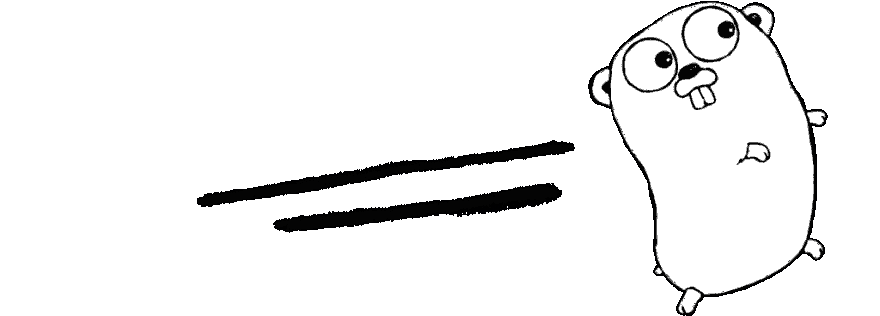

# 学习戈朗

> 原文：<https://dev.to/gayanhewa/learning-golang-35mc>

<figcaption>[【https://common . wikimedia . org/wiki/file:golang . png】](https://commons.wikimedia.org/wiki/File:Golang.png)</figcaption>

几个月前，我把钱押在自学高尔夫上。我想看看 Go 有几个原因。第一个是，易于封装和 gRPC 支持。接下来是并发模型和 go 例程如何工作。围绕语言和生态系统的最后的社区和资源。

在 youtube 上花了几个小时，读了一些文章和教程后，我确信我需要一个学习基本面的好地方。毕竟，没有基础，我们只是在试错的基础上做猜测。我看了几本书和一些视频课程。

一开始，我花了几个小时完成了 [Go 速成课程](https://www.youtube.com/watch?v=SqrbIlUwR0U),以便对语言和结构有所了解。做完这些后，我得到了我读过的最好的编程语言入门书[行动起来](https://www.amazon.com/Go-Action-William-Kennedy/dp/1617291781)

这些作者做了如此惊人的工作，书中使用的例子既实用又发人深省。第一章让您体验了如何在应用程序中有效地使用 Goroutines 和并发性。对内部如何工作的解释形成数组、切片、到接口的映射。

这本书太棒了。但是，我错过了一些东西。我想实践我学到的东西。所以像大多数其他情况一样，我在考虑做点什么。一般来说，当你需要在一个项目中使用不同的栈时，你也可以很好地学习这个栈。我想，为什么不呢。一两周之后，我意识到这是无济于事的。纯粹是因为一些结构和它们的用法对我来说有点陌生。所以我觉得不太自然。当我在思考克服困难的方法时，我想起了看 Cameron Price 关于 T2 微模式的视频。在这里，他讨论了他是如何通过采取小步骤和解决小问题来学习长生不老药的。看完这个，我决定开始[Go track exercisem . io](https://exercism.io/my/tracks/go)

一旦开始追踪，我也给自己弄了一本[小围棋书](https://github.com/karlseguin/the-little-go-book)，当我想快速刷新一些话题时，我就用小围棋书作为参考。如果我想完整地重读一个领域，我会回到《行动起来》的相关章节。有了这些，我现在正在用围棋编程来完善我的基础知识。

exercism.io 上的辅导课程让学习变得更加有趣，社区会为您提供如何解决问题的反馈。查看发布的社区对同一问题的回答，可以让您深入了解其他开发人员的思考过程，他们做得好的地方，以及您可以从彼此身上学到什么。

到目前为止，在我看来，这是我过去 5 年多来最有成效的学习经历。我解决的这些微模式或问题让我洞察到一些小细节，如果我构建一个学习语言和生态系统的入门级应用程序，我会错过这些细节。

当你学习 Go lang 的时候，你可以在这里找到你的问题的答案，

*   问答:stackoverflow.com
*   资源精选列表:[https://github.com/avelino/awesome-go](https://github.com/avelino/awesome-go)
*   松弛通道:[https://invite.slack.golangbridge.org/](https://invite.slack.golangbridge.org/)