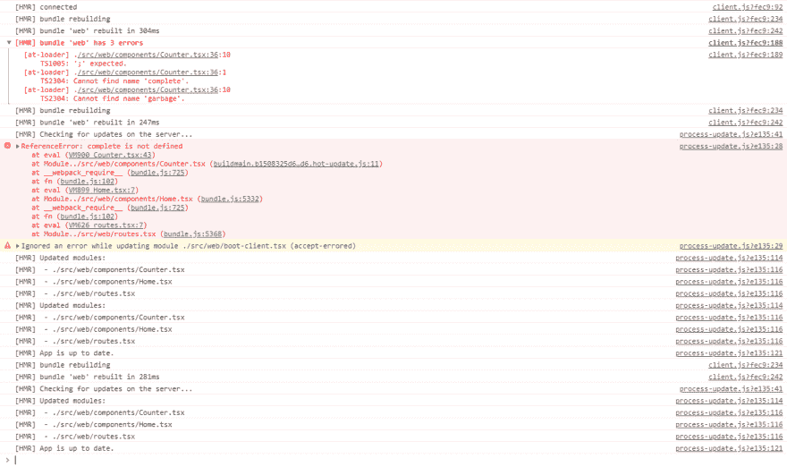
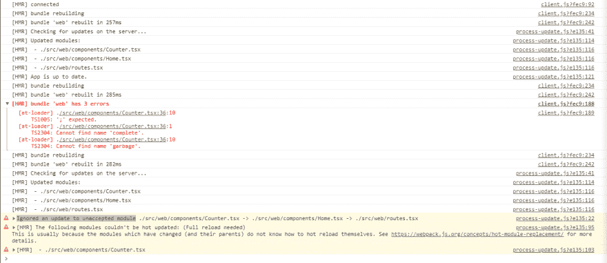
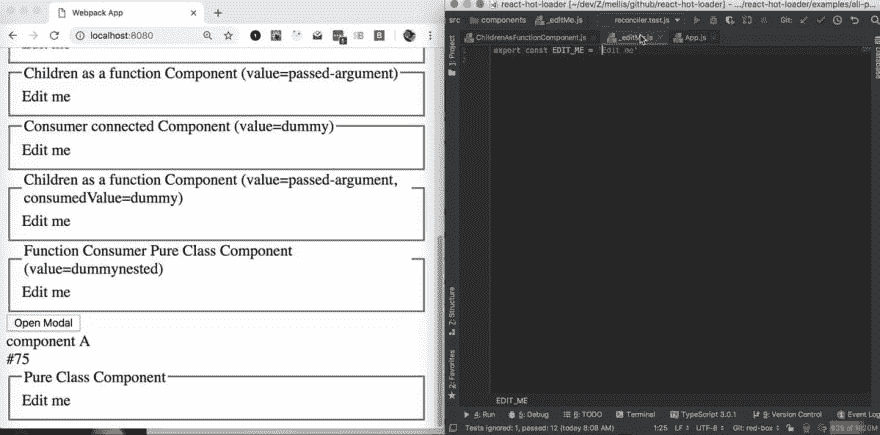
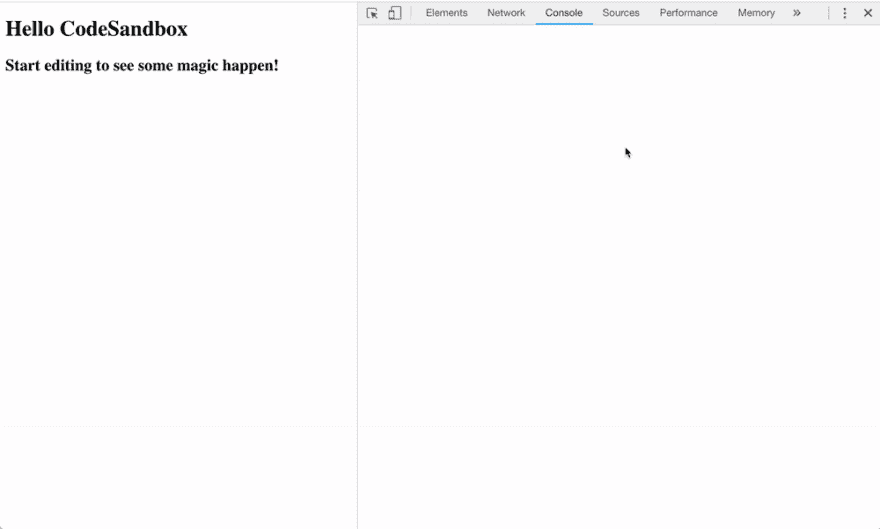

# 反应热加载器 4.6

> 原文：<https://dev.to/thekashey/react-hot-loader-46-3d7c>

# 里面是什么？

*   更好的 HMR 的新顶级 API
*   react 16.6–react . lazy、React.memo 和 forwardRef 支持
*   反作用挂钩支架
*   反应-🔥表示“状态”
*   Webpack 插件
*   自动误差边界
*   纯渲染
*   “原则”

# 新顶级 API

新的热门 api 比以前更火了！

> 在
> 之前

```
import {hot} from 'react-hot-loader';
....
export default hot(module)(MyComponent) 
```

> 现在

```
import {hot} from 'react-hot-loader/root';
....
export default hot(MyComponent) 
```

为什么？我们只是将`hot(module)`移到了`/root`中，所以 HMR 将在模块执行之前配置，我们将能够在更新期间处理错误。

# [ 热重装出错后不该停止 #1078](https://github.com/gaearon/react-hot-loader/issues/1078) 

[](https://github.com/mjhoffm2) **[mjhoffm2](https://github.com/mjhoffm2)** posted on [<time datetime="2018-10-08T22:58:41Z">Oct 08, 2018</time>](https://github.com/gaearon/react-hot-loader/issues/1078)

### 描述

目前，如果热重新加载的代码中有编译错误，我会看到一个包含错误信息的覆盖图，以及控制台中关于这些错误的消息。然而，在解决了这些错误之后，热重装应该会像平常一样继续，但是目前没有。

### 预期的行为

当我保存一段有错误的代码，然后修复错误，我应该能够继续编辑和热重装我的应用程序。这在不使用 react-hot-loader，而只使用 webpack-hot-middleware 的情况下工作得非常好。

```
function render(rootContainer: JSX.Element) {
    ReactDOM.render(
        <Provider store={store}>
            <ConnectedRouter history={history}>
                {rootContainer}
            </ConnectedRouter>
        </Provider>,
        document.getElementById('root')
    );
}

render(<Routes />);

//configure hot module replacement during development
if(module.hot) {
    module.hot.accept('./routes', () => {
        const NewRoutes = require('./routes').Routes;
        render(<NewRoutes />);
    });
}
```

[](https://user-images.githubusercontent.com/29382626/46637642-bb823780-cb22-11e8-82d2-22229a571722.png)

### 实际行为

实际发生的情况:

在我的 Routes 组件中使用 react-hot-loader 和`hot(module)( ... )`时，在我修复错误后，我的应用程序不再能够热重装。我看到下面: [](https://user-images.githubusercontent.com/29382626/46637458-e029df80-cb21-11e8-9198-ad05457d4f87.png)

我看到错误覆盖消失了，但是我的组件不再更新。

### 环境

React 热加载程序版本:4.3.11

在项目文件夹中运行这些命令，并填写其结果:

1.  `node -v` : v8.10.0
2.  `npm -v` : 6.4.1

然后，指定:

1.  操作系统:Windows 10
2.  浏览器和版本:谷歌 Chrome 版本 69.0.3497.100(正式版)(64 位)

### 可复制演示

如果有必要，我可以做

[View on GitHub](https://github.com/gaearon/react-hot-loader/issues/1078)

# 反应 16.6 支持

`forwardRef`会正常工作，`memo`会在 HMR 上更新(使用我们新的超级深层力量更新)，而`lazy`会自动导入更新的模块。
一切**开箱**。

# 反应钩子支持

React 16.7 发布后，我们发现钩子不受支持。一点也不。结果，hooks 并没有得到所有消费者的支持，包括故事书和盖茨比。

# [Gatsby-develop | use state from react hooks 在开发环境中不起作用 #9489](https://github.com/gatsbyjs/gatsby/issues/9489) 

[](https://github.com/aamorozov) **[aamorozov](https://github.com/aamorozov)** posted on [<time datetime="2018-10-28T02:25:47Z">Oct 28, 2018</time>](https://github.com/gatsbyjs/gatsby/issues/9489)

## 描述

当运行 dev 服务器时，react 钩子的状态没有任何错误。然而，在编译完文件后，它在生产环境中是有效的。

### 步骤重现

1.  拉下[https://github.com/aamorozov/gatsby-react-hooks](https://github.com/aamorozov/gatsby-react-hooks)；
2.  运行`yarn && gatsby develop`；
3.  当 dev server 运行时，单击按钮——这里的状态没有更新；
4.  运行`gatsby build && gatsby serve`
5.  当 prod 服务器运行时，单击按钮——状态被正确更新。

### 预期的结果

react-hooks 的状态应该在开发/生产版本中都有效。

### 实际结果

react-hooks 的状态只在生产版本中有效。

### 环境

```
System:
    OS: macOS 10.14
    CPU: x64 Intel(R) Core(TM) i5-5257U CPU @ 2.70GHz
    Shell: 3.2.57 - /bin/bash
  Binaries:
    Node: 11.0.0 - /usr/local/bin/node
    Yarn: 1.10.1 - /usr/local/bin/yarn
    npm: 6.4.1 - /usr/local/bin/npm
  Browsers:
    Chrome: 69.0.3497.100
    Firefox: 62.0.3
    Safari: 12.0
  npmPackages:
    gatsby: ^2.0.19 => 2.0.28
    gatsby-plugin-flow: ^1.0.2 => 1.0.2
    gatsby-plugin-jsxstyle: ^0.0.3 => 0.0.3
    gatsby-plugin-manifest: ^2.0.5 => 2.0.5
    gatsby-plugin-offline: ^2.0.5 => 2.0.7
    gatsby-plugin-react-helmet: ^3.0.0 => 3.0.0
  npmGlobalPackages:
    gatsby-cli: 2.4.3 
```

[View on GitHub](https://github.com/gatsbyjs/gatsby/issues/9489)

# [ 故事书不兼容 React 钩子 #4691](https://github.com/storybookjs/storybook/issues/4691) 

[](https://github.com/ilias-t) **[ilias-t](https://github.com/ilias-t)** posted on [<time datetime="2018-11-01T23:37:20Z">Nov 01, 2018</time>](https://github.com/storybookjs/storybook/issues/4691)

**描述 bug** 试图将使用钩子的 react 组件渲染到 storybook staging 环境中抛出错误`Hooks can only be called inside the body of a function component`。

**重现**重现行为的步骤:

1.  创建一个使用钩子的 react 组件
2.  在 storybook 中导入和渲染组件

**预期行为** Storybook 应该能够显示使用钩子的 React 组件。

**代码片段**

组件代码

```
import React, { useState } from "react";

export default function ColorChanger() {
  const [color, setColor] = useState("#000");
  const randomColor = "#" + Math.floor(Math.random() * 16777215).toString(16);
  return (
    <div style={{ color }} onClick={() => setColor(randomColor)}>
      Color is: {color} (click to change)
    </div>
  );
} 
```

注意，这段代码在 codesandbox 上运行:[https://codesandbox.io/s/n5rmo77jx0](https://codesandbox.io/s/n5rmo77jx0)

**系统:**

*   浏览器:Firefox
*   框架:反应
*   版本:4.0.2

[View on GitHub](https://github.com/storybookjs/storybook/issues/4691)

问题来自 React-Hot-Loader 的性质——它用基于类的组件包装 SFC，这不支持钩子。
社区很快找到了解决方法——只需更改一个选项，并告诉 RHL 停止包装 SFC—`{pureSFC: false}`。

现在这个选项默认是启用的。我们还增加了另一个改变游戏规则的选项…

# React-Hot-Dom

React-Hot-Loader 总是侵入 React，通过向它“呈现”代理组件而不是真实的组件来隐藏真实的更新。代理包装器只是更新它们所代表的真实组件的引用，从而使热更新成为可能。

版本 4.5 改变了这一点——比较移到了 React-Dom 内部，实现了更好的协调，提供了停止包装元素的能力(目前只有 SFC)。所以 RHL 不能像以前那样影响类型比较。

要启用高级模式，我们需要修补 react-dom 代码——有两种方法
可以做到——使用[热加载器/react-dom](https://github.com/hot-loader/react-dom) (参见自述文件)

```
// this would always work
yarn add @hot-loader/react-dom@npm:react-dom
// or change your webpack config
alias: {
  'react-dom': '@hot-loader/react-dom'
}
// or do the same with package.json to enable it in parcel 
```

或者使用我们的 Webpack 加载器…

# Webpack 加载器

Webpack loader 是我们在版本 4 中移除的一个东西。又来了。

使用 Webpack loader 可以:

*   来快速处理你的 node_modules，并帮助 RHL 更好地理解你的代码或者里面的一切。
*   要自动修补反应堆

两种不同的选择来得到一个更热的版本 React-don't 将适合几乎所有人。

# 自动误差边界

现在 RHL 会通知你更新过程中的任何错误，包括阻止更新的错误。同样，就在热模块替换(或懒惰组件更新)之后，RHL 会将`componentDidCatch`注入到每个基于类的组件中，以“就地”捕捉错误。

> <video loop="" controls=""><source src="https://video.twimg.com/ext_tw_video/1072626065942724608/pu/pl/N_tWH6VCTM0BEohc.m3u8?tag=6" type="application/x-mpegURL"></video>Anton korzunov[@ thekashey](https://dev.to/thekashey)[# react loader](https://twitter.com/hashtag/ReactHotLoader)原则:
> ✅一个语法错误不应该引起运行时错误或刷新
> ✅一个热重装时引入的运行时错误应该如果你在一个组件中犯了错误，它不应该破坏你的整个应用程序。
> 
> 很快-2018 年 12 月 11 日 22:57 点[](https://twitter.com/intent/tweet?in_reply_to=1072626544135335936)[](https://twitter.com/intent/retweet?tweet_id=1072626544135335936)1[](https://twitter.com/intent/like?tweet_id=1072626544135335936)2

# 【纯】渲染

是多年来无人问津的事情。像往常一样，React-Hot-Loader 用自己的版本替换了 render 但是 React-Dev-Tools 让你能够右击元素，并跳转到源代码..

[](https://res.cloudinary.com/practicaldev/image/fetch/s--I8Gqial8--/c_limit%2Cf_auto%2Cfl_progressive%2Cq_66%2Cw_880/https://thepracticaldev.s3.amazonaws.com/i/d7lflk9fj1juj7hyhykq.gif)

[https://github.com/facebook/react-devtools/pull/1191](https://github.com/facebook/react-devtools/pull/1191)

现在你可以提供选项`pureRender`(抱歉，默认情况下还没有启用)，渲染方法的副作用会被移除。

请测试这个选项，并帮助我把它设为默认。

PS:这个选项只影响“类组件”。对于 SFC，您必须使用 ignoreSFC，这只有在使用 react-dom 补丁时才有可能。

# 原则

现在，RHL 将试图与丹·阿布拉莫夫的“热点原则”更加兼容。我们知道现代的热重装体验与理想相差甚远，我们非常确定书面原则是我们要遵守的。

[https://overreacted.io/my-wishlist-for-hot-reloading/](https://overreacted.io/my-wishlist-for-hot-reloading/)

# [🚀追踪“原则”合规 #1118](https://github.com/gaearon/react-hot-loader/issues/1118) 

[](https://github.com/theKashey) **[theKashey](https://github.com/theKashey)** posted on [<time datetime="2018-12-09T20:34:57Z">Dec 09, 2018</time>](https://github.com/gaearon/react-hot-loader/issues/1118)

[https://overreacted.io/my-wishlist-for-hot-reloading/](https://overreacted.io/my-wishlist-for-hot-reloading/)

## 正确性

*   [x] ( `partialy` ) **热重装在第一次编辑**之前应该是观察不到的。在保存文件之前，代码的行为应该与禁用热重装时的行为完全一样。预计 fn.toString()之类的东西不匹配，这已经是 minification 的情况了。但是它不应该破坏合理的应用程序和库逻辑。热重装不应该破坏反应规则。组件不应该以意外的方式调用它们的生命周期，意外地在不相关的树之间交换状态，或者做其他非反应性的事情。
*   [x] ( `partialy` ) **元素类型应该总是匹配预期的类型**。一些方法包装组件类型，但是这可能会中断。type === MyThing。这是常见的错误来源，不应该发生。
*   [x] **应该很容易支持所有的 React 类型**。lazy、memo、forwardRef——它们都应该得到支持，添加更多支持应该不难。像 memo(memo(...))应该也行。当字体形状改变时，我们应该重新安装。它不应该重新实现 React 的重要部分。很难跟上 React。如果一个解决方案重新实现 React，它会带来长期的问题，因为 React 增加了像悬念这样的特性。
*   [x] **再出口不应破坏**。如果一个组件从其他模块(无论是 own 还是 node_modules)重新导出组件，这应该不会引起问题。静态字段不应该中断。如果您定义了一个 ProfilePage.onEnter 方法，您会希望导入模块能够读取它。有时库依赖于此，所以重要的是能够读写静态属性，并且组件本身“看到”相同的值。
*   [ ] **失去局部状态总比行为不正确好**。如果我们不能可靠地修补某个东西(例如，一个类)，丢失它的本地状态比做一个混合的成功努力来更新它要好。无论如何，开发人员都会怀疑，并且可能会强制刷新。我们应该有意识地选择那些我们有信心能够处理的案件，并放弃其余的。丢失本地状态比使用旧版本要好。这是前一个原理的更具体的变体。例如，如果一个类不能被热重载，代码应该强制用新版本重新装载那些组件，而不是一直呈现僵尸。

## 地点

*   [x] ( `partialy` ) **编辑一个模块要尽可能少的重新执行模块**。通常不鼓励组件模块初始化期间的副作用。但是你执行的代码越多，某些东西被调用两次就越有可能造成混乱。我们正在编写 JavaScript，React 组件是(相对)纯净的孤岛，但即使在那里，我们也没有强有力的保证。因此，如果我编辑一个模块，我的热重装解决方案应该重新执行该模块，如果可能的话，尝试在那里停止。
*   编辑一个组件不应该破坏它的父组件或兄弟组件的状态。类似于 setState()只影响下面的树，编辑一个组件不应该影响它上面的任何东西。
*   [x] **对非反应代码的编辑应该向上传播**。如果你编辑一个包含常量或纯函数的文件，而这些常量或纯函数是从几个组件导入的，那么这些组件应该会更新。在这样的文件中丢失模块状态是可以接受的。
*   [x] **热重装期间引入的运行时错误不应传播**。如果你在一个组件中犯了错误，它不应该破坏你的整个应用程序。在 React 中，这通常通过错误边界来解决。然而，对于我们在编辑时犯下的无数错别字来说，它们太粗糙了。当我在一个组件上工作时，我应该能够在不卸载它的兄弟或父组件的情况下制造和修复运行时错误。然而，在热重新加载期间不会发生的错误(在我的代码中是合理的错误)应该出现在最近的错误边界。
*   [ ] **保留自己的状态，除非开发人员不想这么做**。如果你只是调整样式，那么每次编辑都要重置状态是令人沮丧的。另一方面，如果您只是更改了状态形状或初始状态，您通常会希望它重置。默认情况下，我们应该尽力保持状态。但是如果它在热重新加载期间导致一个错误，这通常是一些假设已经改变的迹象，所以我们应该重置状态并且在那种情况下重试渲染。对事物进行注释是很常见的，所以优雅地处理这一点很重要。例如，移除末尾的钩子不应该重置状态。
*   [ ] **当开发者明确想要**时，丢弃状态。在某些情况下，我们还可以主动检测到用户想要重置。例如，如果钩子顺序改变了，或者像 useState 这样的原始钩子改变了它们的初始状态类型。我们还可以提供一个轻量级的注释，您可以使用它来强制组件在每次编辑时重置。比如//！或者一些类似的约定，当您关注组件如何安装时，可以快速添加和删除这些约定。支持更新“固定”的东西。如果一个组件被包装在 memo()中，热重载仍然应该更新它。如果用[]调用一个效果，还是应该替换。代码就像一个看不见的变量。之前，我认为对于 renderRow={this.renderRow}这样的东西，在下面强制深度更新是很重要的。但是在 Hooks 的世界里，我们依赖闭包，无论如何，这似乎不再必要了。不同的参考应该足够了。
*   【x】**支持一个文件中多个组件**。在同一个文件中定义多个组件是一种常见的模式。即使我们只保留功能组件的状态，我们也希望确保将它们放在一个文件中不会导致它们丢失状态。注意这些可以相互递归。
*   [x] **可能的话，保留孩子的状态**。如果你编辑一个组件，如果它的子组件无意中丢失了状态，这总是令人沮丧的。只要在其他文件中定义了子元素类型，我们就希望保留它们的状态。如果它们在同一个文件中，我们应该尽最大努力。
*   【x】**支持自定义挂钩**。对于编写良好的定制钩子(有些情况下像 useInterval()可能有点棘手)，热重载任何参数(包括函数)应该可以。这应该不需要额外的工作，并遵循钩的设计。我们的解决方案不应该碍事。
*   【x】**支持渲染道具**。这通常不会造成问题，但验证它们是否正常工作并按预期进行更新是值得的。
*   【x】**支持高阶组件**。将导出封装到像 connect 这样的高阶组件中不应该破坏热重载或状态保持。如果你使用一个从 JSX 的一个特设中创建的组件(比如 styled)，并且这个组件是一个类，那么当它在编辑过的文件中被实例化时，它会丢失状态。但是返回函数组件(可能使用钩子)的 HOC 不应该丢失状态，即使它是在同一个文件中定义的。事实上，甚至对其参数(例如 mapStateToProps)的编辑也应该反映出来。

## 反馈

*   [x] **成功和失败都应该提供视觉反馈**。您应该始终确信热重装是成功还是失败。在运行时或语法错误的情况下，您应该会看到一个覆盖图，该覆盖图应该会在不相关后自动消除。当热重装成功时，应该会有一些视觉反馈，比如更新组件的闪烁或通知。
*   [x] **语法错误不应该导致运行时错误或刷新**。当您编辑代码时，如果有语法错误，它应该显示在一个模态覆盖图中(理想情况下，通过点击进入编辑器)。如果您犯了另一个语法错误，现有的覆盖将被更新。只有在修复语法错误后，才会尝试热重装。语法错误不应该让你失去状态。重新加载后，语法错误应该仍然可见。如果您看到一个模态语法错误覆盖和刷新，您应该仍然会看到它。它绝对不应该让你运行上一个成功的版本(我在一些设置中看到过)。
*   [ ] **考虑公开高级用户工具**。有了热重装，代码本身就可以成为你的“终端”。除了假设//！命令来强制重新安装，例如，可能有// inspect 命令，该命令显示一个面板，在组件旁边有 props 值。要有创意！
*   【x】(`partialy`)**最小化噪音**。DevTools 和警告消息不应该暴露我们正在做一些特别的事情。避免破坏显示名称或向调试输出添加无用的包装。
*   [x] **在主流浏览器中调试应该会显示最新的代码**。虽然这不完全取决于我们，但我们应该尽力确保浏览器调试器显示任何文件的最新版本，并且断点按预期工作。
*   [ ] **优化为快速迭代，而不是长时间重构**。这是 JavaScript，不是 Elm。任何长时间运行的编辑序列可能都不会很好地重新加载，因为有一堆错误需要逐一修复。当有疑问时，针对在一个紧密的迭代循环中调整一些组件的用例进行优化，而不是针对一个大的重构。并且是可预测的。记住，如果你失去了开发者的信任，他们还是会更新的。

[View on GitHub](https://github.com/gaearon/react-hot-loader/issues/1118)

目前，我们符合 14 个，部分符合 22 个中的 4 个。17/22 -相当惊人！而且已经知道下一步该怎么做了！

# 接下来是什么？

*   更新您的热加载程序！
*   把 hot 换成 hot，现在你知道它的意思了。(可选*)选择一种方式来登陆一个补丁 react-dom，一切都是我们的自述… *)即使没有这一步，一切都应该工作，但有了这一步，它会工作得更好。只有几个合成案例真正需要这个。
*   可能不需要配置——只需要内部以某种方式连接的新热点和新反应。
*   然后-尽情狂欢吧！

□和

[https://github.com/gaearon/react-hot-loader](https://github.com/gaearon/react-hot-loader)