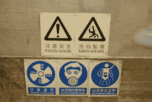

# 改造遗留项目的代码分析——我的长期成功的 4 步战略

> 原文：<https://dev.to/tdwright/retrofitting-code-analysis-to-legacy-projects--my-4-step-strategy-for-long-term-success-46hm>

在我的上一篇文章中，我谈到了我为什么喜欢代码分析器。最后，我提到了入门是多么容易，但是我忽略了这样一个事实，即在现有的应用程序上切换开关可能是一个非常痛苦的经历。在今天的帖子中，我希望通过我在几个项目中发现有帮助的 4 步策略，让这个跳跃变得更容易一些。

在这篇文章中，我推测了一些基于罗斯林的代码分析器的知识。如果你觉得这不适合你，也许值得从[我关于这个主题的介绍文章](https://dev.to/tdwright/seven-reasons-that-roslyn-based-code-analysers-are-awesome-jid-temp-slug-3430756)开始。

 

<figcaption>图片由[美国空军](https://www.8af.af.mil/News/Article-Display/Article/1402316/5-muns-armament-systems-maintainers-help-keep-bombs-on-target/)提供。</figcaption>

好了，您已经打开了开关，并在您的遗留项目上启用了代码分析器。对你有好处！但是，哦，孩子，这是很多警告…你打算怎么办？

### 第 0 步:自理

首先是不可避免的内疚和羞愧感。找面镜子。看看你自己。告诉自己:“这样就可以了”。请记住，代码分析人员要求他们自己的(非常固执己见的)完美版本，并接受没有他们的帮助，不可能使您的代码完全符合这个宏伟的愿景。

其次，你会被庞大的工作量吓到。你会觉得自己淹没在警告的海洋中。不要被吓住了！我要分享的方法包括将问题分解成小块，并按照自己的方式处理积压的问题。

第三，记住这是一个团队游戏。如果你采纳了我上一份工作的建议，你已经赢得了同事们的认同。由于新规则，他们迟早会有一个构建失败，所以你需要确保你不会让它们成为你的*规则。幸运的是，这里有一点协同作用:让他们对项目保持积极态度的最好方法也是保持你理智的最好方法——通过团队努力让他们参与进来。*

### 第一步:限制自己的范围

不要试图一口气吃掉苹果。我们要分而治之。记住，你是从零开始的。你不需要一次就搞定。选择一个地方开始，稍后再回到其余的地方。

#### 从单个项目开始

如果你正在做一个大型的遗留项目，你可能有不止一个项目。我的建议是从选择一个开始。我们将要编辑的规则集文件的范围是项目级别的(即，不是解决方案范围的)，因此从一个规则集开始可以避免同时管理多个规则集的潜在混乱。

实际上，限制代码分析器*的范围应该和管理分析器包添加到哪个项目一样简单。正如我最近发现的，构建链中某处的一个 bug(NuGet？)意味着分析器沿着项目依赖“流动”。幸运的是，[修复很简单](https://stackoverflow.com/a/53714002/50151):只需在项目文件的相关`PackageReference`元素中添加`PrivateAssets="All"`。*

#### 从单个分析仪开始

除了[古老的 FxCop(移植到罗斯林)](https://www.nuget.org/packages/Microsoft.CodeAnalysis.FxCopAnalyzers/)，还有[相当多的罗斯林代码分析器。有些很具体，但有些很笼统。可能很难知道使用哪一个。我打赌你能猜到我的建议:先挑一个开始。](https://github.com/Cybermaxs/awesome-analyzers)

我建议把你的初始分析器做得相当一般。我发现微软 FxCop 规则通常是一个很好的起点。也就是说，如果您想要一个温和的介绍，StyleCop 违规往往很容易修复(在这里添加一个空格，在那里删除一个空行……)，所以它也可能是一个很好的首选分析器。事实上，我在这篇文章的演示项目中使用了 StyleCop，因为它太容易被破解了。

 

<figcaption>图片由维基上的[津内克共同提供](https://commons.wikimedia.org/wiki/File:0ld_keyboards.JPG) s.</figcaption>

### 第二步:盘点

既然我们已经选定了一个要先做的项目，我们就准备动手了。但是在我们开始解决问题之前，充分理解问题是值得的。

因为规则集文件是管理规则的地方，所以我也喜欢把它用作文档。这意味着您可以在一个地方看到您的项目违反的每个规则的状态。

我们要做的是获取构建输出，并使用一点 Excel-fu 来生成我们的规则集文件的内容。我们将使用 XML 注释来帮助我们组织它。

1.  将 MSBuild 的输出复制粘贴到 Excel 或类似的文件中。
2.  对数据进行排序，以便得到所有消息的 id(例如 [CA2140](http://CA2140) )的重复列表。
3.  计算每个消息 ID 有多少个实例。根据这个给你的清单排序。了解“长尾长度”可以帮助你决定从哪里开始。
4.  使用您的列表生成行，以进入您的自定义规则集。现在，将它们 **all** 设置为“none”来忽略它们。
5.  重新构建您的项目，看到所有的消息都消失了。松一口气。

不要低估这一步的重要性。虽然您的代码并没有变得更加清晰，但是您现在知道了您所面临的问题的范围和性质。实际上，您已经完成了对代码的审计。更重要的是，您已经开始了您的分析之旅，而没有破坏您的项目。

**奖励:**我已经在 Github 上的演示项目中包含了[一个示例 Excel 文件](https://github.com/tdwright/CodeAnalysersExampleProj/blob/1adf3e5c2b6ffdc3da6c3959976f8866564d5180/CodeAnalyserOutputMunger.xlsx)。它可以按原样工作，但是根据您自己的需要进行调整也应该非常简单。

### 第三步:产生泡沫，冲洗，重复…

现在我们已经填充了规则集文件，它可以作为我们的待办事项列表和地图。通过包括每个规则违反的计数，我们可以很容易地看到哪些是普遍的，哪些只是“长尾”。以这种方式查看它比试图直接处理构建输出要容易得多。

我们也将继续使用规则集文件。当我们修复每个规则的违规时，我们将把它从(最初的)被忽略规则的长列表中移到两个更突出的列表中的一个:一个是强制规则，另一个是我们主动决定忽略的规则。我喜欢用注释和空白来划分我的列表。例如，在我修复第一个问题后，查看示例项目中的规则集文件

#### 从小做起

首先，我建议从列表底部选择一个规则——违反次数最少的规则。(在演示项目[中，我从顶部](https://github.com/tdwright/CodeAnalysersExampleProj/commit/88d9486f2a95c170b857852ab8475afbd2d636cb#diff-d7b2967f8896111f79edd998db1ca9d3)选择了一个，以使变化更加明显。)

一旦你选择了一个，就去查阅文档并做出决定。这条规则对你适用吗？修复它会产生足够的收益来保证修复和保持修复的痛苦吗？可能很难找到平衡，但是请记住这些规则通常是由聪明人编写的(我的意思是，这就是为什么我们要实现它们，对吗？)并确保你理解为什么要建议一个规则，然后再放弃它。我很少会无视规则。

#### 一一

如果我们*打算*忽略一个规则，我们可以简单地[把它移到忽略列表](https://github.com/tdwright/CodeAnalysersExampleProj/blob/63b09c9c7fd1a10cde1e81c784bfce330cb27215/custom.ruleset#L8-L9)。一般来说，我会在注释中留下初始违规计数。我还会添加一个简短的规则描述(因为任何告诉你他们能记住【SA1508 的意思的人都是卑鄙的骗子)。

如果我们决定*修复*对规则的违反，我们将从将规则改为“警告”并重建项目开始。这将告诉我们问题在哪里。我们已经知道问题是什么(因为我们阅读了文档并做出了明智的决定来修复它)，所以下一步是进入代码文件并对其进行排序。最后，重新构建项目以验证问题是否已解决，警告是否已消失。

恭喜你！您已经向更干净、更健壮的代码库迈出了第一步。

您接下来的步骤(正如本节的标题所暗示的)在过程方面会非常重复，但是希望在规则本身方面很有趣。选择另一个规则来修复和卡住。很快你就会好运连连。

 

<figcaption>这张可爱的照片是[乔尔讲述的女儿第一次洗头莫霍克发型](https://www.flickr.com/photos/joeltelling/300633426)。感谢分享乔尔！</figcaption>

#### 我们的算法完整

让我们回顾一下。我们解决违规问题的完整算法如下:

1.  从未审核的列表中选择一个规则
2.  查阅文档，决定是修复还是忽略
3.  如果“忽略”，那么…
    1.  将其移至规则集中的“忽略”列表
    2.  添加解释该规则的注释(以及它被忽略的原因)
4.  如果“修复”，那么…

    1.  将其从被忽略(`Action="None"`)更改为警告(`Action="Warning`)。
    2.  构建项目。
    3.  获取违规的位置
    4.  修理它/他们
    5.  再次构建项目以确认修复
    6.  将规则移动到规则集的“固定”部分
5.  转到 1

这种方法将意味着你可以看到进展真的很快。将项目从一个列表移动到另一个列表[会使它变得非常明显](https://github.com/tdwright/CodeAnalysersExampleProj/commit/dc57e4ee9fbb0aa90db7e7fe2e1bc806cc8f9f29#diff-d7b2967f8896111f79edd998db1ca9d3)。

### 第四步:新常态

一旦您修复了一些规则，您将想要将您的更改合并回一个共享分支。只要确保你和你的同事保持沟通，告诉他们你正在应用这些规则。当他们的代码开始产生警告时，你不希望任何人感到惊讶。

你现在需要保持你的势头。也许作为一个团队，同意在每次迭代中从未评审的列表中删除两条规则。或者留出时间两人一组，一起解决问题。不管你想怎么做，确保你继续和你的团队合作，同时一起改进你的代码。

 

<figcaption>照片由 Flickr 上的 [Indi Samarajiva 提供。](https://www.flickr.com/photos/indi/7350616994)</figcaption>

#### 警告是错误？

现在也是讨论是否开始将[警告视为错误](https://jack.ofspades.com/warnings-are-errors/index.html)的好时机。在构建时忽略警告太容易了——尤其是当它们“只是样式警告”的时候。然而，当构建失败时，人们会关注。

为您的项目启用这一点非常容易。只需将下面一行添加到项目文件中:

`<TreatWarningsAsErrors>true</TreatWarningsAsErrors>`

这对于 CI 系统非常有效——尤其是对于受保护的分支——因为它基本上防止了不兼容的代码进入共享代码库。

### 包装完毕

哇——这开始是一堆潦草的笔记，但最终成为一篇相当长的帖子。谢谢你坚持和我在一起。

我第一次尝试将代码分析添加到现有项目中时，我只是一口气完成了所有的工作。这是一场摧毁灵魂的马拉松，因为我在开始时不知道问题的严重性，当我盲目地缓慢前行时，无法欣赏我的进步。坦白地说，如果不是只有我一个人(和一个相对较小的项目)，我根本不可能完成这一切。

从那以后，我在几个团队中使用了我上面描述的技术。总的来说，效果还不错。我学到的主要经验是:

*   你需要同事们的支持才能成功
*   知道你面临的是什么，并记录下你的进步
*   不要被任务的规模所阻碍——把它分成小块
*   不要让优先顺序影响你——开始更重要
*   困难的部分是保持下去，所以考虑改变习惯或过程来维持你的努力

我真的希望这能帮助到一些人。如果对你有帮助，也许可以在评论中告诉我。但是现在，我要在自己的代码中修改更多的规则。事实证明，如果你掌握了正确的方法，它会让人上瘾！