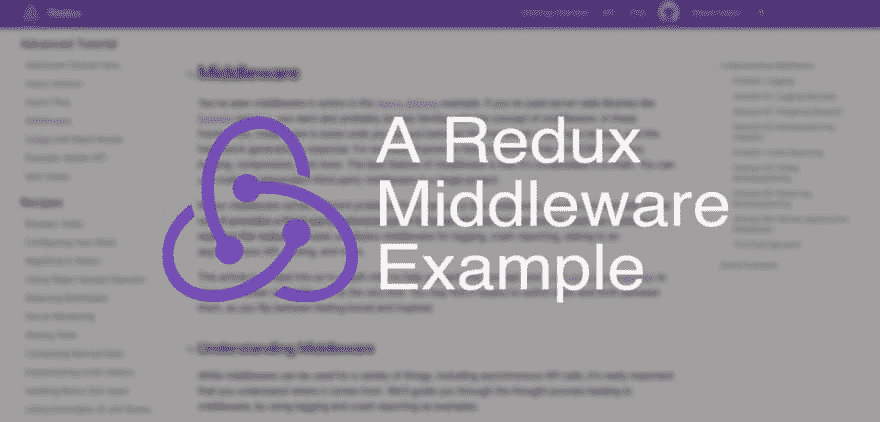

# 从反应式核心公开基于承诺的 API(3.0 版日志)

> 原文：<https://dev.to/couellet/exposing-a-promise-based-api-from-a-reactive-core-v30-journal-2jb0>

这里的整个团队最近都在经历非常有意义的时刻。

自从我们开始开发新购物车的前端堆栈，我们就有机会深入了解一些令人敬畏的现代技术。

这种重写完全是在 TypeScript 中完成的，将主题与新出炉的 SDK 分离开来。

Redux 也是这个堆栈的核心部分。我的好朋友 Jean-Seb 已经解释了我们为什么要使用它——今天，让我们在引擎盖下再移动一点。

**我想用我们的经验来举例说明如何使用 Redux 中间件**。更准确地说，我将解释我们如何从一个反应式核心公开一个基于承诺的 API。为此，我将:

*   定义 Redux 中间件到底是什么
*   揭露更多关于我们的 SDK 的细节
*   解释我们是如何从 it 中公开一个基于承诺的 API 的
*   展示我们如何利用 Redux 中间件功能

> 这篇文章是我们 3.0 日志的第二章，在这里我们揭示了购物车重写的有趣部分。阅读全文:
> 
> *   [第一章:我们如何使用 Redux&Redux-可观察与 Vue](https://snipcart.com/blog/redux-vue)
> *   **第二章:从反应式核心公开基于承诺的 API**
> *   第三章:使我们的 SDK npm 包类型脚本友好(01/19)
> *   第四章:模板覆盖(02/19)

→点击阅读全文