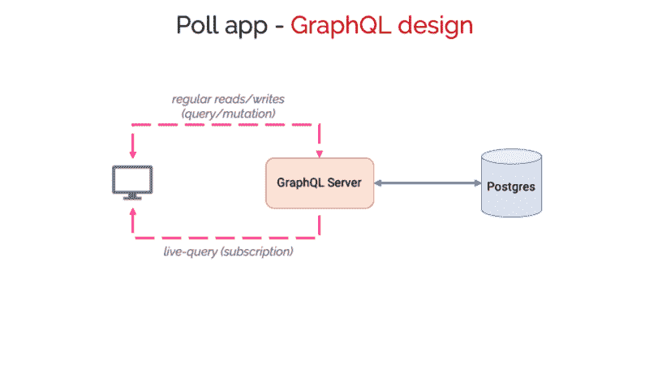

# 如何在 Postgres 上使用 GraphQL 订阅构建实时应用程序

> 原文：<https://dev.to/hasurahq/how-to-build-a-real-time-app-with-graphql-subscriptions-on-postgres-62f>

构建实时应用程序是一个很难解决的工程问题，特别是作为一名前端开发人员或最近刚过渡到全栈开发人员的人。然而，GraphQL 正在迅速颠覆这一现状。

在《Smashing》杂志上发表的 [**他的文章**](https://www.smashingmagazine.com/2018/12/real-time-app-graphql-subscriptions-postgres/) 中，[桑迪普](https://www.twitter.com/dsandip)涵盖了如何从基本原则构建实时应用、所涉及的挑战以及新兴工具如何用易于推理的优雅解决方案来解决这些挑战。

如果你是 GraphQL 的新手，或者只是想构建一个实时应用，这篇文章是一个很好的起点。