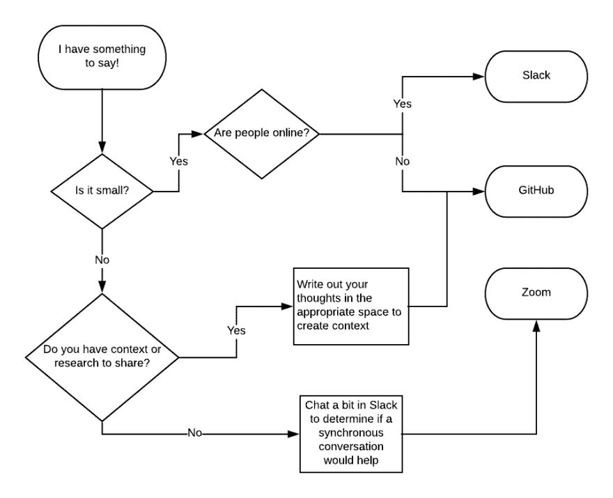

# 我们如何在 IOpipe 停止使用电子邮件

> 原文：<https://dev.to/pamasaur/how-we-stopped-using-email-at-iopipe-4fff>

*本帖最初发表于[媒体](https://read.iopipe.com/how-we-stopped-using-email-at-iopipe-8a93a94b7c)。*

在 IOpipe，我们使用三种主要的沟通模式:GitHub、Slack 和 Zoom。你会注意到邮件不在里面。我将谈谈我们为什么使用这一战略，我们作为一个团队是如何做出这一决定的，以及我们从中看到了什么好处。

## 我们用什么&为什么

我们利用 GitHub、Slack 和 Zoom 作为我们沟通的主线。使用了其他工具(例如，用于架构图和信息流的 LucidChart，用于在线白板的 Witeboard，用于 UI 的 InVision)，但是如果你问任何团队成员我们如何交流，或者参考我们的内部文档，这三个(GitHub、Slack 和 Zoom)是主要的答案。

GitHub 是我们的记录系统，用于异步和非即时通信。好的例子是:为一个 bug、大的特性、组成一个特性的较小的问题提交一个问题；然后把这些问题放到 GitHub 的项目板上；会议记录也写在 GitHub 中，以保持长寿。如果事情没有完全归档，没关系，我们大量使用搜索，GitHub 不断向我们提供有用的功能，如“相关问题”，帮助人们更快地看到他们是否要提交副本。

**Slack** : Slack 用于实时的、类似办公室的协作。我们的团队是完全分散的(没有办公室)，但我们通常在北美时区保持核心时间。正因为如此，我们使用 Slack 来提出想法，指出事情，或者快速获得对某些事情的反馈，以保持事情的进展。

**缩放**:缩放用于实时/同步协作。Zoom 上应该有一些东西的好迹象是，如果“许多人正在输入”Slack，如果有一个计划好的时间来插入某个特定的功能以制定计划，或者如果有一个正在调查的开放事件，并且有许多人正在查看它。将对话从松弛转为放大的一个方法是说“这应该是放大吗？”在聊天中。10 分钟的同步聊天通常可以避免 60 分钟的文本聊天会话。
我们是如何来到这里的

去年，我们召开了一次工作协议会议，就我们如何合作达成了一些团队范围的协议。我使用了一些来自 LucidMeetings 的材料和来自 Redbooth 的指南来说明我们所做的事情。我们远程召开会议，并使用 Trello(我们当时的工具之一)来回答协议中的问题，但对于今天的主题，我们回答的问题之一是:

> 我们将如何相互交流？

工作协议的结果(有很多关于如何运行协议的阅读，从前面的链接开始)是我们坚持的五个协议，其中一个是:

> 沟通渠道越少越好

我们的工作协议成为/仍然是我们管理沟通的指路明灯。我们意识到，当我们回答“我们将如何……”这个问题时，电子邮件并不在我们的首选通信列表中。因此，如果我们要遵守我们的协议，沟通渠道越少越好，我们该怎么办？

在实践中，这意味着我们的通信主“干线”不会改变，即使它周围的东西会改变。例如，我们在 Trello 做项目管理，并意识到我们重复了太多的工作，所以即使当我们转移到 GitHub 项目时，它们还不成熟，我们还是全力以赴。Trello 被从我们公司的工作流程中剔除，因为这样做维护了我们的工作协议。

## 为什么有效

对我们来说，这行得通的第一个也是最主要的原因是，我们的团队一致认为这行得通。没有人闯进来大喊“我讨厌电子邮件！我们再也不干了！”不，那没发生。我们是一个由成年人组成的团队，他们进行了对话，并就我们更喜欢如何做事达成了一致，作为一个理性的成年人团队，我们就如何合作达成了一致。

当然还有额外的好处:这个系统降低了认知开销——主干有明确的决策点:需要持续很长时间吗？放在 GitHub 里。你需要和某人“很快”谈一些事情吗？很可能是松弛的，但如果到了做出任何决定的地步，确保信息在 GitHub 中得到反映，并尽可能多地写出上下文(同时保持清晰)。下面是一个(绝对不完整的)示例流程:

 
交流流程，[来源于 LucidChart](https://www.lucidchart.com/invitations/accept/7fd8cbdc-cbb7-4579-b884-08d92726b9c1)

“懈怠爬行”，即群体传递对他们不利的懈怠信息，确实发生在组织中，也有一些论文写道为什么人们讨厌懈怠。但是我不能比我们的一个 IOpipe 校友(启发了这篇文章)说得更好了:[“不要把任何需要迭代、审查或过程的工件放在 Slack 中。”这个简单的指南将会很好地为你服务。](https://twitter.com/coreyalight/status/1043148669271400448)

## 我们如何改进

有几个我们可以改进的地方最突出:第一，虽然“GitHub 作为记录系统”通常是有效的，并且有一个强大的搜索，有许多存储库(包括营销、内容等)。)的意思是“这个问题适合放在哪里？”这个问题占用了认知空间，我们可能有办法解决这个问题。

第二，虽然每个工具的文字描述感觉相当具体(Slack for …等等)，但是根据信息的种类(也许是人物角色),描绘出信息如何在组织中流动的整个流程？)，这将是一个有趣的练习，并可能引发一些关于我们已经内在化的低效率的有趣观察。

## 怎么做

如果你对此非常感兴趣，并想在你的组织中做类似的事情，我怎么强调都不为过，作为工作协议的结果而不是自上而下的决定来实现这一点，感觉真的很积极。当团队中的每个人都致力于协议时，没有一个人/团体是我们如何沟通的“规则”的“执行者”——我们谈论我们如何做事。

这个决定并不是“让我们消灭电子邮件”，而是“我们应该有尽可能少的沟通渠道[是什么]，这样我们就可以减少我们的认知开销，更容易找到事情[为什么]。”在这一点上，从等式中删除电子邮件是一个履行协议的行动，或者，如果你愿意，是一个实施战略的策略。

你的团队达成工作协议了吗？你的远程团队是如何练习沟通的？对与一个非常关心我们工作方式的远程团队合作感到好奇吗？试试看 IOpipe 和 T2 加入我们的#jobs 频道。