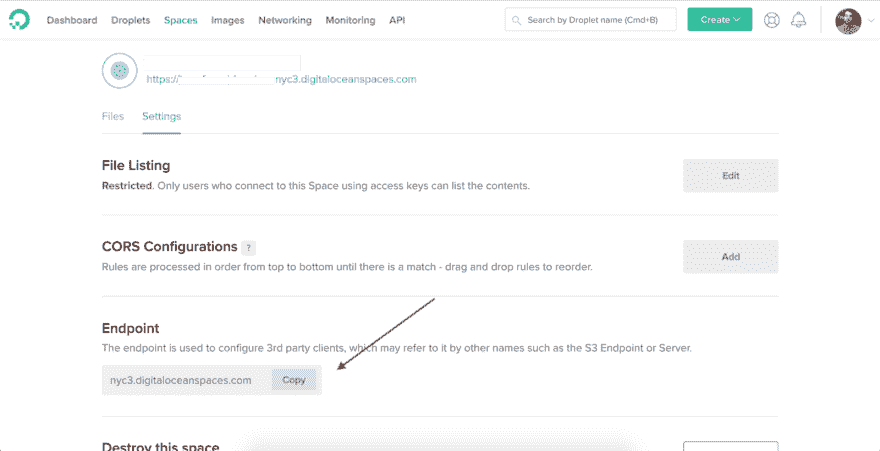
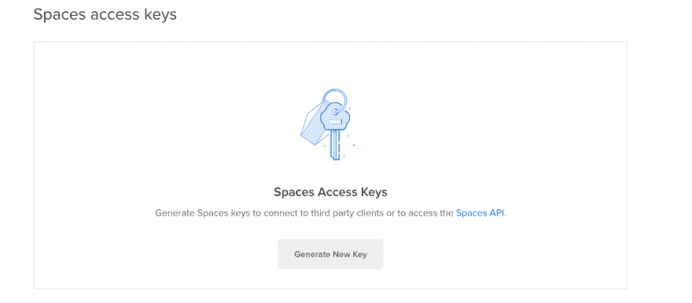

# 作为平台后端的数字海洋空间

> 原文：<https://dev.to/jmarhee/digitalocean-spaces-as-a-terraform-backend-3lck>

亚马逊网络服务 S3 对象存储 API 兼容性是一个非常酷的接口，用于许多伟大的对象存储选项，如 Minio，以在您的基础设施上运行 S3 工具兼容的对象存储服务，同样用于托管选项，如 DigitalOcean Spaces，其中围绕 AWS S3 的通用工具应用于新的端点，使用相同的组件，如身份验证方案、存储桶名称空间等。

DigitalOcean(和其他 IaaS 消费者)用户可能关注的一个常见用例是，以可靠/持久的方式将基础设施作为代码状态数据存储在其基础设施中(如果他们在 DigitalOcean 上运行类似 Terraform 生成的资源)，或者在资源中(例如，如果您在类似独立实例集或 Kubernetes 集群等中运行 Minio)。)以及不一定以相同方式与基础设施耦合的状态数据后端的其他选项。

您在现有配置中对 Terraform 的使用不需要彻底改变；在这种情况下，您只需添加一个 Terraform 数据块，与通常的 provider 块一起提供您的数据。您需要的是您的数字海洋空间端点 URL:
[](https://res.cloudinary.com/practicaldev/image/fetch/s--T06scIEn--/c_limit%2Cf_auto%2Cfl_progressive%2Cq_auto%2Cw_880/https://cdn-images-1.medium.com/max/1600/0%2AmTyYOuXPat5yWYMi.png) 
以及您的访问令牌和来自[https://cloud.digitalocean.com/settings/api/tokens](https://cloud.digitalocean.com/settings/api/tokens)的秘密令牌，位于 Spaces 部分:
[](https://res.cloudinary.com/practicaldev/image/fetch/s--l2y5RTS4--/c_limit%2Cf_auto%2Cfl_progressive%2Cq_auto%2Cw_880/https://cdn-images-1.medium.com/max/1600/0%2Ax1zkRi1Hv75Hy4n4.png) 
请记住，这将与您的数字海洋 API 令牌分开，用于计算和块存储资源等资源，并且仅用于访问对象存储桶本身。

出于这里的目的，我们将首先介绍如何在 Terraform 中管理这些凭证(因为您可能在其他地方使用与 S3 兼容的工具，即 awscli 或 boto 来管理对象存储数据，我将在后面介绍这一点)。
出于我稍后将解释的原因，您将把这些存储在其他地方，而不是像通常那样将您的共享空间凭证存储在 terraform.tfvars 中(即，使用您的数字海洋提供商令牌)。在我的例子中，我将它们存储为环境变量:

```
export SPACES_ACCESS_TOKEN=""
export SPACES_SECRET_KEY="" 
```

Enter fullscreen mode Exit fullscreen mode

在您的 Terraform 脚本中，或者在名为 provider.tf 的 repo 文件中，您将有一个这样的块来连接到 DigitalOcean 的 API:

```
variable "do_token" {}
provider "digitalocean" {
  token = "${var.do_token}"
} 
```

Enter fullscreen mode Exit fullscreen mode

太好了。但是在 Terraform run 上，它会将所有有状态的数据转储到您的项目根，这些数据会保留在本地存储(可靠地检查版本控制是一件非常痛苦的事情)。因此，让我们设置一个块，使用我们刚刚创建的 Spaces S3 兼容存储桶来远程存储我们的状态数据。

因为 Terraform 不允许在状态存储的后端块中进行插值，所以在远程存储状态之前，您还需要做一些事情。在你的地形中，你可以提供一个类似于
的方块

```
terraform {
  backend "s3" {
    endpoint = "nyc3.digitaloceanspaces.com"
    region = "us-west-1"
    key = "terraform.tfstate"
    skip_requesting_account_id = true
    skip_credentials_validation = true
    skip_get_ec2_platforms = true
    skip_metadata_api_check = true
  }
} 
```

Enter fullscreen mode Exit fullscreen mode

其中端点是您所在地区的 Spaces 端点(region 指的是 AWS S3 地区，您可以将其设置为 us-west-1，这实际上将被忽略)，然后，当您初始化 Terraform 时，您可以向后端提供者提供您的 Spaces 凭据(访问令牌和密钥):

```
terraform init \
 -backend-config="access_key=$SPACES_ACCESS_TOKEN" \
 -backend-config="secret_key=$SPACES_SECRET_KEY" \
 -backend-config="bucket=$SPACE_BUCKET_NAME" 
```

Enter fullscreen mode Exit fullscreen mode

注意:上面的内容可以用来从后端配置中设置和定义任何您想要的密钥对，所以您也可以在 init 命令中定义上面的任何内容(即端点),而不仅仅是凭证和 bucket 名称。使用空间凭证初始化后，您可以像往常一样重新设计计划并应用其余的更改。

还有另外一种处理凭证的方法:
你也可以在你的本地机器上将这 3 项设置为环境变量(分别为`AWS_S3_ENDPOINT`、`AWS_ACCESS_KEY_ID`和`AWS_SECRET_ACCESS_KEY`)，当你在 terraform 中引用 S3 后端时，可以检测到这些值；如果您也使用类似 awscli 或 botoclient 包(由于 s3 的兼容性)这样的工具，那么您可能对这种方法很熟悉，这些工具也可以处理 s3 相关用途的空间。这可以用来代替上面的实例化(它们只需要在运行 Terraform CLI 时在您的 shell 环境中获得)，或者，使用这两种方法的组合，您可以导入一个~/。aws/credentials 文件，您可能已经在本地使用这些 S3 工具)，然后使用 shared_credentials_file 键对您的 Terraform 配置进行以下修改:

```
shared_credentials_file=${var.shared_credentials_file} 
```

Enter fullscreen mode Exit fullscreen mode

到 Terraform init 命令，就像我们上面做的那样。

我创建了一个由 Terraform 管理的部署示例，使用这种方法在数字海洋空间中存储其状态:

[jmarhee/digital ocean-spaces-back end/source/-bit bucket](https://bitbucket.org/jmarhee/digitalocean-spaces-backend/src/master/)