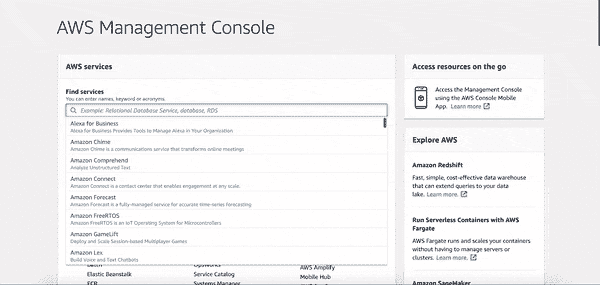
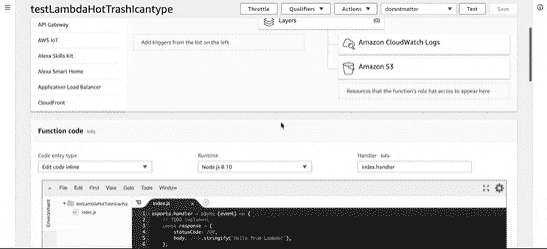

# ❤️'s 拉姆达

> 原文：<https://dev.to/royalaid/cljs-s-lambda-697>

# clo jure 是什么，为什么关心？

因为每一个关于 Clojure 或者 Clojurescript (CLJS)的帖子都要解释 Clojure(script)是什么，为什么要用:

> <video loop="" controls=""><source src="https://video.twimg.com/ext_tw_video/1068978070999027712/pu/vid/320x180/35NWMY5p0HOuar_f.mp4?tag=5" type="video/mp4"></video>Amperity@ Amperity我们如此热爱 [#Clojure](https://twitter.com/hashtag/Clojure) ，我们将这个非常史诗般的、完全合法的商业作品放在一起，让更多的人拥抱这门语言，加入我们的社区。尽情享受吧！[# NoCodeOnlyData](https://twitter.com/hashtag/NoCodeOnlyData)21:23PM-01 2018 年 12 月[](https://twitter.com/intent/tweet?in_reply_to=1068978794910777344)[](https://twitter.com/intent/retweet?tweet_id=1068978794910777344)146[](https://twitter.com/intent/like?tweet_id=1068978794910777344)363

但是严肃地说，很多人已经对 Clojure 做了更好的介绍，那么这篇文章将会:

*   勇敢和真实的 clo jure
    *   我是如何学习 Clojure (Long)的
*   [Y 分钟学会 clo jure](https://learnxinyminutes.com/docs/clojure/)
    *   你可以在 [REPL](https://clojure.org/guides/repl/introduction) 运行一个文件来测试这种语言
*   [Hypi 对 Clojure 帖子的介绍](https://hypi.io/blog/solutions/introduction-to-clojure/)
    *   介于上述两者之间的一个很好的中间地带

# 🔥无服务器🔥

不幸的是，没有一个令人惊讶的模仿无服务器广告，所以让我们试着激发你为什么应该关心它。无服务器只是描述一种不用担心基础设施就能运行代码的方式的简写。这实际上是什么意思？给他们和 zip，他们就扔在一些没用的硬件上，就是这样！

它支持在 [AWS](https://aws.amazon.com/lambda/) 、[谷歌云](https://cloud.google.com/functions/)、 [Azure](https://azure.microsoft.com/en-us/services/functions/) 以及其他云上运行。因为这些例子是用 AWS 构建的，这是我们要关注的地方。

或许迁移到无服务器或者用无服务器构建新服务的最大动力是[成本](https://www.troyhunt.com/brief-lessons-on-handling-huge-traffic-spikes/)。[免费层](https://aws.amazon.com/lambda/pricing/)非常慷慨，而且是随用随付，所以可以免费制作原型！

[](https://i.giphy.com/media/12eOoLezVypVWo/giphy.gif)

您还可以轻松部署/操作，并与您的云提供商进行本机集成，从而非常容易地利用云提供的数据库、指标/分析、队列、电子邮件服务等服务。

# CLJS+λ

虽然有很多方法可以将 Clojurescript 和 Lambda 结合在一起，但是它们与特定的构建工具相结合，对我来说有点像黑盒。这也是一个很好的借口来了解所有的部分是如何连接在一起的。这篇文章是如何做到这一点的精华。在最终进入正题之前，我们还得介绍一位选手上台。

## 影子-CLJS

Shadow-CLJS 是 Clojurescript 编译器的另一个前端，如果你熟悉这个领域，它与 [lein-cljsbuild](https://github.com/emezeske/lein-cljsbuild) 或 [Figwheel-main](https://github.com/bhauman/figwheel-main) 的作用相同。与其他工具相比，它最大的优势是[强大的 npm 支持](https://code.thheller.com/blog/shadow-cljs/2017/11/10/js-dependencies-in-practice.html)。我们基本上可以通过 Shadow 将所有 npm 与 CLJS 一起使用，如果我们想要利用像 [AppSync](https://aws.amazon.com/appsync/) 或 [AWS Node SDK](https://aws.amazon.com/sdk-for-node-js/) 这样的东西，这很重要。

# 让那该死的拉姆达紧着

## 设置

好吧，让我们做一个 lambda，最终我们会扔掉它里面的所有东西，但是现在就让它去吧。
[](https://res.cloudinary.com/practicaldev/image/fetch/s--k4oGtY4Z--/c_limit%2Cf_auto%2Cfl_progressive%2Cq_66%2Cw_880/https://thumbs.gfycat.com/CraftyGroundedGrassspider-size_restricted.gif) 
而有了我们的基本 lambda 我们只需要我们的工具和一些示例代码，首先工具:
`brew install yarn #Or your OS equiv, apt-get, yum, etc`
就这样！

## 示例代码

对于示例代码，我已经分叉了[陈勇的](https://github.com/chenyong)最小[阴影+节点示例](https://github.com/minimal-xyz/minimal-shadow-cljs-nodejs)来创建一个带有阴影的 hello world lambda:

##  [皇家援助](https://github.com/royalaid) / [极小阴影-cljs-nodejs](https://github.com/royalaid/minimal-shadow-cljs-nodejs)

### Node.js 的 shadow-cljs 热代码交换

<article class="markdown-body entry-content container-lg" itemprop="text">

## [shadow-cljs](https://github.com/thheller/shadow-cljs) 的 Node.js 示例

### 发展

使用热重装进行监视编译:

```
yarn
yarn shadow-cljs watch app
```

开始程序:

```
node target/main.js
```

### 取代

启动一个连接到当前运行程序的 REPL，`app`为`:build-id`:

```
yarn shadow-cljs cljs-repl app
```

### 建设

```
shadow-cljs release app
```

编译到`target/main.js`。

你可能会在[http://doc.shadow-cljs.org/](http://doc.shadow-cljs.org/)上找到更多配置。

### 步伐

*   将`shadow-cljs.edn`添加到配置编译中
*   编译 ClojureScript
*   运行`node target/main.js`启动应用程序并连接重新加载服务器

### 许可证

用它

</article>

[View on GitHub](https://github.com/royalaid/minimal-shadow-cljs-nodejs)

```
git clone https://github.com/royalaid/minimal-shadow-cljs-nodejs.git /tmp/lambda-example
cd /tmp/lambda-example
yarn 
```

现在你所有的部门都设置好了！

## 代码分解

虽然这个项目应该是不言自明的，但我将给出重要部分的高级概述，即`shadow-cljs.edn`和`src/server/main.cljs`文件。

### [T1】shadow-cljs . edn](#shadowcljsedn)

`shadow-cljs.edn`相当于 lein 的`project.clj`或 boot 的`boot.clj`，它是 Shadow 的构建配置文件。对我们来说，该文件最重要部分是`:target :node-library`行，它告诉 shadow 设置`module.exports`供 node 使用，这是 CLJS 代码与 Node 读取的 Javascript 之间的桥梁。第二条最重要的线是`:exports {:handler server.main/handler}`。这一行告诉 Shadow 调用什么导出，然后绑定什么 CLJS 函数，在我们的例子中是 Clojurescript 名称空间中的 handler 函数`server.main`。当我们执行 lambda 时，AWS 将最终调用这个函数。

### main.cljs

至于`src/server/main.cljs`，在 Shadow 为我们传输之后，这将最终由 AWS 运行。名称空间中唯一的函数就是实际调用的函数。重要说明，函数签名必须有 3 个参数(如果使用 async/await，则为 2 个，但我们没有),并且必须通过调用`cb`参数并将结果传递给回调(`cb`)调用的第二个参数来“返回”其值。

我们需要这样做，因为 Lambda 希望结果是一个承诺或者来自传入的回调。这花了我太长时间拼凑，希望这不会绊倒任何人。此外，我们需要确保返回 Javascript 值，而不是 Clojurescript 值，因此对数组使用了`#js`。

## 构建和发布时间

###### 注意:我将跳过实际开发代码的过程，但请查看之前链接的[阴影+节点示例](https://github.com/minimal-xyz/minimal-shadow-cljs-nodejs)以了解如何将阴影用于 Nodejs 和热重载的详细信息和工作流程。

```
cd /tmp/lambda-example # Get you back to the correct directory
yarn shadow-cljs release app # This transpiles and optimizes your CLJS
zip -r archive.zip target # Prep your output for upload to Lambda 
```

然后，我们只需将新的 zip 文件上传到旧的 Lambda 中，并将处理函数指向我们的 CLJS 函数(将会是。记录中的 handler，main.handler)。

[](https://res.cloudinary.com/practicaldev/image/fetch/s--gLO6mMFI--/c_limit%2Cf_auto%2Cfl_progressive%2Cq_66%2Cw_880/https://thumbs.gfycat.com/IllTinyApisdorsatalaboriosa-size_restricted.gif)

# 🎉🎉🎉

我们做到了！如果您有任何问题或反馈，请在推特、[乳齿象](https://royalaid.me/@admin)或 [@royalaid](https://dev.to/royalaid) 上联系 Clojurians [Slack](https://clojurians.slack.com/) 或 [Zulip](http://clojurians.zulipchat.com/)