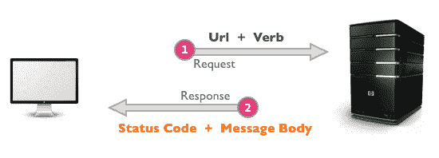
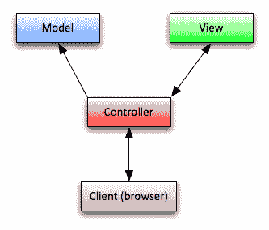
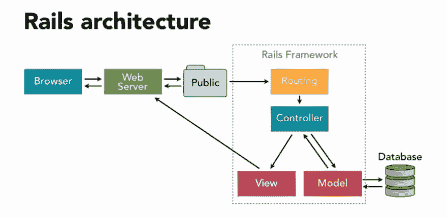

# 理解 Ruby on Rails 的基础:HTTP、MVC 和 Routes

> 原文：<https://dev.to/teekay/understanding-the-basics-of-ruby-on-rails-http-mvc-androutes-37j4>

学完你的[第一门编程语言](https://medium.freecodecamp.org/learning-ruby-from-zero-to-hero-90ad4eecc82d)后，你可能会问，编程可以做什么:AI/机器学习？硬件开发？移动应用？或者您可能想开始开发 web 应用程序！:)

在这里，我们将使用 Ruby on Rails web 框架来理解 web、路由和 MVC 架构是如何工作的。让我们深入网络世界。

在学习用 Rails 进行 web 开发之前，我真心推荐先学习一下[Ruby](https://medium.freecodecamp.org/learning-ruby-from-zero-to-hero-90ad4eecc82d)。

### 网络是如何工作的？

网络有很多层([应用层、TCP 层、互联网层、硬件层](https://web.stanford.edu/class/msande91si/www-spr04/readings/week1/InternetWhitepaper.htm))都是相互连接的。但基本上，它是通过 **HTTP** (超文本传输协议)来工作的。

> 超文本传输协议(HTTP)是分布式、协作式超媒体信息系统的应用协议。—维基百科

HTTP 的工作方式类似于客户机-服务器模型中的请求-响应循环。

我们有一个网络浏览器(例如谷歌浏览器)。所以我们键入`www.google.com` URL，客户端向服务器提交 HTTP 请求(请求消息)。服务器返回 HTTP 响应(响应消息——在这种情况下，响应是来自 Google 网站的 HTML)。

[](https://res.cloudinary.com/practicaldev/image/fetch/s--a7arRKFX--/c_limit%2Cf_auto%2Cfl_progressive%2Cq_auto%2Cw_880/https://cdn-images-1.medium.com/max/1600/1%2A0HsqvxES_m9Serhg8xW2Xg.png)

客户机发出请求，并接收来自服务器的响应。客户端处理 UI 和用户交互。在服务器上，我们可以存储和检索数据(在数据库上)，在后台处理逻辑(工人/作业)，以及许多其他东西。

如果你想深入了解，我给你推荐一些资源。我是 Preethi 的超级粉丝。这里有一系列的 **3 部分**:

*   [网络开发新手入门](https://medium.freecodecamp.org/how-the-web-works-a-primer-for-newcomers-to-web-development-or-anyone-really-b4584e63585c)

*   [客户-服务器模式&网络应用的结构](https://medium.freecodecamp.org/how-the-web-works-part-ii-client-server-model-the-structure-of-a-web-application-735b4b6d76e3)

*   [HTTP &休息](https://medium.freecodecamp.org/how-the-web-works-part-iii-http-rest-e61bc50fa0a)

### MVC 架构和 Rails 路线

[](https://res.cloudinary.com/practicaldev/image/fetch/s--oDe9bAVK--/c_limit%2Cf_auto%2Cfl_progressive%2Cq_auto%2Cw_880/https://cdn-images-1.medium.com/max/1600/1%2AeDPWR3lYGm1ogbef2beyHA.png)

现在我们已经了解了 Web 是如何工作的，我们将学习 MVC 架构和 Rails 路线。

MVC 代表模型、视图和控制器。

在这个架构上，我们在模型、视图和控制器之间有“关注点分离”。每个部分都有自己的职责。让我们深入了解每一部分。

#### 型号

> 维护对象和数据库之间的关系，并处理验证、关联和事务

这意味着模型将与数据库保持极端的关系。每个模型(可以)代表一个数据库表(在 SQL 数据库的情况下)。这个模型对象获得了从数据库表中检索、保存、编辑和删除数据的能力(继承自 ActiveRecord — Rails 类)。我们使用模型对象作为应用程序和数据库之间的一层。

除了与数据库关系之外，模型可以在模型之间创建**验证**和**关联**。

#### 视图

> "以特定格式显示数据，由管制员决定显示数据而触发."

这是请求响应的表示。这个演示可以有多种格式类型:PDF、HTML、JSON 等。视图的最终结果可能是用户界面(UI)，它是“客户端”的一部分

对于 web 上的大多数页面，视图将是一个用 CSS 和 JS 样式的 HTML。但是我们可以在[旅游数字产品](https://www.worldpackers.com/)上实现用户行为的 pdf，向所有员工展示人们如何使用他们的网站。

#### 控制器

> 应用程序中的工具，用于引导流量，一方面查询模型以获取特定数据，另一方面将数据组织(搜索、排序)成适合给定视图需求的形式

控制器是“大师”它负责流程:使用模型进行查询、解析数据，并决定以何种格式呈现数据。

[](https://res.cloudinary.com/practicaldev/image/fetch/s--ABnQpp8A--/c_limit%2Cf_auto%2Cfl_progressive%2Cq_auto%2Cw_880/https://cdn-images-1.medium.com/max/1600/1%2AKK61kGXrkaFBDfY7uWukyQ.png)

### MVC &在 Rails 应用程序上循环路由

想象一下，我们在一家旅游初创公司工作。该产品的一部分是向旅行者展示一份关于旅游故事和提示的[列表。](https://www.worldpackers.com/articles)

站在旅行者的角度想想。你进入`www.worldpackers.com/articles`，你会看到一个漂亮的页面，上面列出了一堆很棒的文章。

当您在浏览器中键入此 URL 时，它会向服务器发出请求。在服务器中，我们有 Rails web 应用程序。Rails 路由器验证是否有条目匹配所请求的 URL。

我们只需要配置这条线路的路由:

```
resources :articles 
```

Enter fullscreen mode Exit fullscreen mode

这将为文章创建 RESTful 路径。如果我们运行`bundle exec rake routes`，它将显示创建的路径列表。

```
HTTP VERB   PATH                          Controller#Action
GET         /articles(.:format)           articles#index
POST        /articles(.:format)           articles#create
GET         /articles/new(.:format)       articles#new
GET         /articles/:id/edit(.:format)  articles#edit
GET         /articles/:id(.:format)       articles#show
PATCH       /articles/:id(.:format)       articles#update
PUT         /articles/:id(.:format)       articles#update
DELETE      /articles/:id(.:format)       articles#destroy 
```

Enter fullscreen mode Exit fullscreen mode

HTTP 动词可以是`GET`、`POST`、`PATCH`、`PUT`或`DELETE`。我们知道 Rails 如何将每个`PATH`映射到右边的`controller`和`action`。点击阅读更多[。](http://guides.rubyonrails.org/routing.html)

在我们的例子中，服务器将接收到作为 HTTP 动词的`/articles`路径和`GET`。它会映射到`ArticlesController`和`index`的动作。

在**控制器** `ArticlesController`中，我们使用**模型** `Article`获取数据库中的所有文章，并呈现**视图** `index.html.erb`作为服务器响应(UI)。

```
class ArticlesController < ApplicationController
  def index
    @articles = Article.all
  end
end 
```

Enter fullscreen mode Exit fullscreen mode

按照惯例，这个控制器将在`views/articles/index.html.erb`中呈现视图。基本上，它是一个由 Ruby 支持的普通 HTML 文件。

Rails 请求-响应周期是您开始学习 web 开发时需要理解的第一个概念。

用户进行填充(向服务器请求)，Rails 应用程序让路由器将 URL 路径映射到正确的控制器。在控制器中，我们可以对一个模型(或多个模型)做所有的事情——意味着获取、保存、编辑、删除数据——并向用户呈现一个视图。

### 就这样！

我们在这里学到了很多。我希望你们喜欢这些内容，并更多地了解 MVC 架构和路由在 Rails 上是如何工作的。

在我学习和掌握 Rails 和 web 开发的旅程中，这又向前迈进了一步。你可以在我的[文艺复兴开发者出版物](https://medium.com/the-renaissance-developer)上看到我的完整旅程的文档。

如果你想要一个完整的 [Ruby](https://onemonth.com/courses/ruby?mbsy=lG6tt&mbsy_source=97541b09-e3ab-45d7-a9b1-dbc77028e008&campaignid=33446&discount_code=TKRuby1) 和 [Rails](https://onemonth.com/courses/rails?mbsy=lG6tz&mbsy_source=d2442db6-e764-401a-a394-a9c081468830&discount_code=TKRuby1&campaignid=33448) 课程，学习真实世界的编码技能和构建项目，试试[一个月 Ruby Bootcamp](https://onemonth.com/courses/ruby?mbsy=lG6tt&mbsy_source=97541b09-e3ab-45d7-a9b1-dbc77028e008&campaignid=33446&discount_code=TKRuby1) 和 [Rails Bootcamp](https://onemonth.com/courses/rails?mbsy=lG6tz&mbsy_source=d2442db6-e764-401a-a394-a9c081468830&discount_code=TKRuby1&campaignid=33448) 。那里见，☺

玩得开心，继续学习，继续编码。

我的 [Twitter](https://twitter.com/LeandroTk_) 、 [Medium](https://medium.com/@leandrotk_/) 、[Github](https://github.com/LeandroTk)&[LinkedIn](http://br.linkedin.com/in/leandrotk/)。☺